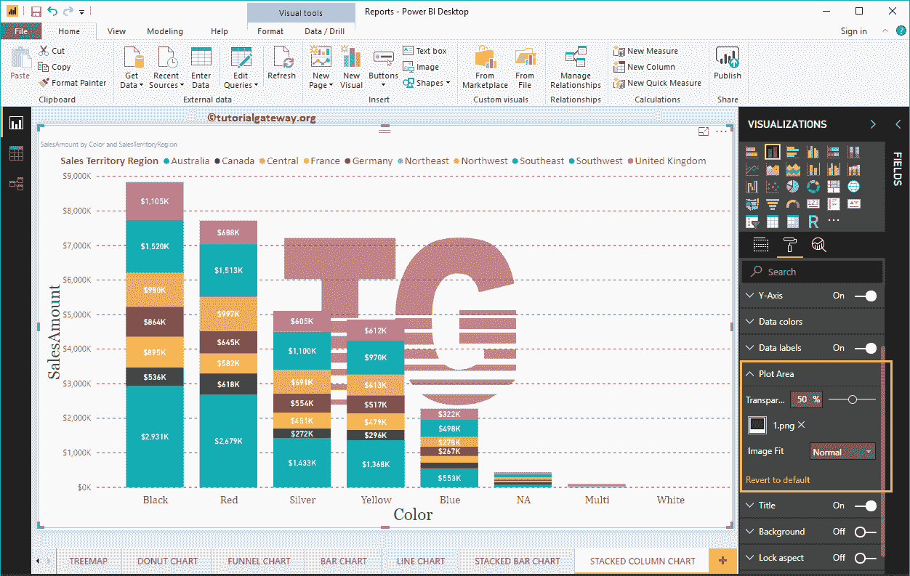

# 设置商务智能堆叠柱形图格式

> 原文：<https://www.tutorialgateway.org/format-power-bi-stacked-column-chart/>

如何用实例格式化 Power BI 堆叠柱形图？。格式化 Power BI 堆叠柱形图包括更改堆叠柱形图颜色、标题文本、标题位置、启用数据标签、轴字体和背景颜色等。

为了演示这些堆叠柱形图格式选项，我们将使用之前创建的堆叠柱形图。请参考 Power BI 文章中的[堆叠柱形图，了解创建](https://www.tutorialgateway.org/stacked-column-chart-in-power-bi/) [Power BI](https://www.tutorialgateway.org/power-bi-tutorial/) 堆叠柱形图的步骤。

## 如何格式化电力商业智能堆叠柱形图

请单击“格式”按钮，查看此堆叠柱形图可用的格式选项列表。

### 格式化堆叠柱形图常规部分

使用此常规部分更改堆叠柱形图的 X 位置、Y 位置、宽度和高度。

### 电力商业智能中堆叠柱形图的格式图例

要显示或启用图例，请选择图例区域，并将选项从关闭切换到打开。

从下面的截图中可以看到，我们添加了图例标题作为销售区域区域，图例位置作为顶部中心。我们还将颜色更改为金黄色，字体系列更改为卡利布里，文本大小更改为 15。

### 幂商业智能堆叠柱形图的 X 轴格式

正如你从下面的截图中看到的，我们将颜色改为棕色，字体样式改为剑桥，文本大小改为 20。最小类别、最大大小和内部填充选项用于更改竖条宽度

默认情况下，堆积柱形图的 X 轴标题设置为关闭。但是您可以通过将“标题”切换到“打开”来启用它。让我将标题颜色更改为绿色，字体样式更改为乔治亚，标题文本大小更改为 30

### 格式化幂 BI 堆叠柱形图 Y 轴

从下面的截图中可以看到，我们将 Y 轴标签的颜色更改为棕色，文本大小更改为 15，显示单位更改为千。

默认情况下，堆积柱形图的 Y 轴标题设置为“关”。但是您可以通过将“Y 轴”部分下的“标题”切换为“开”来启用它。让我将标题颜色更改为绿色，字体样式更改为乔治亚，标题文本大小更改为 30。

通过将堆叠柱形图网格线选项从打开切换到关闭，可以禁用该堆叠柱形图的网格线。

*   颜色:您可以更改网格线颜色。
*   描边宽度:用它来改变网格线的宽度。
*   线条样式:选择实线、虚线等线条样式。

### 设置商务智能堆叠柱形图数据颜色的格式

默认情况下，Power BI 会在竖线中为每个组分配一些默认颜色。请根据你的要求改变颜色。

### 如何为商务智能堆叠柱形图启用数据标签

数据标签显示关于竖条的每个单独组的信息。在这种情况下，它显示每个销售区域的销售额。要启用数据标签，请将数据标签选项切换为打开。

让我将颜色更改为白色，字体系列更改为 DIN，文本大小更改为 12

### 格式化 Power BI 堆叠柱形图绘图区域

您可以使用此绘图区域部分添加图像作为堆叠柱形图的背景。出于演示目的，我们添加了一个图像作为堆叠柱形图绘图区域背景。

### 设置商务智能堆叠柱形图标题的格式

通过将“标题”选项从“开”切换到“关”，可以禁用堆积柱形图标题。

从下面的截图中可以看到，我们将标题文本更改为按颜色和销售区域划分的销售额。我们还将字体颜色改为绿色，字体系列改为乔治亚，字体大小改为 25，标题对齐改为居中。如果你愿意，你也可以给标题加上背景色。

### Power BI 中堆叠柱形图的格式背景色

通过将“背景”选项切换到“开”，可以将背景颜色添加到堆积柱形图中。为了演示，我们添加了背景色。

同样，通过将边框选项从关闭切换到打开，可以将边框添加到堆叠柱形图。

