# 格式化PowerBI表

> 原文：<https://www.tutorialgateway.org/format-power-bi-table/>

如何用例子格式化 Power BI 表报告？。Power BI 格式表包括更改表网格颜色、行颜色、列格式、行格式、表标题文本和背景颜色等。

为了演示这些 Power BI 表格式选项，我们将使用之前创建的表。请参考[在 Power BI](https://www.tutorialgateway.org/create-a-table-in-power-bi/) 中创建表一文，了解创建 [Power BI](https://www.tutorialgateway.org/power-bi-tutorial/) 表所涉及的步骤。

## 如何格式化PowerBI表

请单击“格式”按钮查看可用的表格式选项列表。

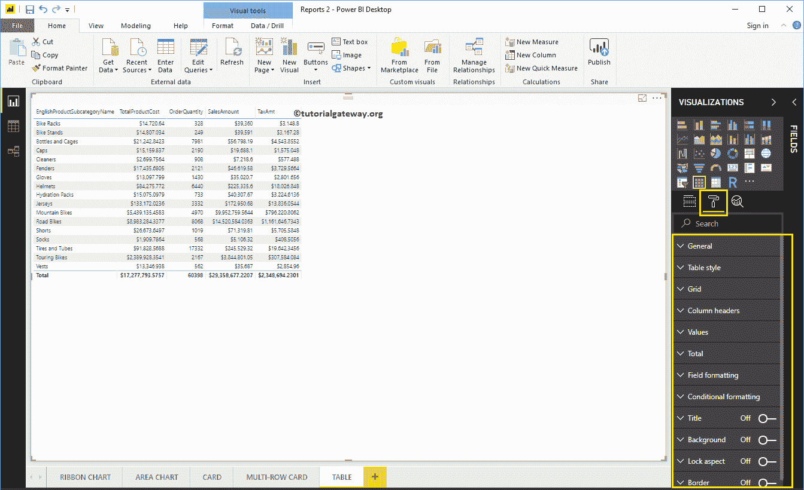

### 格式化PowerBI表常规设置

使用此常规部分更改表的 X、Y 位置、宽度和高度

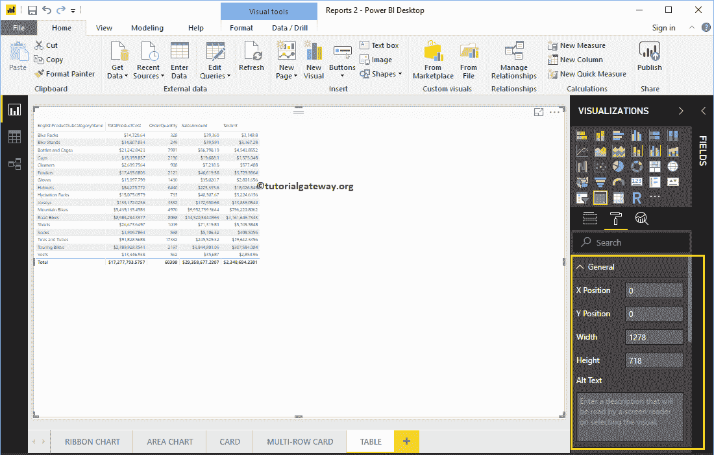

### 格式化PowerBI表样式

从下面的截图中，您可以看到可用于设置此表样式的样式列表。请根据你的要求选择款式。

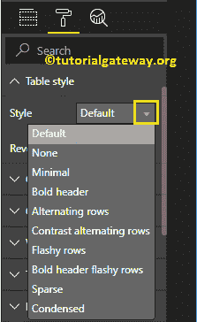

现在，我们从下拉列表中选择交替行选项。请记住，这是任何表的默认选项，它会添加可选的行颜色。

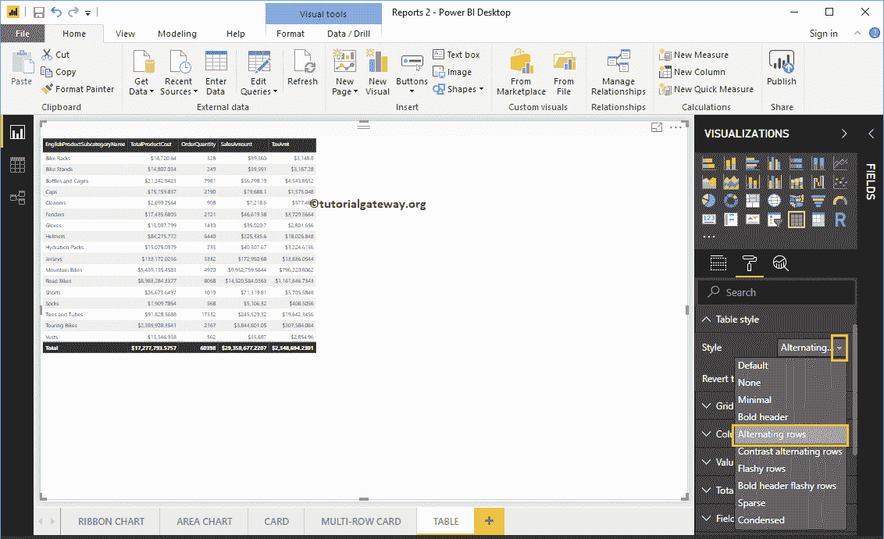

### PowerBI中表的格式网格

以下是可用于格式化网格的选项列表。

*   垂直网格:将此选项从关闭切换到打开会添加垂直网格。除了启用垂直线来分隔每一列之外，别无他法。
*   水平网格:它添加了水平网格。除了启用水平线来分隔每行之外，别无他法。
*   水平网格颜色:更改水平网格的颜色。
*   水平网格厚度:水平网格线宽度
*   行填充:行与行之间的空间。让我把它改成 3 来增加空间

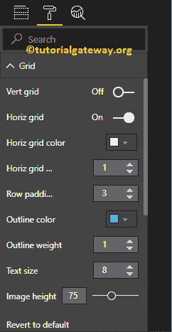

从下面的截图中可以看到，我们启用了垂直网格，并分配了一些随机的颜色。

*   垂直网格颜色:更改垂直网格的颜色。
*   垂直网格厚度:垂直网格线宽度或笔画

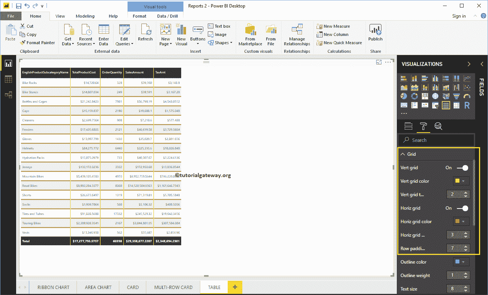

*   轮廓颜色:第一行开始前和最后一行后的颜色。我们使用默认的绿色作为轮廓颜色。
*   轮廓粗细:线条宽度。我们将线条改为 4
*   文本大小:表值的字体大小。让我把文本大小改为 14

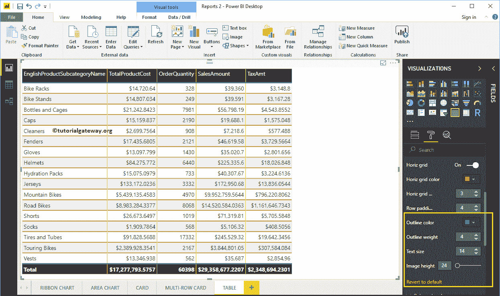

### 在 Power BI 中格式化表的列标题

本节将更改标题颜色。从下面的截图中可以看到，我们将字体颜色改为白色，背景颜色改为橄榄绿。接下来，大纲到顶部+底部(大纲添加到页眉的顶部和底部)，字体系列到剑桥，文本大小到 26，页眉文本对齐到中心。

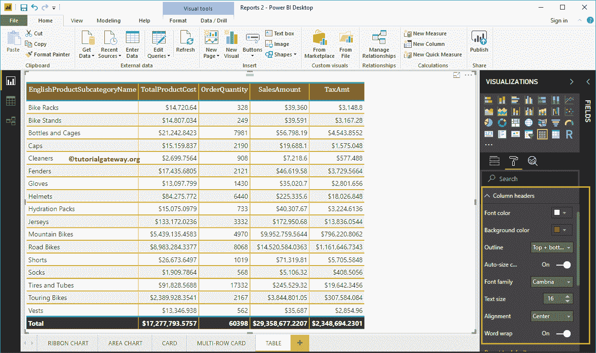

### PowerBI中表的格式值

您可以使用此部分来更改表值。从下面的截图中可以看到，我们更改了偶数行和奇数行的字体颜色和背景颜色。在这里，我们还将字体系列更改为坎布里亚，并将文本大小更改为 16

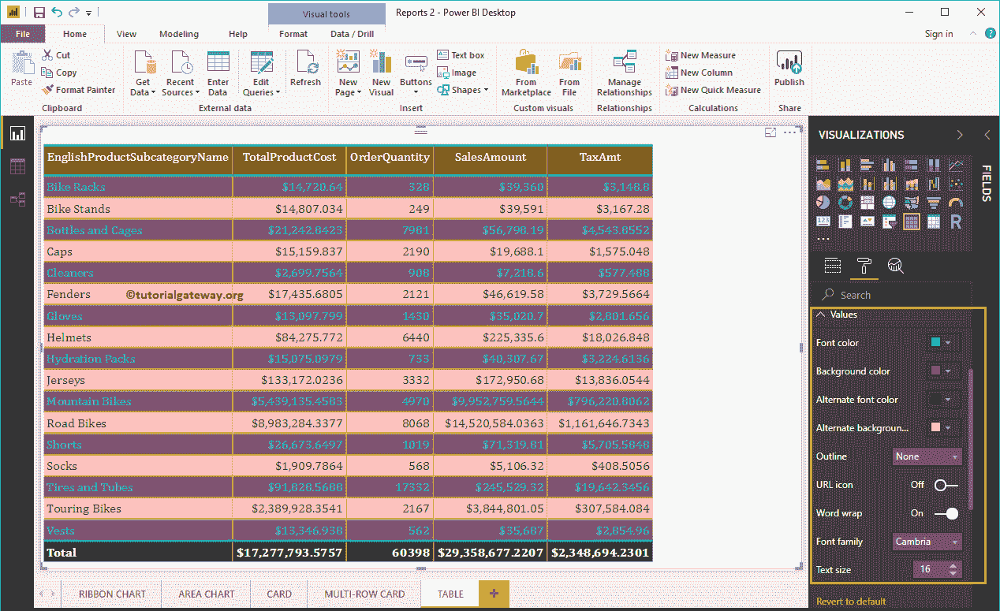

### PowerBI中表的总计格式

使用此总计部分更改总计的文本和背景颜色。正如您从下面的截图中看到的，我们更改了总计字体颜色。接下来，背景颜色变为绿色，轮廓变为顶部+底部(轮廓添加到总数的顶部和底部)，字体系列变为红色，文本大小变为 17。

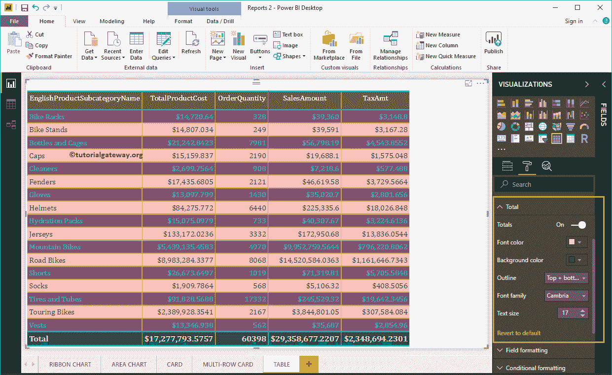

### 设置商务智能表格式–字段格式

使用此部分可以格式化表中的各个列。例如，您可以使用此部分为一列指定完全不同的颜色。在这里，我们选择英文产品子类别名称。

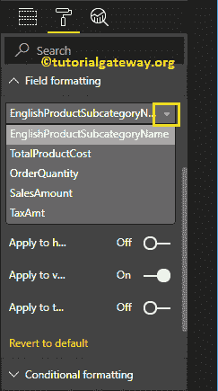

出于演示目的，我们仅将此栏的背景颜色更改为白色。

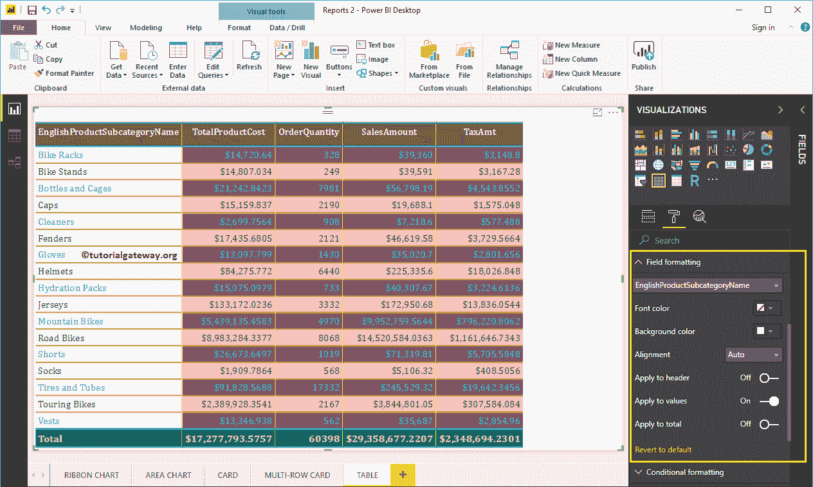

### 格式化 Power BI 表条件格式

使用此部分可以格式化表中的度量列(数值)。目前，我们正在选择产品总成本。

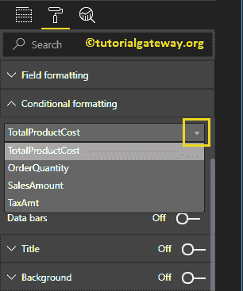

选择任意数值列将打开以下窗口。

*   最低:最低总销售额时的颜色
*   最大值:最高总销售额时的颜色
*   发散:您可以勾选此选项，为该列指定发散颜色。

我们单独写一篇文章来解释这些设置

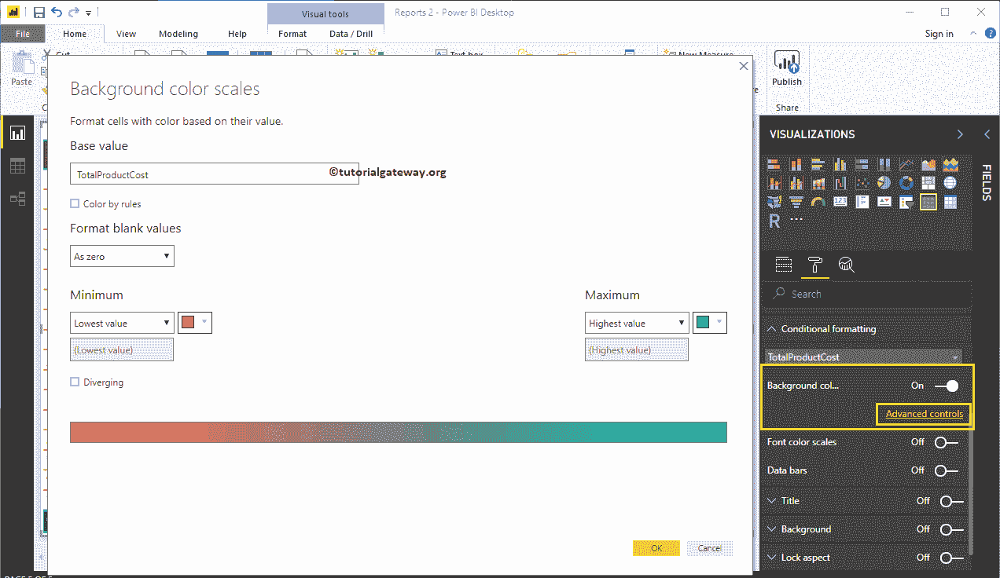

### 设置商务智能表标题的格式

通过将标题选项从关闭切换到打开，可以启用表标题。

从下面的截图可以看到，我们添加了标题文本作为产品子类别销售信息。接下来，将字体颜色设置为绿色，字体系列设置为乔治亚，文本大小设置为 21，标题对齐居中。如果需要，也可以将背景颜色添加到表标题中。

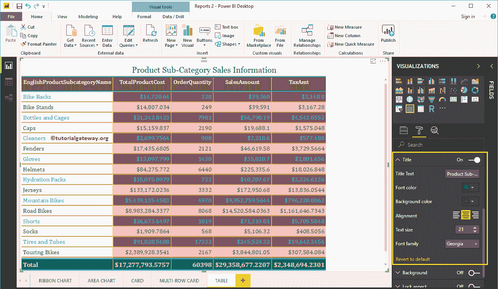

### 设置商务智能表背景颜色和边框的格式

通过将“背景”选项切换为“开”，可以向表添加背景颜色。出于演示目的，我们添加了透明度为 49%的天蓝色。

同样，您可以通过将“边框”选项从“关闭”切换到“打开”来向表添加边框。

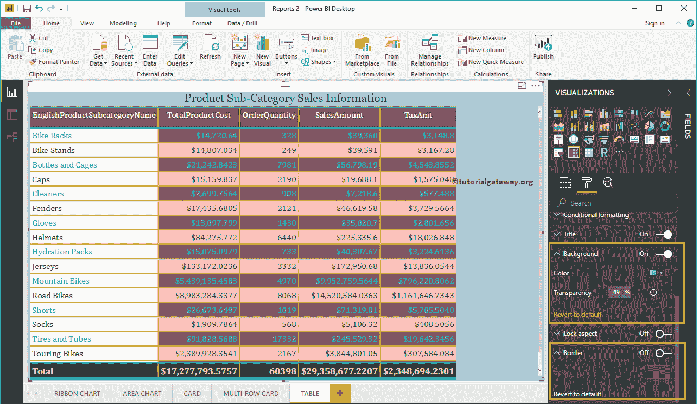