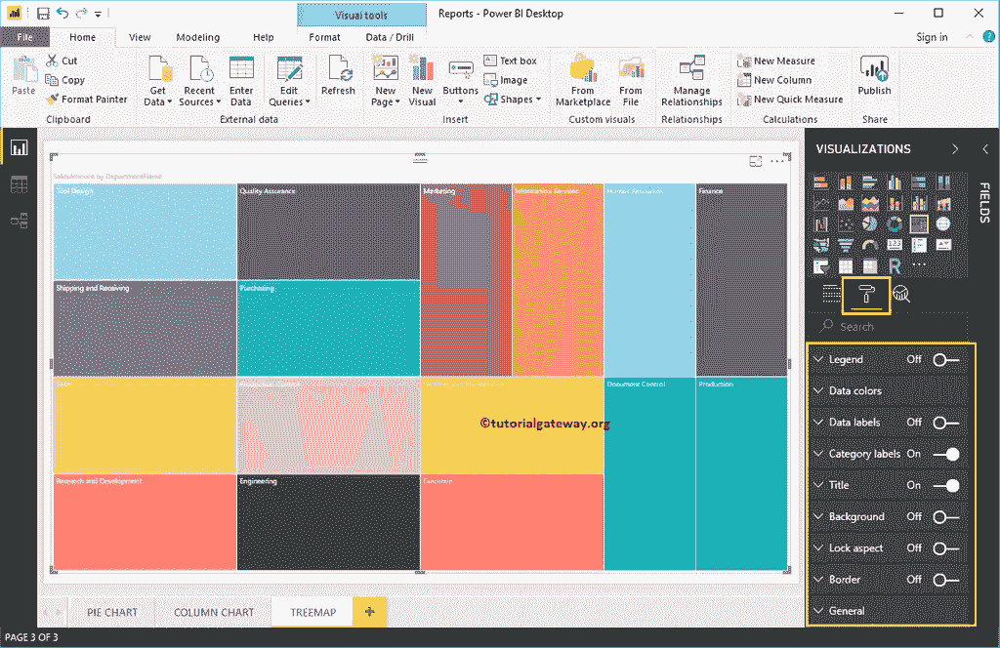
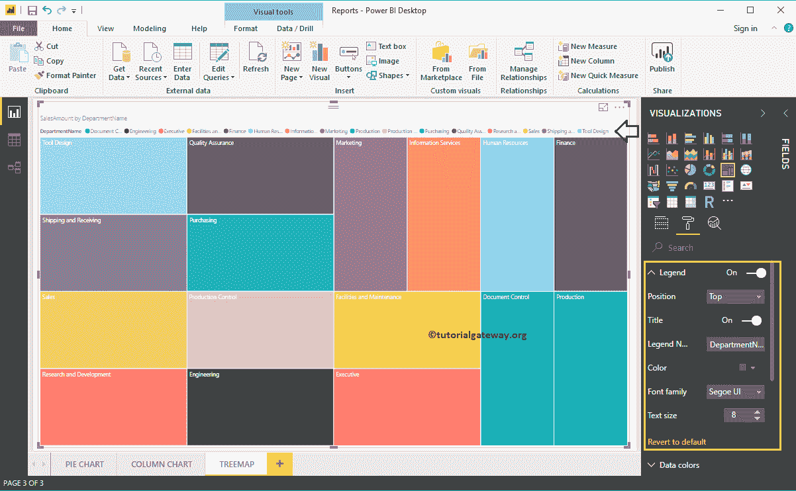
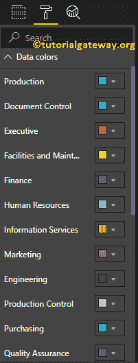
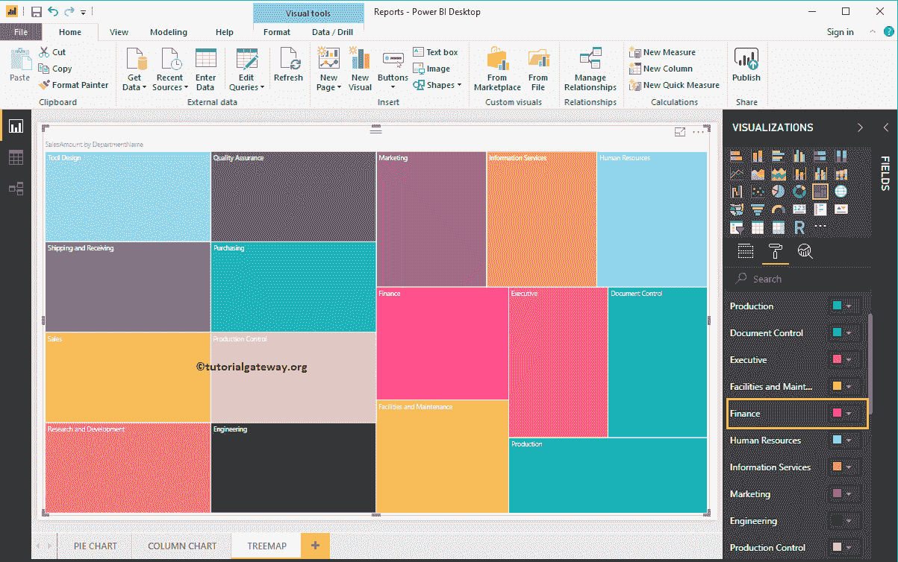
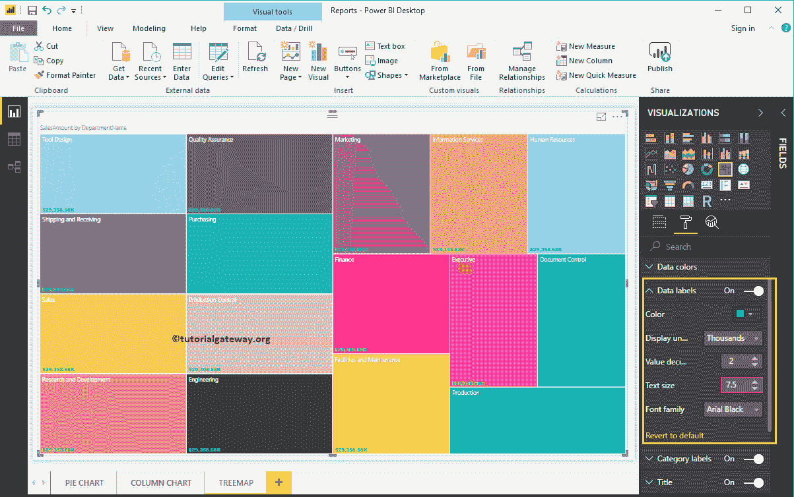
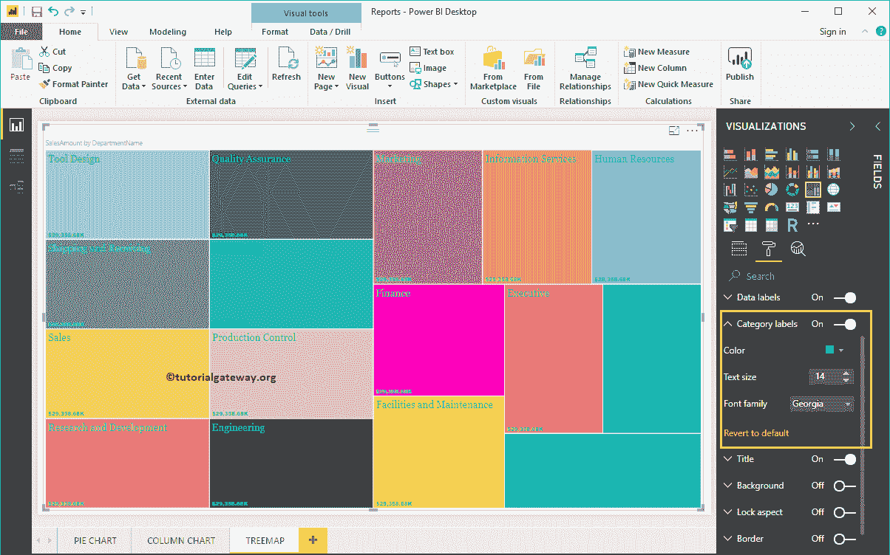
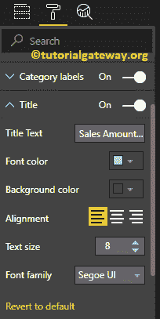
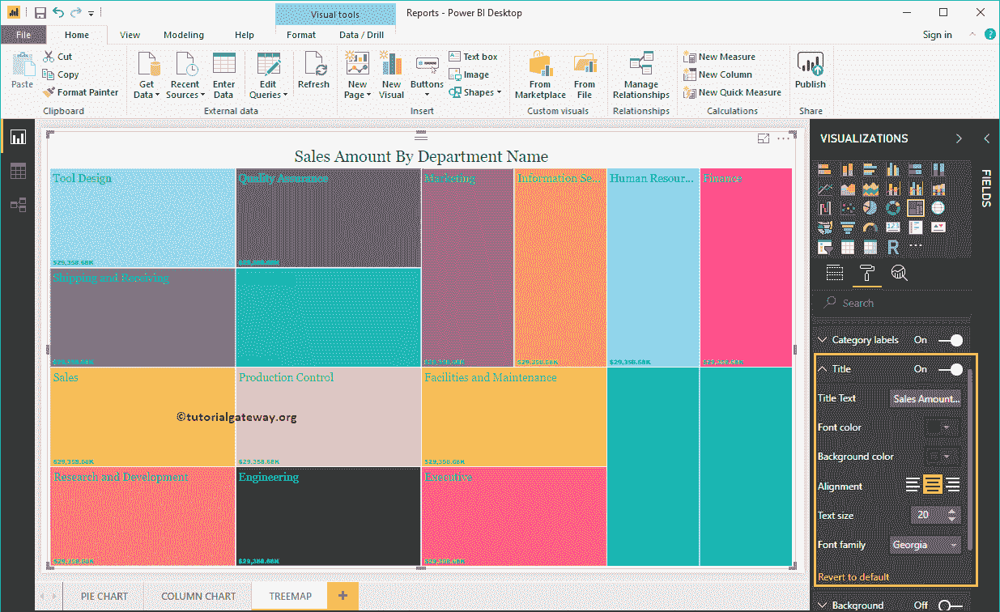
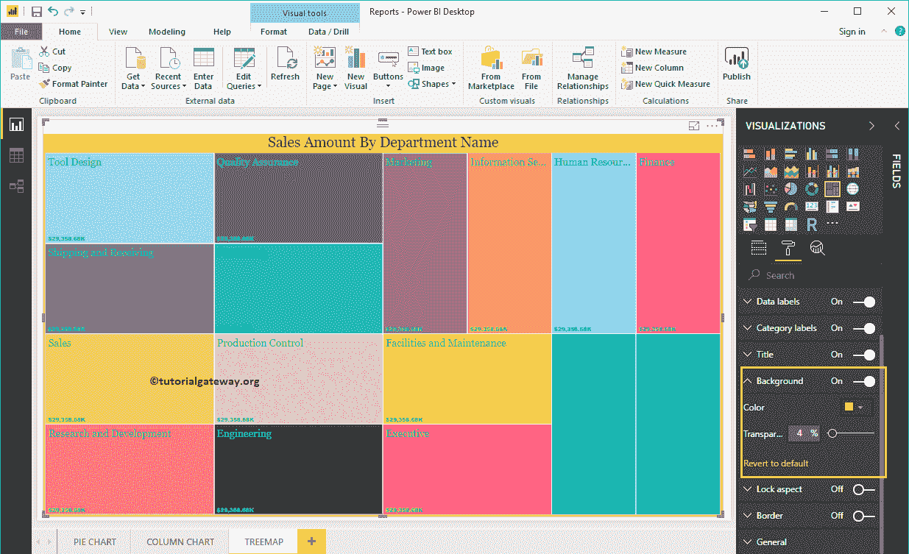
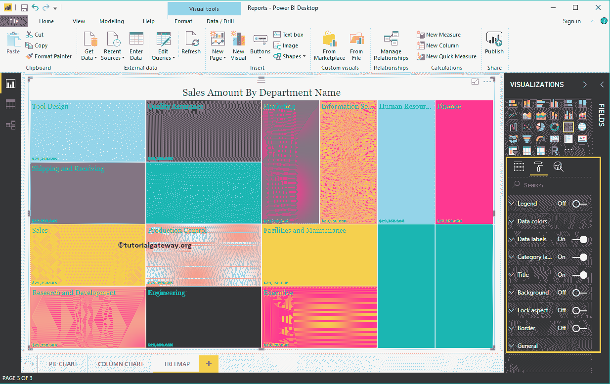

# PowerBI 中的树形图格式

> 原文：<https://www.tutorialgateway.org/format-tree-map-in-power-bi/>

如何用实例格式化 PowerBI 中的树形图？。它包括改变盒子颜色、树形图标题位置、背景颜色和数据标签等。

为了演示这些格式选项，我们将使用之前创建的树图。请参考 [Power BI 树形图](https://www.tutorialgateway.org/create-power-bi-treemap/)文章，了解创建 [Power BI](https://www.tutorialgateway.org/power-bi-tutorial/) 树形图的步骤。

## PowerBI 中如何格式化树形图

请单击“格式”按钮，查看树形图的可用格式选项列表。

### PowerBI 中树形图的格式图例

要显示图例，请选择图例区域并将选项从关闭更改为打开。从下面的截图中，可以看到传说

### 格式化 PowerBI 树图数据颜色

默认情况下，Power BI 智能感知会为每个矩形框分配随机颜色。但是使用这个数据颜色部分，您可以选择根据您的要求更改这些颜色。

出于演示的目的，我们将财务的矩形框改为粉色。

### 在 PowerBI 中启用树形图上的数据标签

用于显示矩形框信息的数据标签。在这种情况下，它显示每个矩形框的销售额。要启用数据标签，请将数据标签选项切换为打开。

从下面的截图中，您可以看到我们将颜色、显示单位从自动更改为千，并将字体系列更改为 Arial Black。

### PowerBI 树图的格式类别标签

类别标签除了代表矩形框的尺寸值(组值)之外，别无其他。从下面的截图中，您可以看到我们将类别标签的颜色、文本大小更改为 14，并将字体系列更改为 Georgia。

### PowerBI 中树形图的标题格式

请选择标题，并将选项从关闭切换到打开以显示树状图标题。以下是可用于格式化树状图标题的选项列表。

从下面的截图中可以看到，我们将标题文本更改为按部门名称列出的销售额。接下来，将“字体样式”设置为“乔治亚”，将“字体大小”设置为“20”，将“标题对齐”设置为“居中”。

### 在 Power BI 中为树形图添加背景色

您可以通过将“背景”选项切换到“开”来将背景颜色添加到树状图中。出于演示目的，我们添加黄色作为背景色。在这里，您也可以更改透明度百分比。

下面的截图显示了格式化后的树形图。

