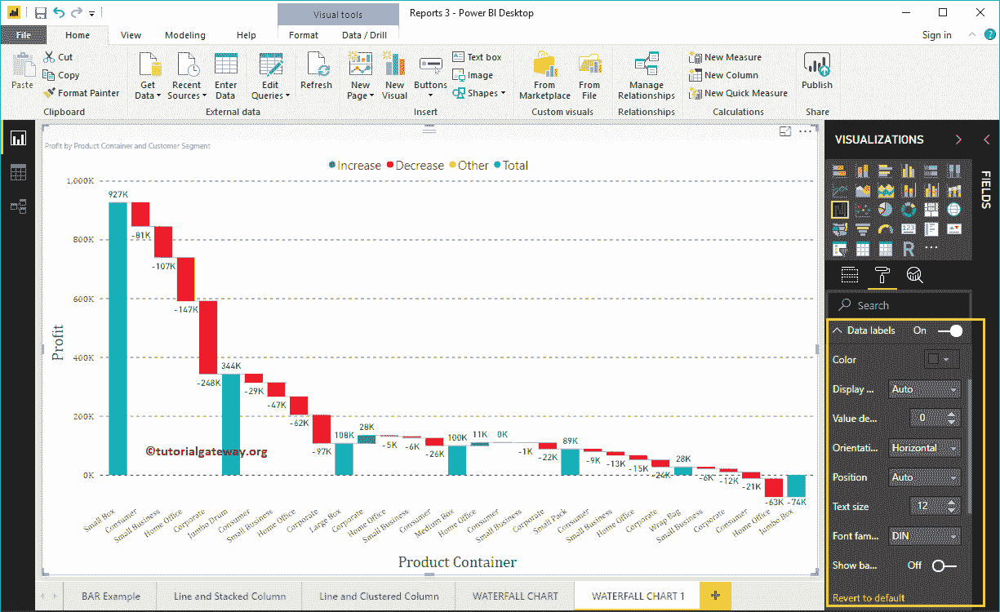
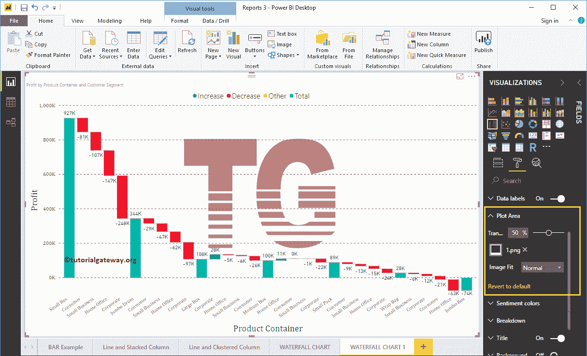
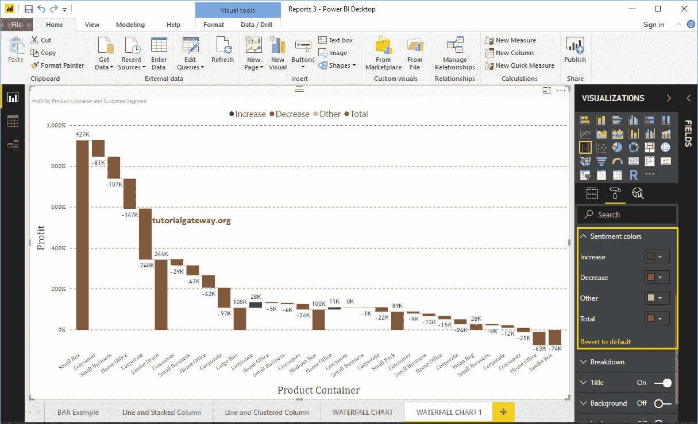

# 格式化PowerBI瀑布图

> 原文：<https://www.tutorialgateway.org/format-power-bi-waterfall-chart/>

如何用实例格式化 Power BI 瀑布图？。格式化瀑布图包括更改条形图颜色、瀑布图标题文本、标题位置、Y 轴和 X 轴详细信息、数据标签和背景图像等。

为了演示这些瀑布图格式选项，我们将使用之前创建的瀑布图。请参考 Power BI 文章中的[瀑布图，了解创建](https://www.tutorialgateway.org/waterfall-chart-in-power-bi/) [Power BI](https://www.tutorialgateway.org/power-bi-tutorial/) 瀑布图的步骤。

## PowerBI中如何格式化PowerBI瀑布图

请单击“格式”按钮查看该瀑布图可用的格式选项列表。正如你从下面的截图中看到的，悬停在任何一个栏上都会显示产品容器

之间的利润差异

### 格式化 Power BI 瀑布图常规设置

使用此常规部分更改瀑布图的图表响应度、X、Y 位置、宽度和高度

### PowerBI中瀑布图的格式图例

请选择图例区域，并将选项从关闭切换到打开以启用图例。

从下面的截图中可以看到，我们使用了位置下拉框将图例位置更改为顶部中心。接下来，我们将图例颜色更改为棕色，文本大小更改为 15。

### PowerBI中瀑布图的 X 轴格式

以下是可用于格式化水平轴或 X 轴的选项列表。从下面的截图中可以看到，我们将颜色改为棕色，文本大小改为 14，字体系列改为 Cambria。

默认情况下，X 轴标题设置为关闭。让我将选项从关闭更改为打开。接下来，将标题颜色更改为绿色，字体样式更改为红色，字体大小更改为 25。

### 功率商业智能瀑布图的 Y 轴格式

以下是可用于格式化垂直轴的选项列表。在这里，您可以更改 YAxis 的默认开始和结束值

如您所见，我们将 Y 轴字体颜色更改为棕色，字体系列更改为红色，显示单位更改为千，文本大小更改为 15。

默认情况下，X 轴标题设置为关闭。让我将选项从关闭更改为打开。接下来，我们将 Y 轴标题颜色更改为绿色，文本大小更改为 25，字体系列更改为 Cambria。

通过将“网格线”选项从“开”切换到“关”，可以禁用网格线。

*   颜色:您可以更改网格线颜色。
*   描边宽度:用它来改变网格线的宽度。
*   线条样式:选择线条样式，如实线、虚线和虚线。

这里，我们将颜色改为金色，线条样式改为虚线。

### PowerBI中瀑布图的数据标签格式

数据标签显示价值(每个时间点的销售额或利润)。从下面的截图中可以看到，我们启用了数据标签，并将颜色更改为绿色。

### PowerBI绘图区的瀑布图格式

使用此绘图区域属性，您可以添加自定义图像作为瀑布图的背景。出于演示目的，我们添加了一个图像作为绘图区域背景。

### 格式化 Power BI 瀑布图数据颜色

请根据你的要求改变这些颜色。

### 格式功率商业智能瀑布图细分

此选项限制了瀑布图允许的细分数量。当我们创建这个瀑布图时，我们添加了客户细分作为细分属性。

我们的数据在客户细分市场下有 4 条记录，这就是为什么细分市场会显示这 4 条记录。

让我把值改为 2。这意味着瀑布允许每个产品容器之间最多有两个故障。

### 格式化 Power BI 瀑布图标题

通过将标题选项从打开切换到关闭，您可以禁用瀑布图标题。

从下面的截图中，您可以看到我们将字体颜色更改为绿色，标题对齐更改为居中，文本大小更改为 25，字体系列更改为乔治亚。如果你愿意，你也可以给标题加上背景色。

### 格式化 Power BI 瀑布图背景色和边框

通过将“背景”选项切换为“开”，可以将背景颜色添加到瀑布图中。出于演示的目的，我们添加了一个透明度为 30%的随机黄色。

同样，您可以通过将“边框”选项从“关闭”切换到“打开”来向瀑布图添加边框。

