# Power BI R 脚本

> 原文：<https://www.tutorialgateway.org/power-bi-r-script/>

Power BI R 脚本允许在您的 Power BI 仪表板中使用 R 视觉效果或图表。在 Power BI 中使用 R 脚本对于数据科学家将他们的工作放在一个地方非常有帮助。

在本节中，我们将通过示例向您展示如何使用 Power BI R 脚本创建图表。在这个 Power BI R 脚本演示中，我们将使用 Rstudio 创建的忠实 CSV 文件。

我建议你参考 [R 编程](https://www.tutorialgateway.org/r-programming/)来理解我们在这篇 [Power BI](https://www.tutorialgateway.org/power-bi-tutorial/) 文章中使用的代码。

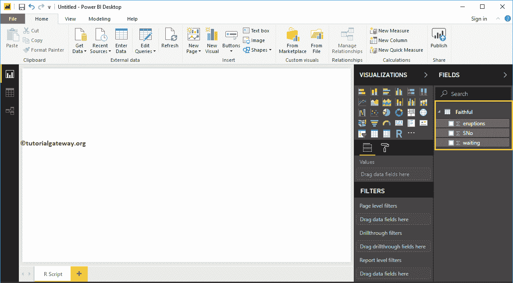

## 创建一个强大的商业智能脚本视觉

在 Power BI 中，您可以使用这个可视化脚本在仪表板内创建图表。

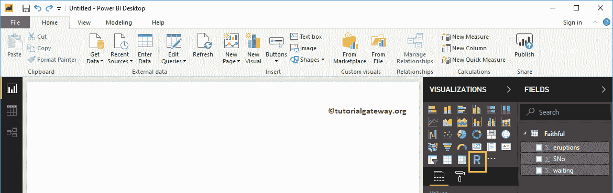

首先，点击可视化部分下的可视化脚本。它使用脚本编辑器自动生成图表，如下图所示。

您必须使用这个脚本编辑器窗口来编写代码。

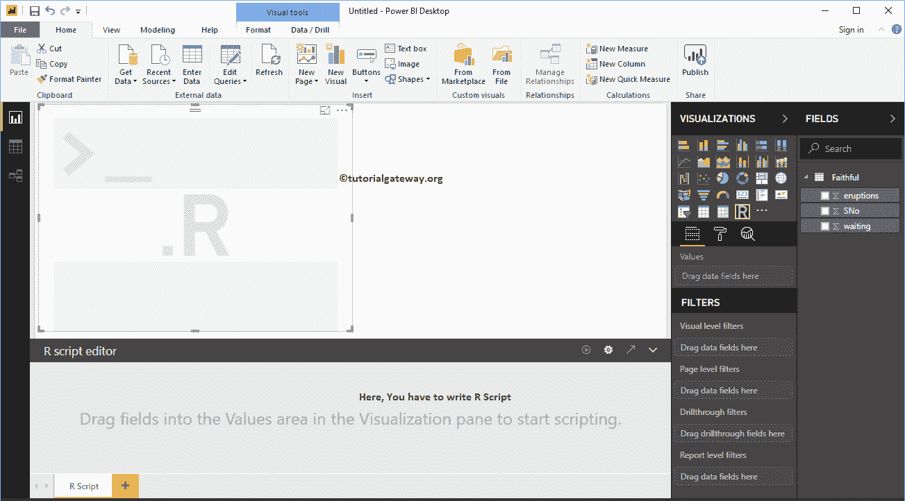

在开始编写代码之前，您必须创建一个数据集。可以通过将必填字段拖到“值”部分来完成。在这个演示中，让我将喷发和等待列拖到值部分。

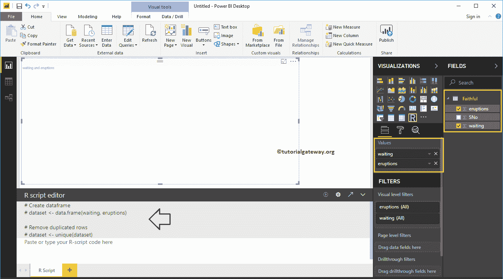

从上面的截图可以看到，Power BI 已经自动为你生成了一个数据集。现在，你必须使用这个数据集来生成你的视觉。

这里，我们使用 ggplot2 生成 2D 散点图。建议大家参考，[散点图](https://www.tutorialgateway.org/r-ggplot2-scatter-plot/)文章了解一下这个代码。

```
library(ggplot2)
ggplot(dataset, aes(x = eruptions, y = waiting))  +  
     geom_point() + 
     geom_density_2d()

```

写完脚本后，点击【运行】按钮

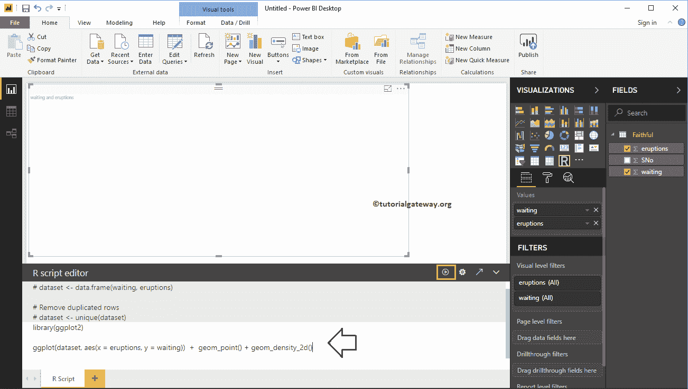

从下面的截图，你可以看到图表。

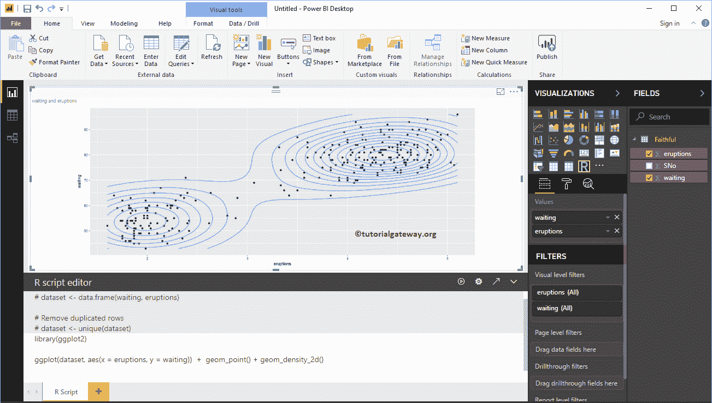

像任何其他图表一样，您也可以在图表上应用过滤器。为了演示 Power BI R 脚本过滤器，让我先[创建一个表](https://www.tutorialgateway.org/create-a-table-in-power-bi/)。

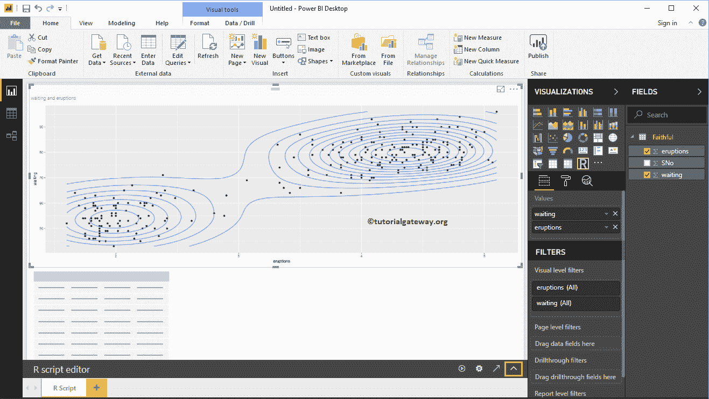

我们还创建了一个[柱形图](https://www.tutorialgateway.org/column-chart-in-power-bi/)。

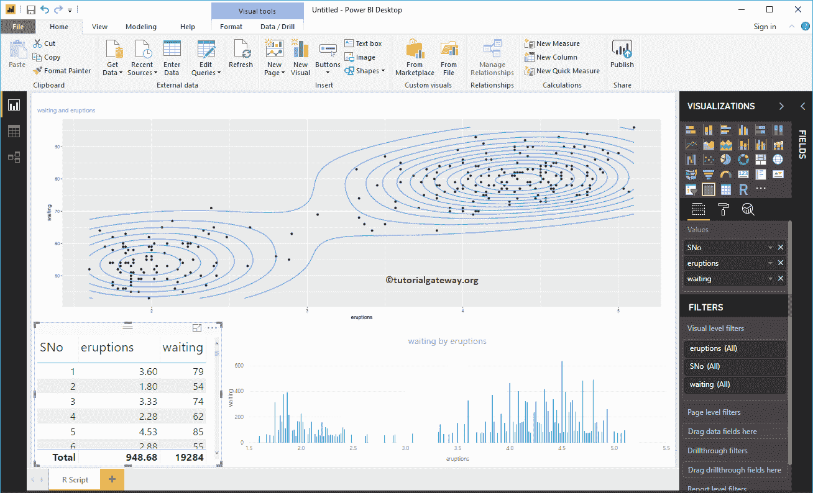

我认为表中的数据太多，无法应用过滤器。所以，让我[创建一个集群](https://www.tutorialgateway.org/power-bi-clusters/)。

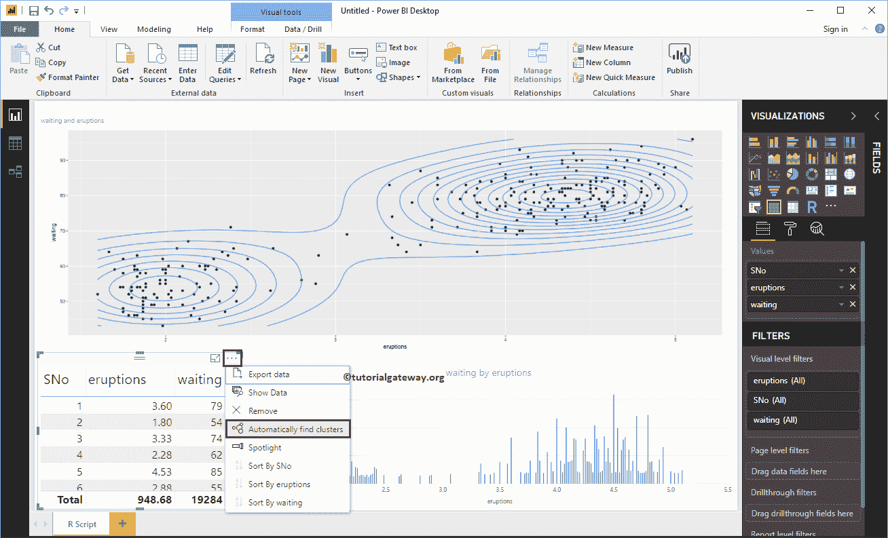

我们将保留默认设置

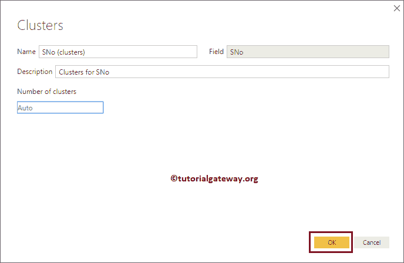

如您所见，它创建了两个集群。接下来，我们用表

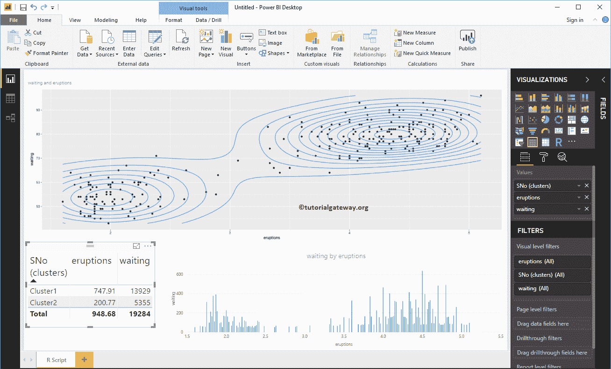

中的聚类列替换 Sno

让我选择集群 1。从下面的截图中，可以看到视觉正在过滤。

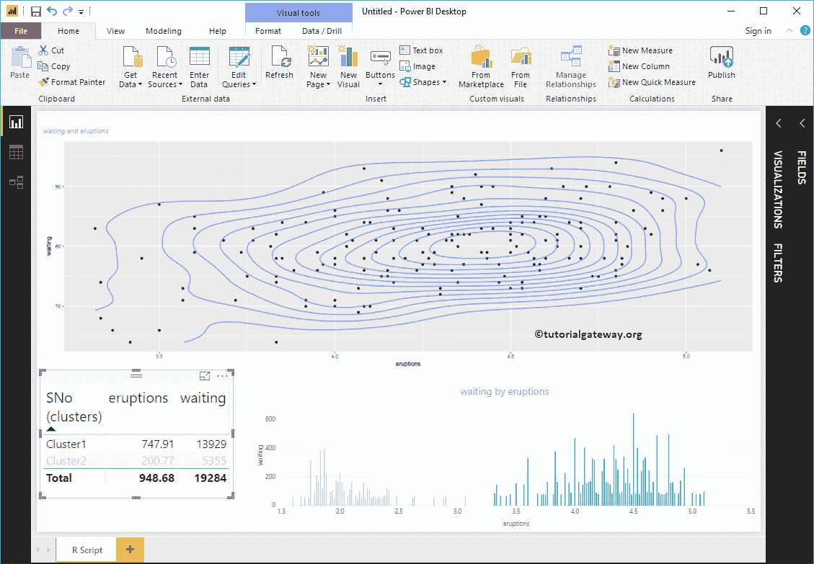

试试用其他集群太

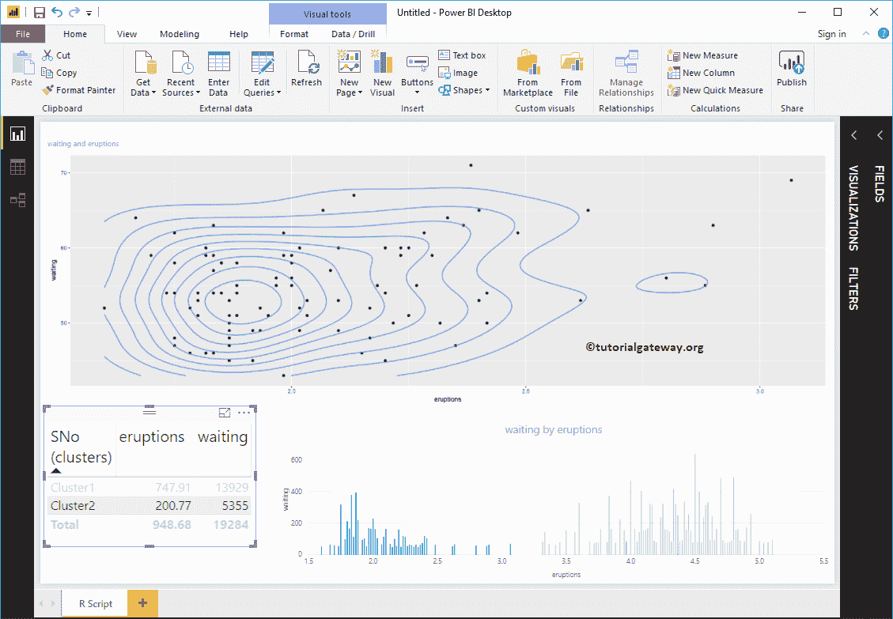

## 创建一个强大的商业智能脚本视觉 2

在 Power BI 中，您还可以使用可用的默认数据集创建一个 R 可视化。为了证明这一点，我们使用了钻石数据集。

```
library(ggplot2)
ggplot(diamonds, aes(x = carat, y = price, color = cut))  +  
       geom_point() + 
       geom_smooth(method = "auto", se = FALSE) +  
       scale_color_manual(values = c("orchid", "chocolate4",   
                                 "goldenrod2", "tomato2", "midnightblue"))
```

从下面的截图中，您可以看到报告和代码。

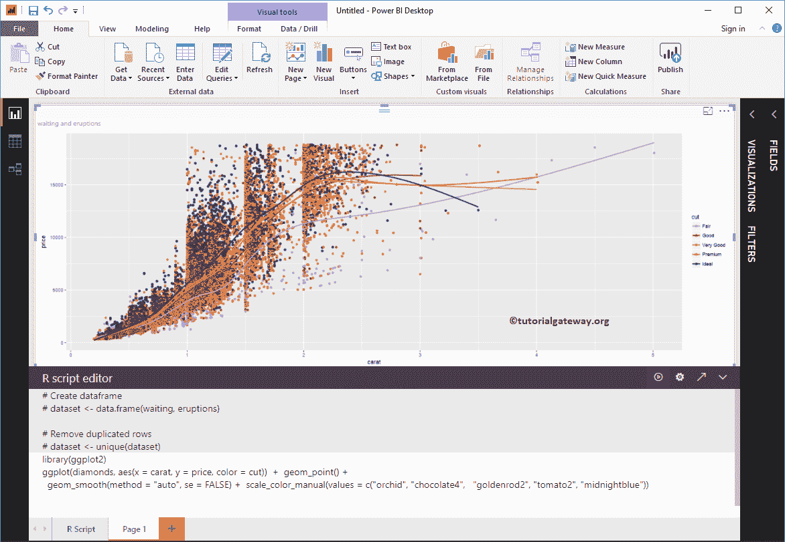