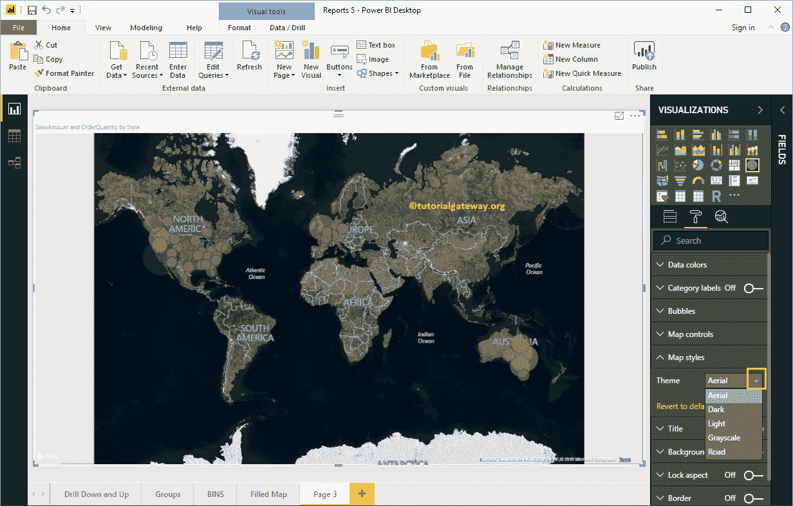
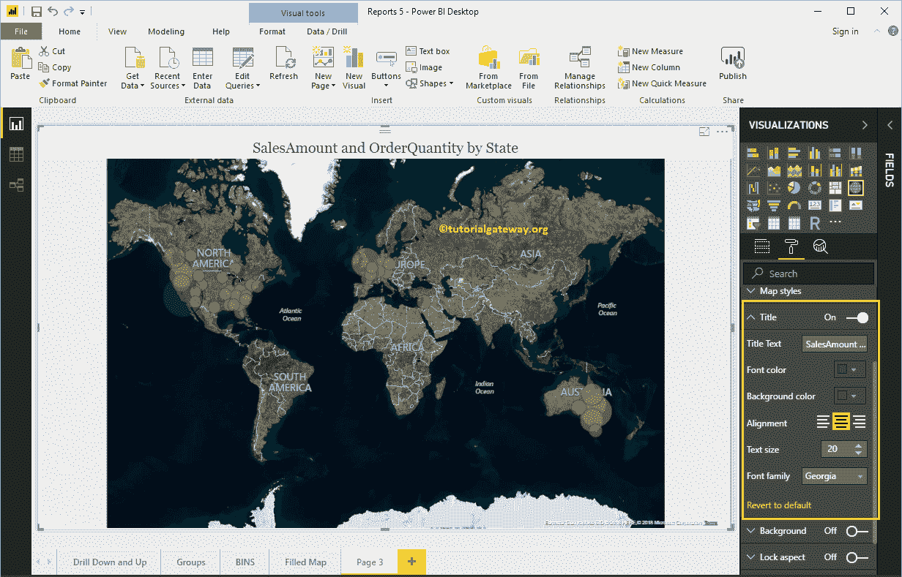

# 格式化PowerBI地图

> 原文：<https://www.tutorialgateway.org/format-power-bi-map/>

如何用例子格式化PowerBI地图？。格式化 Power BI 地图包括更改气泡大小、颜色、地图标题文本、标题位置、背景颜色等。

为了演示这些地图格式选项，我们将使用之前创建的地图。请参考[在 Power BI](https://www.tutorialgateway.org/create-a-map-in-power-bi/) 中创建地图一文，了解创建 [Power BI](https://www.tutorialgateway.org/power-bi-tutorial/) 地图所涉及的步骤。

## 如何格式化PowerBI地图

请单击格式按钮查看此地图可用的格式选项列表。

### 格式化PowerBI地图数据颜色

当我们创建此地图时，我们添加了订单数量作为颜色饱和度，这就是为什么我们在数据颜色下看到发散选项。请根据您的要求更改最小、中心和最大颜色。

如果您从颜色饱和度中删除了订单数量，数据颜色部分会显示每个气泡的颜色，如下所示。

让我再次将订单数量添加到色彩饱和度

### 格式化PowerBI地图类别标签

地图类别标签表示代表每个气泡或圆的名称。通过将类别标签选项从关闭切换到打开，您可以启用这些标签。

从下面的截图中，你可以看到，我们将颜色改为黑色，文本大小改为 14。如果你愿意，你也可以添加背景色。

### PowerBI图的气泡尺寸格式

使用此部分更改所有圆的大小。从下面的截图中可以看到，我们将大小更改为 25%。

### PowerBI地图中的地图控制

默认情况下，此地图启用了自动缩放选项。但是，您可以通过将自动缩放选项从打开切换到关闭来禁用。

### 设置地图主题的格式

使用此部分更改地图的外观或主题。让我选择空中主题。

### PowerBI中地图标题的格式

通过将标题选项从打开切换到关闭，您可以禁用地图标题。

从下面的截图中，您可以看到，我们将字体颜色更改为绿色，文本大小更改为 20，字体系列更改为乔治亚，标题对齐更改为居中。如果你愿意，你也可以给标题加上背景色。

### 设置地图背景颜色和边框的格式

通过将“背景”选项切换为“开”，可以将背景颜色添加到地图中。

同样，您可以通过将“边框”选项从“关闭”切换到“打开”来向地图添加边框。

