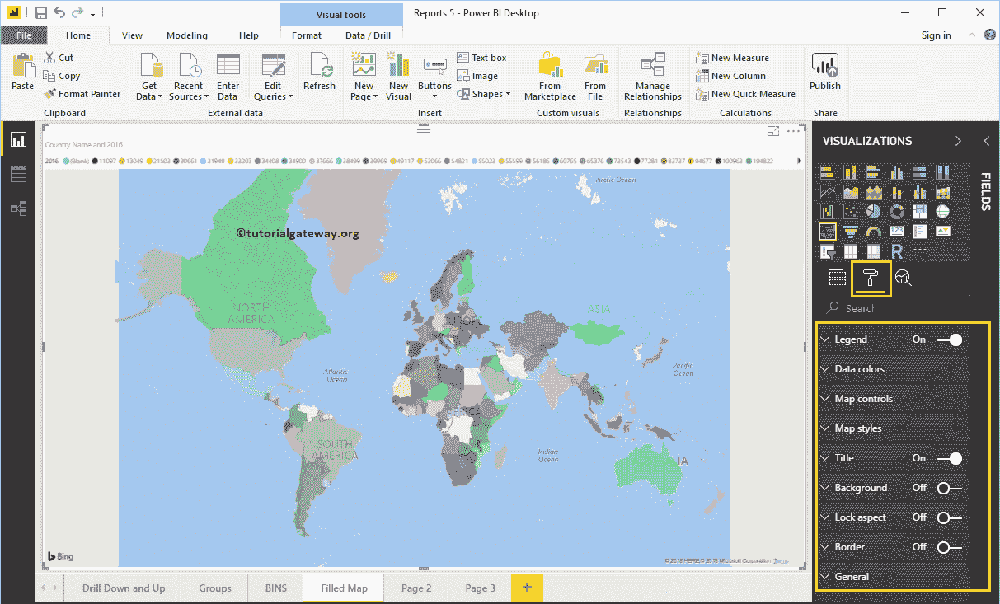
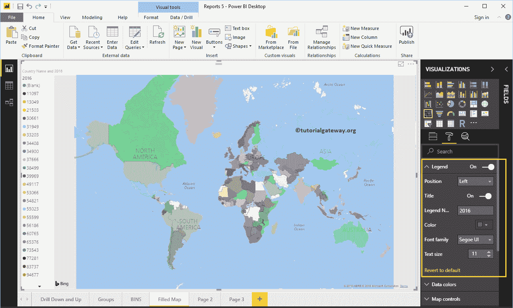
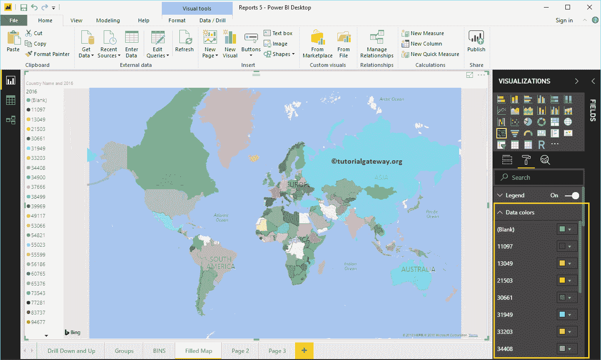
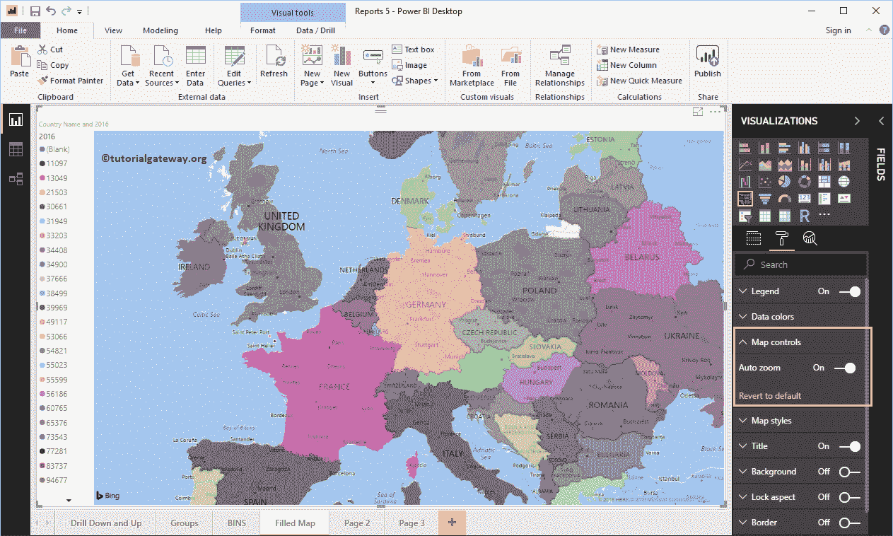
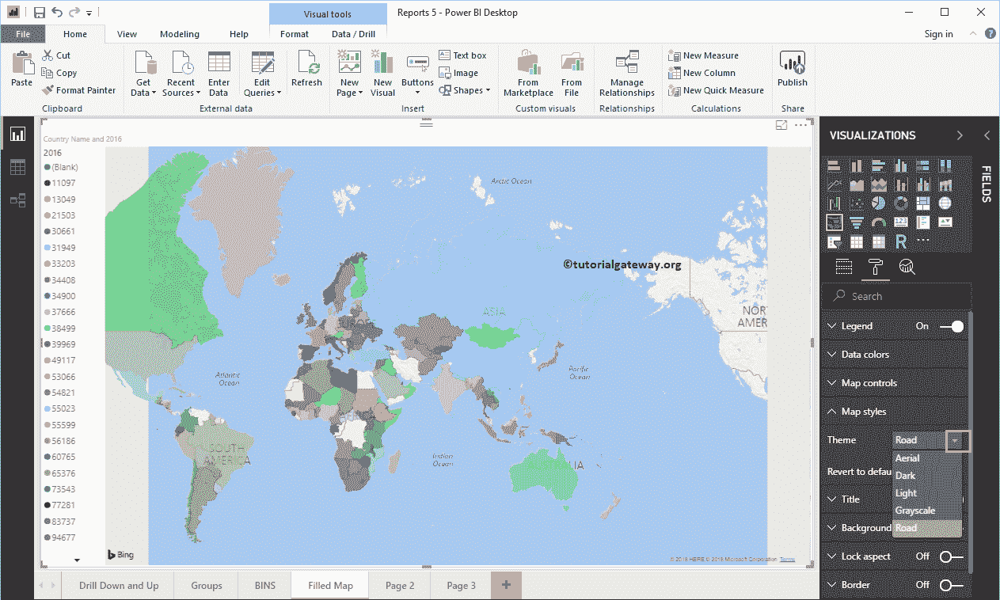
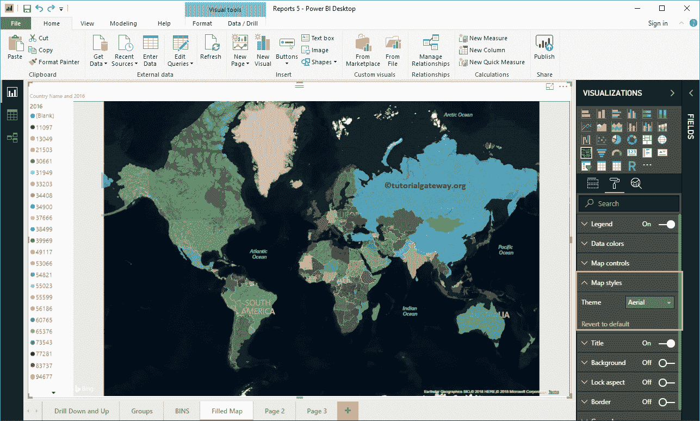
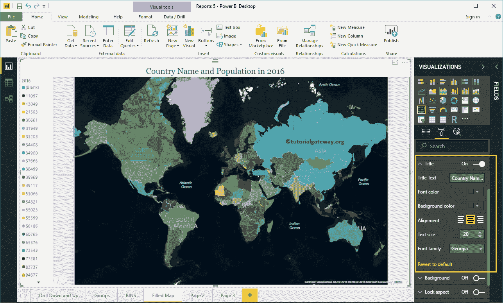
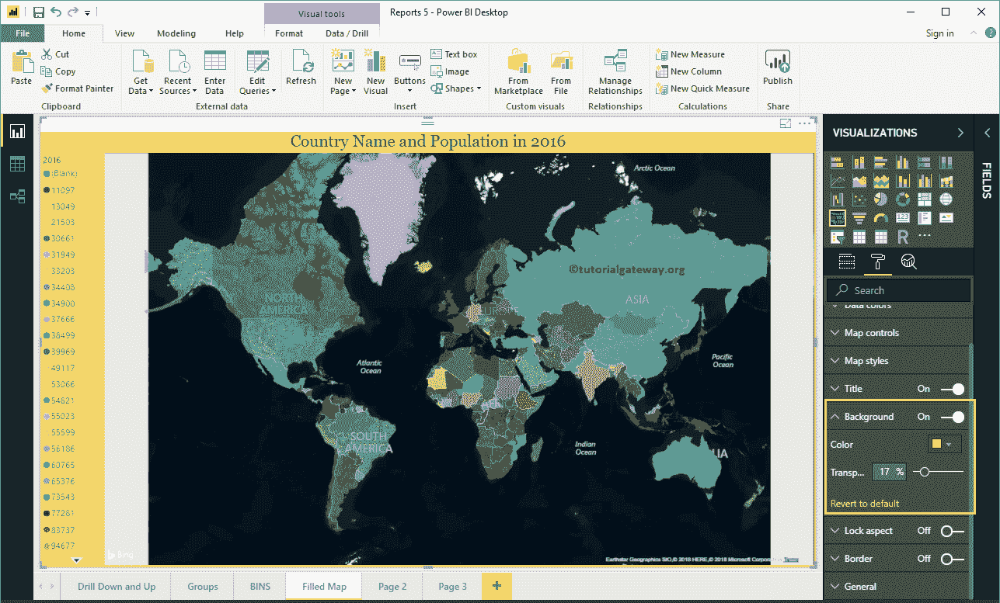
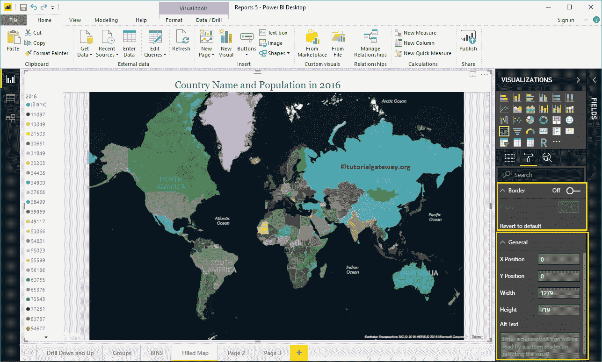

# 格式化 PowerBI 填充地图

> 原文：<https://www.tutorialgateway.org/format-power-bi-filled-map/>

如何用例子格式化 Power BI 填充地图？。格式化 Power BI 填充地图包括更改地图颜色、填充地图标题文本、标题位置、背景颜色等。

## 如何格式化 PowerBI 填充地图

为了演示这些填充地图格式选项，我们将使用之前创建的填充地图。请参考[在 Power BI](https://www.tutorialgateway.org/filled-map-in-power-bi/) 中创建填充地图一文，了解在 [Power BI](https://www.tutorialgateway.org/power-bi-tutorial/) 中创建填充地图的过程。

请单击“格式”按钮查看此填充地图的可用格式选项列表。

### PowerBI 中填充地图的格式图例

从下面的截图中可以看到，我们使用了位置下拉框将图例位置更改为左侧。接下来，我们将图例文本大小更改为 11。

### 格式化填充地图数据颜色

使用此数据颜色部分更改每个区域的颜色(这里是国家)。

### PowerBI 填充地图中的地图控制

默认情况下，在此填充地图中启用自动缩放选项。但是，您可以通过将自动缩放选项从打开切换到关闭来禁用。

### 字段地图的格式地图样式

使用此部分更改地图的外观或主题。

让我选择空中主题。

### 填充地图的格式标题

通过将“标题”选项从“打开”切换到“关闭”，您可以禁用填充的地图标题。

从下面的截图中，您可以看到，我们将字体颜色更改为绿色，文本大小更改为 20，标题对齐更改为居中，字体系列更改为乔治亚。如果你愿意，你也可以给标题加上背景色。

### 在 Power BI 中格式化填充地图的背景颜色

通过将“背景”选项切换为“开”，可以将背景颜色添加到填充的地图中。出于演示目的，我们添加了透明度为 17%的黄色。

### 填充地图的格式边框和常规设置

通过将“边框”选项从关闭切换到打开，可以将边框添加到填充地图。类似地，使用此常规部分更改填充地图的 X、Y 位置、宽度和高度

