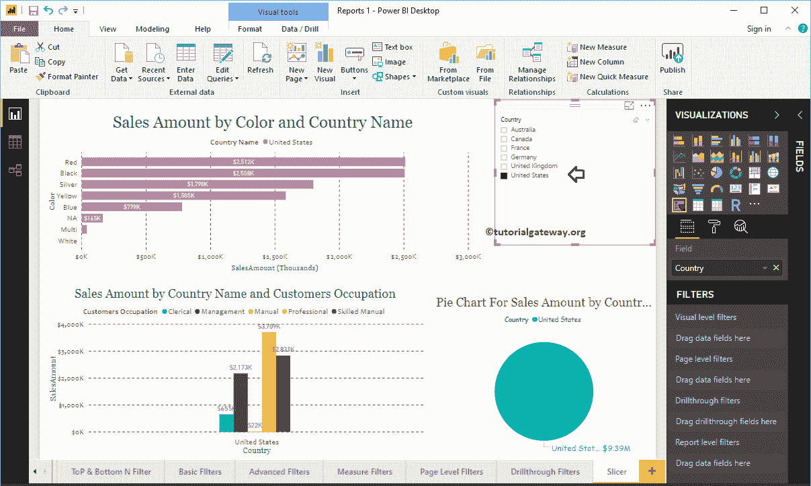
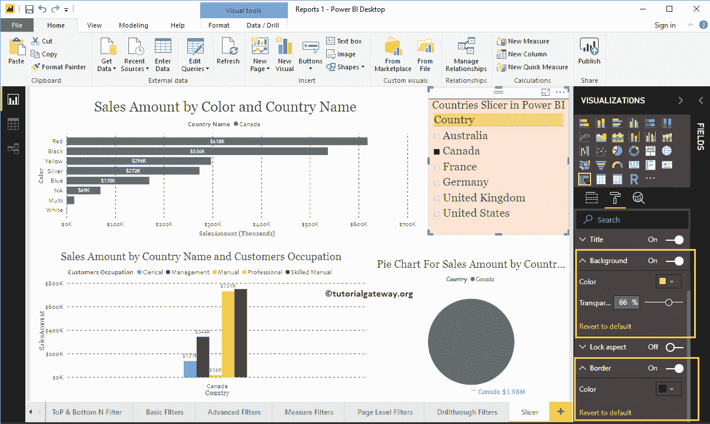
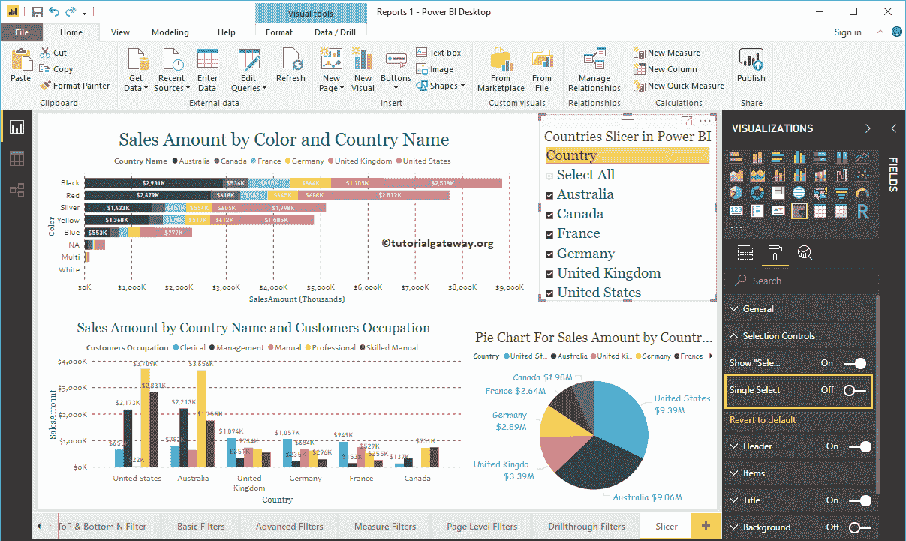

# PowerBI切片机

> 原文：<https://www.tutorialgateway.org/power-bi-slicer/>

Power BI Slicer 通常用于向画布添加过滤器或在报告画布上显示过滤器。让我用一个例子向您展示如何在 Power BI 中创建切片器。

在这个 Power BI 切片器演示中，我们将使用我们在上一篇文章中创建的 SQL 数据源。

## 如何创建高级商业智能切片器

我们将使用此页面演示创建 Power BI 切片器的步骤。本页包含[堆叠条形图](https://www.tutorialgateway.org/power-bi-stacked-bar-chart/)、[聚集柱形图](https://www.tutorialgateway.org/clustered-column-chart-in-power-bi/)和[饼图](https://www.tutorialgateway.org/pie-chart-in-power-bi/)。所以，请参考[将 Power BI 连接到 SQL Server](https://www.tutorialgateway.org/connect-power-bi-to-sql-server/) 一文了解 [Power BI](https://www.tutorialgateway.org/power-bi-tutorial/) 数据源。

要在 Power BI 中创建切片器，首先将要用作过滤器的字段拖放到画布区域。在本例中，我们希望使用国家作为此报告的过滤器。所以，让我把国家从地理表拖到画布上。它会自动为你创建一张[地图](https://www.tutorialgateway.org/create-a-map-in-power-bi/)。

单击可视化部分下的切片器，它将转换地图。从下面的截图，可以看到国家列表。

## 创建功率双限幅器方法 2

首先，单击可视化部分下显示的图标。它会自动用虚拟数据创建一个，如下所示。

为了向其中添加数据，请将过滤字段拖放到字段部分。让我在字段部分添加国家。

为了演示的目的，让我选择美国。从下面的截图中，您可以看到堆叠柱形图、饼图和聚集柱形图显示了美国的销售额。

提示:默认情况下，一次只能选择一个字段(国家/地区)。对于多选，您必须在格式部分将单选选项从开切换到关。

这次我们选择了英国。正如您所观察到的，过滤器适用于所有图表。

### 如何格式化PowerBI切片机

请单击“格式”按钮，查看此 Power BI 切片器可用的格式选项列表。

#### 格式常规设置

使用此常规部分更改轮廓重量、轮廓颜色、X、Y 位置、宽度和高度。

#### PowerBI中切片器的格式头

这里，我们添加了背景色，轮廓到底部。接下来，我们将文本大小更改为 20，并将字体系列更改为佐治亚。

#### 设置项目格式

我们将项目(国家)字体颜色更改为绿色，文本大小更改为 20，字体系列更改为乔治亚。

#### 格式化切片器标题

通过将“标题”选项从“关闭”切换到“打开”，您可以向其添加标题。从下面的截图中，您可以看到我们在 Power BI 中添加了标题文本作为国家切片器。接下来，将字体颜色更改为红色，标题对齐方式更改为居中，字体系列更改为乔治亚，文本大小更改为 19。

#### 格式化高级商业智能切片器背景颜色和边框

您可以通过将“背景”选项切换到“开”来添加背景颜色。出于演示目的，我们添加了透明度为 66%的随机颜色。同样，您也可以通过将“边框”选项从“关闭”切换到“打开”来添加边框。

#### 格式切片器选择控件

选择控件部分帮助您格式化 Power BI 切片器选择控件。该部分有两个属性:

*   显示全选:它向切片器添加全选选项。
*   单一选择:它一次只能选择一个项目。

让我将显示全选选项从关闭切换到打开。现在，您可以在国家切片器

下看到全选

通过将“单一选择”选项从“开”切换到“关”，您可以使切片器选择多个字段。

让我选择澳大利亚、德国、英国和美国。

