# PowerBI基本过滤器

> 原文：<https://www.tutorialgateway.org/power-bi-basic-filters/>

Power BI 过滤器可用于根据要求限制数据。例如，使用 Power BI 基本过滤器，我们可以从显示中排除一个产品，或者我们可以显示前/后 10 个性能记录。让我用例子向你展示如何创建 Power BI 基本过滤器。

## 如何使用PowerBI基本过滤器

为了演示 Power BI 中的基本过滤器，我们将使用我们在之前的文章中创建的[聚类柱形图](https://www.tutorialgateway.org/clustered-column-chart-in-power-bi/)。从下面的截图 [Power BI](https://www.tutorialgateway.org/power-bi-tutorial/) 中可以看到，我们使用了“国家名称”作为“轴”字段，“职业”作为“图例”字段，“销售额”作为“值”字段。

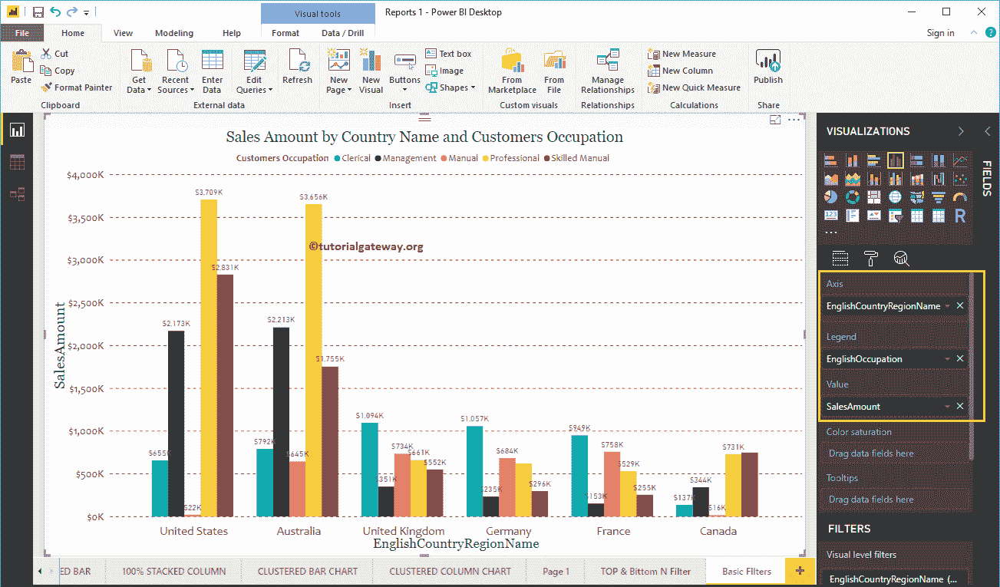

在过滤器部分，您可以看到 Power BI 中可用的过滤列表

*   视觉级过滤器:包括维度过滤器、[度量过滤器](https://www.tutorialgateway.org/power-bi-filters-on-measures/)、基本过滤器、[高级过滤器](https://www.tutorialgateway.org/power-bi-advanced-filters/)和[前 N 名过滤器](https://www.tutorialgateway.org/power-bi-top-10-filters/)
*   页面级过滤器:这些[页面级过滤器](https://www.tutorialgateway.org/power-bi-page-level-filters/)适用于当前页面中出现的所有视觉效果。
*   穿透钻取过滤器:此[穿透钻取过滤器](https://www.tutorialgateway.org/drill-through-filters-in-power-bi/)帮助您穿透钻取特定区域或特定类别等。
*   报告级别过滤器:这些[报告级别过滤器](https://www.tutorialgateway.org/power-bi-report-level-filters/)适用于当前报告中存在的所有页面。

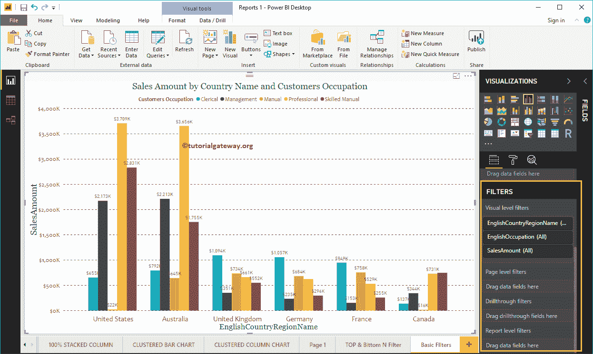

让我展开英文国家/地区名称(简称国家/地区)来查看过滤器类型。

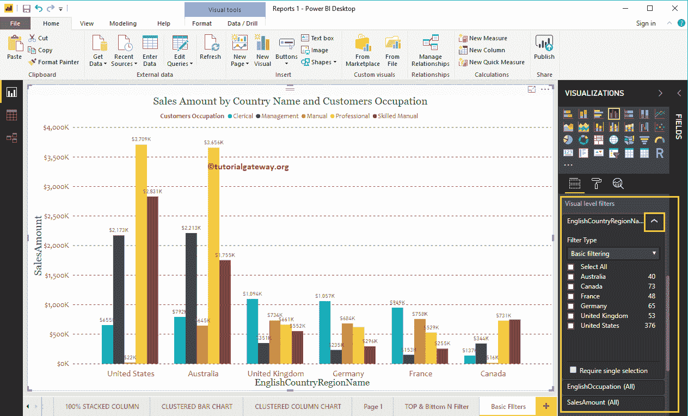

使用下拉列表查看维度可用的 Power BI 过滤器类型列表。

*   [高级过滤](https://www.tutorialgateway.org/power-bi-advanced-filters/):这个选项可以帮助你使用更高级的选项，比如开头、结尾、包含等。
*   Power BI 基本过滤器:用于执行基本操作。
*   [前 N 名](https://www.tutorialgateway.org/power-bi-top-10-filters/):用这个查找前 10 条记录或者后 10 条记录。

在这个例子中，我们想要讨论 Power BI 基本过滤器，所以，让我选择相同的。

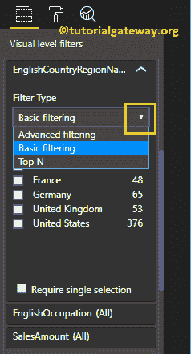

在 Power BI 中选择基本过滤器将显示此列可用的行。您可以使用复选框选择一个、无(或全部)

让我选择澳大利亚、德国、英国和美国。从下面的截图中，您可以看到聚集柱形图显示了属于雨夹雪国家的列。

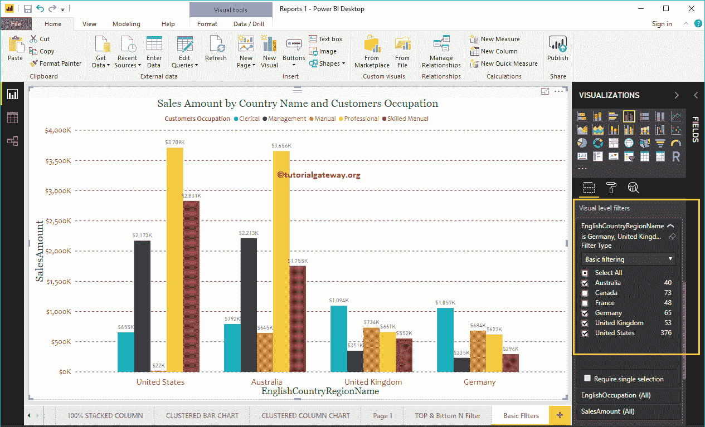

必需的单一选择:它限制我们一次只能选择一个字段。我的意思是，现在你一次只能选择一个国家的名字。

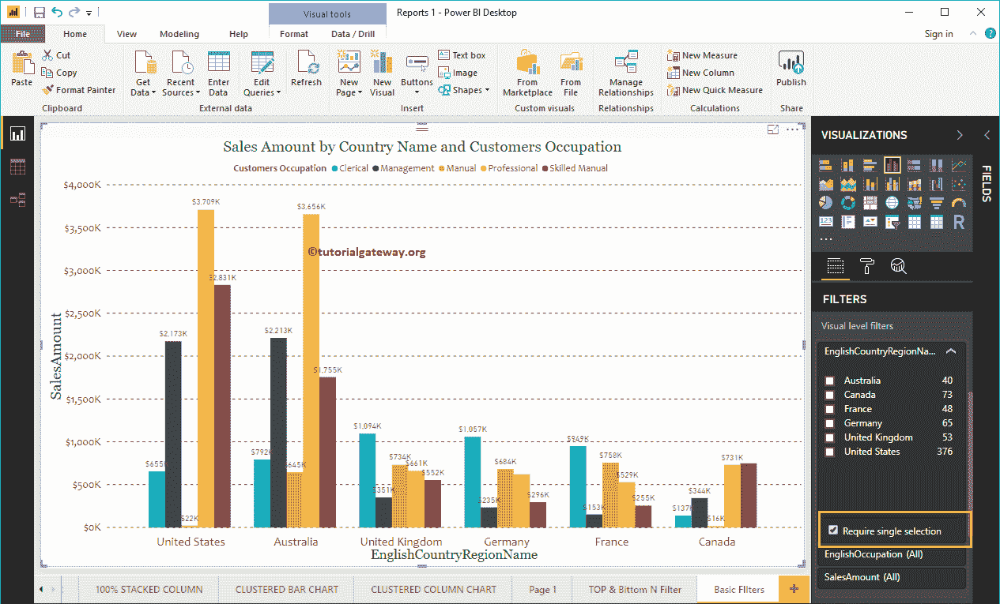

如你所见，我们选择了美国。

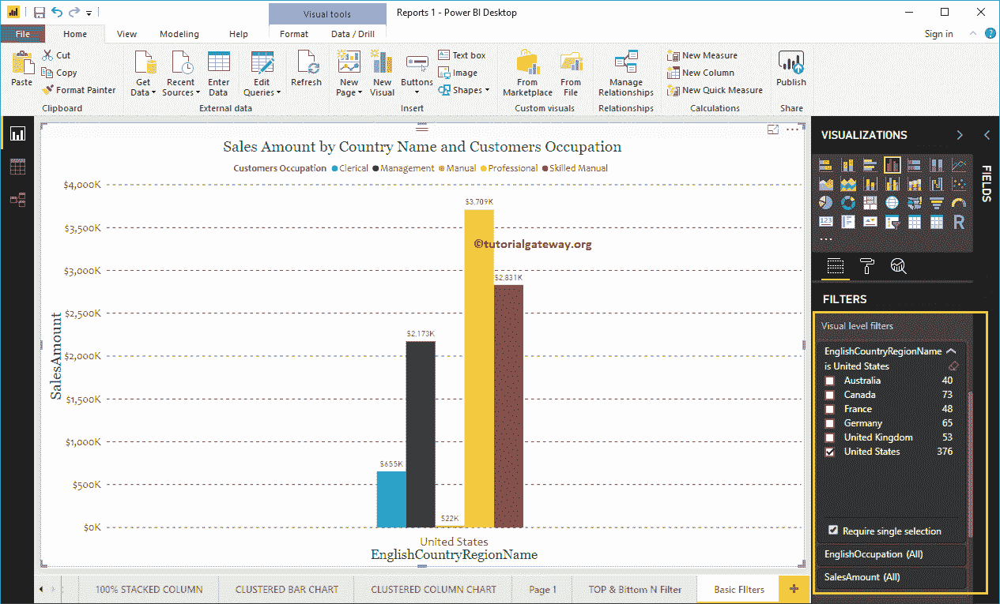

通过取消选中“必需的单一选择”属性，您可以选择多个字段。

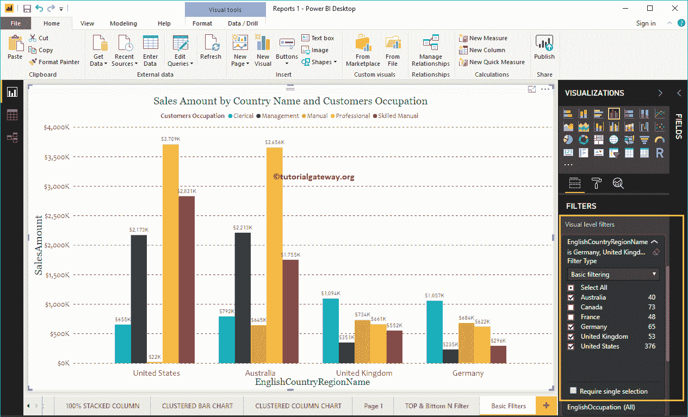

通过点击这个小小的清除过滤器按钮，可以帮助您删除现有的过滤器。

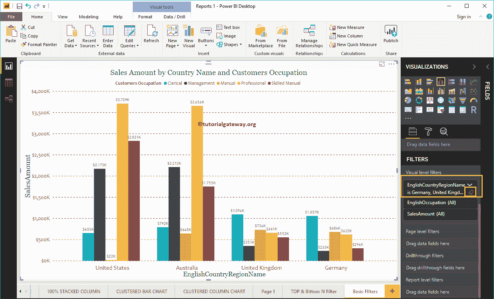

### 多维度上的PowerBI 基本滤波器

让我展开“英语职业”栏，对“职业”应用过滤器。

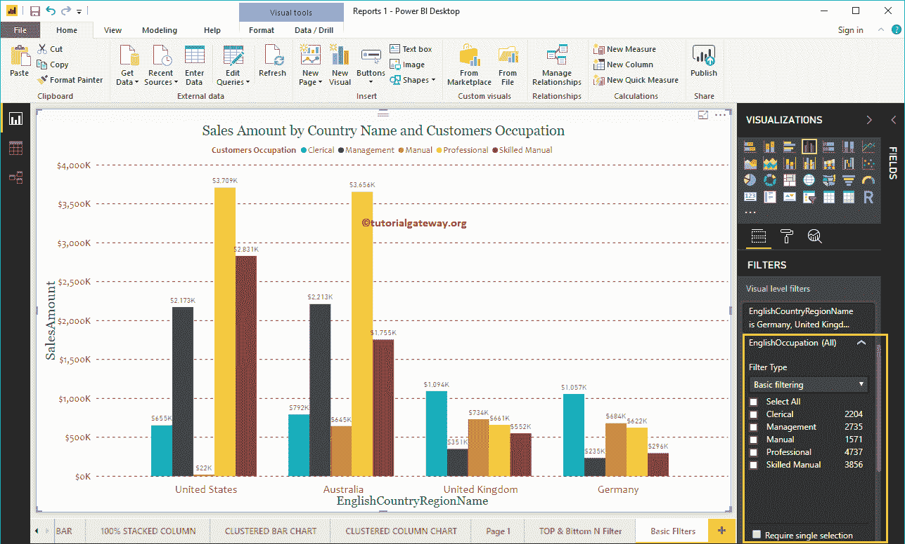

让我选择管理、专业和熟练手动字段作为基本过滤值。从下面的截图中可以看到，它显示了我们在国家过滤器中选择的 4 个国家和我们现在选择的三个职业。

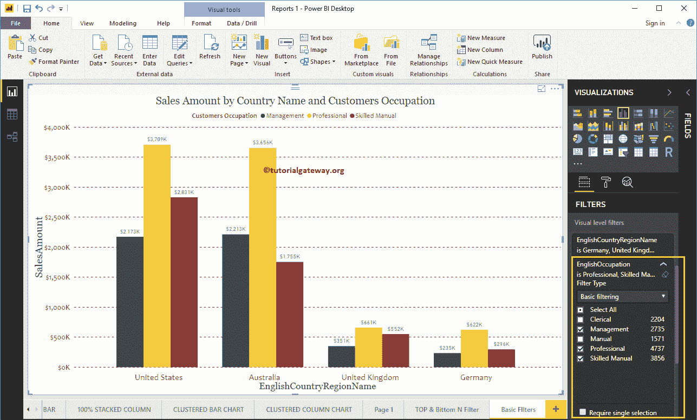

这一次，我们选择了一个字段，即熟练手册。

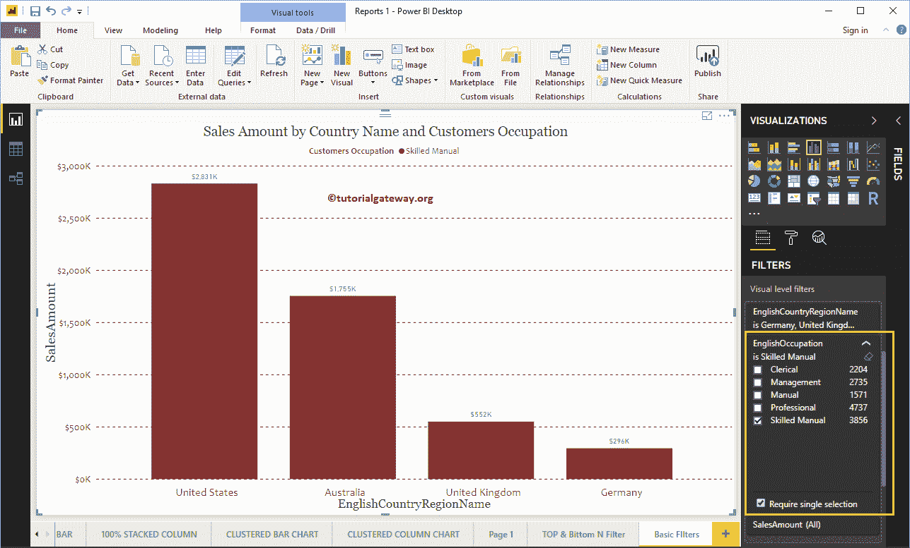

### 删除PowerBI过滤器

点击微小的清除过滤器按钮，删除现有的过滤器。出于演示目的，让我删除“职业”字段中的过滤器。

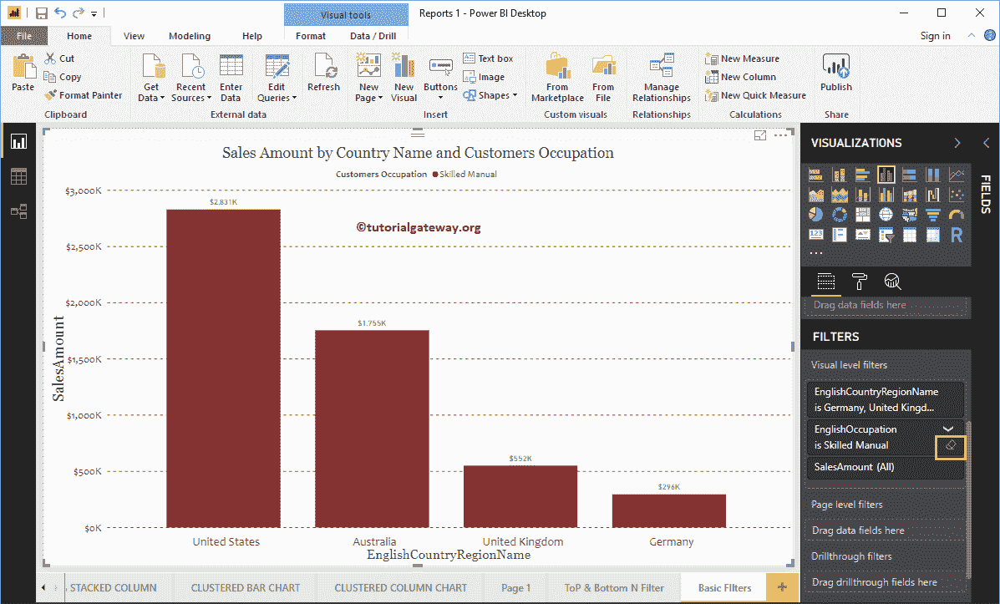

您可以看到职业字段没有过滤器

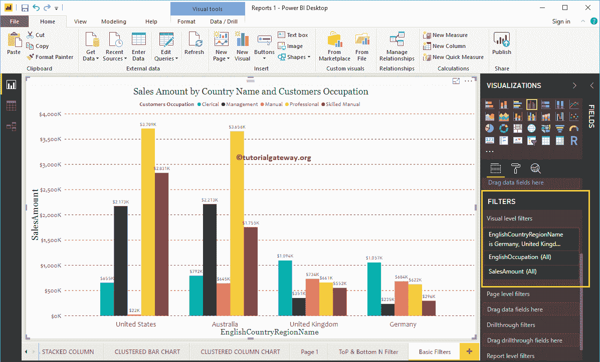

让我去掉国家

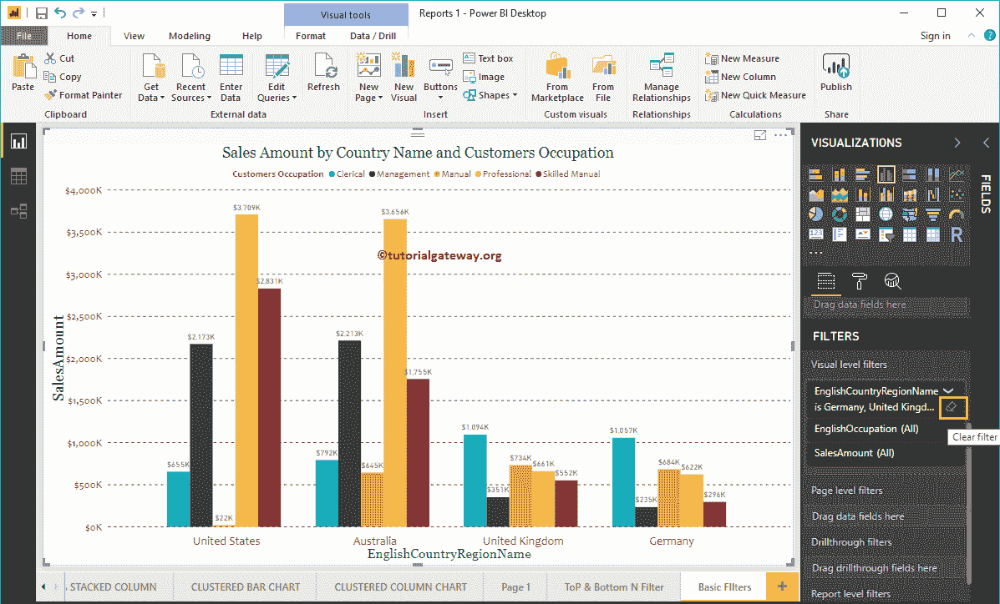

上的滤镜

现在你可以看到这个[聚类柱形图](https://www.tutorialgateway.org/clustered-column-chart-in-power-bi/)中没有过滤器。

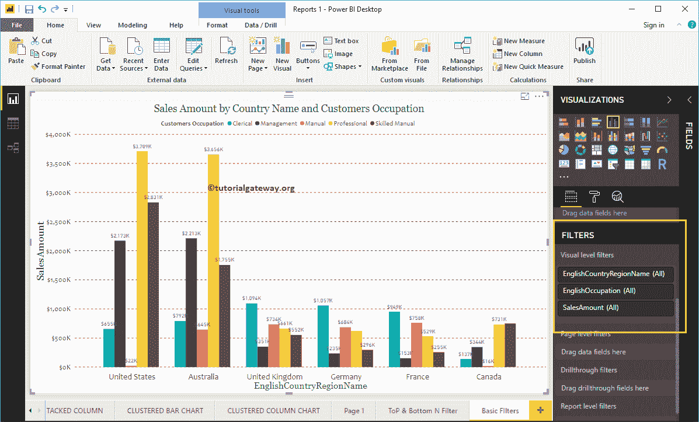