# 电力商业智能高级过滤器

> 原文：<https://www.tutorialgateway.org/power-bi-advanced-filters/>

如何用例子创建 Power BI 高级过滤器？。Power BI 高级过滤器使用通配符根据要求限制报告数据。例如，我们可以使用这些 Power BI 高级过滤器来查找以 S 开头的产品，或者产品包含 Bikes 等。

## 如何使用 Power BI 高级过滤器

为了演示 Power BI 中的高级过滤器，我们将使用我们在之前的文章中创建的[聚类柱形图](https://www.tutorialgateway.org/clustered-column-chart-in-power-bi/)。从下面的 [Power BI](https://www.tutorialgateway.org/power-bi-tutorial/) 截图中可以看到，我们使用了“国家/地区名称”作为“轴”字段，“英语职业”作为“图例”字段，“销售额”作为“值”字段。

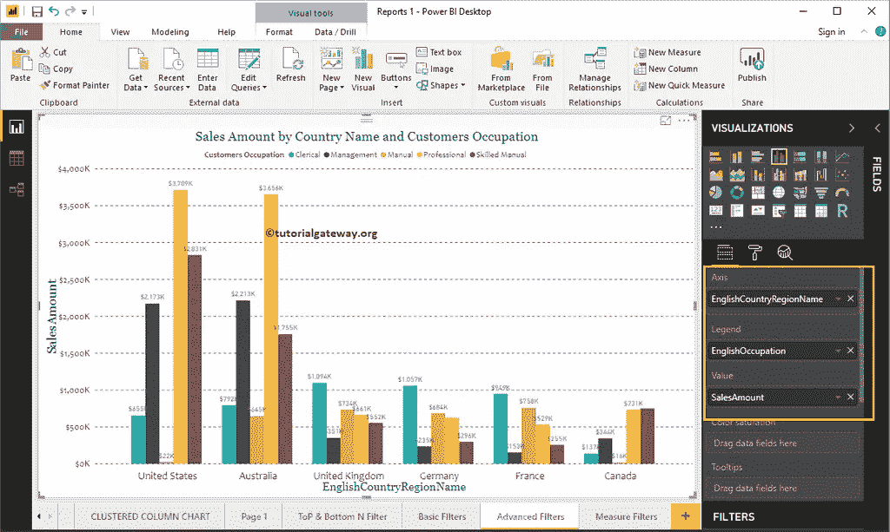

在过滤器部分，您可以看到 Power BI

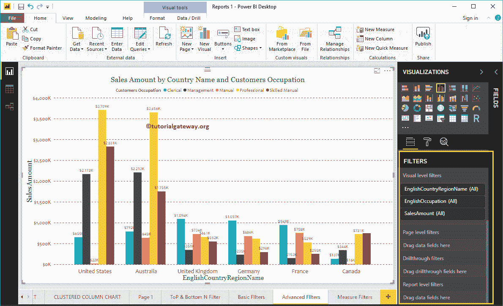

中可用过滤器的列表

让我展开英文国家/地区名称来查看过滤器类型。默认情况下，[基本过滤器](https://www.tutorialgateway.org/power-bi-basic-filters/)选项选择为过滤器类型

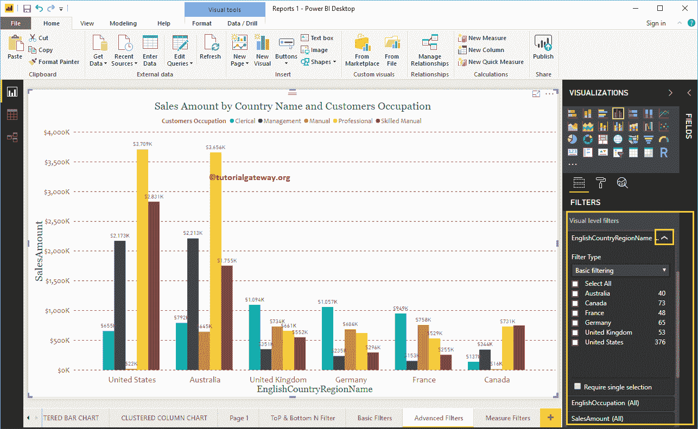

使用下拉菜单将其更改为高级过滤

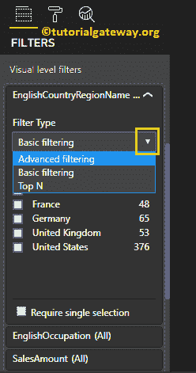

以下是 Power BI 高级过滤可用的选项列表

*   值为时显示项目:请选择要使用的通配符。
*   空文本框:请指定通配符或表达式。例如，它以 s 开头。
*   And 和 Or:与 [SQL](https://www.tutorialgateway.org/sql/) 中的 [AND 和 OR](https://www.tutorialgateway.org/sql-and-or-operators/) 运算符相同。使用它来连接多个通配符搜索。
*   空下拉列表:请选择您想要使用的第二个通配符。
*   空文本框:请为第二个通配符指定字符或表达式。

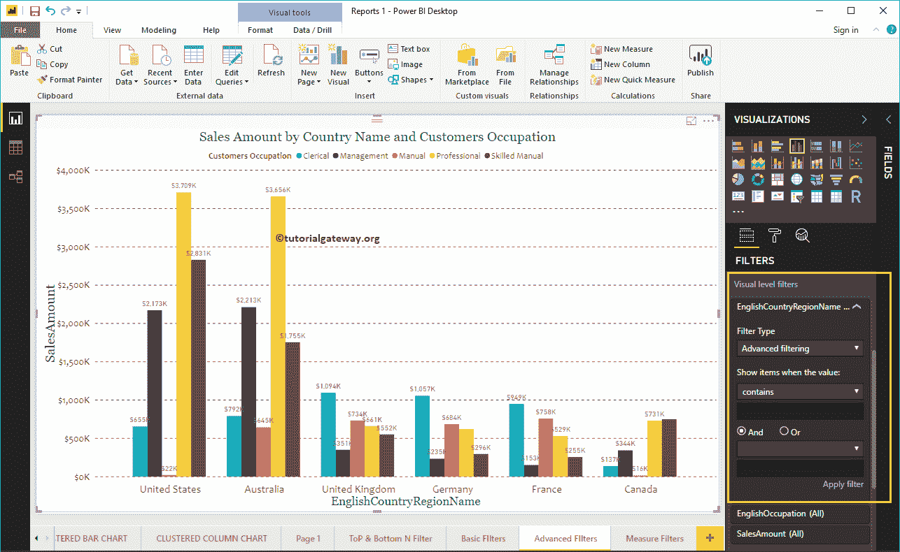

以下是值部分显示项目下的可用选项列表:

1.  包含:选择此属性时，它将根据匹配值检查每条记录。如果它在任何位置包含匹配值，则显示记录。
2.  不包含:它根据匹配值检查每条记录。如果它在任何位置都不包含匹配值，则显示记录。
3.  开始于:如果记录以匹配值开始，则显示该记录。
4.  不以:开始如果记录不以匹配值开始，则显示该记录。
5.  is:如果记录与匹配值完全匹配，则显示该记录。
6.  不是:如果记录不完全等于匹配值，则显示该记录。
7.  为空:此选项显示具有空值的所有记录。
8.  不为空:它显示不包含空值的所有记录。

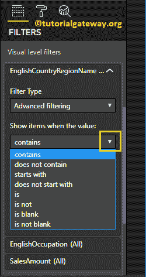

为了演示 Power BI 高级过滤器，我们选择了包含作为通配符，联合作为关键字。

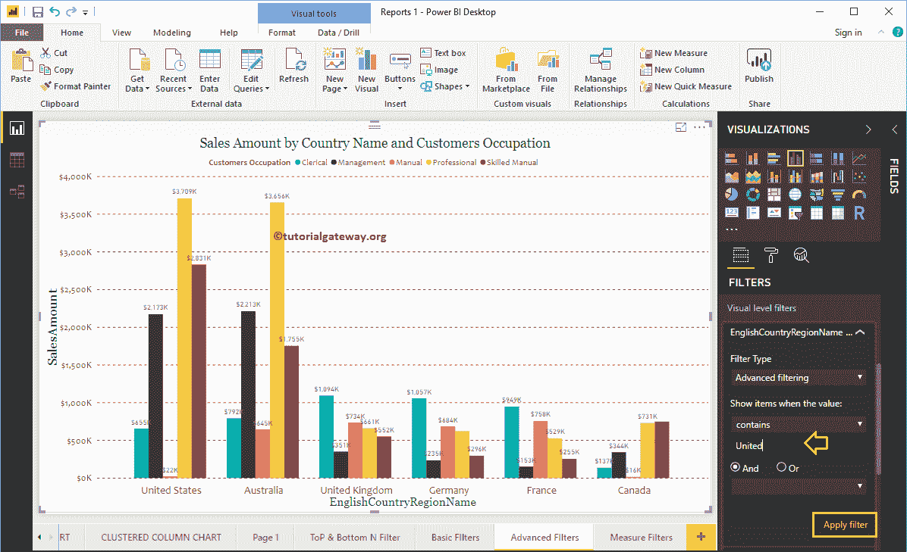

从下面的截图中，您可以看到报告显示了包含 united 关键字的国家。

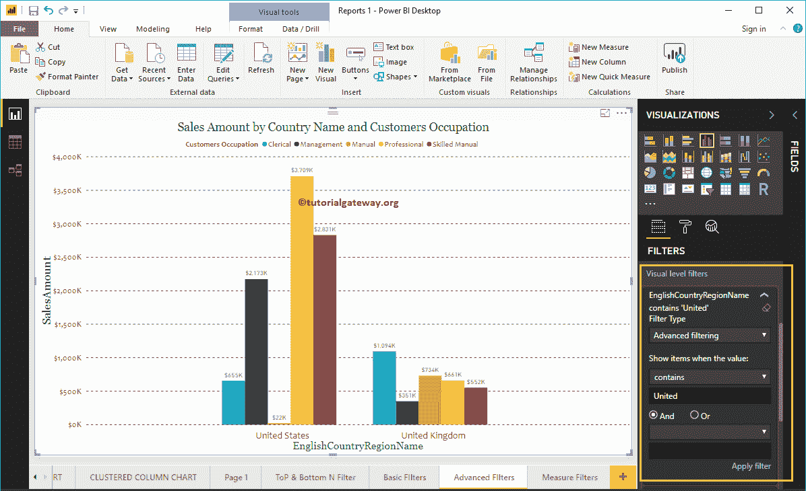

这次我们使用了不包含作为通配符，加拿大作为关键字。从下面的截图中，您可以看到该报告显示了除加拿大之外的所有国家。

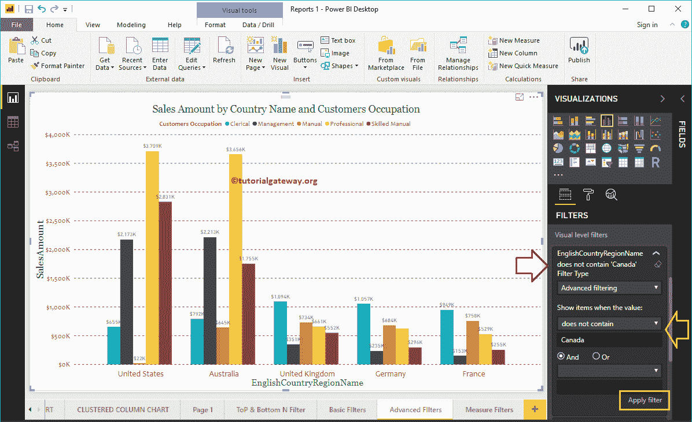

让我在英语职业专栏中应用 Power BI 高级过滤器。

我们使用了开头作为通配符，M 作为关键字。从下面的截图中，您可以看到报告显示了以 M 开头的职业(管理和手册)。

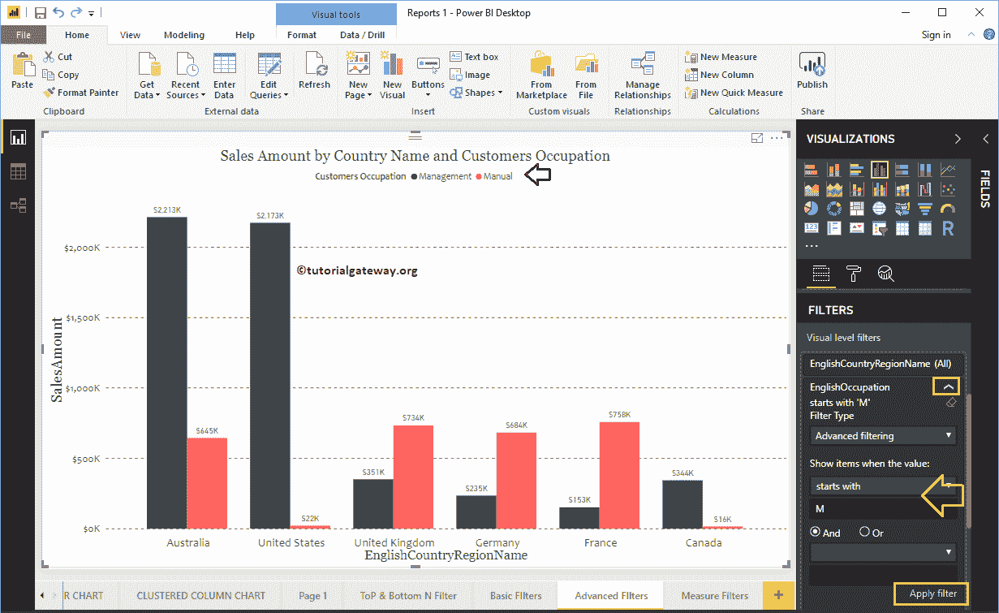

让我使用或运算符，以作为关键字。

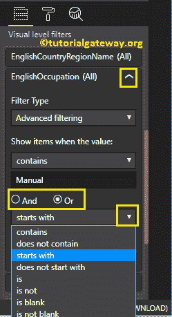

这里，我们使用两个通配符:第一个通配符检查职业是否包含手动关键字。或者，第二个过滤器检查职业是否以 P 开头。

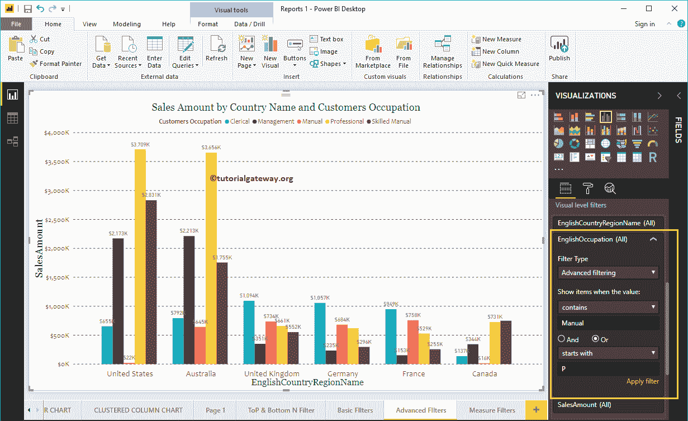

下面的截图显示了包含手动关键字的职业，以及以 P.

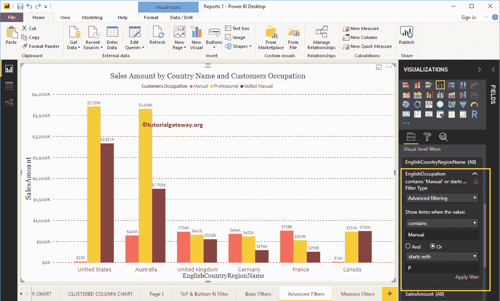

开头的职业

这一次，我们将在“国家”栏中应用多个过滤器。首先，它检查国家是否包含一个联合关键字。或者，第二个过滤器检查国家是否不是法国。

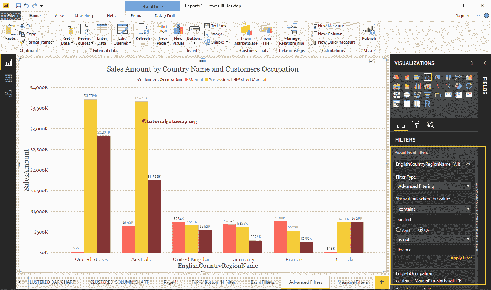

下面的报告显示了包含联合关键字的国家，以及不是法国的国家。

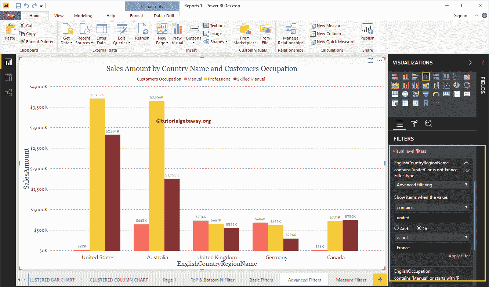

使用这个微小的清除过滤器按钮删除电力商业智能高级过滤器。

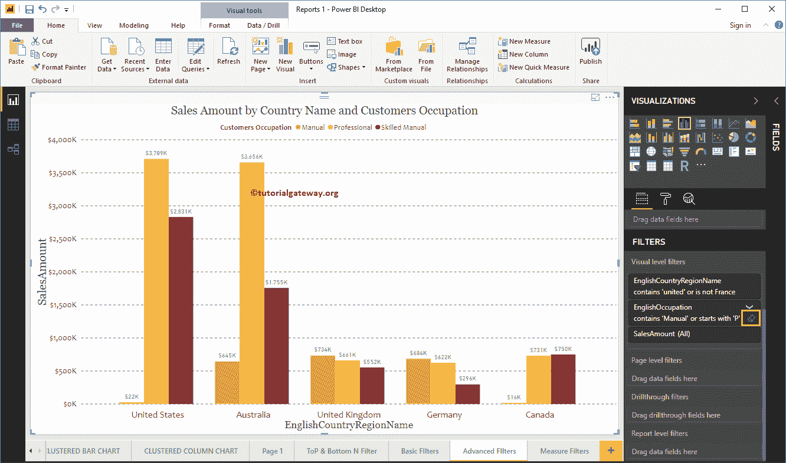