# PowerBI十大过滤器

> 原文：<https://www.tutorialgateway.org/power-bi-top-10-filters/>

Power BI 前 N 个过滤器有助于显示表现最好的记录，而后 N 个过滤器有助于显示表现最差的记录。例如，我们可以按订单或销售额显示排名前 10 或后 10 的产品。让我用例子向你展示如何创建 Power BI 十大过滤器和底层过滤器。

## 如何使用 Power BI 十大过滤器

为了演示 Power BI 中的前 N 个过滤器，我们将使用我们在之前的文章中创建的[条形图](https://www.tutorialgateway.org/power-bi-bar-chart/)。从下面的截图 [Power BI](https://www.tutorialgateway.org/power-bi-tutorial/) 可以看到，我们使用了州省名作为轴字段，销售额作为值字段，订单数量作为色彩饱和度。

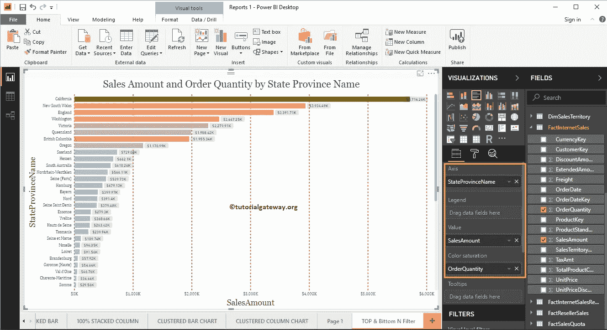

在过滤器部分，您可以看到在 Power BI

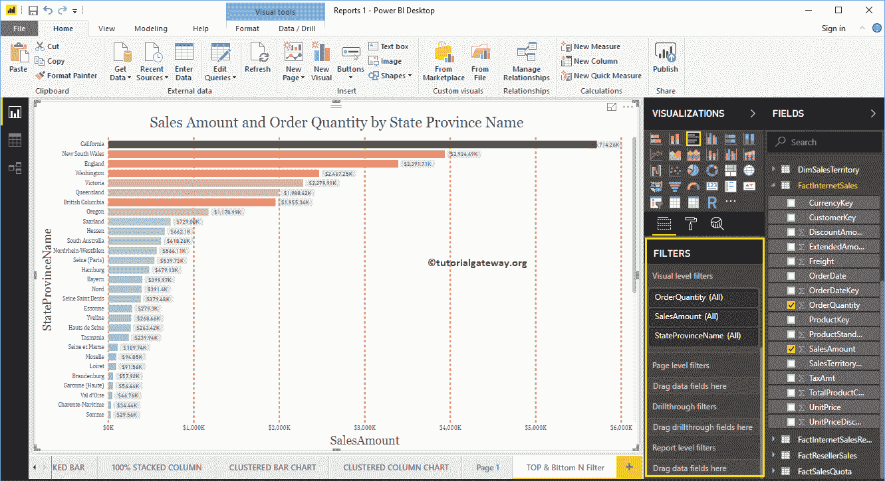

中可用的[过滤器](https://www.tutorialgateway.org/power-bi-basic-filters/)列表

让我展开州省名称(简称州)来查看过滤器类型。默认情况下，选择[基本过滤器](https://www.tutorialgateway.org/power-bi-basic-filters/)选项作为过滤器类型。

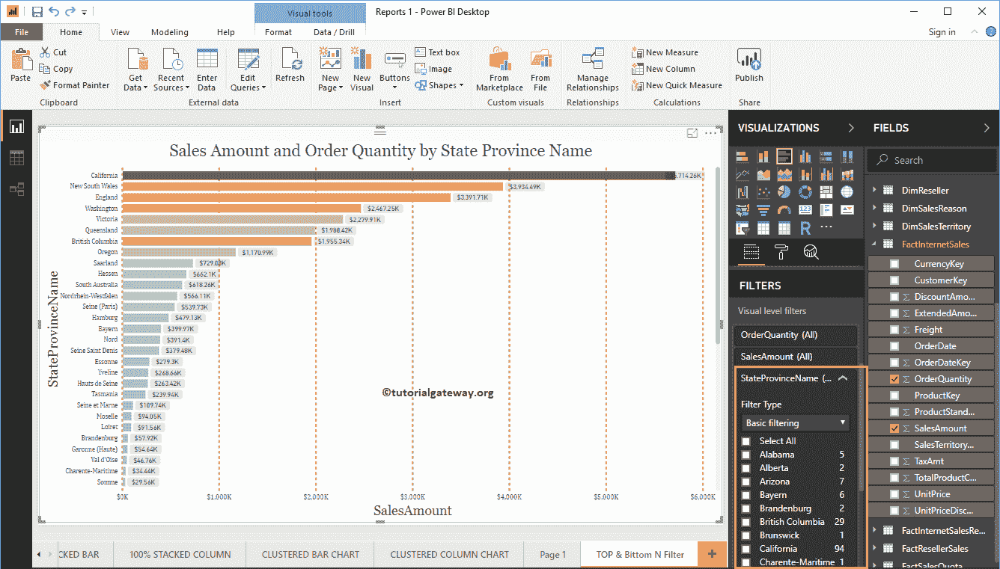

### PowerBI十大过滤器

要启用 Power BI 前 10 名过滤器，使用下拉菜单将其更改为前 N 名过滤器

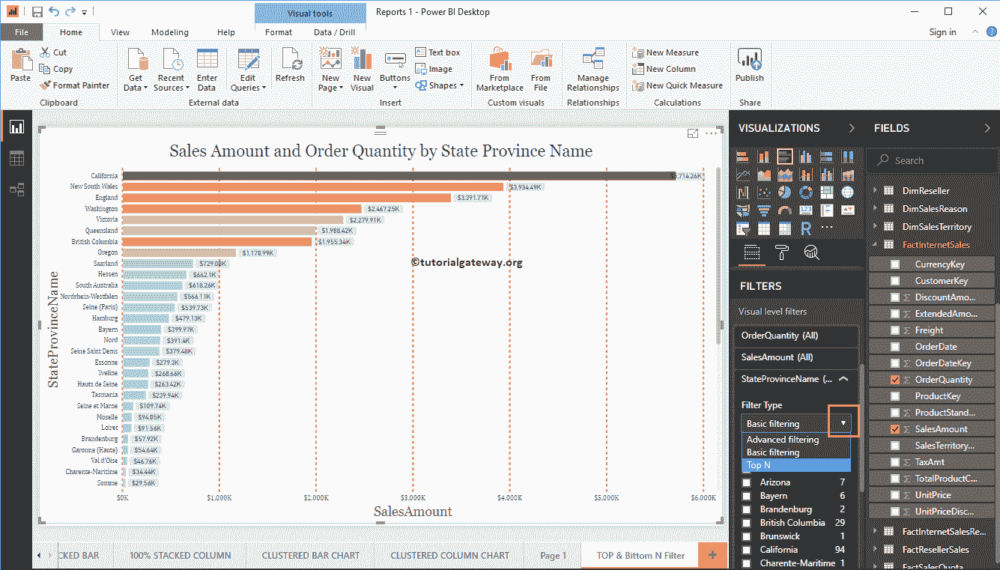

以下是适用于 Power BI TOP 10 过滤器的选项列表

*   显示项目:默认情况下选择顶部过滤器。但是，您可以通过单击向下箭头将其更改为底部。
*   空文本框:请指定任意整数值，例如，10 表示前 10 条记录。
*   按值:您必须拖放字段中所需的度量值。前 N 名过滤器使用此度量来查找前 10 名和后 10 名记录。

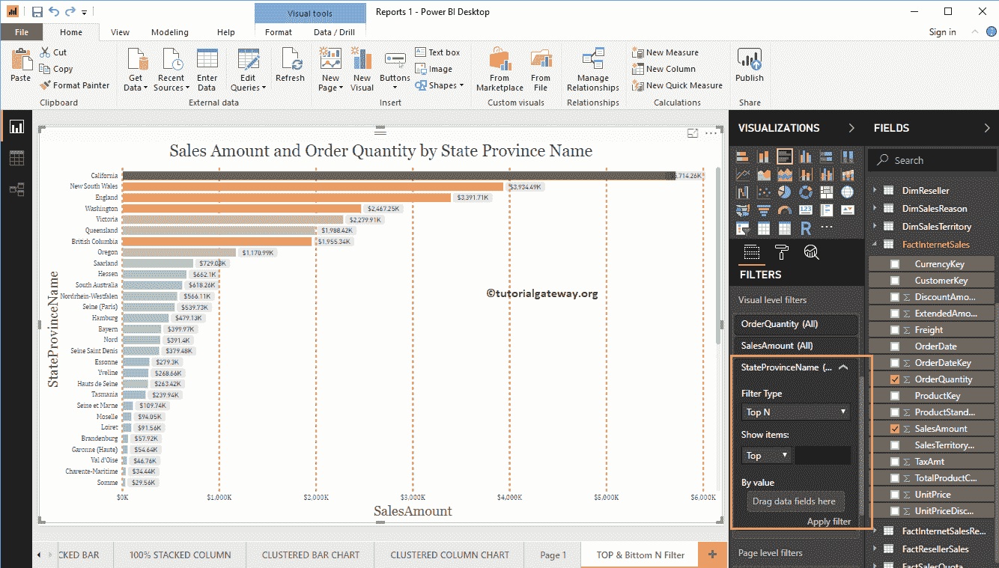

让我将销售金额添加到“按价值”部分，并将 10 添加到文本框

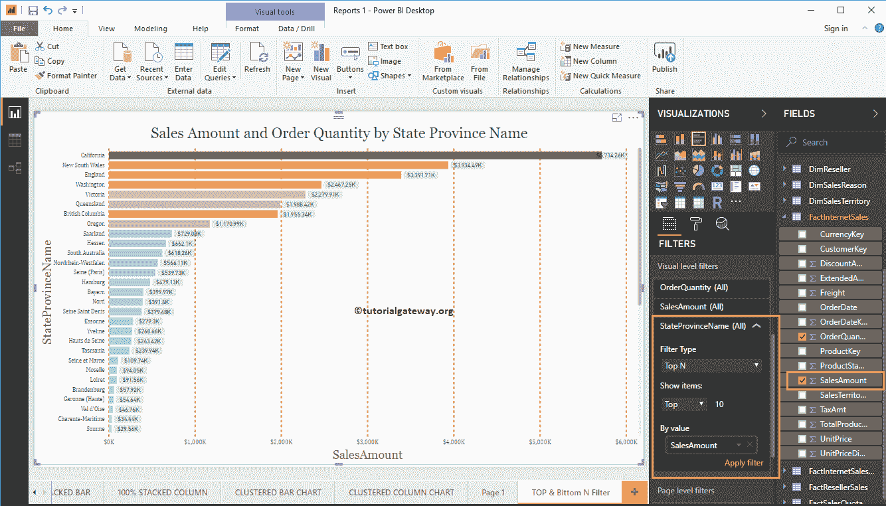

下面的 Power BI 报告根据销售额显示了前 10 个州。或者我们可以说，根据销售额排名前十的州。

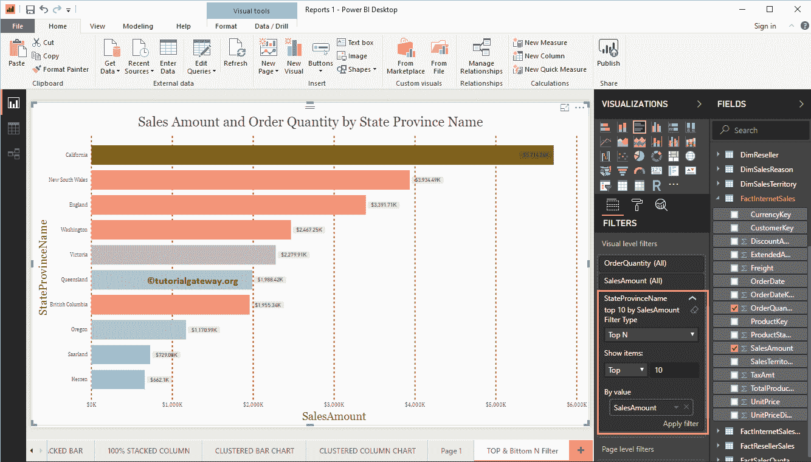

使用下拉箭头最小化过滤器

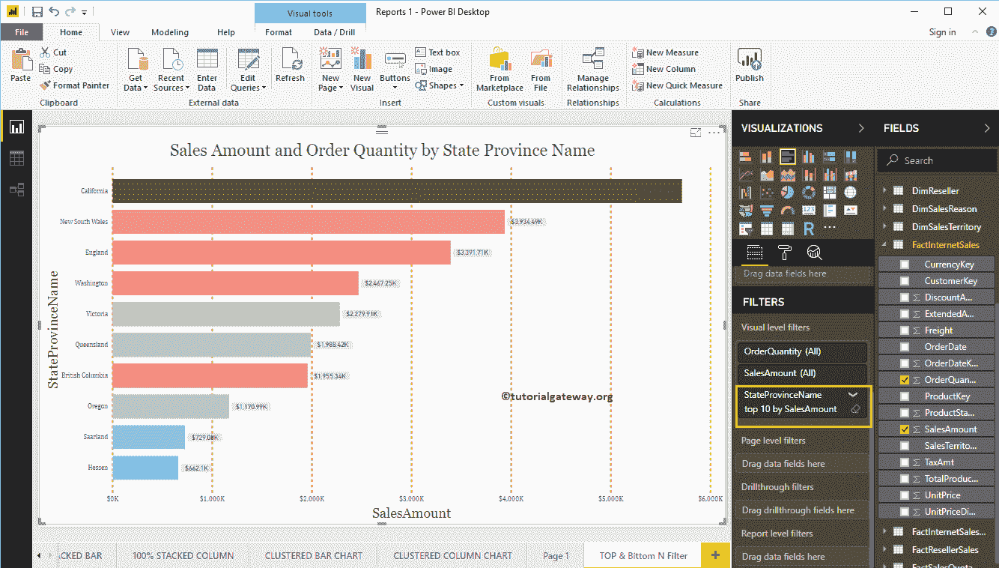

让我把值改为 5。意思是，动力 BI 前 5 名过滤器

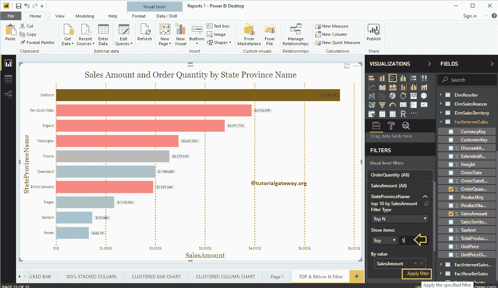

如您所见，Power BI 过滤器已按销售额

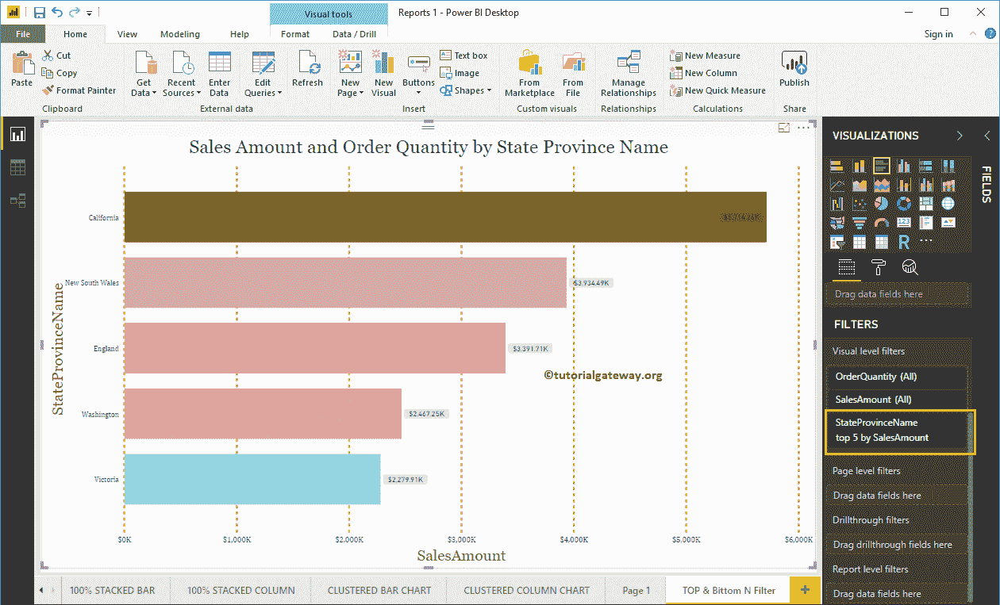

选择了前 5 名州/省名称

## PowerBI 底部 10 个过滤器

为了应用 Power BI 底部 10 个过滤器，让我将“显示项目”选项从顶部更改为底部，并将整数值保留为 5

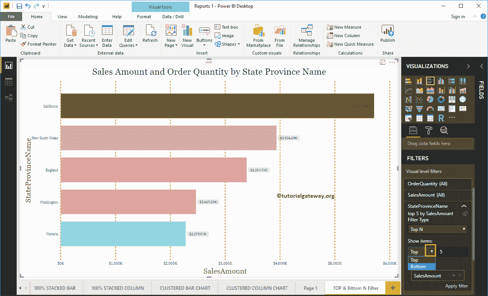

点击【应用过滤器】按钮

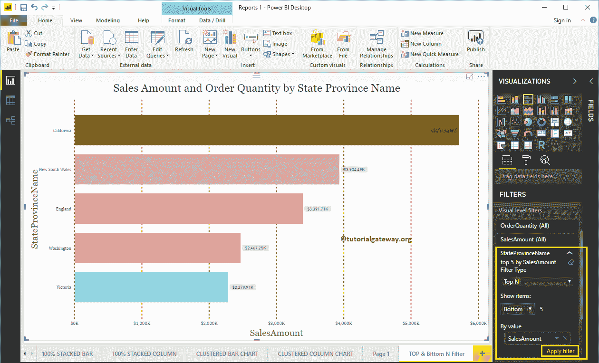

下面的PowerBI报告根据销售金额显示了排名后 5 位的州。或者我们可以说，表现最差的州。

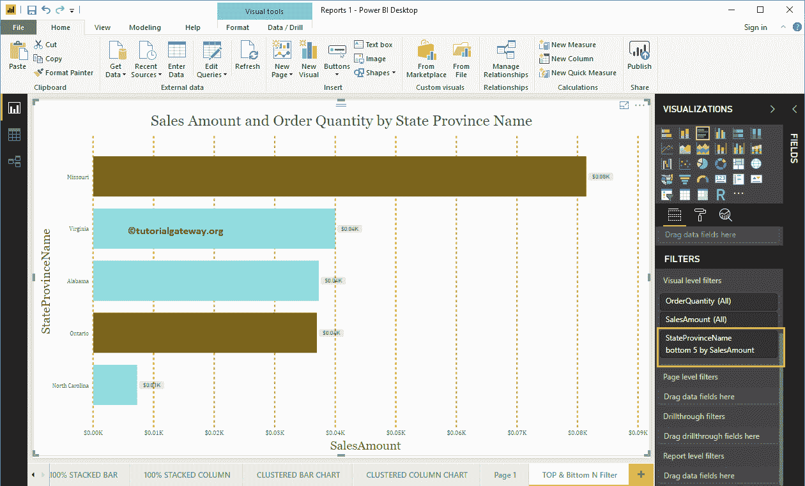

让我将整数值更改为 10

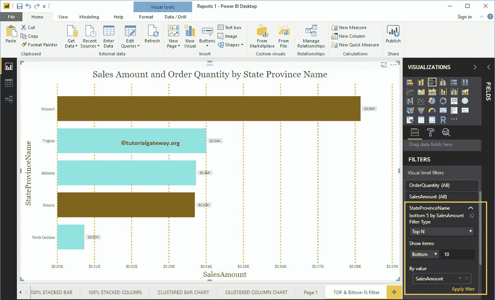

下面的报告按照销售额显示了PowerBI排名倒数 10 位的州。

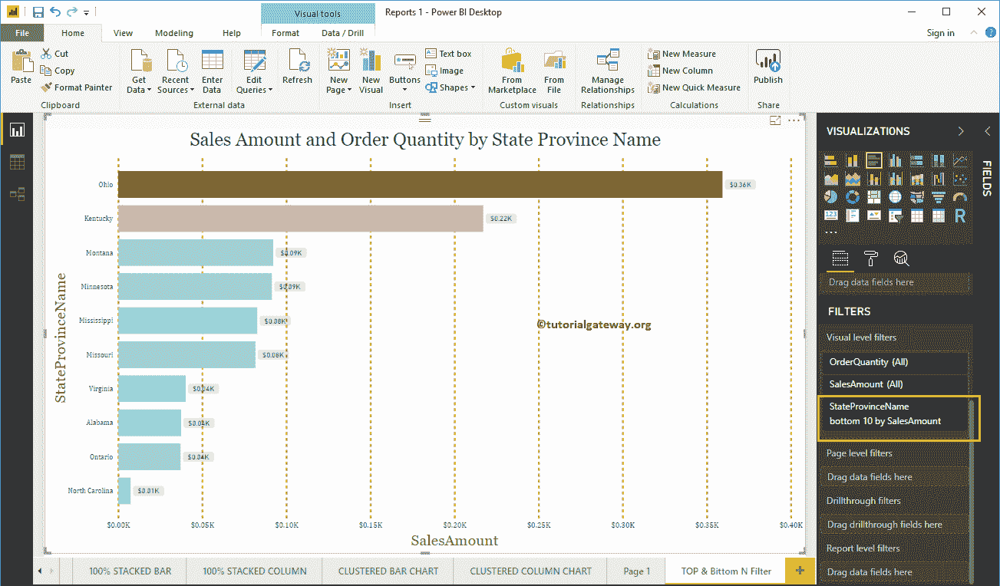