# 基于度量的 PowerBI 滤波器

> 原文：<https://www.tutorialgateway.org/power-bi-filters-on-measures/>

如何通过示例在测量上创建 PowerBI 过滤器？。PowerBI 度量过滤器用于过滤度量(度量值)。例如，我们可以使用测量上的 Power BI 过滤器来显示销售额大于阈值或小于平均值的产品等。

## 如何在测量上使用 PowerBI 滤波器

为了演示 Power BI 中的测量过滤器，我们将使用我们在之前的文章中创建的[条形图](https://www.tutorialgateway.org/power-bi-bar-chart/)。从下面的[PowerBI](https://www.tutorialgateway.org/power-bi-tutorial/) 截图中可以看到，我们使用了州/省名称作为轴字段。我们使用销售额作为值字段，订单数量作为颜色饱和度。

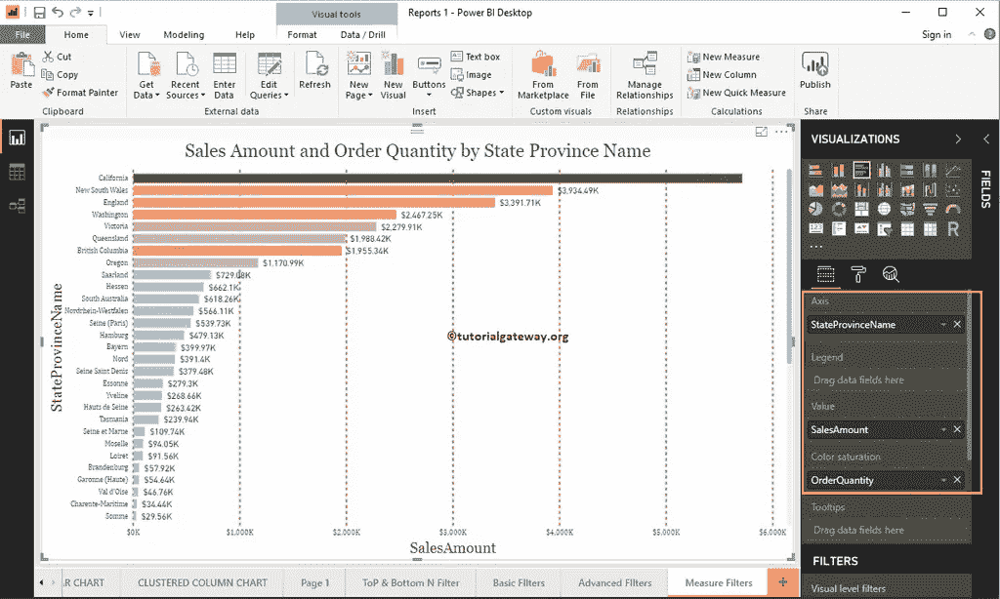

在过滤器部分，你可以看到可用的 PowerBI 过滤列表

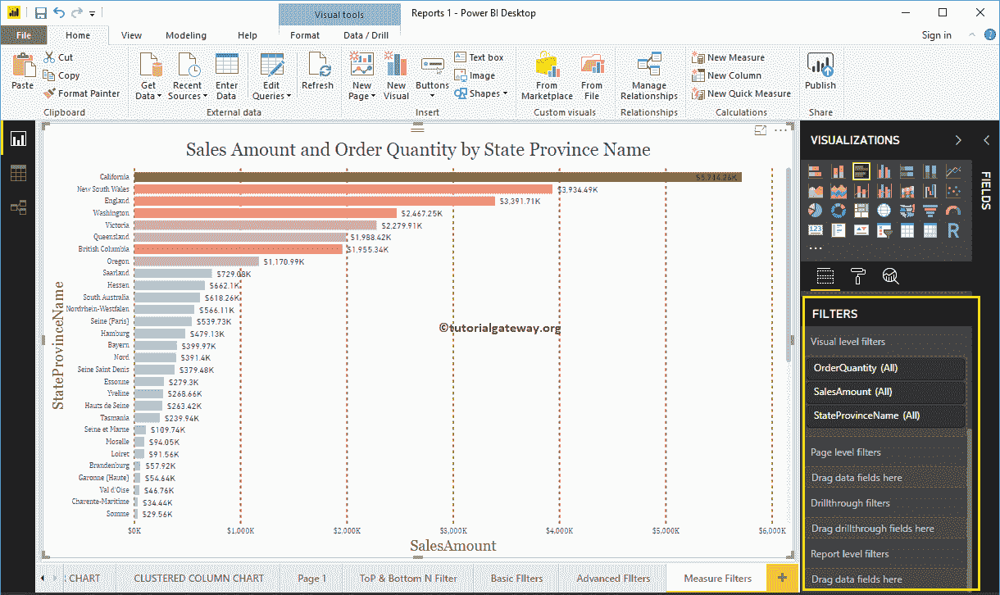

让我展开“销售额”来查看过滤选项。以下是 PowerBI 中测量过滤器可用的选项列表

*   值为时显示项目:请选择要使用的运算符。
*   空文本框:请指定值。
*   And and Or:同[AND Or](https://www.tutorialgateway.org/sql-and-or-operators/)运算符 [SQL](https://www.tutorialgateway.org/sql/) 。用它来连接多个过滤器。
*   空下拉列表:请选择要使用的第二个运算符。
*   空文本框:请指定第二个过滤器的值。

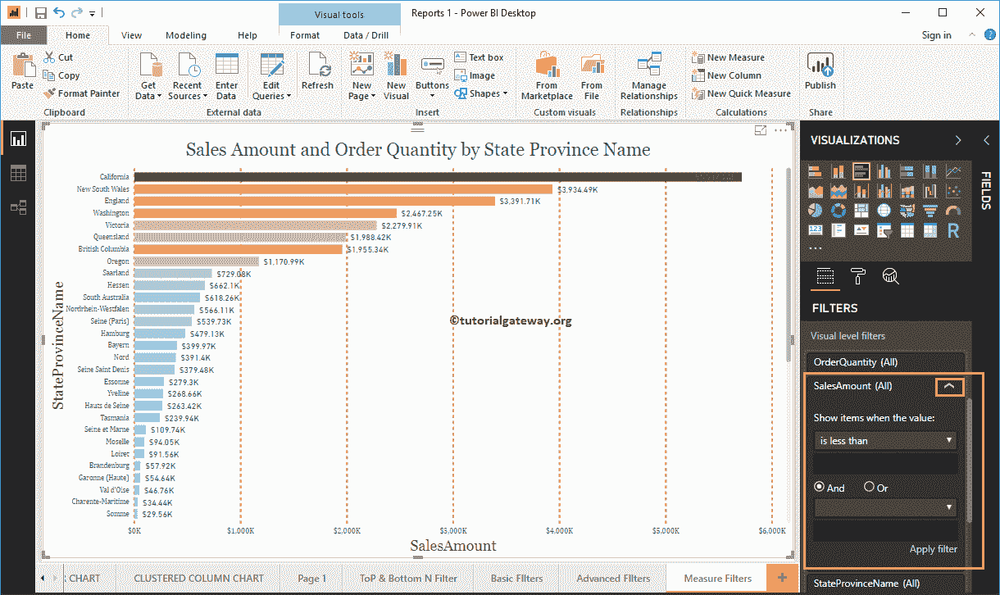

以下是“显示项目时显示值”部分下的“测量”选项上的 PowerBI 过滤列表:

1.  小于:选择此选项时，它将根据值检查每条记录。如果它小于用户指定的值，则显示记录。
2.  小于或等于:如果小于或等于给定值，则显示记录。
3.  大于:显示销售额大于指定值的记录
4.  大于或等于:显示销售额大于或等于给定值的记录。
5.  is:如果记录与值完全匹配，则显示记录。
6.  不是:如果记录不等于该值，则记录显示。
7.  为空:它显示具有空值的所有记录。
8.  不为空:它显示不包含空值的所有记录。

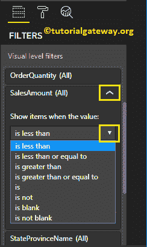

对于 Power BI 演示中的这些测量过滤器，我们选择大于作为运算符，1000000 作为值。

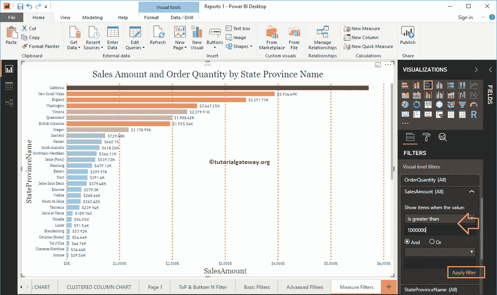

下面的报告显示了销售额大于 1000000 的州。

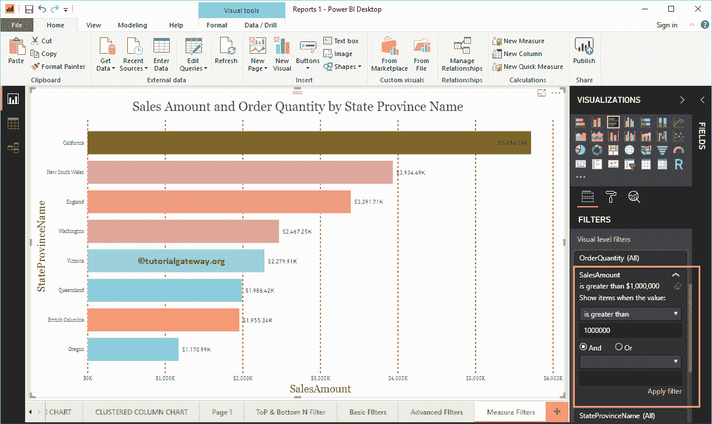

让我将运算符更改为小于，值为 1000。从下图可以看到，报表显示的是销售额小于 1000

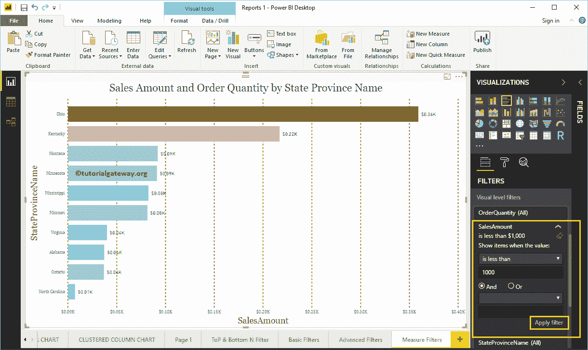

的州

这次我们使用的是 is blank 运算符。您可以看到报告是空白的，因为我们没有任何包含空白销售的状态。

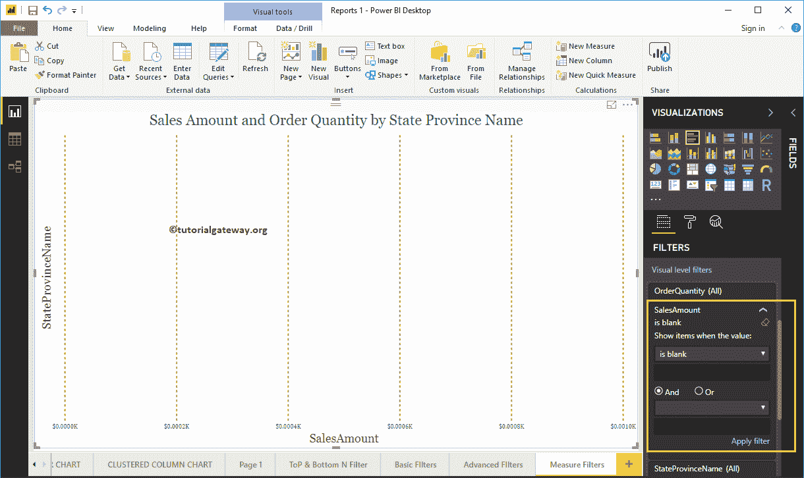

让我在“销售额”列中使用多个过滤器。第一个过滤器查找销售额大于 300000 的州，第二个过滤器查找销售额小于 2300000 的州。

我们使用“与”运算符来连接这两个过滤器

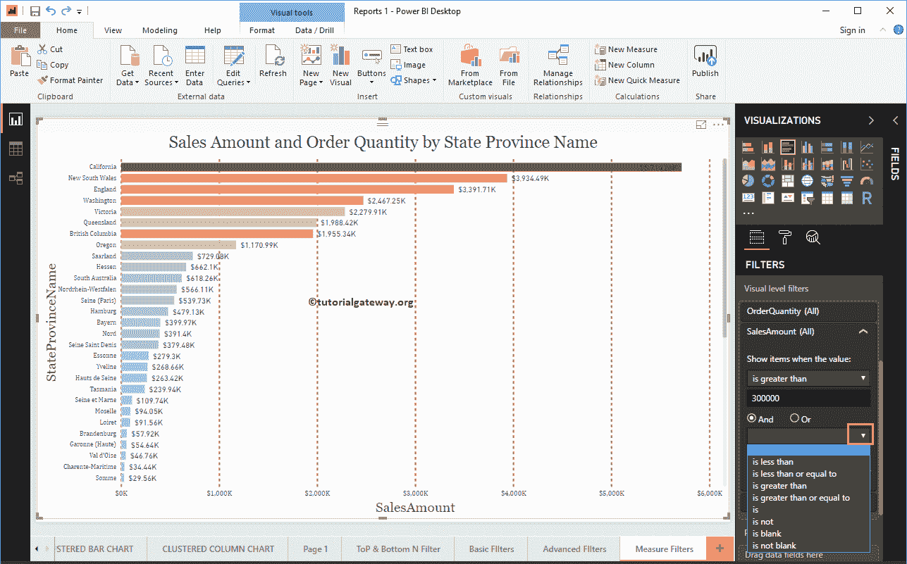

从下面的截图可以看到，报表显示的是销售额大于 300000、小于 2300000 的州。

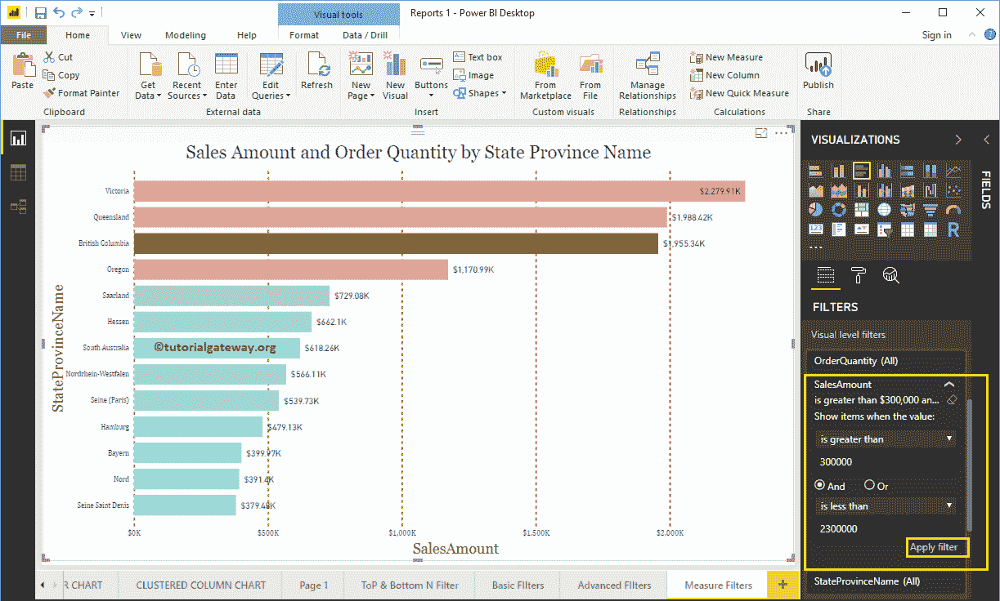

下面的报告显示了销售额大于 300000 或小于 1000 的州。

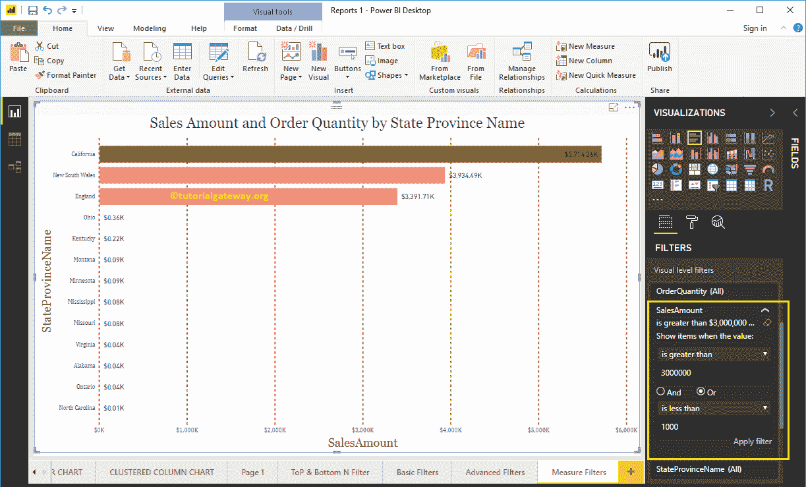