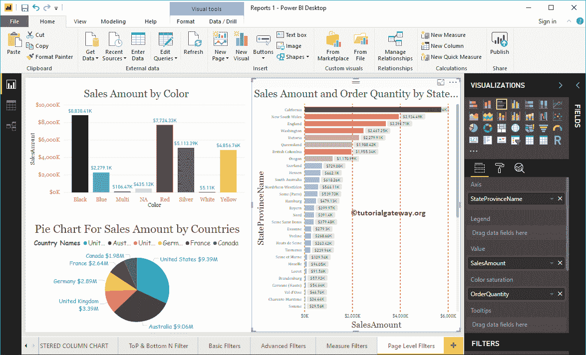

# 启用商业智能页面级过滤器

> 原文：<https://www.tutorialgateway.org/power-bi-page-level-filters/>

如何用例子在 Power BI 中创建页面级过滤器？。“高级商务智能页面级过滤器”对于优化页面上的图表(或视觉效果)非常有用。例如，如果您的页面包含四个图表，则可以使用此页面级别筛选器一次筛选这四个报告。

## 如何创建高级商务智能页面级过滤器

为了演示 Power BI 中的页面级过滤器，我们将使用我们在早期的 [Power BI](https://www.tutorialgateway.org/power-bi-tutorial/) 帖子中创建的[列](https://www.tutorialgateway.org/column-chart-in-power-bi/)、[饼图](https://www.tutorialgateway.org/pie-chart-in-power-bi/)和[条形图](https://www.tutorialgateway.org/power-bi-bar-chart/)。

在下面的部分，您可以看到 Power BI 中可用的页面级过滤器列表。您必须使用页面级别过滤器部分来创建您需要的过滤器。

让我将英文国家/地区名称从字段部分拖放到页面级筛选器。

展开英文国家/地区名称以查看可用的类型。默认情况下，选择[基本过滤器](https://www.tutorialgateway.org/power-bi-basic-filters/)选项作为过滤器类型。

为了演示的目的，让我选择澳大利亚、德国、英国和美国。从下面的截图中，您可以看到柱形图显示了所选国家的销售额。饼图显示选定的国家。条形图显示了属于这些国家的州。

使用下拉菜单将过滤类型更改为[高级](https://www.tutorialgateway.org/power-bi-advanced-filters/)。

在这里，我们对 CountryName 列应用了多个过滤器。第一个检查国家是否包含一个联合关键字。或者，第二个条件检查不以 F.

开头的国家

下页显示的是包含 United 关键字的国家，这些国家不是以 F.

开头的

让我删除现有的，并将产品颜色从字段部分拖放到页面级过滤器。

请选择蓝色、红色、银色和黄色作为基本字段。

从下面的截图中，您可以看到柱形图显示了所选颜色的销售额。饼图显示所选产品颜色的销售额，条形图显示所选颜色的销售额。

让我删除现有的一个，并将销售金额从字段部分拖放到页面级过滤器。接下来，展开“销售额”以查看选项。请参考 [Filterson Measures](https://www.tutorialgateway.org/power-bi-filters-on-measures/) 文章了解这些选项。

为此，我们选择大于作为运算符，3000 作为值。下一页的所有报告都显示了销售额大于 3000 的国家或地区。

