# 电源商业智能报告级别过滤器

> 原文：<https://www.tutorialgateway.org/power-bi-report-level-filters/>

Power BI 报告级别过滤器用于过滤报告所有页面中的视觉效果(或图表)。例如，如果您的报表包含 10 页，则可以使用此报表级别筛选器一次筛选这 10 页。让我通过示例向您展示如何在 Power BI 中创建报告级过滤器。

为了为 Power BI 报告级过滤器演示创建此报告(页面组合)，我们使用了我们在上一篇文章中创建的 SQL 数据源。

请参考[连接 Power BI 到 SQL Server](https://www.tutorialgateway.org/connect-power-bi-to-sql-server/) 一文了解数据源。

## 如何创建电力商业智能报告级别过滤器

为了演示 Power BI 中的报告级别过滤器，我们将使用我们在早期文章中创建的报告 1。本 [Power BI](https://www.tutorialgateway.org/power-bi-tutorial/) 报告共 19 页:[柱状图](https://www.tutorialgateway.org/column-chart-in-power-bi/)、[饼图](https://www.tutorialgateway.org/pie-chart-in-power-bi/)、[树形图](https://www.tutorialgateway.org/create-power-bi-treemap/)、[甜甜圈图](https://www.tutorialgateway.org/format-donut-chart-in-power-bi/)、[条形图](https://www.tutorialgateway.org/power-bi-bar-chart/)等。

在本例中，我们在[堆叠条形图](https://www.tutorialgateway.org/power-bi-stacked-bar-chart/)上创建一个报告级别过滤器。记住，这是总共 19 页中的第 8 页。

从下面的截图中可以看到，我们使用了“颜色”作为“坐标轴”字段，“国家/地区名称”作为“图例”字段，“销售额”作为“值”字段。

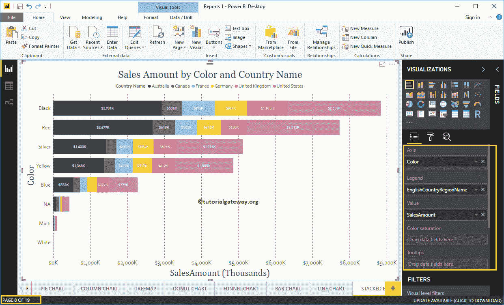

在“过滤器”部分下，您可以看到 Power BI 中可用的报告级别过滤器列表。您必须使用报告级别筛选器部分在报告级别创建筛选器。

让我将英文国家/地区名称从字段部分拖放到报告级别筛选器。

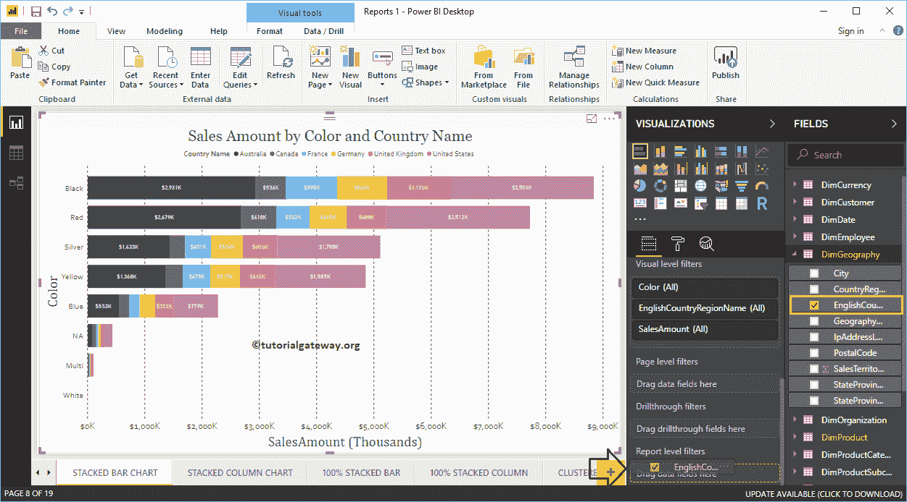

展开英文国家/地区名称以查看过滤器类型。默认情况下，选择[基本过滤器](https://www.tutorialgateway.org/power-bi-basic-filters/)选项作为过滤器类型。

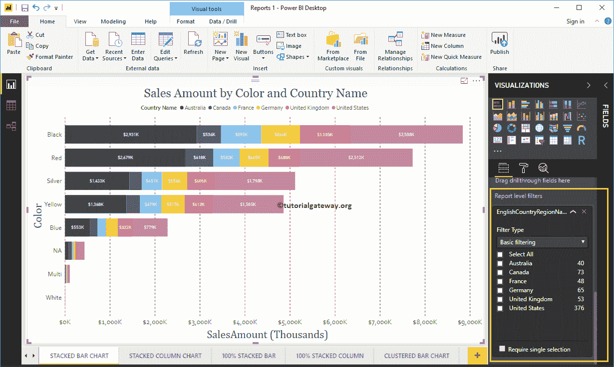

为此，我们选择了澳大利亚、德国、英国和美国作为 Power BI 报告级别过滤器的演示目的。

从下面的截图中，您可以看到堆叠条形图在图例中显示了所选国家的销售额。

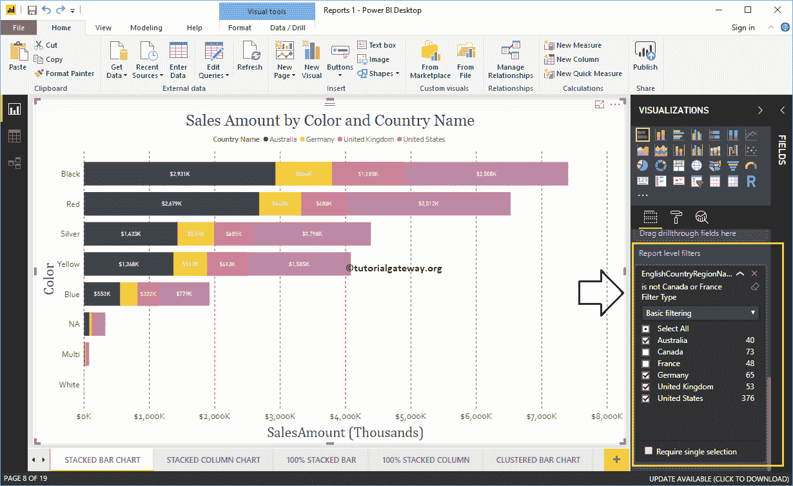

让我导航到第 1 页，共 19 页。从下面的截图中可以看到，饼图也是由报告级别的过滤器过滤的。我的意思是，它显示了选定国家的销售额。

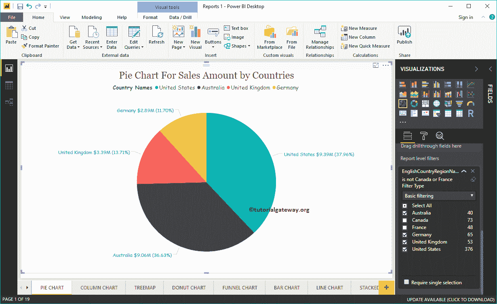

让我导航到第 18 页，共 19 页。您可以从下面的截图中看到，Power BI Report 级别的过滤器正在过滤这三个图表。

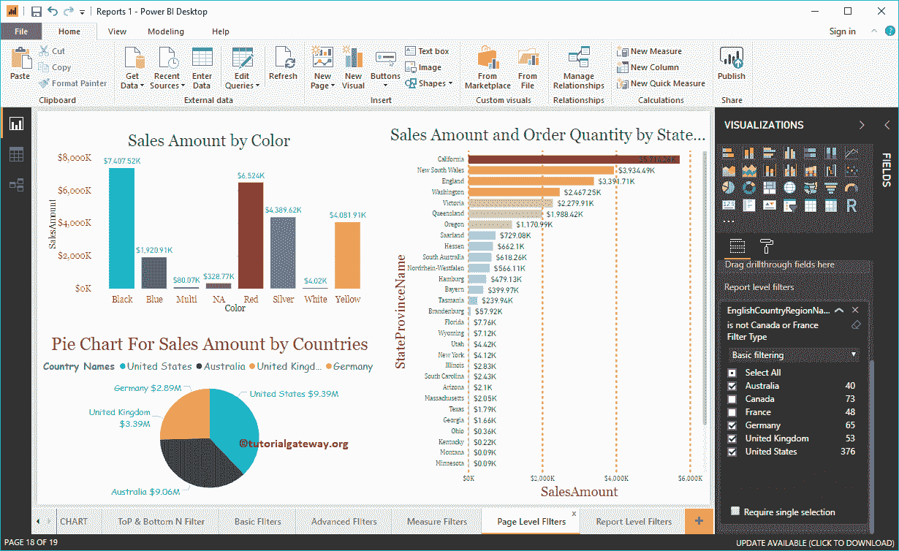

使用下拉菜单将报告级别过滤类型更改为[高级过滤](https://www.tutorialgateway.org/power-bi-advanced-filters/)。

这里，我们在“国家”列上应用了多个过滤器。第一个过滤器检查国家是否包含联合关键字。或者，第二个过滤器检查不以 F.

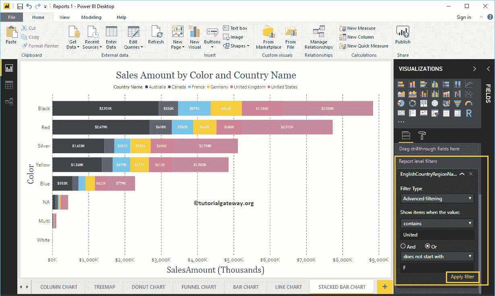

开头的国家

下面的报告显示了带有包含 United 关键字的国家的条形图，这些国家不是以 F.

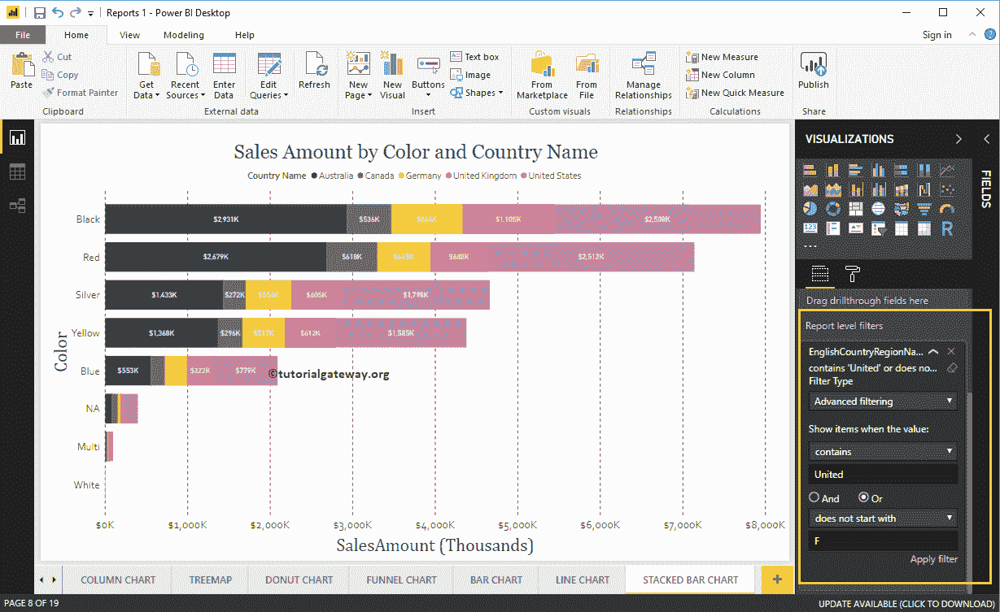

开头的

让我导航到第 1 页，共 19 页。如您所见，饼图显示的是包含美国的国家或不以 F

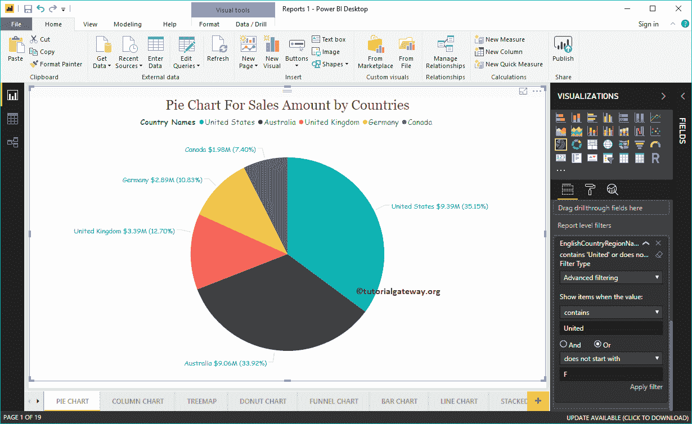

开头的国家的销售额

让我删除现有的 Power BI 报告级别筛选器。接下来，将“销售额”从“字段”部分拖放到报表级别的筛选器中。然后，展开“销售额”以查看筛选选项。请参考[措施过滤器](https://www.tutorialgateway.org/power-bi-filters-on-measures/)一文了解这些选项

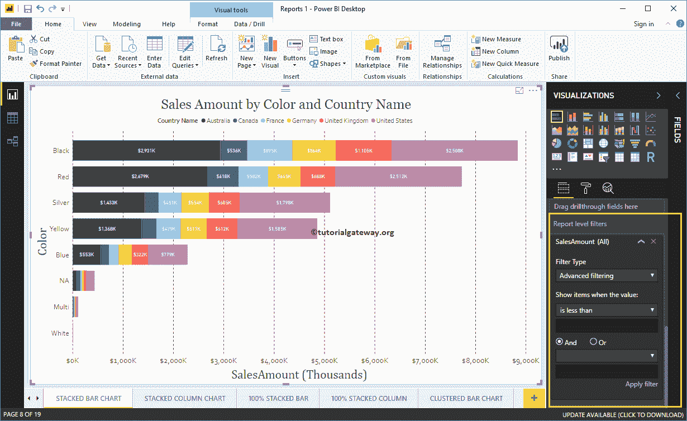

出于演示目的，我们选择大于作为运算符，而 1000 作为值。从下面的截图中，您可以看到堆叠条形图正在显示销售额大于 1000 的条形图。

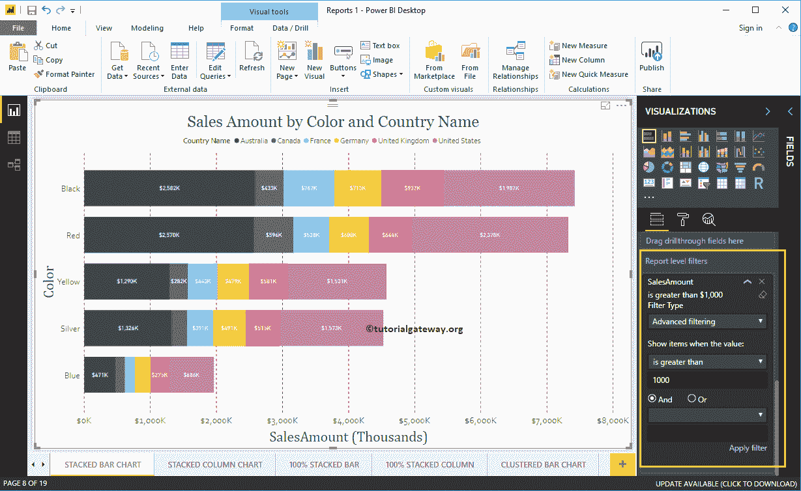

现在，您可以看到相同的过滤器应用于 19

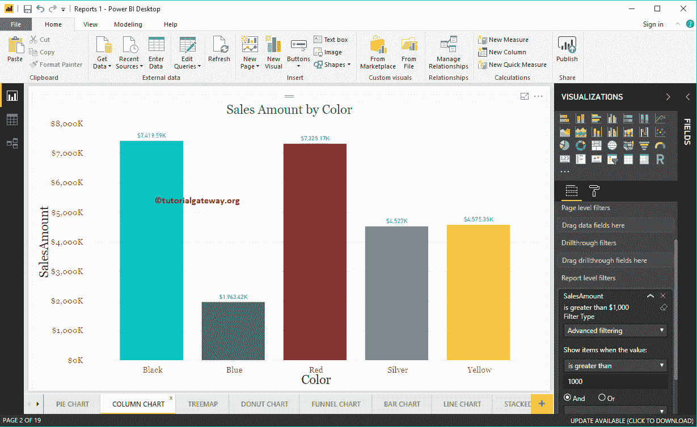

第 2 页的柱形图