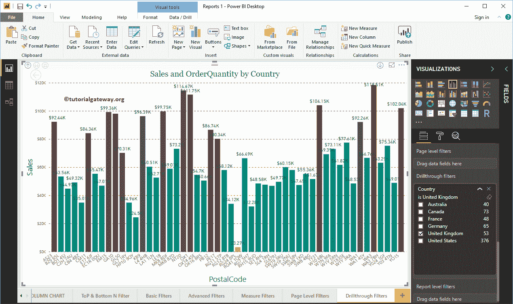

# PowerBI 中的穿透钻取过滤器

> 原文：<https://www.tutorialgateway.org/drill-through-filters-in-power-bi/>

Power BI 穿透钻取过滤器可用于穿透特定字段，或者我们可以说，在多级对报告应用过滤器。让我用一个例子向您展示如何在 Power BI 中创建穿透钻取过滤器。

## 如何在 PowerBI 中创建穿透钻取过滤器

为了演示 Power BI 穿透钻取过滤器报告，我们将使用国家/地区层次结构。请参考[创建层次结构](https://www.tutorialgateway.org/create-hierarchy-in-power-bi/)一文，了解创建层次结构所涉及的步骤。

从下面的截图中可以看到，我们通过在[PowerBI](https://www.tutorialgateway.org/power-bi-tutorial/) 轴字段中添加国家层级，创建了一个[柱形图](https://www.tutorialgateway.org/column-chart-in-power-bi/)。并将销售金额作为值字段，订单数量作为颜色饱和度。

在“过滤器”部分，您可以看到 Power BI 中可用过滤器的列表。您必须使用 Power BI 穿透钻取过滤器部分来创建多级过滤器。

让我将“国家/地区”从字段部分拖放到“PowerBI 穿透钻取过滤器”部分。

展开“国家”以查看过滤器类型。

出于 PowerBI 穿透钻取过滤器的演示目的，让我选择英国。从下面的截图中，您可以看到柱形图显示的是英国的销售额。

提示:默认情况下，一次只能选择一个字段(国家/地区)。

让我深入到下一个层次。建议大家参考[向上钻取和向下钻取报表](https://www.tutorialgateway.org/drill-up-and-drill-down-reports-in-power-bi/)文章，了解多级报表。

现在，您可以看到“按州销售”(第 2 级)。如果你仔细观察，它显示的是英国的销售额，因为这是英国唯一的州

让我去另一个层次。现在，您可以看到英国现有城市的销售额(第 3 级)。

您可以进一步深入查看英国

的邮政编码销售情况

这一次，我们在澳大利亚被选中，一直到邮政编码级别。从下面的截图中，您可以看到澳大利亚的邮政编码销售。

让我删除现有的 Power BI 穿透钻取过滤器，并将“字段中的销售额”部分拖放到穿透钻取过滤器中。接下来，展开“销售额”以查看过滤选项。

让我选择销售金额为 3399.99

现在你可以看到销售金额至少为 3399

的州

现在你可以看到销售金额至少为 3399

的邮政编码

让我按销售额

对它们进行排序