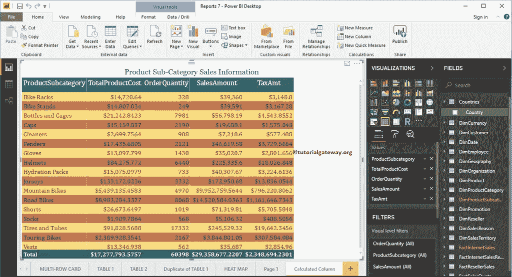

# 在 Power BI 中创建计算列

> 原文：<https://www.tutorialgateway.org/create-calculated-columns-in-power-bi/>

Microsoft Power BI 允许您从现有列创建自定义列或计算列。在本节中，我们将通过示例向您展示如何在 Power BI 中创建计算列。

为了演示这个 Power BI 计算列，我们将使用我们在[连接到 SQL Server](https://www.tutorialgateway.org/connect-power-bi-to-sql-server/) 文章中创建的 SQL 数据源。所以，参考相同。

## 如何在电力商业智能中创建计算列

要创建它，请单击建模选项卡下的新建列选项。

点击新建标签打开 [Power BI](https://www.tutorialgateway.org/power-bi-tutorial/) DAX 公式栏，如下图所示。

你可以根据自己的需要重新命名。让我把这个栏目改名为【利润】

出于此计算列演示目的，我们从事实互联网销售表中选择销售金额和产品总成本。从下面的截图中可以看到，当我在打字时，Power BI IntelliSense 正在显示建议。

从下面的截图中，您可以看到，我们通过从销售金额中删除产品总成本来计算利润。接下来，通过点击回车，创建了一个名为利润的新列。

让我将前面创建的计算列添加到现有的表中。请记住，这是我们在[表格报告](https://www.tutorialgateway.org/create-a-table-in-power-bi/)文章中设计的表格。

