# 在 Power BI 中添加条件列

> 原文：<https://www.tutorialgateway.org/add-conditional-column-in-power-bi/>

Power BI 条件列根据我们指定的条件生成新列，例如，根据员工绩效创建评估列等。让我用例子展示如何在 Power BI 中添加条件列。

## 如何在 Power BI 中添加条件列

为了演示这个 Power BI 条件列，我们将使用我们在[输入数据](https://www.tutorialgateway.org/how-to-enter-data-into-power-bi/)文章中导入的 SQL 表。

要添加条件列，请单击主页选项卡下的编辑查询选项。

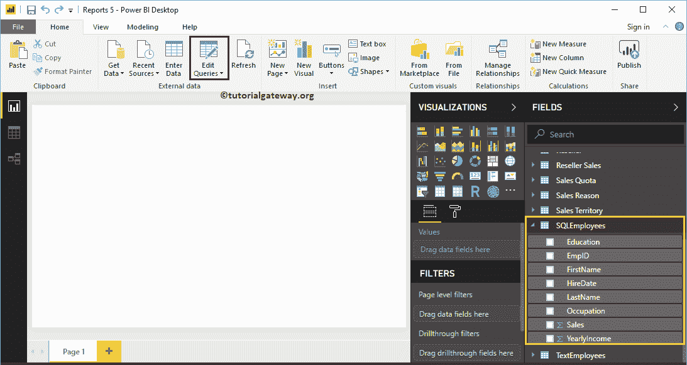

单击编辑查询选项将打开一个名为 [Power BI](https://www.tutorialgateway.org/power-bi-tutorial/) Power 查询编辑器的新窗口。在本例中，我们将使用

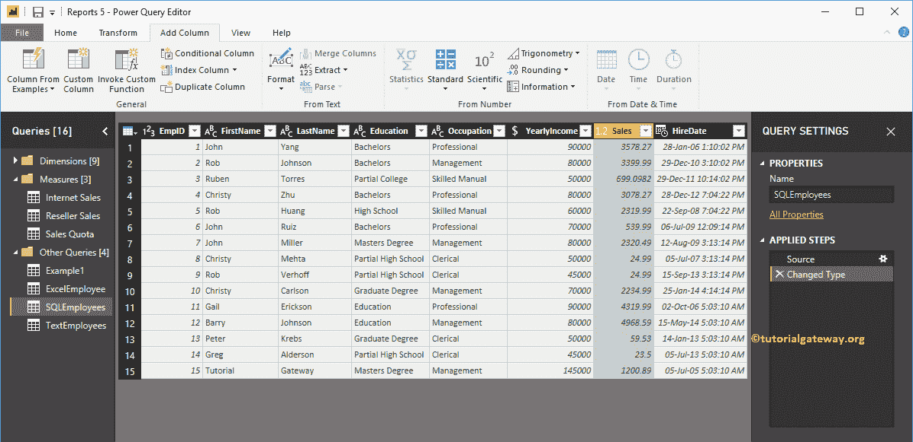

销售柱

首先，转到添加列选项卡。在此选项卡下，您可以看到“条件列”按钮。您可以使用此按钮将条件列添加到该表中。

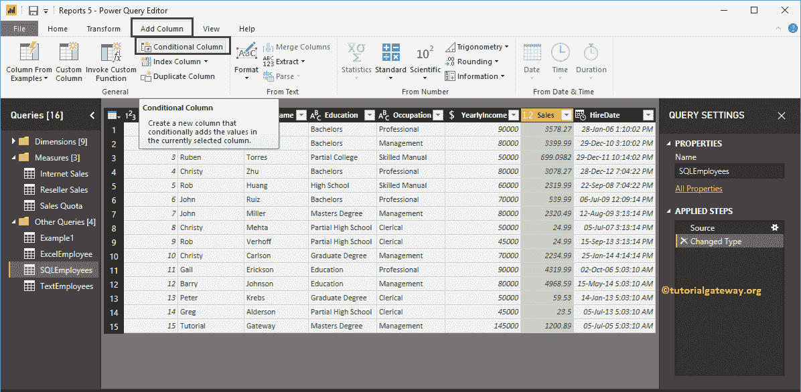

单击PowerBI条件列按钮打开以下窗口。

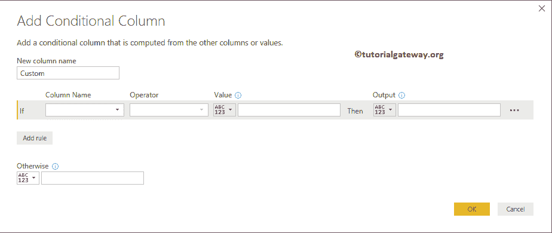

我们将名称更改为评级。接下来，我们选择列名为【销售】

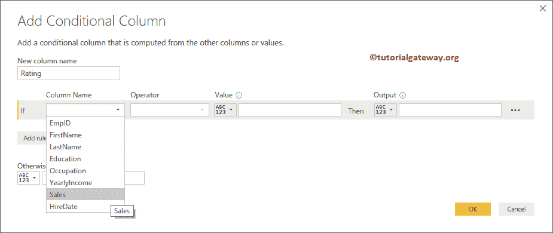

接下来，我们选择运算符为大于，值为 3000。在“值”或“输出”文本框中，您可以给出静态值，也可以选择列

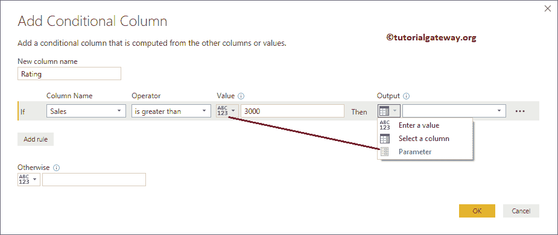

我们添加了第一条规则——如果销售额大于 3000，则在评级中返回优秀。接下来，单击添加规则按钮添加新规则。

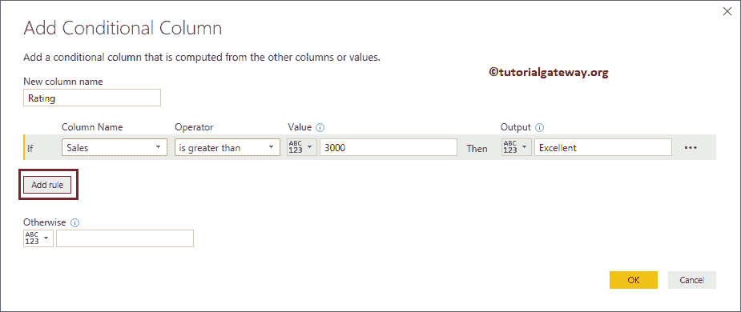

从下面的截图中可以看到，我们又增加了两条规则。请记住，这与 [SQL](https://www.tutorialgateway.org/sql/) 中的 [Else If](https://www.tutorialgateway.org/sql-else-if/) 语句相同。

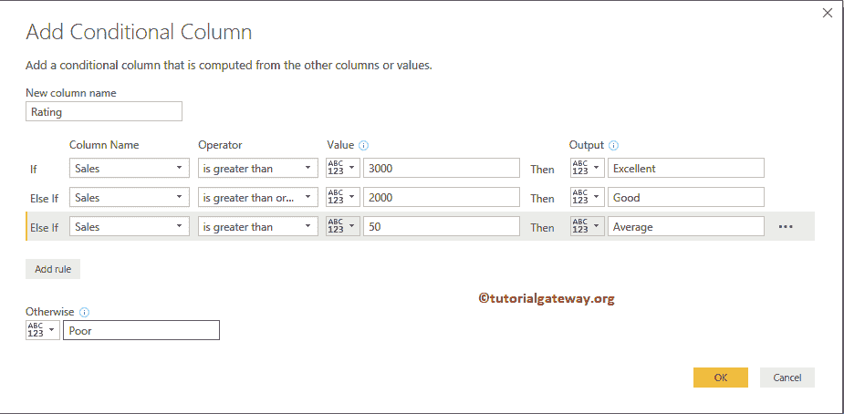

您可以使用…..按钮将选定的规则上下移动，或者您也可以删除它。现在，我们就这样离开，点击

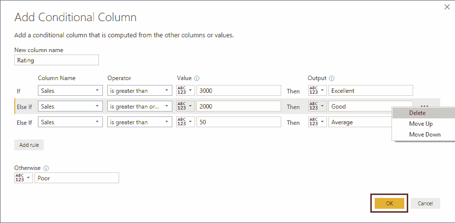

确定按钮

从下面的截图中，您可以看到带有我们在条件列中指定的信息的新列。接下来，点击主页选项卡下的关闭并应用选项来应用这些更改。

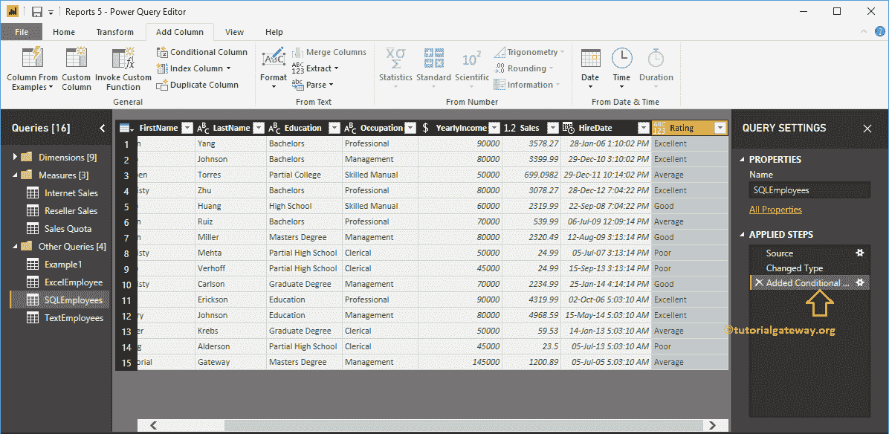

现在，您可以在 SQL 员工表下看到名为评级的新的 Power BI 条件列。

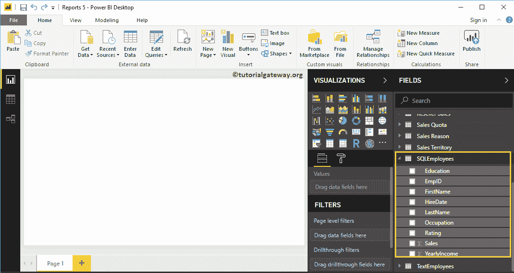