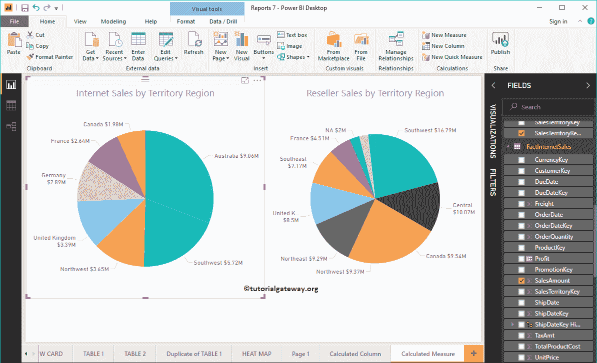
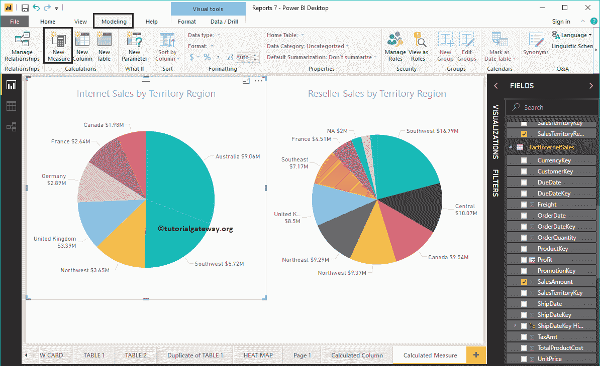
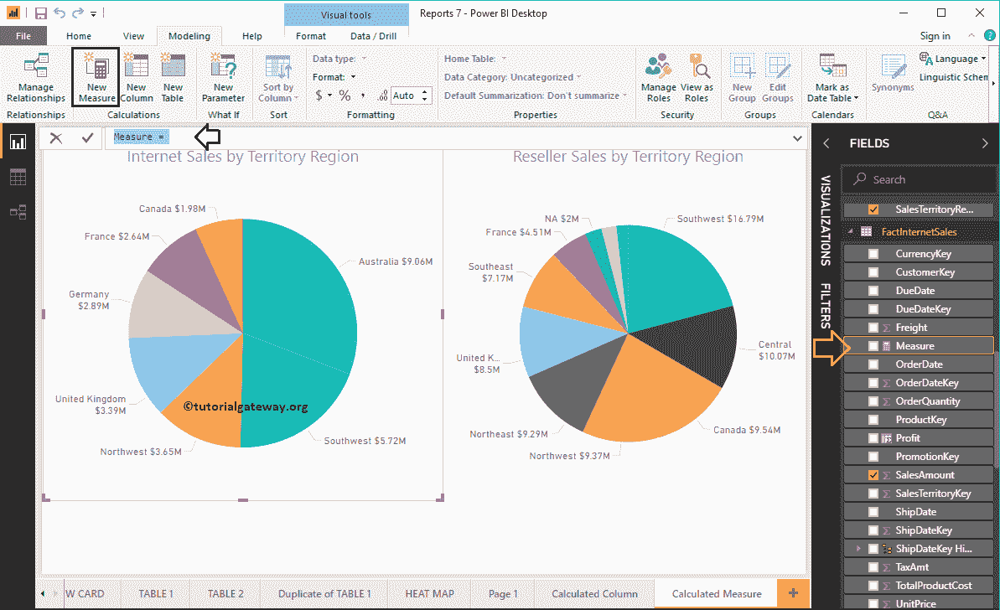
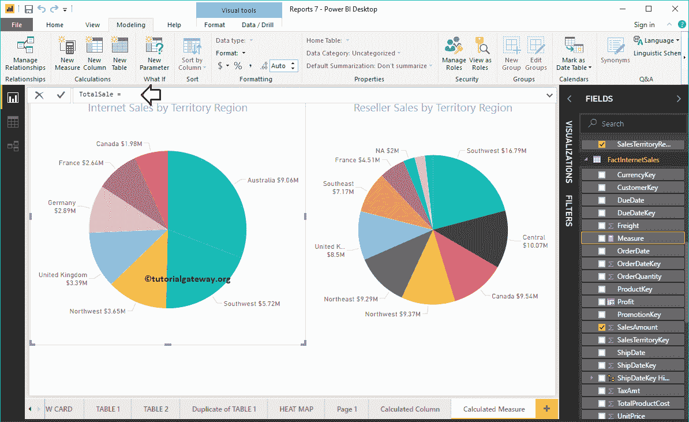
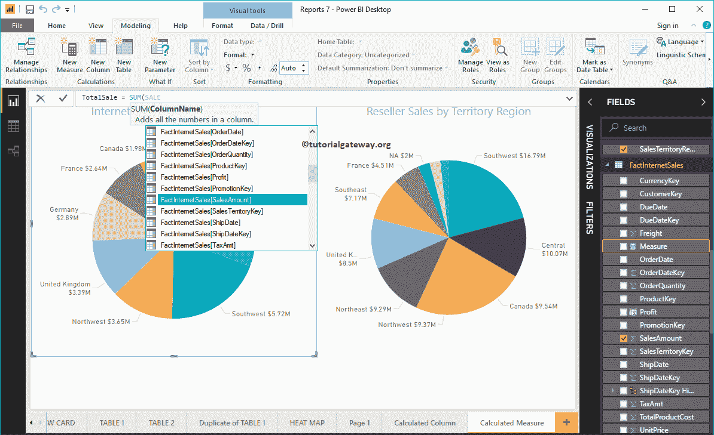
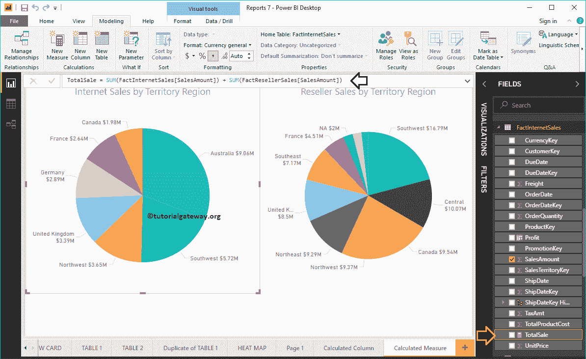
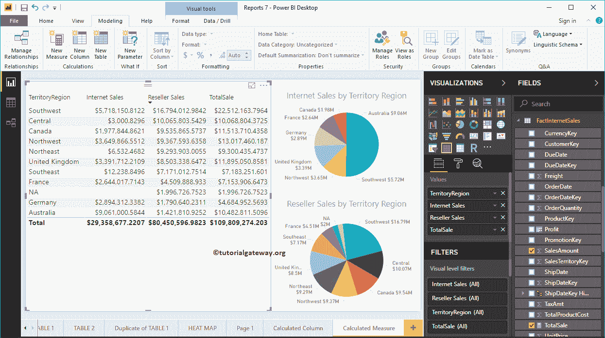
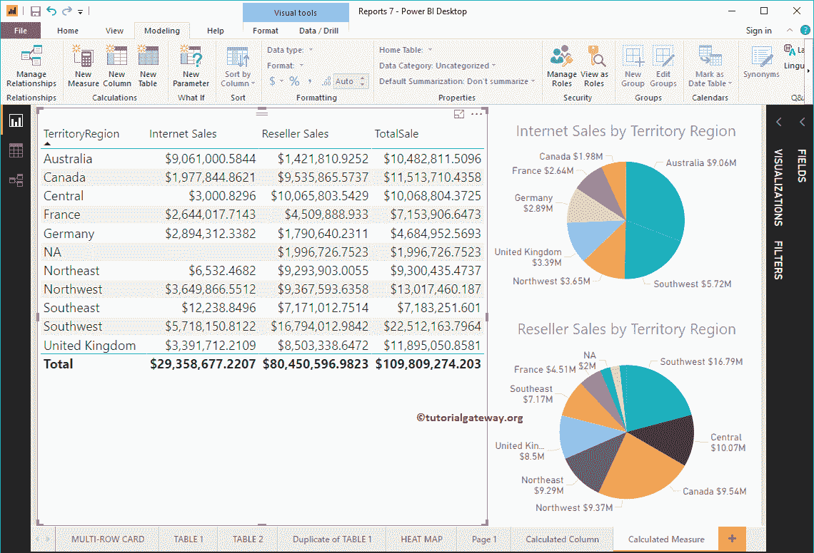
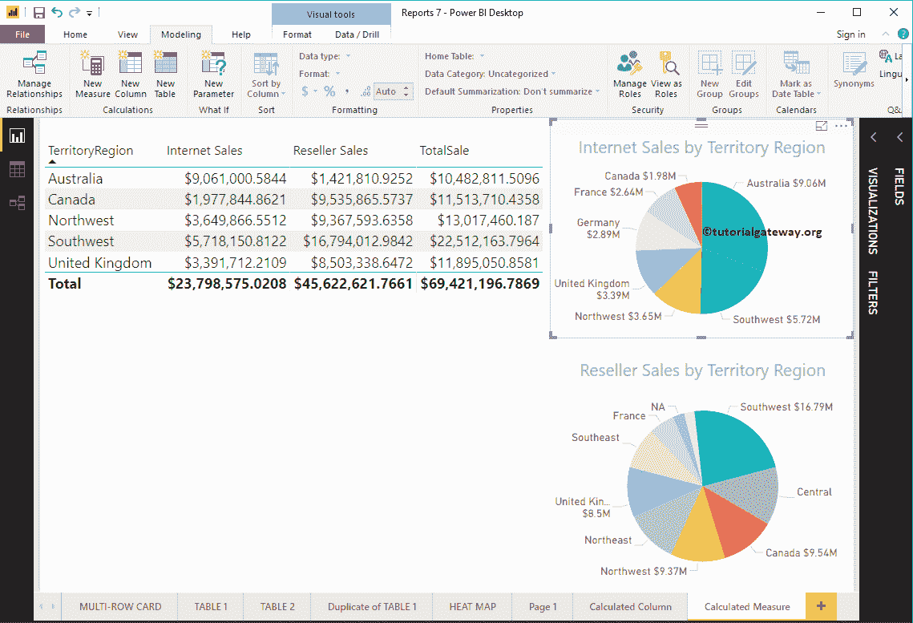

# 在 PowerBI 中创建计算度量

> 原文：<https://www.tutorialgateway.org/create-calculated-measures-in-power-bi/>

在 Microsoft Power BI 中，您可以从现有列创建自定义计算度量(或数值聚合计算)。在本文中，我们将通过示例向您展示如何在 Power BI 中创建计算度量。

为了演示这种 Power BI 计算方法，我们将使用我们在[将 Power BI 连接到 SQL Server](https://www.tutorialgateway.org/connect-power-bi-to-sql-server/) 文章中创建的数据源。

## 如何在 PowerBI 中创建计算度量

要创建它，请单击建模选项卡下的新建度量选项。

点击 [Power BI](https://www.tutorialgateway.org/power-bi-tutorial/) 新建选项卡，打开带有默认度量名称的 DAX 公式栏，如下图所示。

你可以根据自己的需要重新命名。让我把这个重新命名为总销售额

对于 Power BI 计算的指标演示目的，我们添加了互联网销售额、事实互联网销售额中的经销商销售额和事实经销商销售额表。与[计算列](https://www.tutorialgateway.org/create-calculated-columns-in-power-bi/)不同，您必须使用聚合函数来创建它。

从下面的截图中可以看到，当我在打字时，Power BI IntelliSense 正在显示建议。

通过单击回车键或任意键，将创建一个名为 TotalSale 的新度量。

让我将前面创建的计算度量添加到表中。请参考[表报告](https://www.tutorialgateway.org/create-a-table-in-power-bi/)文章，了解创建表

所涉及的步骤

让我最小化字段选项卡和可视化，以便您可以专注于表值。

您也可以在这些上应用[滤镜](https://www.tutorialgateway.org/power-bi-basic-filters/)。从下面的截图中，您可以看到我们在饼图中选择了几个区域，同样的情况也反映在表中。

