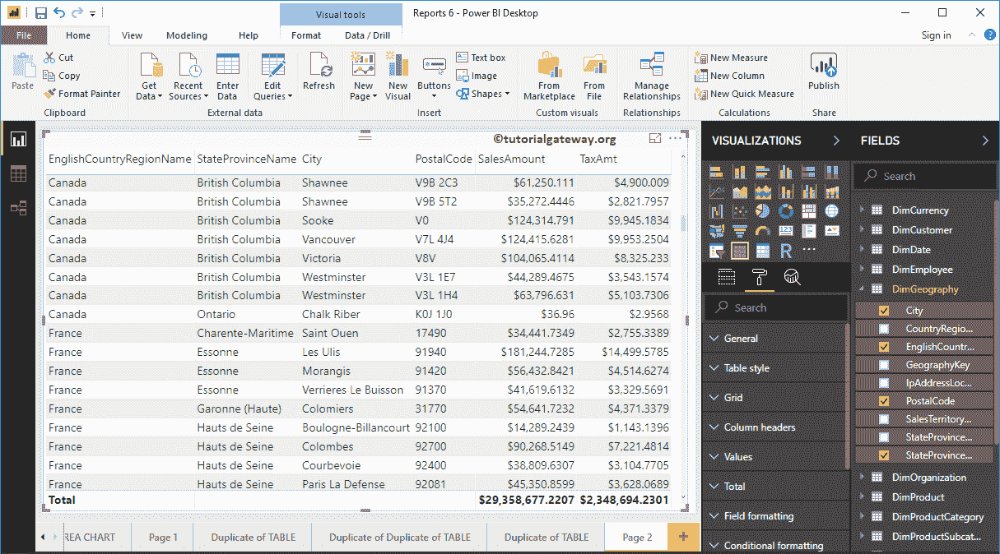
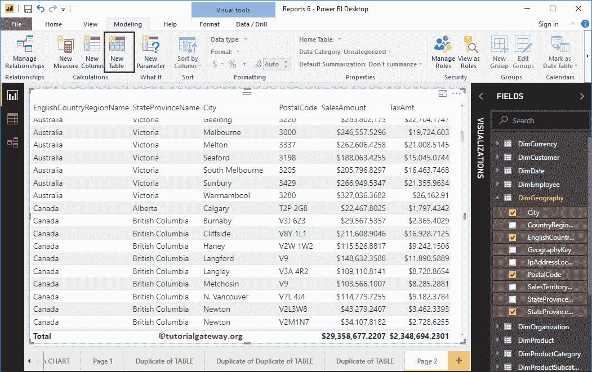
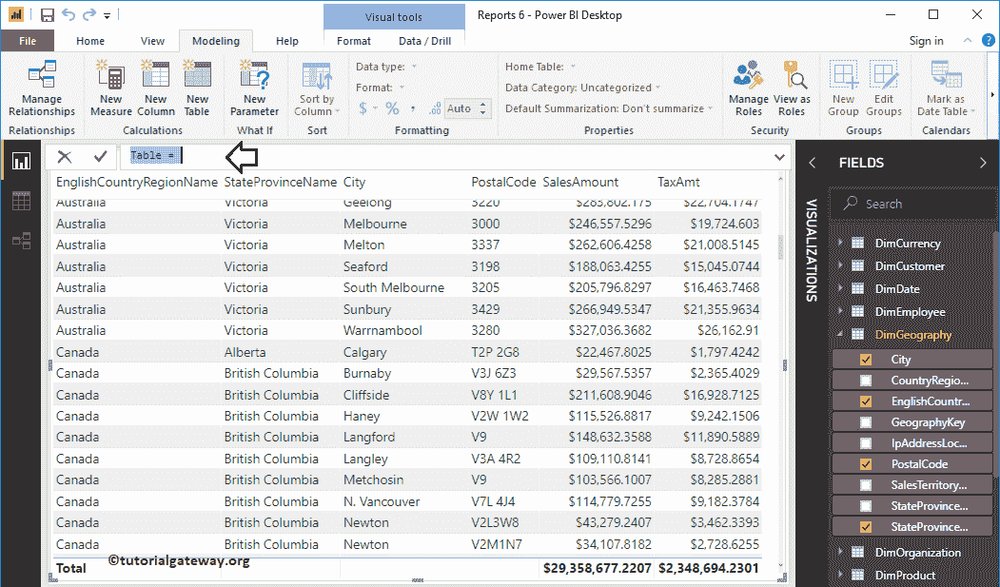
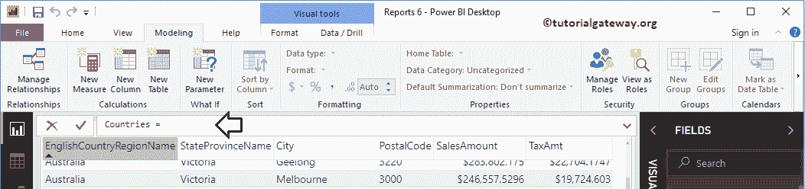
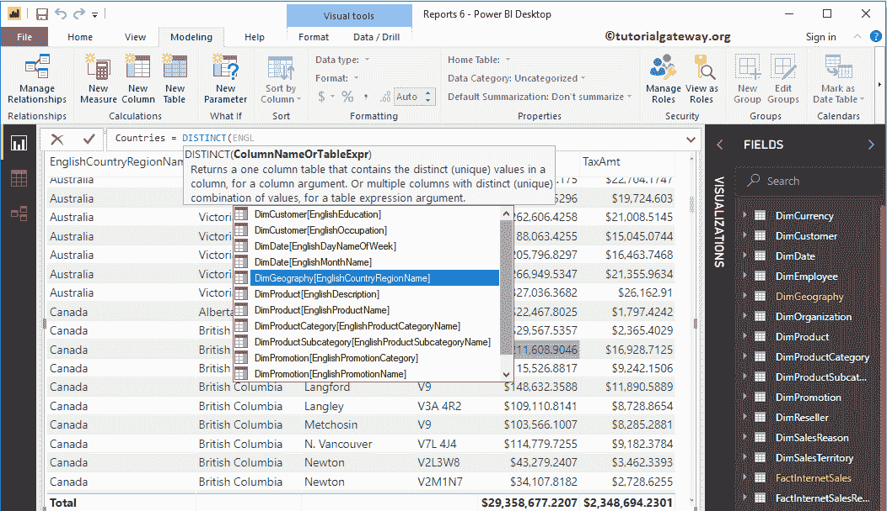
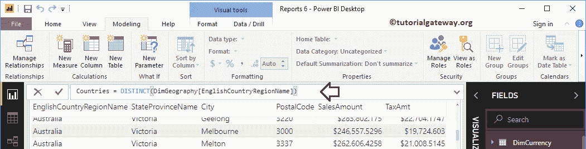
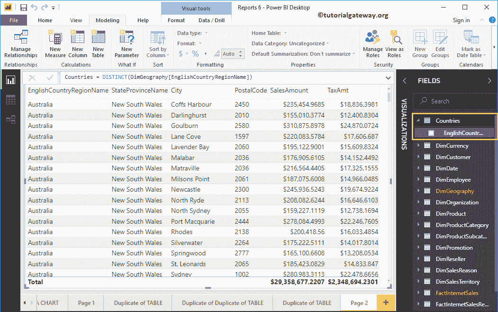
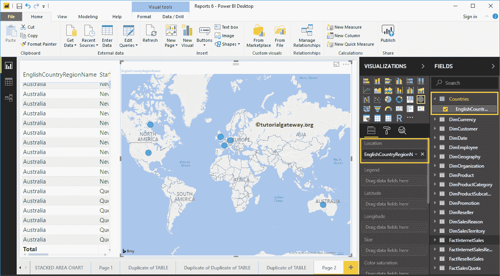

# 在电力商业智能中创建计算表

> 原文：<https://www.tutorialgateway.org/create-calculated-tables-in-power-bi/>

在 Power BI 中，可以从现有表创建自定义表或计算表。在本文中，我们通过一个例子向您展示了如何在 Power BI 中创建计算表。

为了演示这个 Power BI 计算表，我们将使用我们在[将 Power BI 连接到 SQL Server](https://www.tutorialgateway.org/connect-power-bi-to-sql-server/) 文章中创建的 SQL 数据源。所以，请参考相同的。

## 如何在电力商业智能中创建计算表

要添加计算表，请单击建模选项卡下的新建表选项。

它会打开 [Power BI](https://www.tutorialgateway.org/power-bi-tutorial/) DAX 公式栏写 DAX 表达式，如下图截图所示。

让我将默认表名重命名为国家

为此计算表演示目的，我们将从“地理”表中选择国家。从下面的截图中可以看到，当我在打字时，Power BI IntelliSense 正在显示建议。

从下面的截图中，您可以看到，我们正在从“国家”列中选择 DISTINCT(非重复或唯一)国家的名称。

通过单击输入或任何键，将创建一个名为“国家”的新表，其中包含不同的国家名称。

让我用之前创建的计算表创建一个[地图](https://www.tutorialgateway.org/create-a-map-in-power-bi/)。

