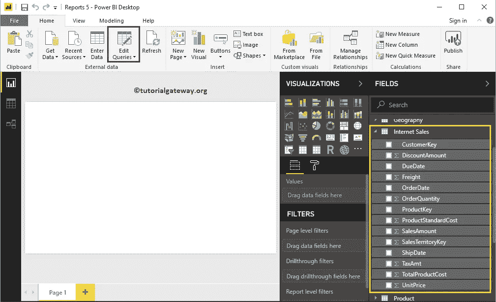
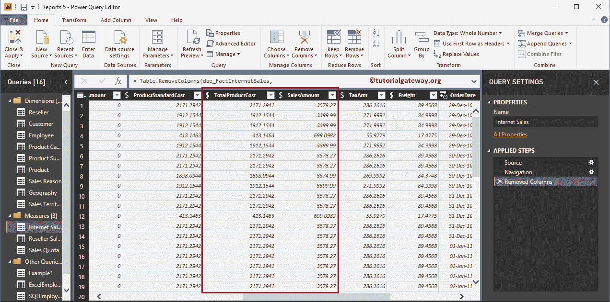
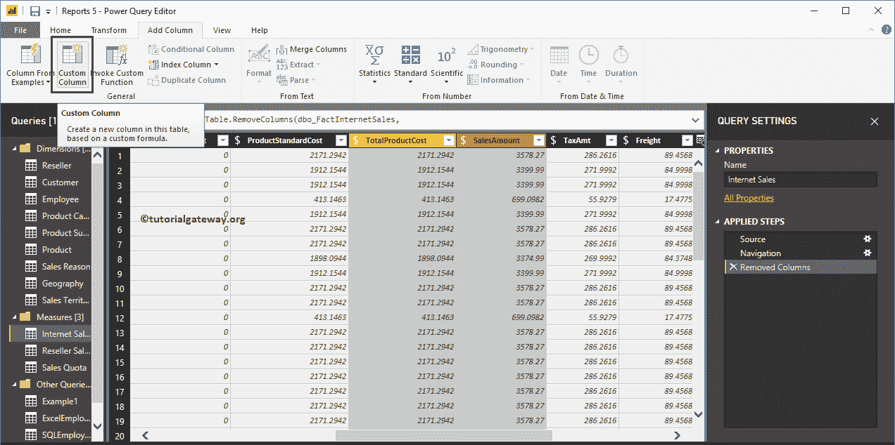
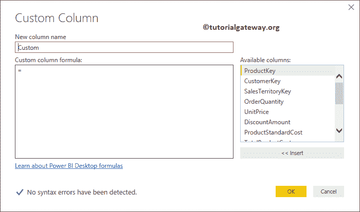
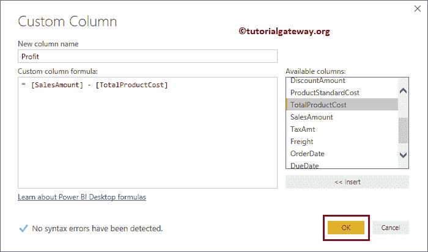
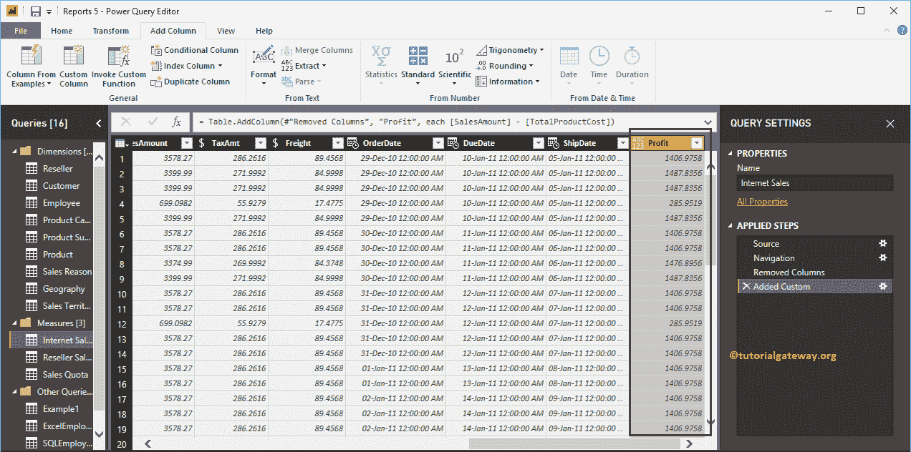
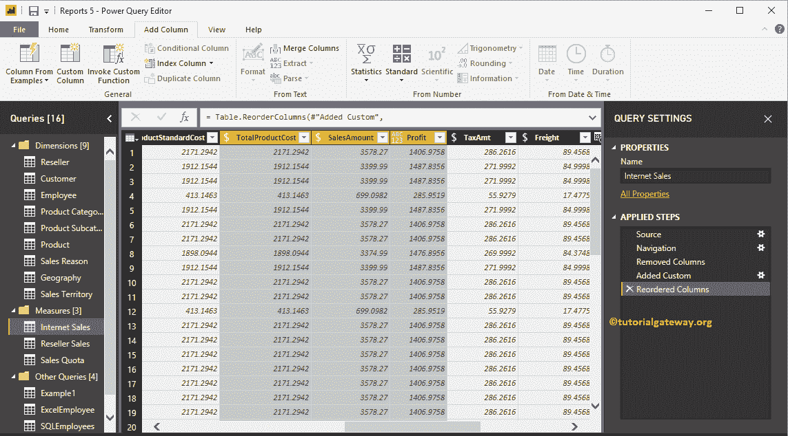
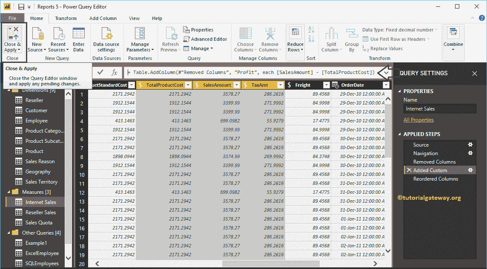

# 在 Power BI 中创建自定义列

> 原文：<https://www.tutorialgateway.org/create-a-custom-column-in-power-bi/>

Power BI 自定义列基于现有列生成新列。例如，你可以用这个来计算利润或损失等。让我们通过一个例子来看看如何在 Power BI 中创建一个自定义列。

## 如何在 Power BI 中创建自定义列

为了演示这个自定义列，我们将使用我们在[连接到 SQL 数据源](https://www.tutorialgateway.org/connect-power-bi-to-sql-server/)文章中导入的互联网销售表。

要添加或创建自定义列，请单击主页选项卡下的编辑查询选项。

单击编辑查询选项将打开一个名为超级查询编辑器的新窗口。

在本例中，我们将使用产品总销售额和销售额来计算利润。

要在 Power BI 报告中添加自定义列，请转到添加列选项卡。在此选项卡下，请单击自定义列按钮，如下所示。

单击自定义列按钮将打开以下窗口。

我们将列名改为利润。接下来，我们将从销售额中减去总产品。

现在可以看到新栏目

让我[重新排列列](https://www.tutorialgateway.org/remove-or-reorder-columns-in-power-bi/)，这样你就可以并排看到它们

点击 [Power BI](https://www.tutorialgateway.org/power-bi-tutorial/) 主页选项卡下的关闭并应用选项，应用这些更改。

