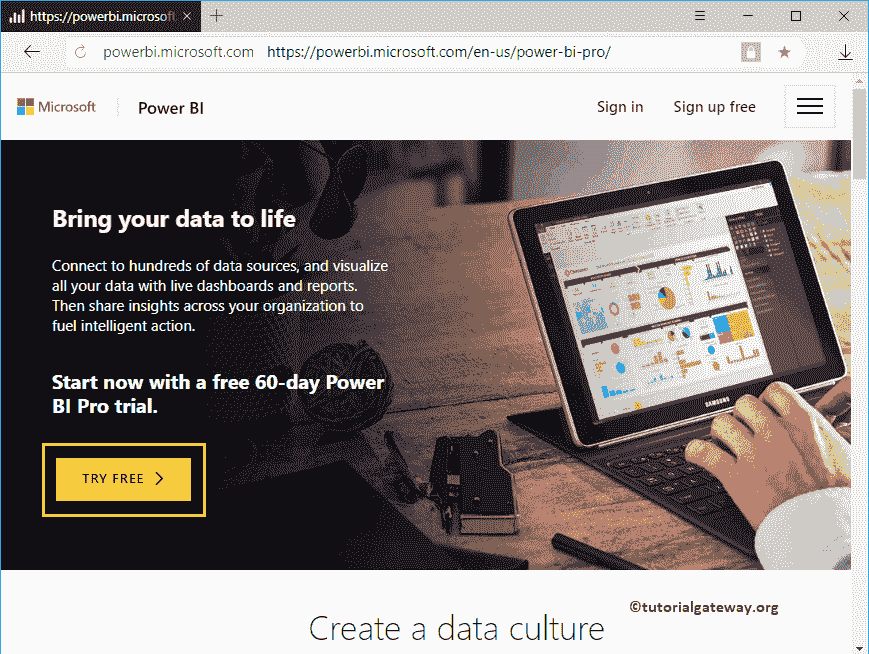
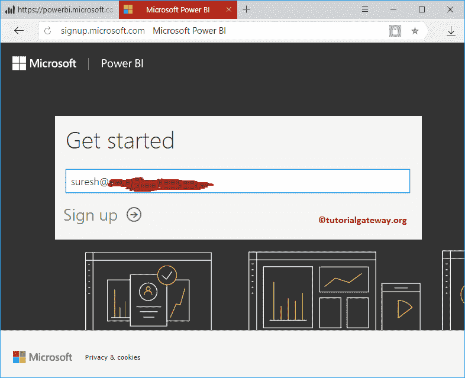
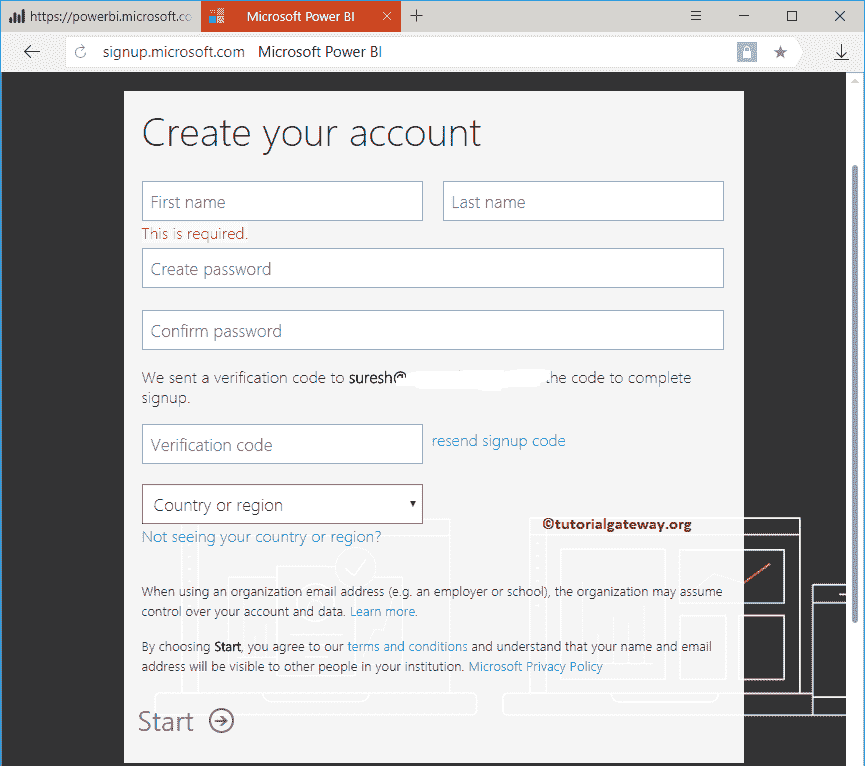
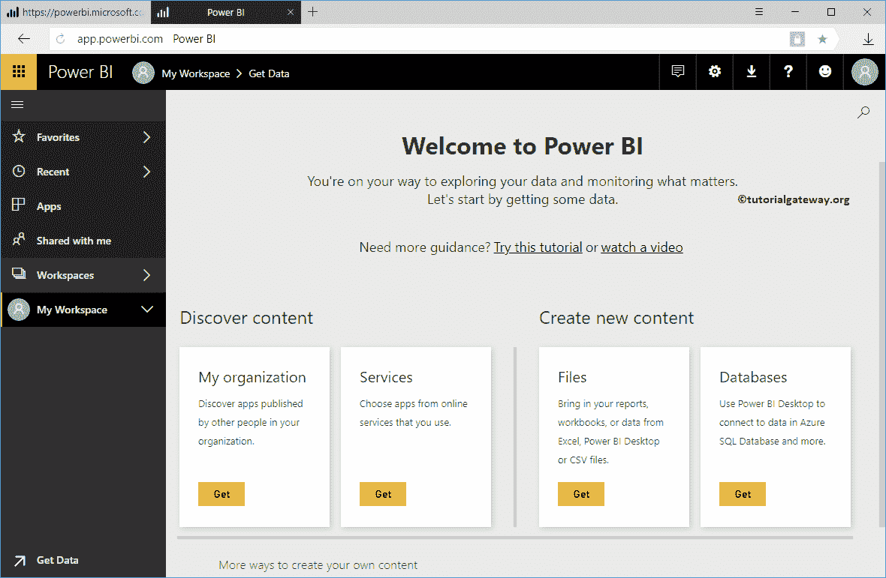

# 注册为商业智能服务提供动力

> 原文：<https://www.tutorialgateway.org/register-to-power-bi-service/>

Power BI 桌面是本地版本，您可以在其中设计报告。但是，您必须在整个组织中实时共享您的工作(报告)和仪表板。为此，您需要高级许可证。但是，您可以尝试 Power BI Pro 60 天试用版。让我告诉你如何注册PowerBI服务。

## 如何注册PowerBI服务

首先，点击此链接 [Power BI Pro](https://powerbi.microsoft.com/en-us/power-bi-pro/) 进入微软 Power BI 官方网站。接下来，点击免费试用按钮开始您的 [Power BI](https://www.tutorialgateway.org/power-bi-tutorial/) 60 天试用。

单击免费试用按钮打开入门窗口。在这里，您必须提供公司电子邮件 id。记住，它不会像 Gmail 那样接受你的个人邮件。

单击“向上唱”按钮后，Power BI 会向您提供的电子邮件发送一个验证码。您必须在下一个屏幕上使用该验证码。

接下来，在这些文本框中填入您的个人信息。

现在，您可以看到 Power BI 工作区。

