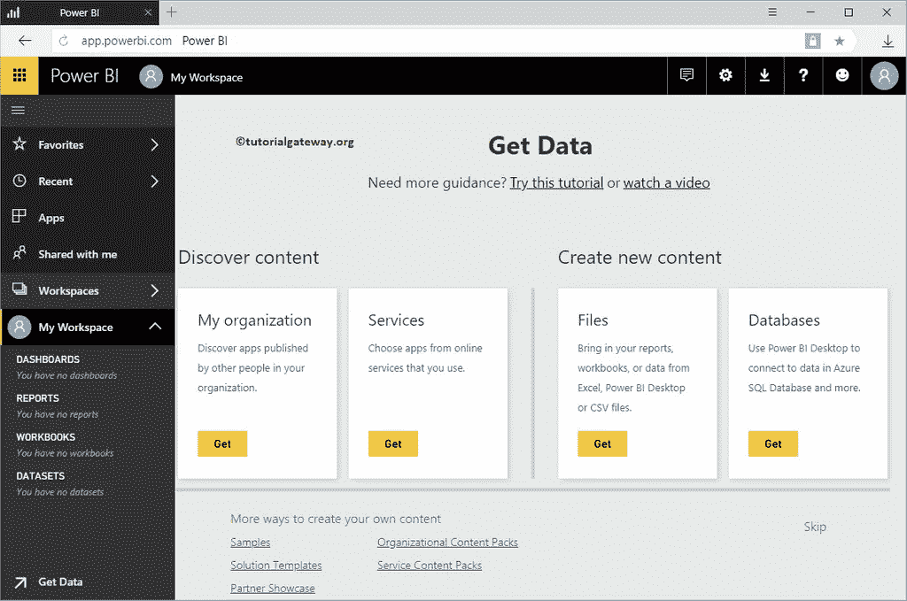
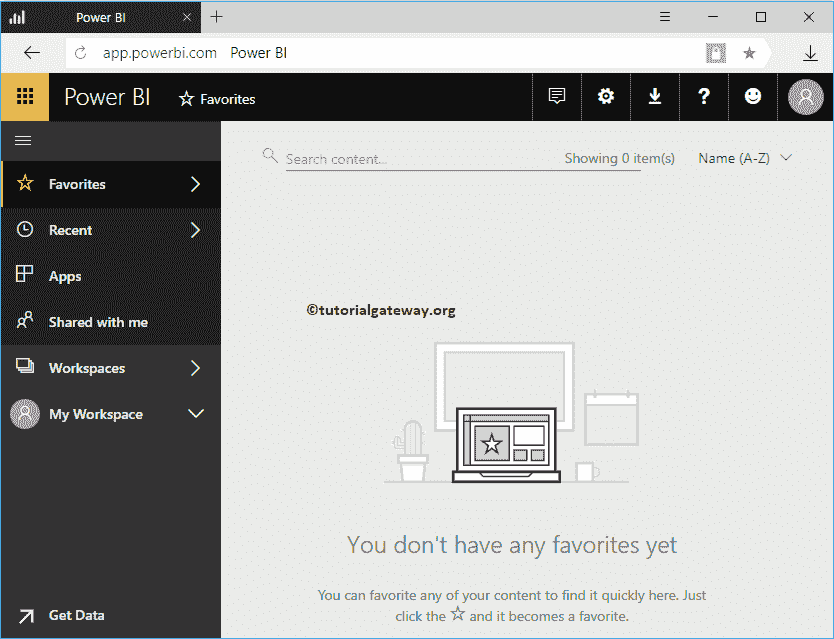
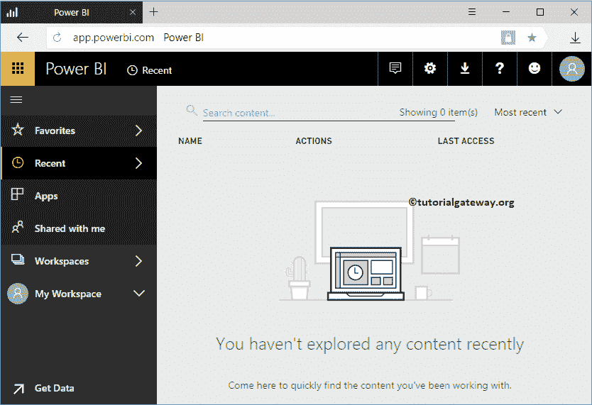
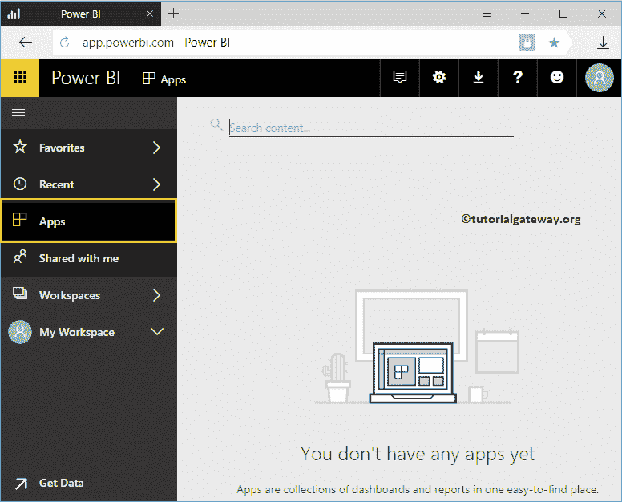
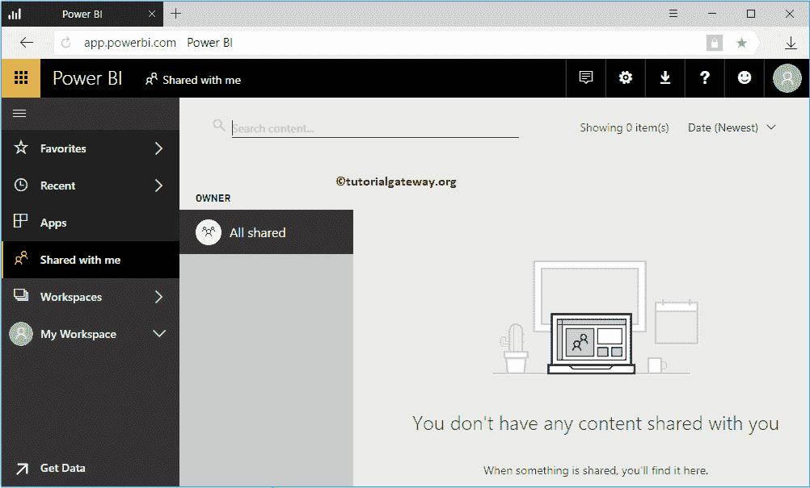
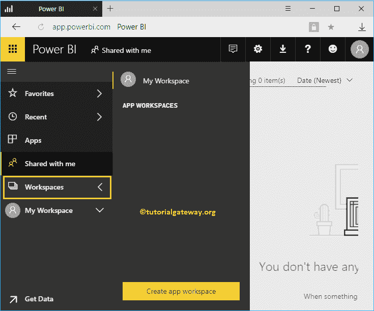
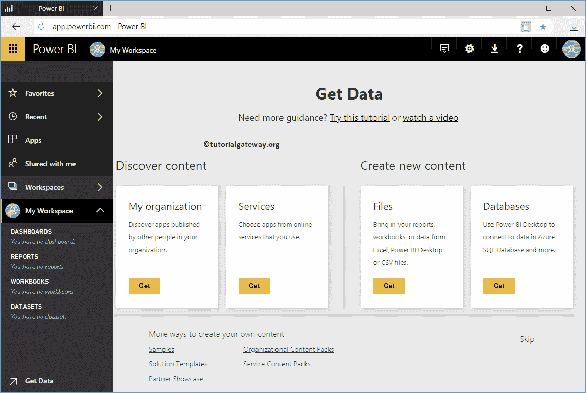
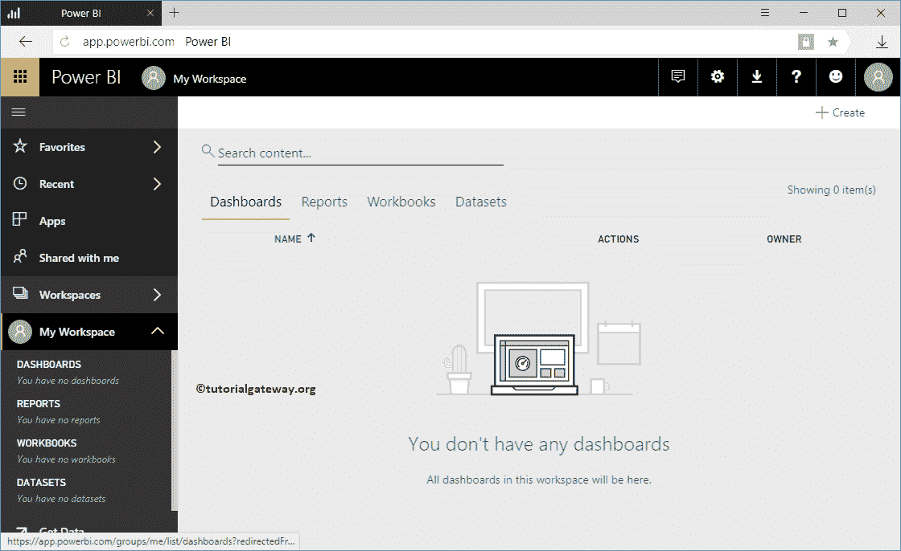

# PowerBI 仪表盘简介

> 原文：<https://www.tutorialgateway.org/power-bi-dashboard-introduction/>

本文是对 Power BI 仪表板的介绍。当您打开或登录服务时，您可以看到默认 PowerBI 仪表板。

如果这是你的第一次，那么 Power BI 仪表盘会显示以下页面

## PowerBI 收藏夹

如果你发现一些有趣的东西，我指的是报告或仪表板，那么你可以将它们添加到收藏夹中，以便快速访问。这些项目将显示在此部分。建议大家参考[收藏夹](https://www.tutorialgateway.org/power-bi-favorites/)文章，了解 [Power BI](https://www.tutorialgateway.org/power-bi-tutorial/) 收藏夹添加板卡和报告的情况。

### 最近的

与窗口中的最近文件相同。它显示我们最近看到的报告和仪表板。

### PowerBI 应用

Power BI 应用是帮助您分析业务的报告和仪表板的集合。此部分显示可用的[应用](https://www.tutorialgateway.org/publish-app-in-power-bi/)。

### 与我分享

如果组织中有人与您共享报告或仪表板，则这些共享项目会显示在此部分中。请参考[共享仪表板](https://www.tutorialgateway.org/share-power-bi-dashboard/)，以及。[分享报告](https://www.tutorialgateway.org/share-a-report-in-power-bi/)文章了解分享选项。

### 工作区

Power BI Workspace 是仪表板、报告、工作簿和数据集的集合。它显示此帐户可用的工作区。建议大家参考[创建工作区](https://www.tutorialgateway.org/create-power-bi-workspace/)文章了解工作区的创建。

### 我的工作区

这是服务创建的默认工作场所，也是默认工作场所。

如果您是第一次打开此服务，它可能会显示如下所示的页面。您可以使用此页面[导入数据](https://www.tutorialgateway.org/upload-excel-files-to-power-bi-dashboard/)以创建可视化效果。

通过单击“跳过”按钮，或单击“我的工作区”选项卡，将打开以下窗口。

*   仪表板:此部分显示此工作区中可用的 PowerBI 仪表板。使用创建按钮，您也可以创建一个。建议大家参考[创建它](https://www.tutorialgateway.org/create-a-power-bi-dashboard/)的文章。
*   报告:“报告”选项卡显示此工作区中可用的报告。使用“创建”按钮，您还可以创建新报告。建议大家参考[创建报告](https://www.tutorialgateway.org/create-a-report-in-power-bi-workspace/)文章。
*   工作簿:此部分显示此工作区中可用的工作簿。意思是，你上传(不是导入)到工作区的 Excel 工作簿。建议大家参考[上传 Excel 文件](https://www.tutorialgateway.org/upload-excel-files-to-power-bi-dashboard/)文章。
*   数据集:此部分显示可用数据集的列表。您可以使用创建按钮创建仪表板。

