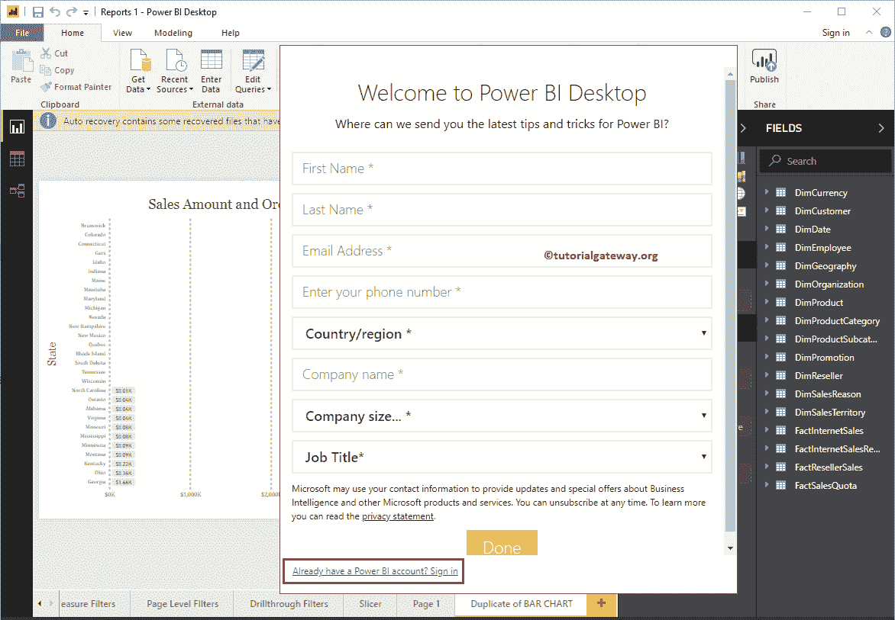
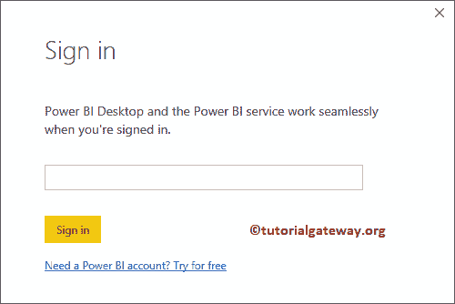
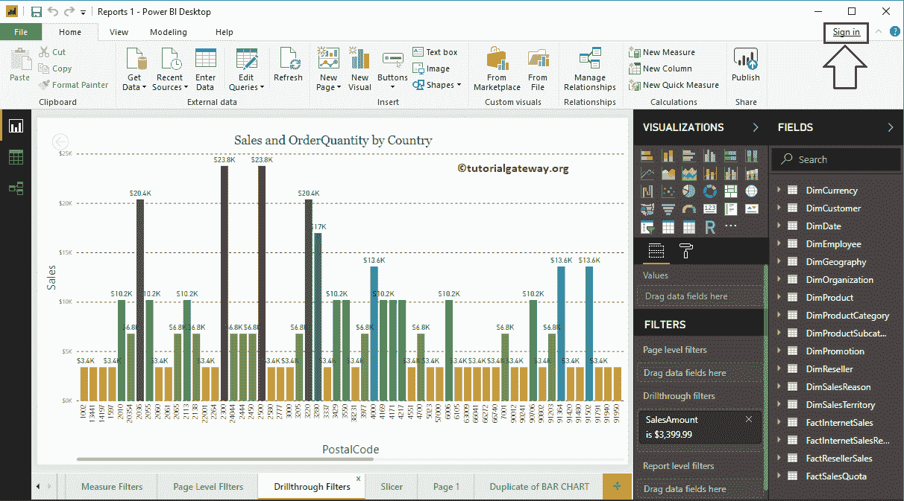
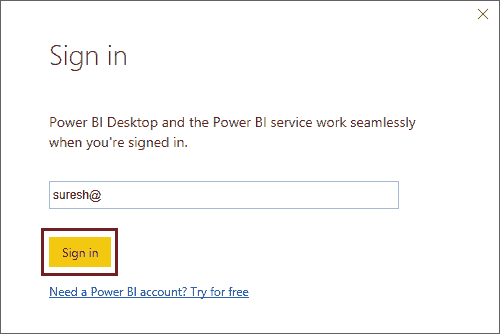
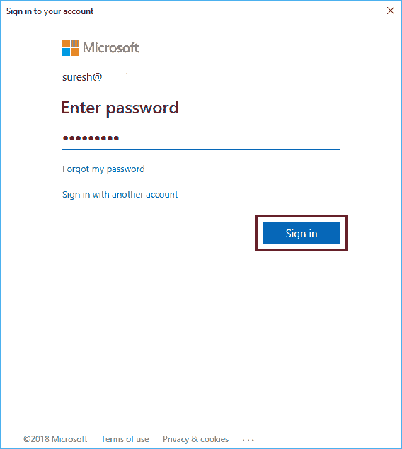
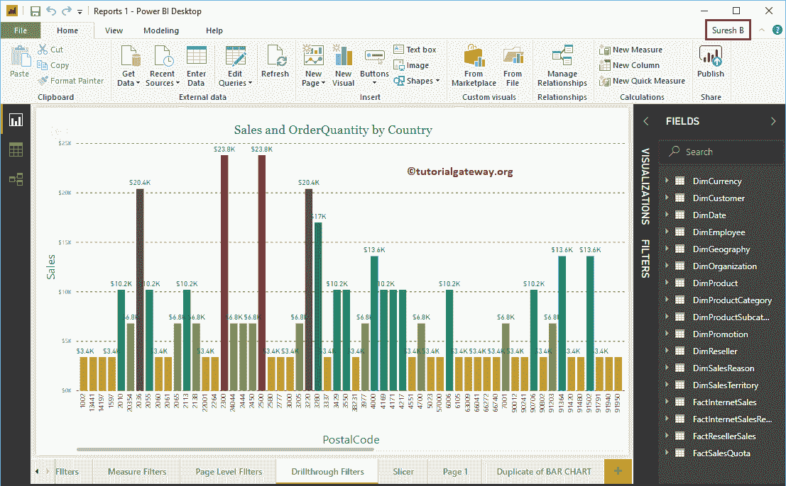

# 使用智能商务服务连接智能商务桌面

> 原文：<https://www.tutorialgateway.org/connect-power-bi-desktop-with-power-bi-service/>

在本节中，我们将向您展示如何将 Power BI 台式机与 Power BI 服务或 Power BI Pro 连接起来。发表你的报告是非常重要的。

## 如何将智能桌面与智能服务连接起来

如果您尚未启动智能商务智能桌面，请双击智能商务智能桌面打开。打开后，它会要求您注册或登录，如下图所示。您可以使用此表单创建新帐户。请点击已经有一个高级商业智能帐户？登录超链接

单击超链接会打开登录窗口。在这里，你必须提供用户名。

提示:建议您参考[注册 Power BI 服务](https://www.tutorialgateway.org/register-to-power-bi-service/)文章创建 [Power BI](https://www.tutorialgateway.org/power-bi-tutorial/) 账户。

### 连接电源商务智能桌面方法 2

不知何故，如果你在加载桌面时忘记登录，那么你可以遵循这个方法。单击右上角的登录超链接。

请提供贵公司提供的电子邮件标识。请记住，它只接受组织 id，不接受您的个人电子邮件帐户，如 Gmail。

请提供密码以连接到电力商业智能服务。

现在你可以看到我以苏雷什的身份登录。

