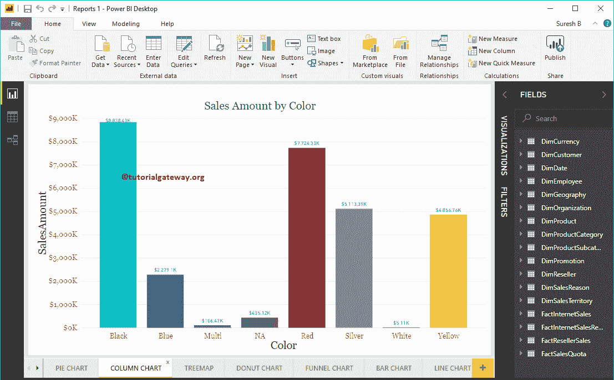
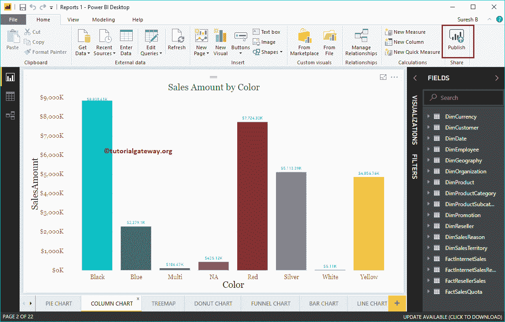
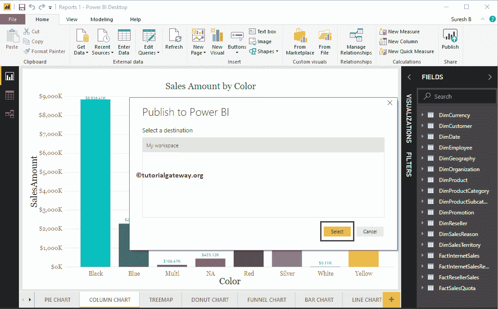
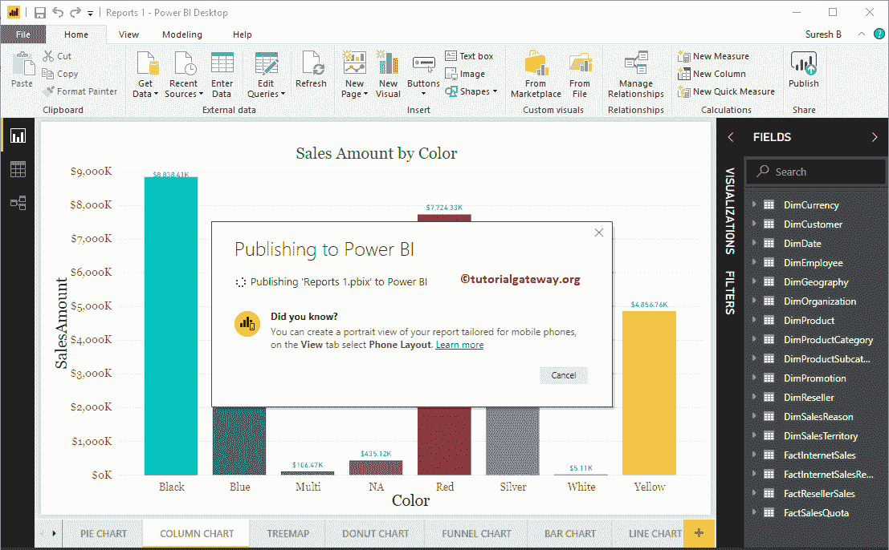
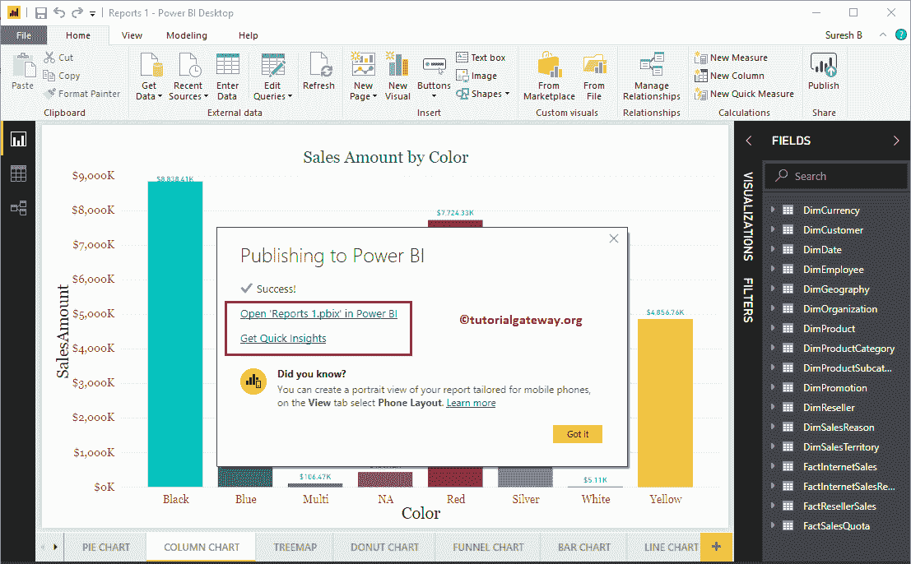
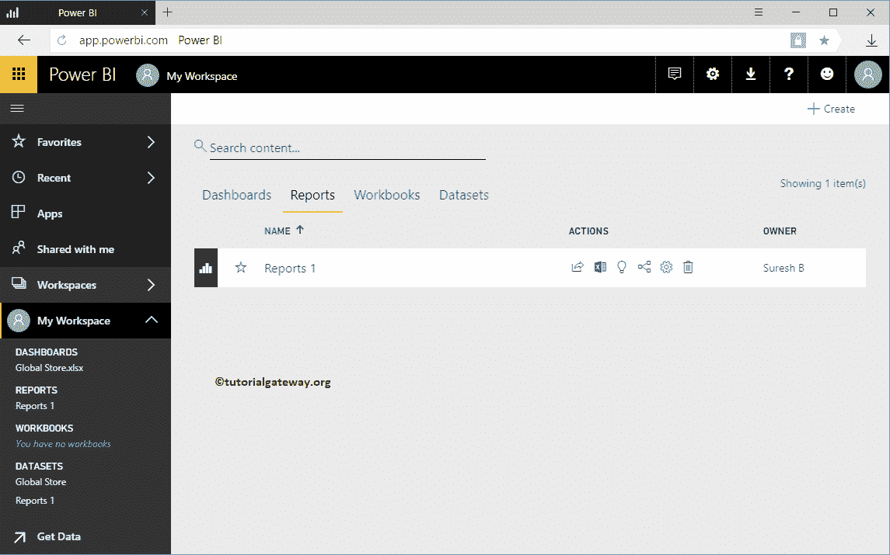
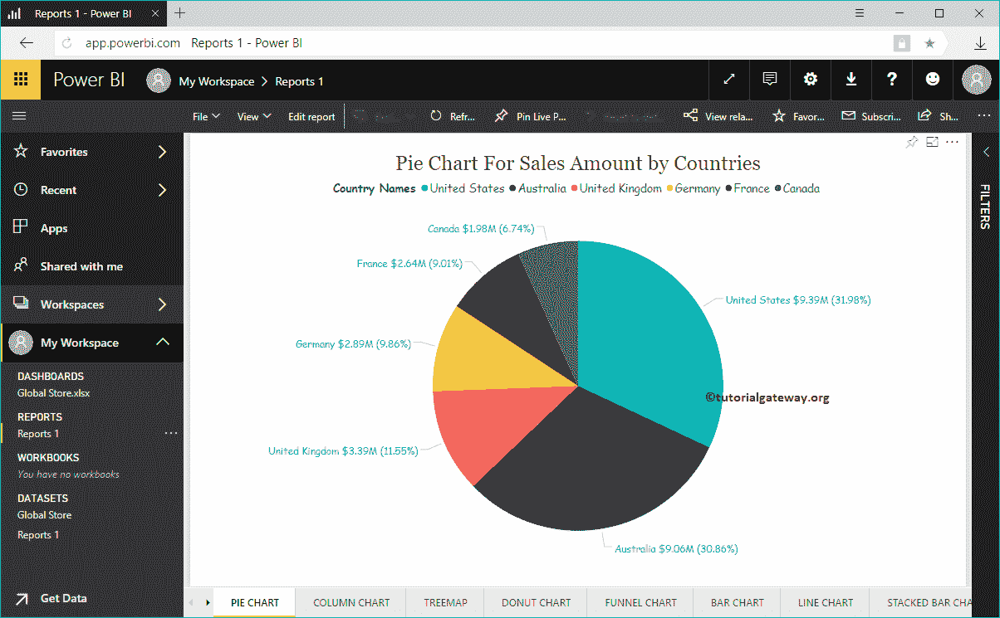

# 发布PowerBI桌面报告

> 原文：<https://www.tutorialgateway.org/publish-power-bi-desktop-reports/>

在本文中，我们通过一个实例向您展示了将 Power BI 桌面报告发布到 Power BI 服务中的分步方法。在开始在 Power BI 桌面中发布报告之前，您必须使用专业凭据登录到您的帐户。

提示:建议您参考[连接桌面与服务](https://www.tutorialgateway.org/connect-power-bi-desktop-with-power-bi-service/)文章，了解登录 [Power BI](https://www.tutorialgateway.org/power-bi-tutorial/) 的流程。

## 如何发布PowerBI桌面报告

请自行导航到主页选项卡，然后单击右上角的发布按钮。

单击该按钮将打开一个名为“发布到 Power BI”的新窗口。在目标部分下，您必须选择工作区(如果有)；否则，选择默认的“我的工作区”。

请等到发布完成。

从下面的截图可以看到，发布成功。点击打开报告超链接，可以看到可视化，点击[快速洞察](https://www.tutorialgateway.org/quick-insights-in-power-bi/)，可以看到数据洞察。

让我打开同样的

现在，您可以在工作区->报告选项卡中看到上面的报告。单击报告 1 查看可视化内容中的页面。

你可以看到里面的页面

