# 创建 PowerBI 工作空间

> 原文：<https://www.tutorialgateway.org/create-power-bi-workspace/>

Power BI Workspace 是仪表板、报告、工作簿和数据集的集合。Power BI 工作区是您组织的完整工作区域。在本文中，我们通过一个实际的例子向您展示了如何创建 Power BI Workspace。

在我们开始创建 Power BI Workspace 之前，让我向您展示当前可用的列表。从下面的截图可以看到，目前这个账号只有一个可用。这是 Power BI 服务创建的默认工作场所。

## 如何创建 PowerBI 工作空间

请点击创建应用程序工作区，在 Power BI

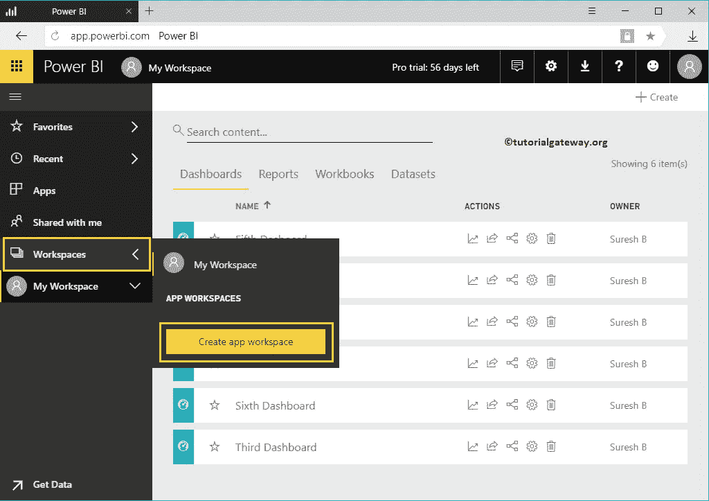

中创建新的

单击它会打开一个新窗口来定义它。

*   命名您的工作区:请指定唯一有效的名称。
*   添加工作区成员:您可以添加成员。

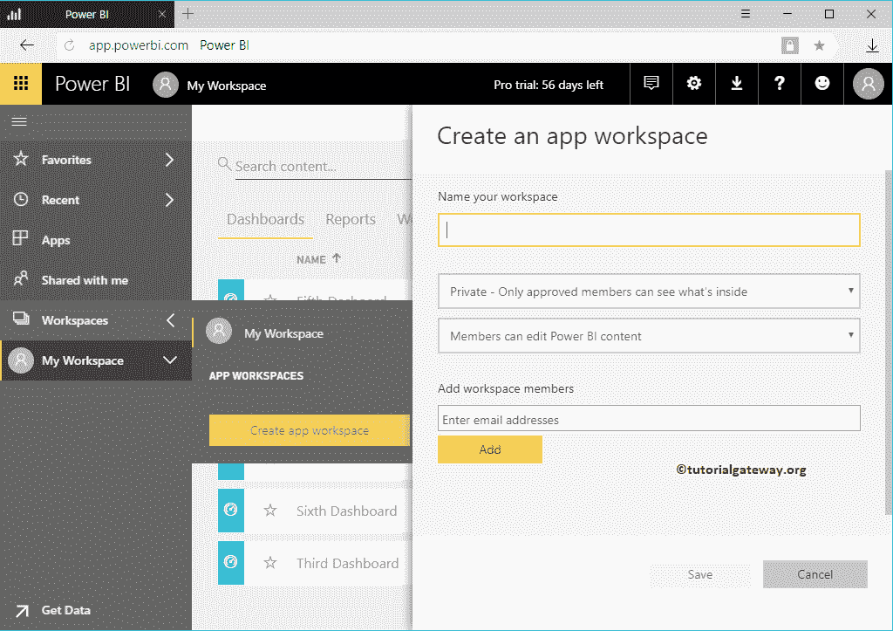

*   公共——任何人都能看到里面的东西:这个组织中的任何人都能看到
*   私人–只有经过批准的成员才能看到里面的内容:添加到此的人可以查看

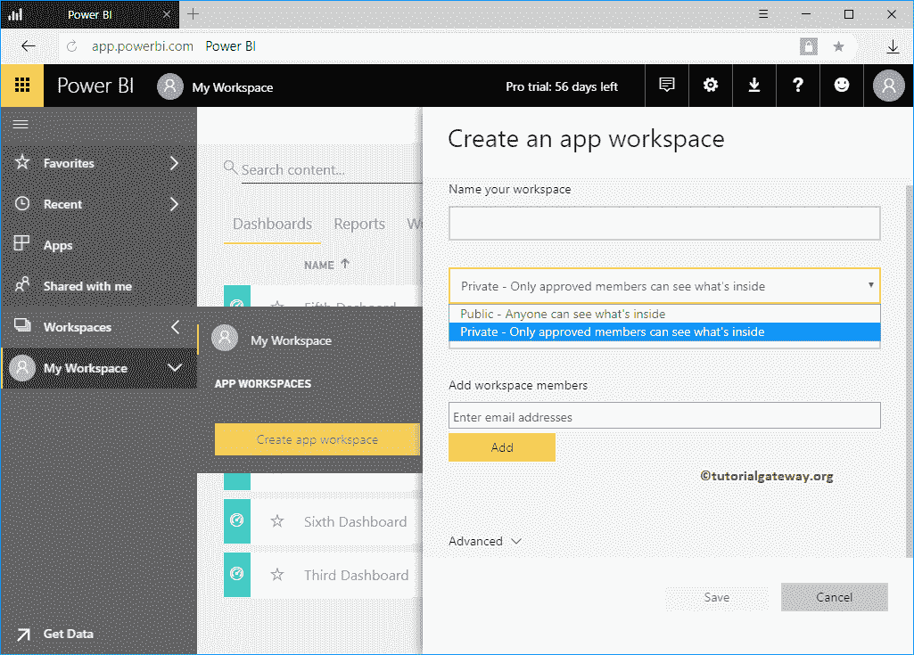

*   成员可以编辑内容:允许人们编辑内容
*   成员只能查看内容:限制他们编辑工作区内容。

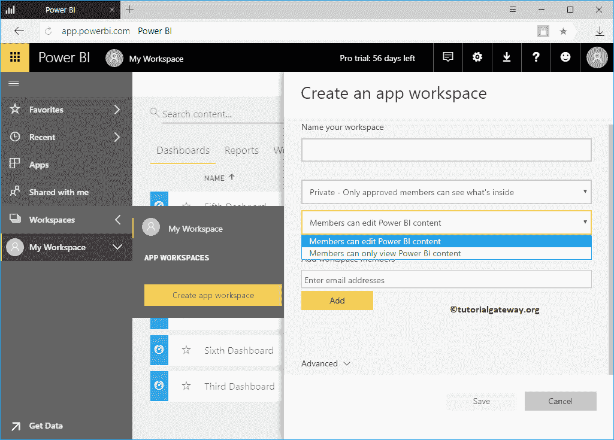

从下面的截图中可以看到，我们将名称指定为样本工作区，限制成员查看(无改动)。接下来，我们还添加了我的一位同事约翰作为成员。

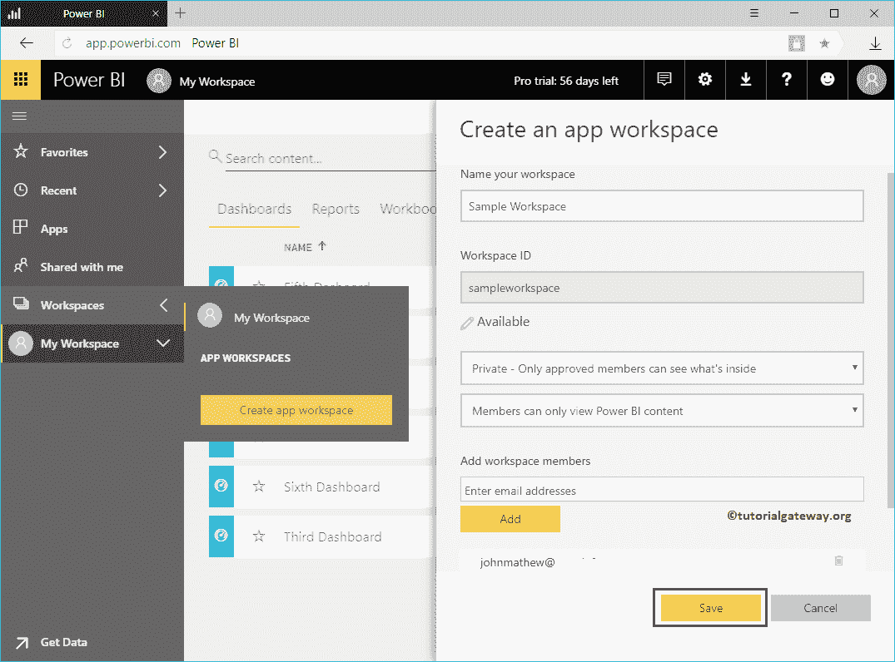

单击保存按钮在 Power BI 中创建新的工作空间，称为样本。默认情况下，它会打开以下窗口。您可以使用此窗口从不同来源获取数据，也可以通过单击“跳过”按钮跳过此页面。

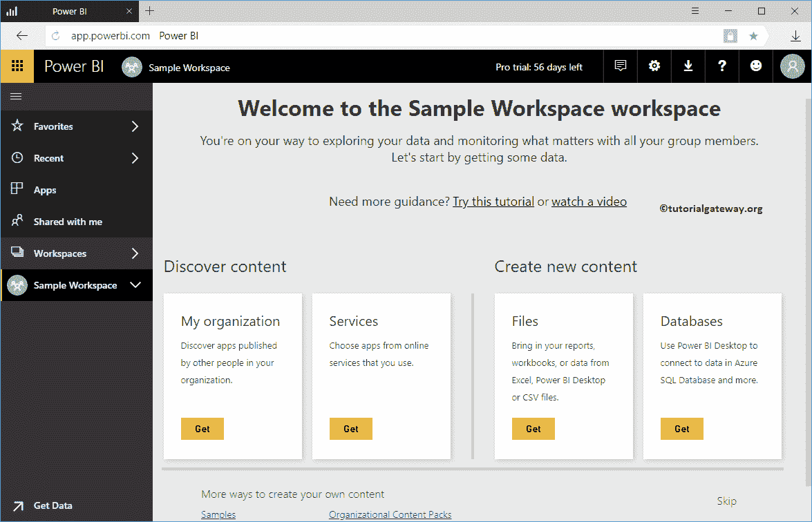

单击跳过超链接后，将显示以下窗口。使用此窗口创建[仪表板](https://www.tutorialgateway.org/create-a-power-bi-dashboard/)、[报告](https://www.tutorialgateway.org/create-a-report-in-power-bi-workspace/)、数据集和工作簿。

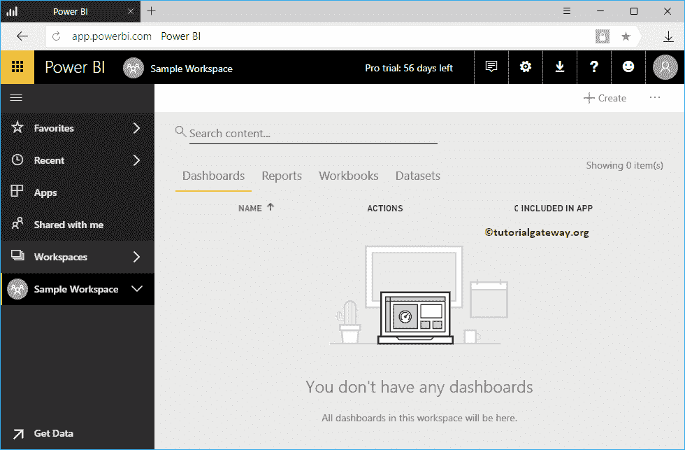

我们刚刚创建了一个简单的仪表盘

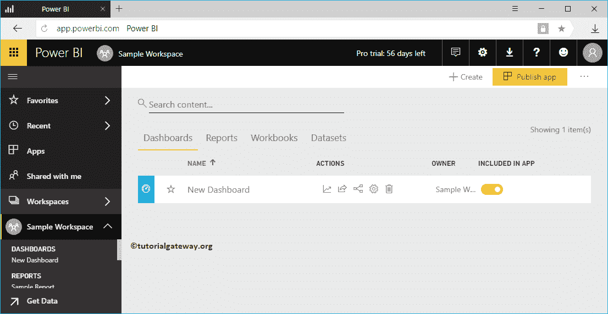

让我给你看看这个仪表盘

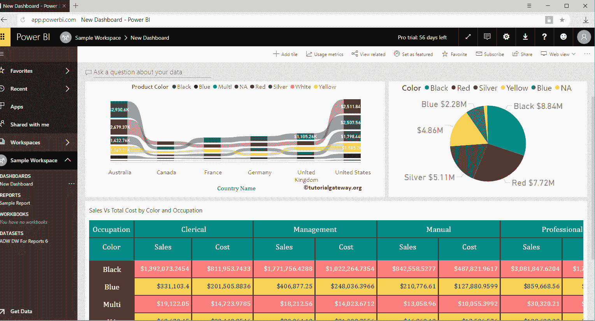

里面的报告或者瓷砖

下面的截图显示了其中的报告。

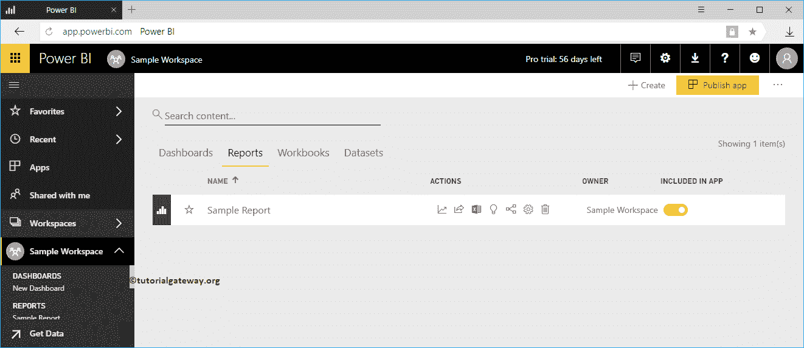

下面的截图显示了相应的数据集。建议大家参考[从桌面](https://www.tutorialgateway.org/publish-power-bi-desktop-reports/)发布报告文章，从 [Power BI](https://www.tutorialgateway.org/power-bi-tutorial/) 桌面发布报告。

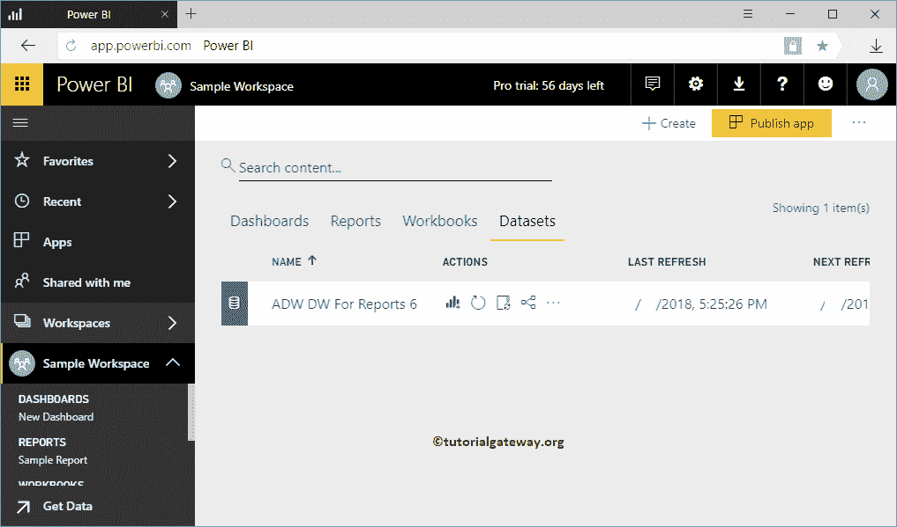