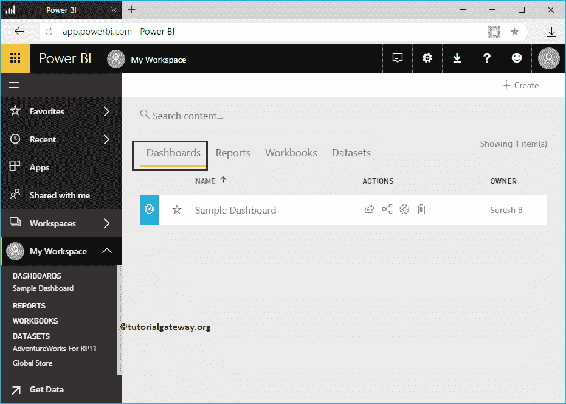

# 创建PowerBI仪表板

> 原文：<https://www.tutorialgateway.org/create-a-power-bi-dashboard/>

Power BI 仪表板是一个报告的集合，解释了业务的一切。在本节中，我们将通过一个实际示例向您展示如何创建 Power BI 仪表板。

在我们开始创建之前，让我向您展示一下我的 Power BI 工作区中当前可用的仪表板列表。

从下面的截图中可以看到，目前我的工作区中没有可用的。

## 如何创建PowerBI仪表板

创建它既简单又直接。您必须使用+ Create 按钮在工作区内创建仪表板。

要创建新的，请单击创建按钮，然后从上下文菜单中选择仪表板选项。

选择该选项将打开“创建”弹出窗口。请根据您的要求指定名称。

目前，我们将 [Power BI](https://www.tutorialgateway.org/power-bi-tutorial/) 名称指定为样本仪表盘

现在，您可以在左窗格中的“我的工作区”部分下看到该示例。

让我导航到我的工作区。在仪表板选项卡下，您可以看到新创建的仪表板。

