# PowerBI 收藏夹

> 原文：<https://www.tutorialgateway.org/power-bi-favorites/>

PowerBI 收藏夹与浏览器的收藏夹相同。如果您发现一些有趣的东西(报告或仪表板)，那么您可以将它们添加到 Power BI 收藏夹。通过这种方式，您可以快速访问它们。

在本文中，我们通过一个实际的例子向您展示了将报表和仪表板添加到 Power BI 收藏夹的分步方法。在我们开始向收藏夹添加项目之前，让我向您展示我的工作区中现有的收藏夹。

要查看它们，请单击 Power BI 左侧导航窗格中的收藏夹选项卡。从下面的截图可以看到，目前我的工作区没有收藏夹。

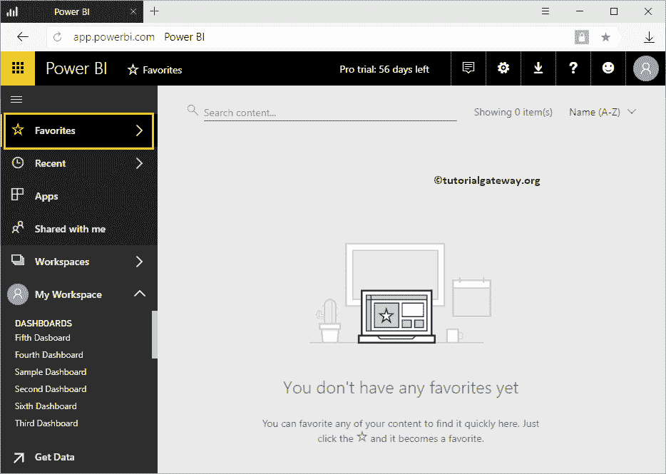

## 将仪表板添加到 PowerBI 收藏夹

在本例中，我们向 Power BI 收藏夹添加了一个仪表板。在我们开始之前，让我给你看看可用的[仪表盘](https://www.tutorialgateway.org/create-a-power-bi-dashboard/)列表。

要查看它们，请点击[Power BI](https://www.tutorialgateway.org/power-bi-tutorial/)My[Workspace](https://www.tutorialgateway.org/create-power-bi-workspace/)，然后转到仪表板选项卡。在本例中，我们将第六个仪表板标记为收藏夹。

让我点击仪表板，看看上面的视觉效果。

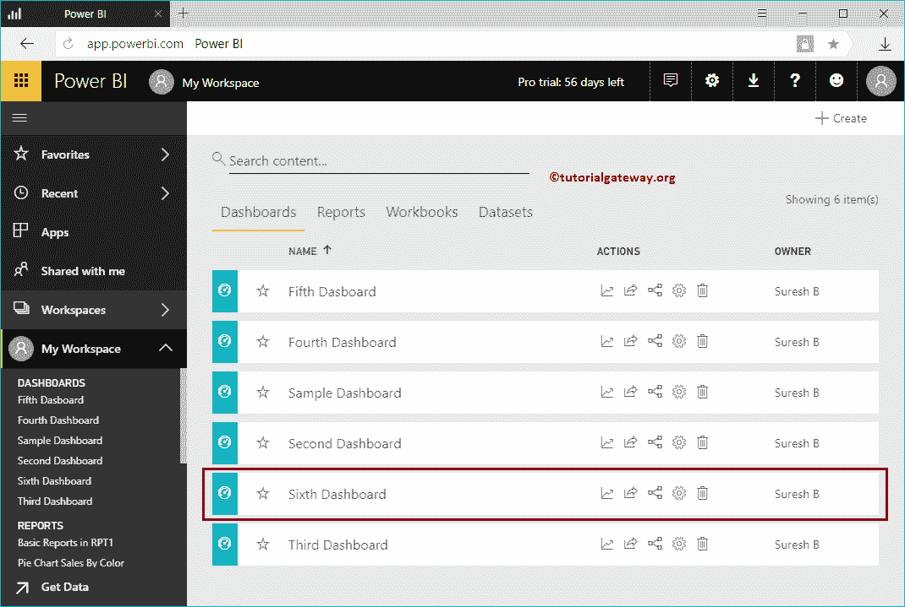

从下面的截图中，您可以看到这个仪表板上可用的视觉效果。点击 Topbar

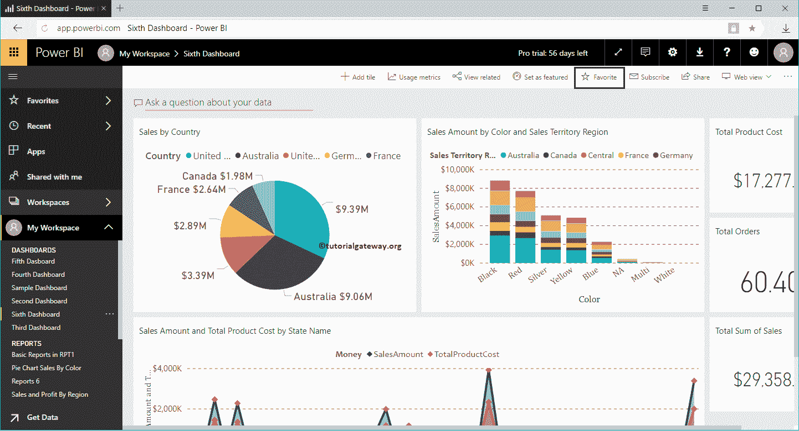

上的收藏夹按钮

如您所见，它已添加到收藏夹列表中。请记住，您可以单击“取消收藏”按钮将此仪表板从收藏列表中删除。

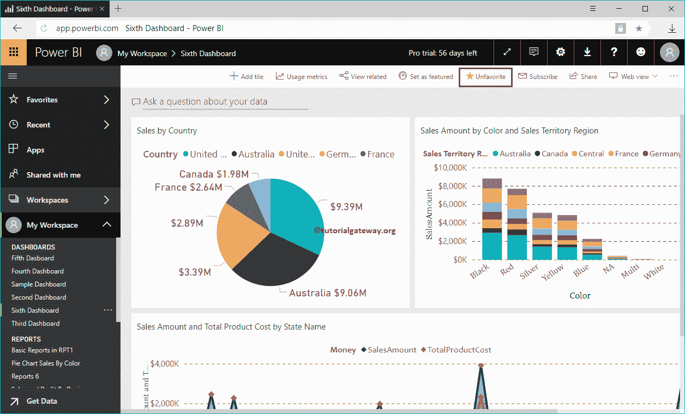

让我打开我最喜欢的列表。

从下面的截图中，您可以看到该部分下的第六个仪表板。

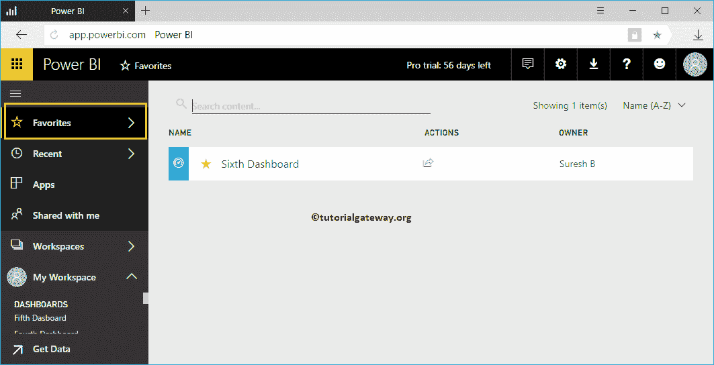

## 将报告添加到超级商务智能收藏夹

在本例中，我们将报告添加到 Power BI 收藏夹中。让我们看看可用的[报告列表](https://www.tutorialgateway.org/create-a-report-in-power-bi-workspace/)。

要查看报告，请点击 [Power BI](https://www.tutorialgateway.org/power-bi-tutorial/) 我的工作区，然后转到报告选项卡。出于演示目的，我们将 RPT1 中的基本报告标记为收藏夹。

请点击报告查看上面的图片。

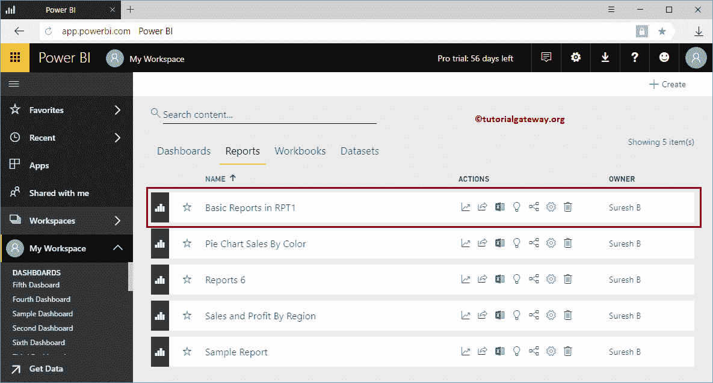

接下来，点击顶部栏

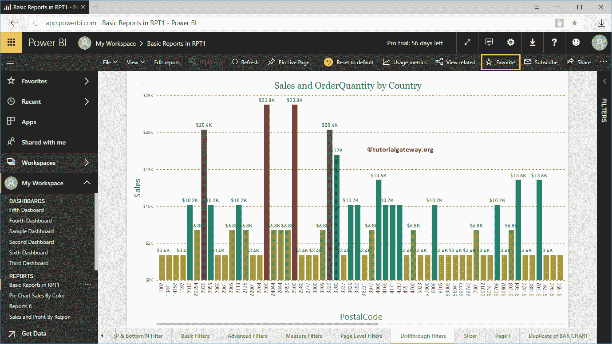

上的收藏夹按钮

从下面可以看到，该报告已添加到收藏夹列表中。请记住，单击“取消收藏”按钮可将此报告从收藏列表中删除。

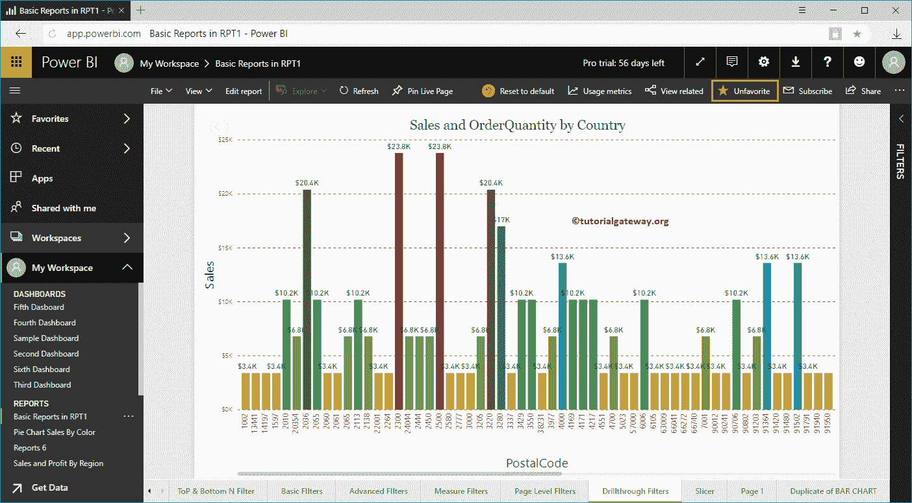

请到收藏列表查看我们是否添加成功。

从下面的截图中，您可以在 RPT1 报告的这一部分看到基本报告。

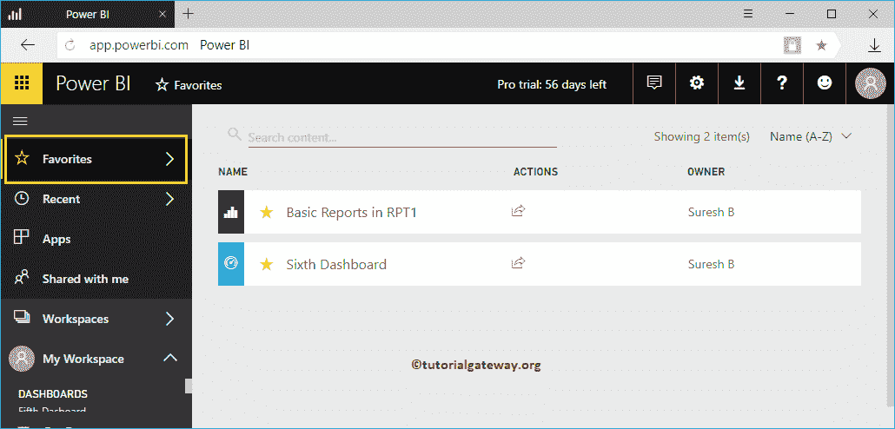

### 删除 PowerBI 收藏夹

通过单击这个小的开始，您可以从收藏夹中删除该项目。出于演示目的，让我从收藏夹列表中删除 RPT1 中的基本报告。

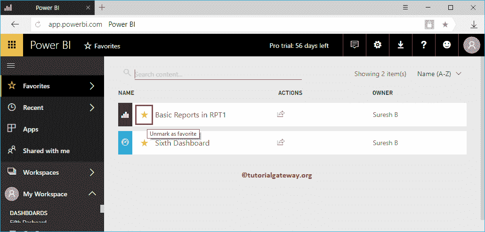

现在你看到报告删除了

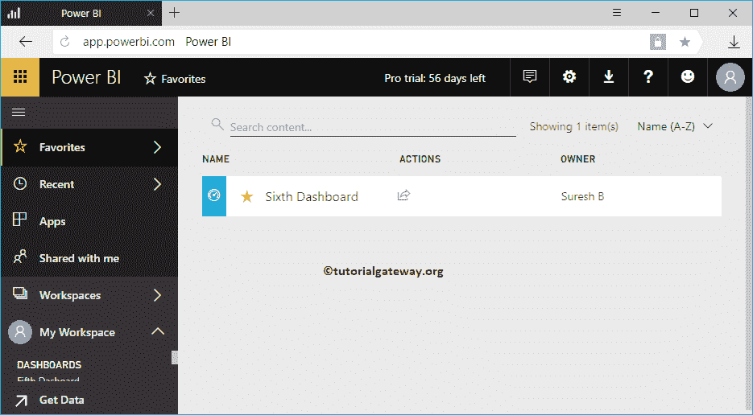

## 将仪表板添加到 PowerBI 收藏夹–第二种方法

这是一个简单的方法。请转到仪表板选项卡，并单击您想要添加为收藏夹的仪表板旁边的星形按钮。

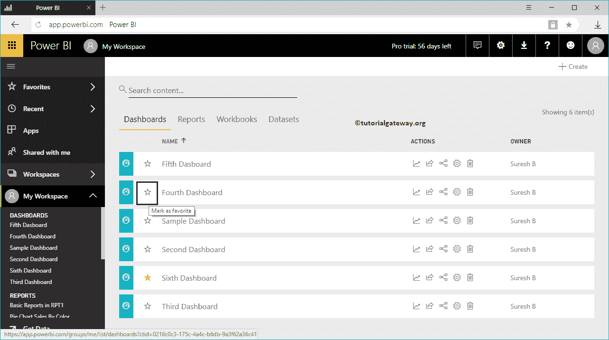

## 将报告添加到最佳商业智能收藏夹–第三种方法

请转到“报告”选项卡，并单击要添加为收藏夹的报告旁边的星号按钮。让我将报告 6 添加到收藏夹列表

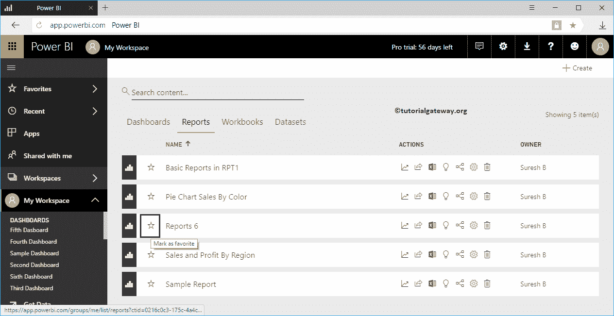

现在你可以将报告 6 视为最爱

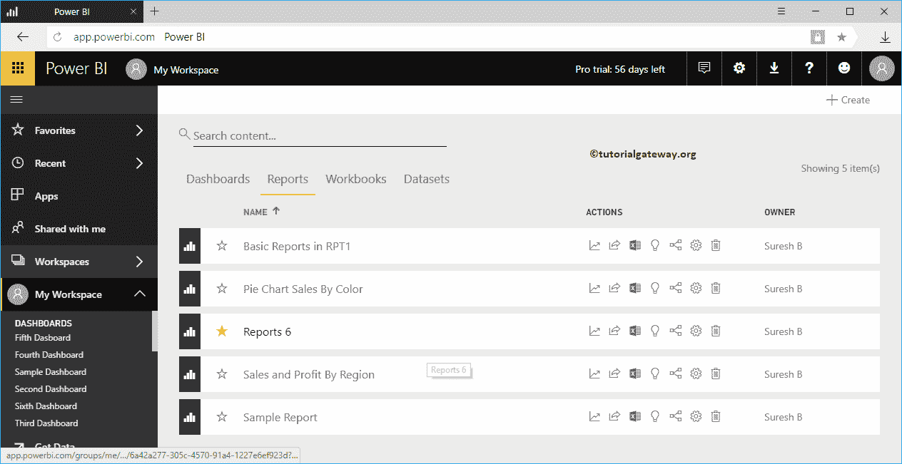