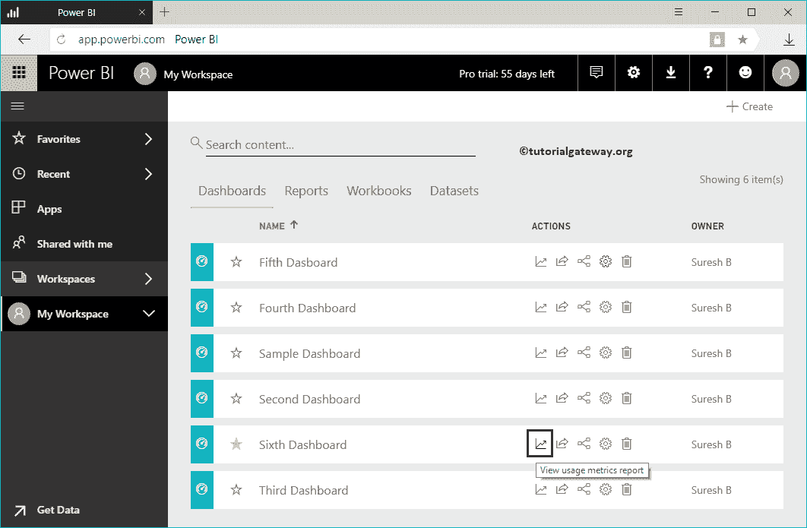

# 智能商务仪表板行动

> 原文：<https://www.tutorialgateway.org/power-bi-dashboard-actions/>

让我向您展示 Power BI 仪表板操作及其用途。在我们开始探索 power bi 中的仪表板操作列表之前，让我向您展示一下我的 Power BI 工作区中的现有仪表板。

要查看它们，请单击 Power BI 我的工作区，然后转到仪表板选项卡。从下面的截图中，可以看到有六个仪表盘。

## 智能商务仪表板行动

在本例中，我们使用第六个[仪表板](https://www.tutorialgateway.org/create-a-power-bi-dashboard/)来演示 Power BI 仪表板动作。

### 查看PowerBI仪表板的使用指标报告

此按钮可帮助您以报告格式查看 Power BI 仪表板的使用指标。让我按那个按钮。

从下面的截图中，您可以看到显示用户每天视图的报告，等等。您也可以[将这些报告固定到您的主](https://www.tutorialgateway.org/pin-report-to-power-bi-dashboard/) [Power BI](https://www.tutorialgateway.org/power-bi-tutorial/) 仪表盘上。

### 共享PowerBI仪表板

使用此按钮在整个组织中共享此仪表板。让我按这个按钮。

我正在单击共享按钮以打开以下窗口。建议大家参考[分享一个仪表盘](https://www.tutorialgateway.org/share-power-bi-dashboard/)的文章来了解选项。

### 查看智能商务仪表板的相关项目

此按钮可帮助您查看与此仪表板相关的项目(我们用于构建此仪表板)。

从下面的截图中，您可以看到使用两个数据集和三个不同的报告创建的仪表板。

### PowerBI仪表板设置

您可以使用此选项更改 Power BI 仪表板设置。建议大家在这些设置下参考[仪表盘设置的](https://www.tutorialgateway.org/power-bi-dashboard-settings/)篇。

### 删除智能商务仪表板

此按钮可帮助您从工作区中删除不需要的 Power BI 仪表板。我建议你参考[删除一个仪表盘](https://www.tutorialgateway.org/delete-power-bi-dashboard/)的文章。

