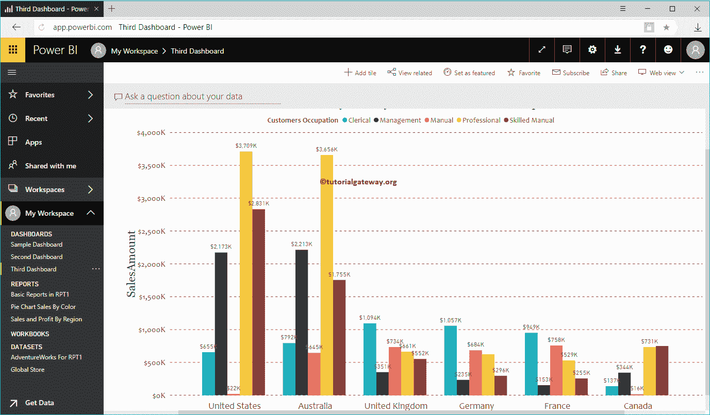

# 将报告添加到PowerBI仪表板

> 原文：<https://www.tutorialgateway.org/add-reports-to-power-bi-dashboard/>

如何通过一个实际的例子向 Power BI 仪表板添加报告？。在我们进入向 Power BI 仪表板添加报告的实际示例之前，让我向您展示我的工作区中可用的仪表板。

提示:我建议您参考[创建 Power BI 仪表盘](https://www.tutorialgateway.org/create-a-power-bi-dashboard/)文章，了解创建 [Power BI](https://www.tutorialgateway.org/power-bi-tutorial/) 仪表盘的相关步骤。

导航到工作区内的可用报告列表。

## 如何将报告添加到 PowerBI 仪表板

在本例中，我们将使用 RPT 1 报告中的基本报告。因此，请点击此报告查看报告中的可用页面。

现在，您可以看到所选报告中的页面。让我把这个[饼图](https://www.tutorialgateway.org/pie-chart-in-power-bi/)添加到我们的仪表盘上。

点击我们在下面截图中显示的 Pin Live 页面按钮。

单击该按钮将打开以下窗口。

1.  预览:显示所选报告的预览。
2.  现有仪表板:如果要将此报告添加到现有仪表板，则必须选择此选项。
3.  新仪表板:如果要为此报表创建新仪表板，则必须选择此选项。
4.  下拉菜单:使用此下拉框选择仪表板。

### 将报告添加到现有的 PowerBI 仪表板

在本例中，我们选择了现有的 [Power BI](https://www.tutorialgateway.org/power-bi-tutorial/) 仪表盘选项。接下来，我们选择了样本仪表盘

单击“实时锁定”按钮会将报告添加到示例仪表板中。让我打开示例仪表板。

同样，您可以将多个报告添加到单个仪表板中。

您可以使用鼠标光标来调整仪表板内报告的大小和位置。让我调整一下供你参考。

现在你可以看到所有可用的报告

### 将报告添加到新的 PowerBI 仪表板

在本例中，我们将向现有的 Power BI 仪表板添加报告。因此，我们选择了“新建仪表板”选项。

它用文本框替换下拉框。您必须在此文本框中提供您的新仪表板名称。

现在你可以在你的第三个仪表盘中看到[聚集柱形图](https://www.tutorialgateway.org/clustered-column-chart-in-power-bi/)。

让我导航到我的工作区->和仪表板选项卡以查看仪表板。如您所见，它正在显示我们之前创建的第三个仪表板。

