# 向 PowerBI 仪表板添加标题

> 原文：<https://www.tutorialgateway.org/add-title-to-power-bi-dashboard/>

如何通过示例为 Power BI 仪表盘添加标题？。在这个为PowerBI仪表板添加标题的演示中，我们将使用第六个仪表板。

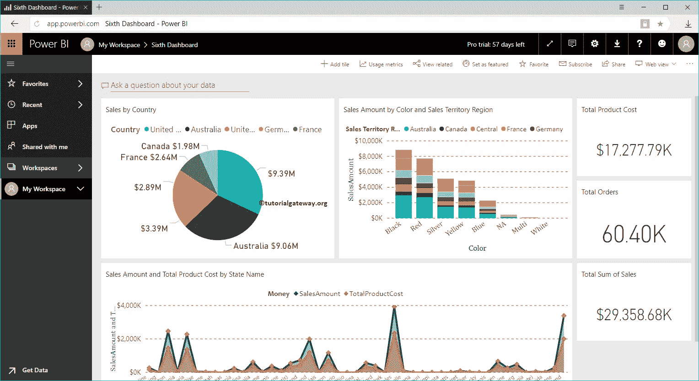

## 如何向 PowerBI 仪表板添加标题

要向现有的 Power BI 仪表板添加标题或任何文本，请单击添加平铺按钮。

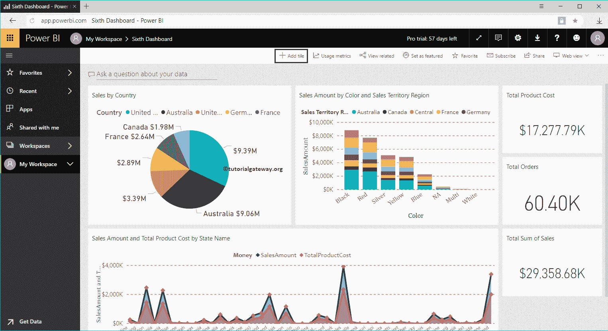

单击添加切片按钮打开以下窗口。在这里，您必须选择文本框。

此文本框可帮助您添加标题或任何解释仪表板的自定义文本。

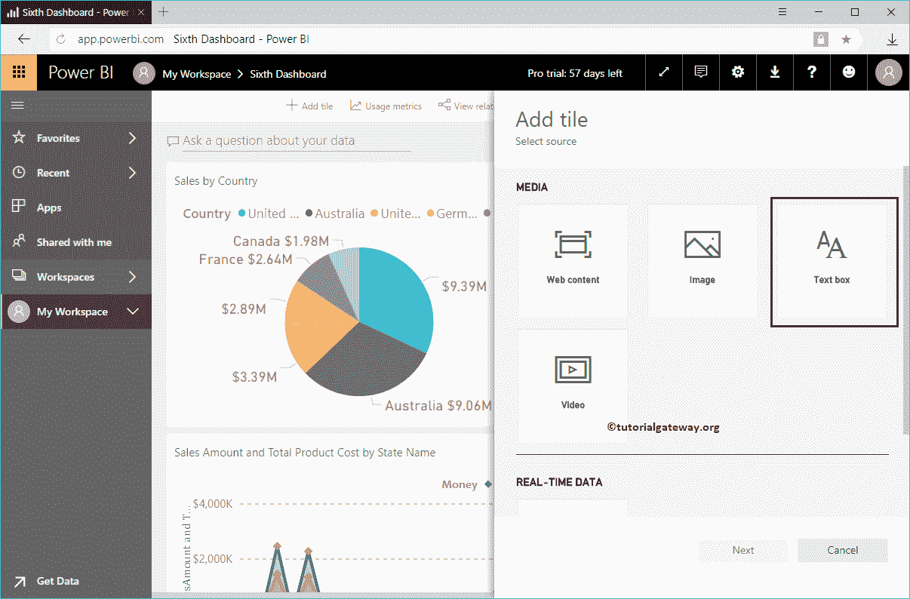

请选择文本框，点击【下一步】按钮

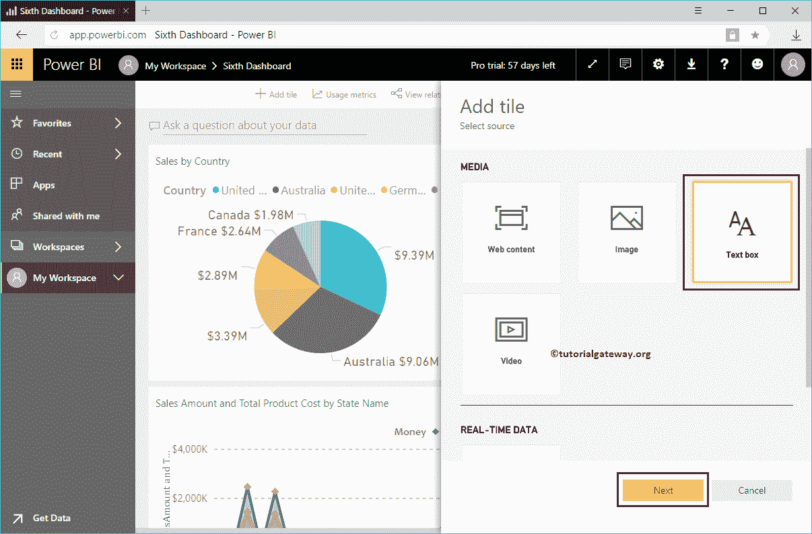

在 [Power BI](https://www.tutorialgateway.org/power-bi-tutorial/) 添加文本框平铺部分，我们有

*   显示标题和副标题:请勾选此选项以显示此文本框的标题和副标题。
*   标题:指定文本框的标题
*   副标题:请提供文本框副标题

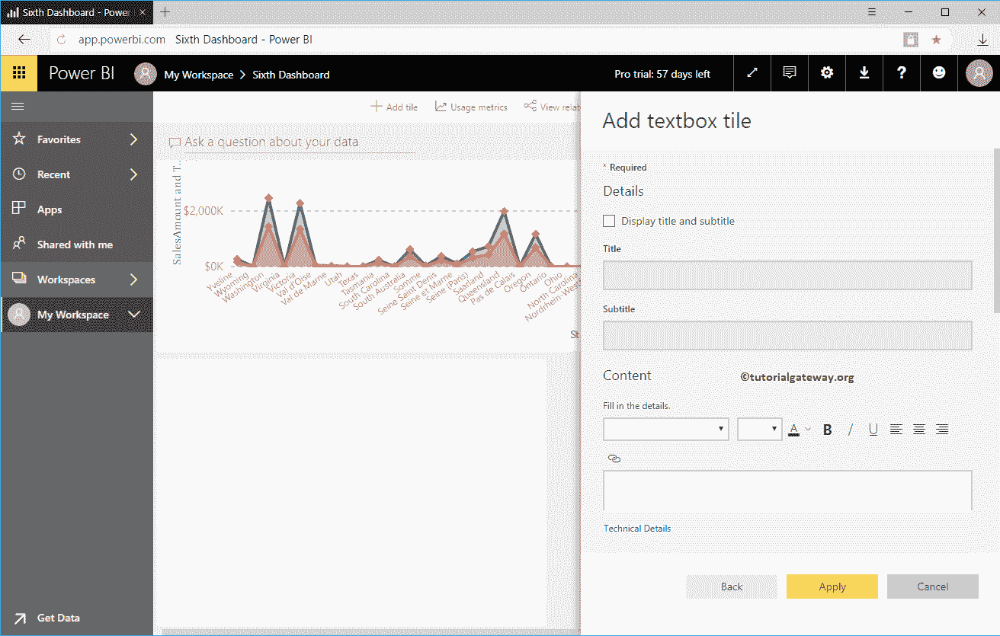

在内容部分，您可以编写自定义文本。我的意思是，写一些解释[仪表盘](https://www.tutorialgateway.org/create-a-power-bi-dashboard/)的段落，仪表盘标题等等。

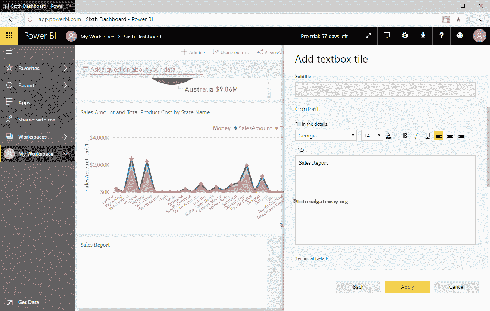

在本例中，我们希望向 Power BI 仪表板显示或添加标题。因此，我们添加了销售报告作为内容，并将字体改为 Cambria，字号改为 42，字体粗细改为粗体，颜色改为绿色。

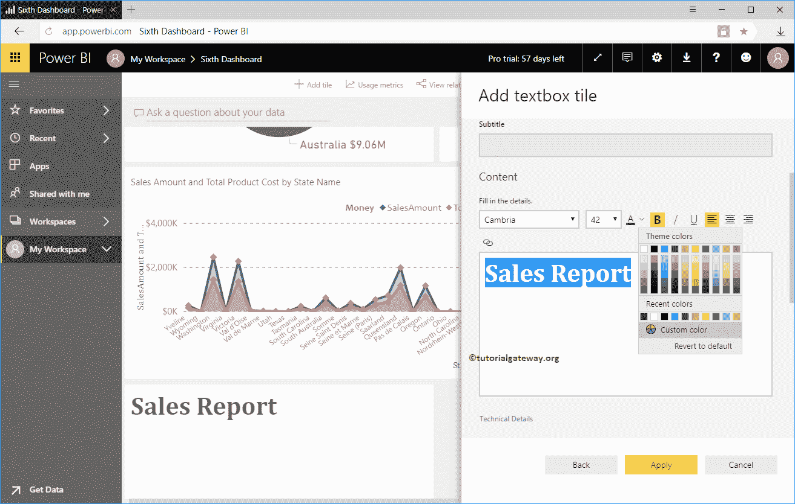

点击【应用】按钮

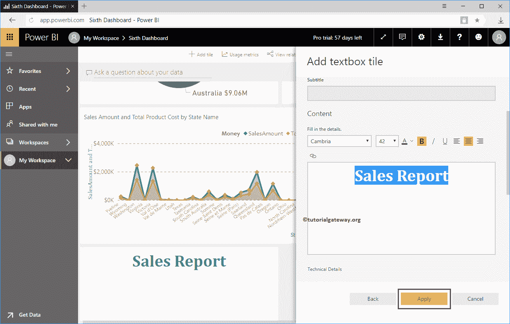

现在，您可以看到显示仪表板标题的新图块。

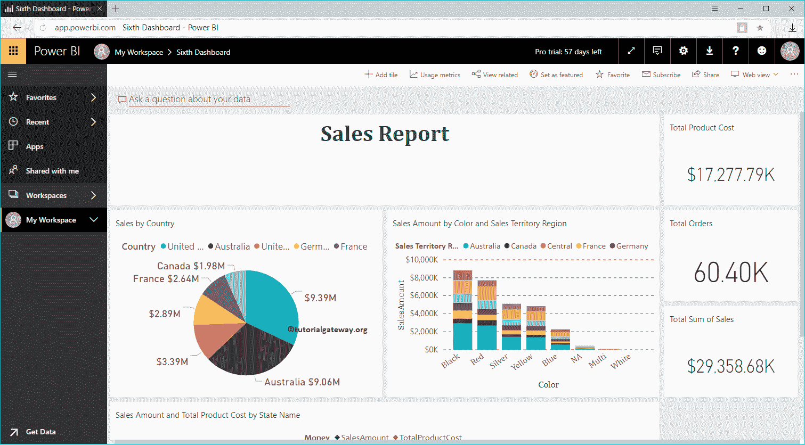

让我编辑标题块

从下面的截图中可以看到，我们添加了标题、副标题和示例内容。

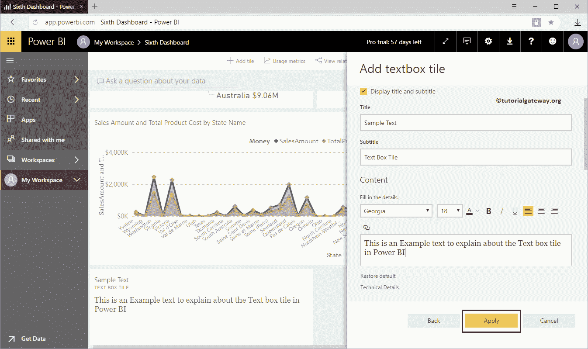

现在您可以看到带有标题、副标题的文本框，以及所选颜色和字体大小

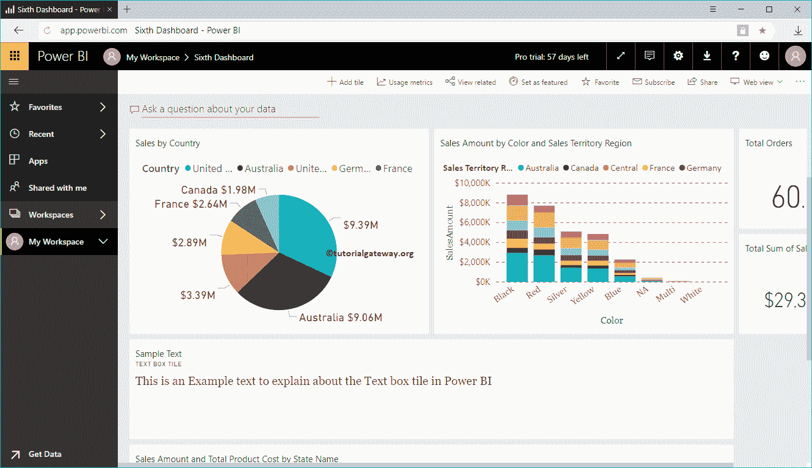

中的内容