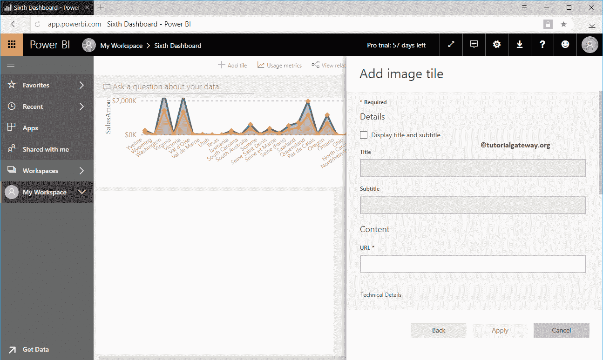
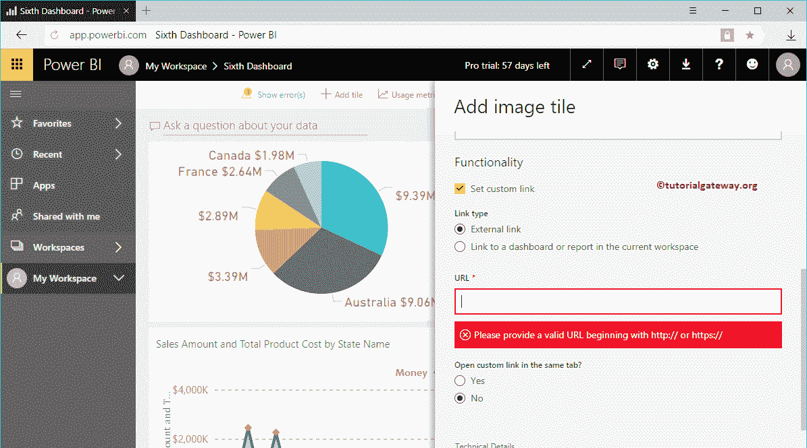

# 将图像添加到 PowerBI 仪表板

> 原文：<https://www.tutorialgateway.org/add-image-to-power-bi-dashboard/>

如何通过一个实际的例子将 Image 添加到 Power BI 仪表板中？。在这个将图像添加到 PowerBI 仪表板演示中，我们将使用第六个仪表板。

## 如何将图像添加到 PowerBI 仪表板

要向现有 Power BI 仪表板添加图像或徽标，请单击添加平铺按钮

单击添加切片按钮打开以下窗口。请选择“媒体”部分下的图像，然后单击“下一步”按钮。

在“将图像添加到 PowerBI 仪表盘”部分，我们有

*   显示标题和副标题:请勾选此选项以显示图像的标题和副标题。
*   标题:指定图像标题
*   副标题:请提供此图片的副标题
*   网址:请提供图片网址。

在这个 [Power BI](https://www.tutorialgateway.org/power-bi-tutorial/) 的例子中，我们想从我们的网站中插入[存储过程](https://www.tutorialgateway.org/stored-procedures-in-sql/)图像。所以，让我用同样的。

从下面的截图中，可以看到我们 Power BI 仪表盘

中的图片

从下面的截图中可以看到，我们还为这张图片添加了标题和副标题。

点击【应用】按钮

现在，您可以在我们的 Power BI 仪表板中看到带有平铺和字幕的图像。

让我编辑图像区块

从下面的截图中可以看到，它里面几乎没有更多的选项

*   设置自定义链接:请选中此选项以提供此图像的自定义链接。
*   外部链接:如果选择此选项，则必须指定图像网址
*   链接到当前工作区中的仪表板或报告:如果选择此选项，则必须从当前工作区中选择仪表板或报告
*   网址:请提供外部图像网址。

如果选中此设置自定义链接，则我们在上一步中指定的图像保持不变。但是，它会创建一个超链接，链接到另一个网址或另一个[仪表板](https://www.tutorialgateway.org/create-a-power-bi-dashboard/)或[报告](https://www.tutorialgateway.org/create-a-report-in-power-bi-workspace/)。

如果在当前工作区选项中选择链接到仪表板或报告，则可以使用下拉列表选择该[工作区](https://www.tutorialgateway.org/create-power-bi-workspace/)中可用的报告或仪表板。

出于将图像添加到 Power BI 仪表板演示的目的，我们选择了“链接到当前工作区中的仪表板或报告”选项，并选择了第四个仪表板。

从下面的截图中可以看到，我们的图像保持不变。但是，如果您点击图像，它会将您带到第四个仪表板。

让我点击一下

现在，您可以看到第四个仪表板。

这次，我们选择了外部链接，并添加了我们的 [POWER BI](https://www.tutorialgateway.org/power-bi-tutorial/) 链接作为外部链接

从下面的截图可以看出，我们的形象没有变化。但是，如果你点击图片，它会打开我们的网页

可以看到

的网页