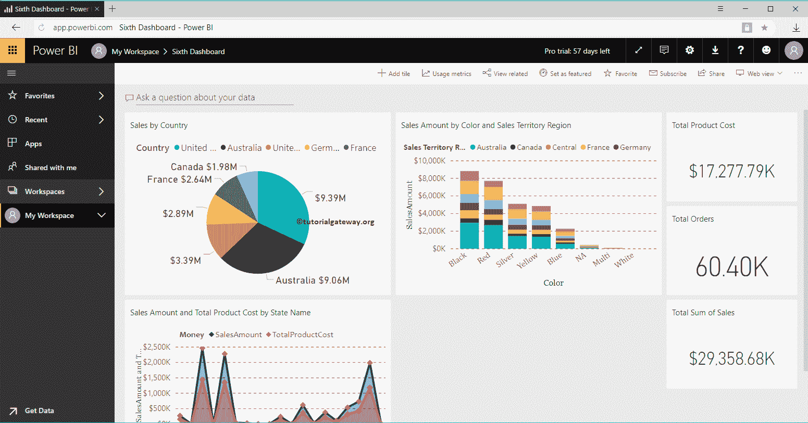
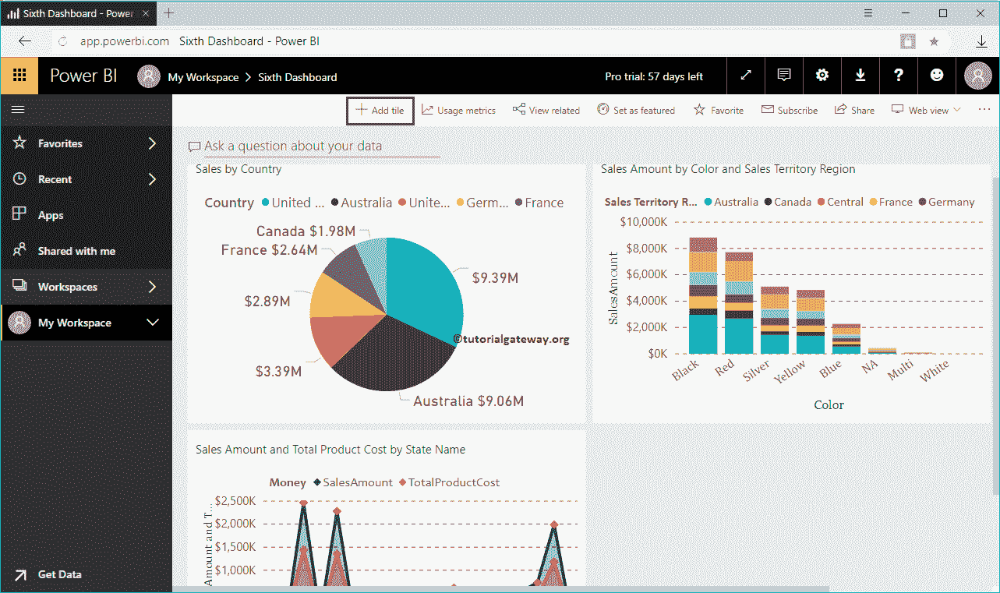
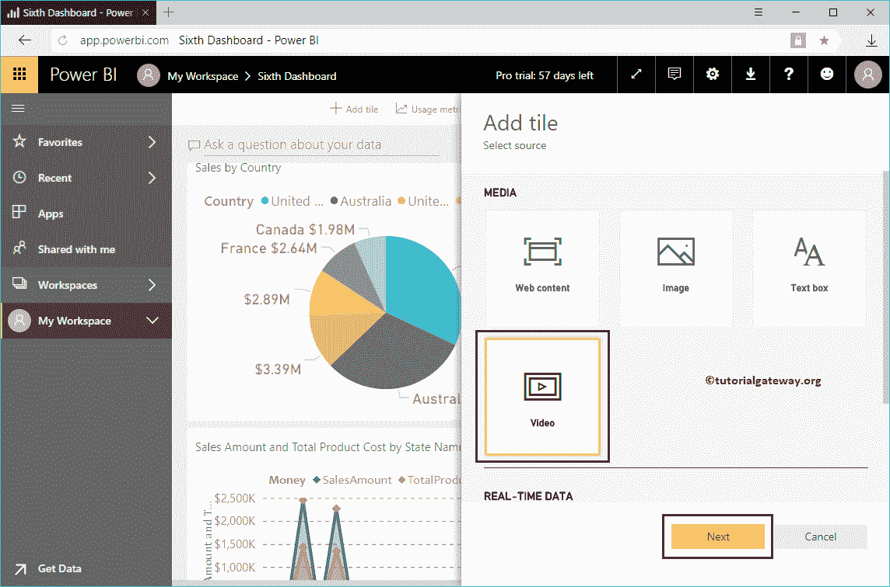
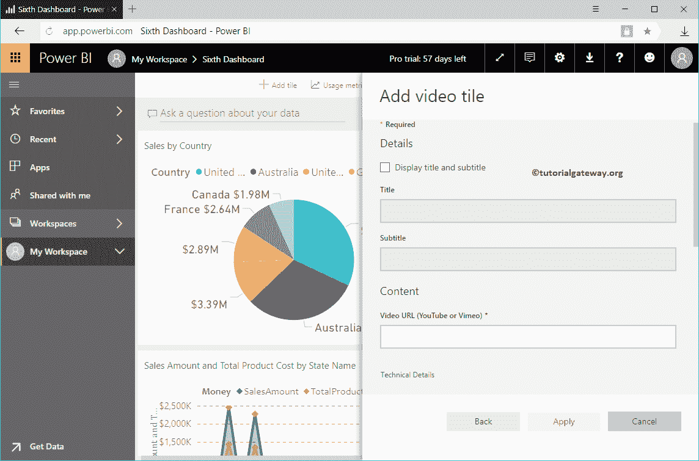
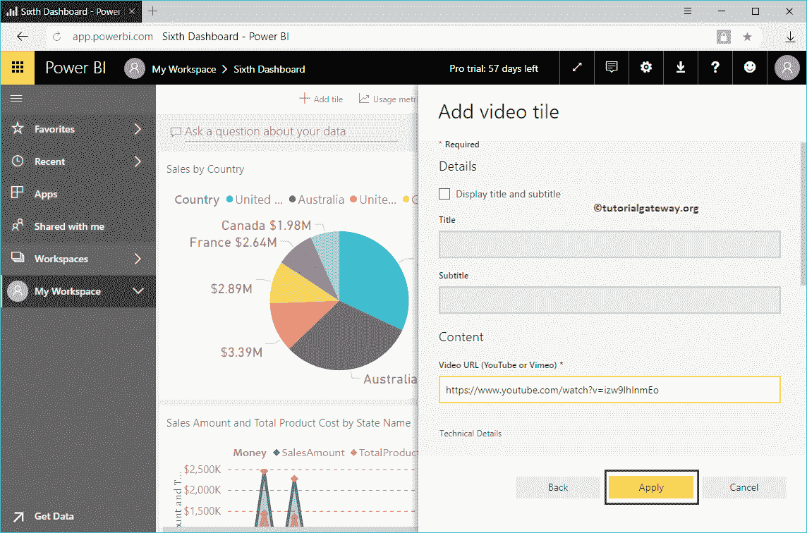
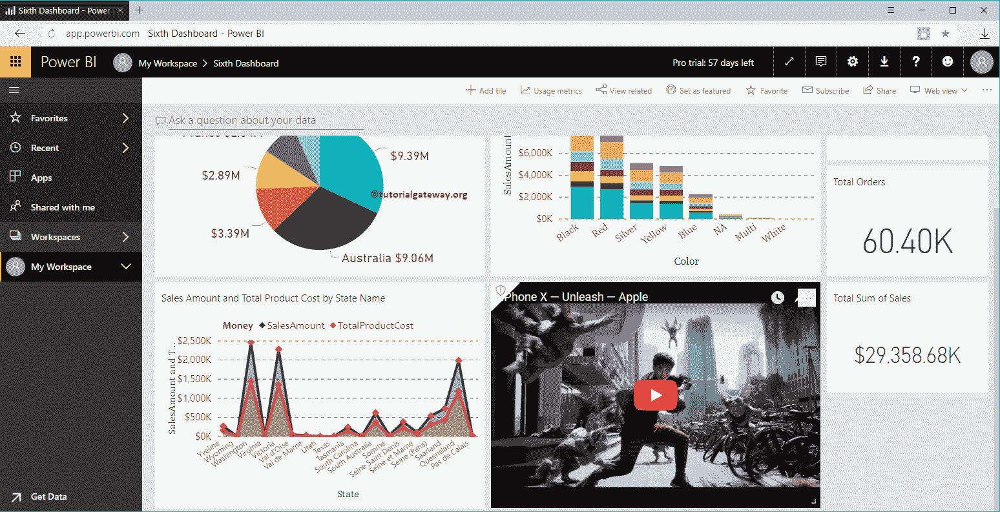
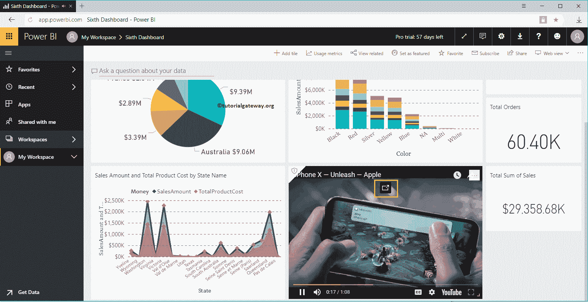
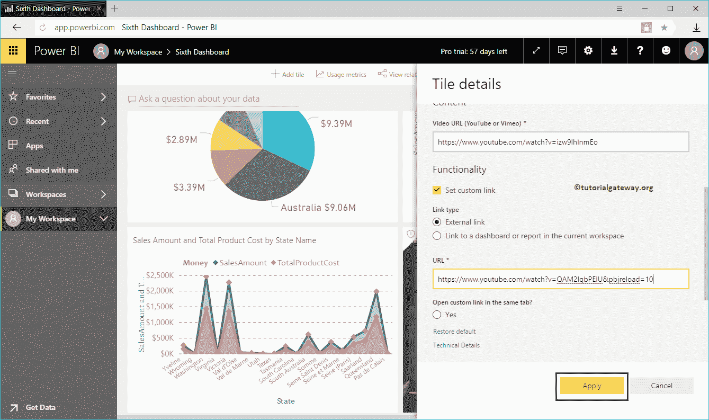
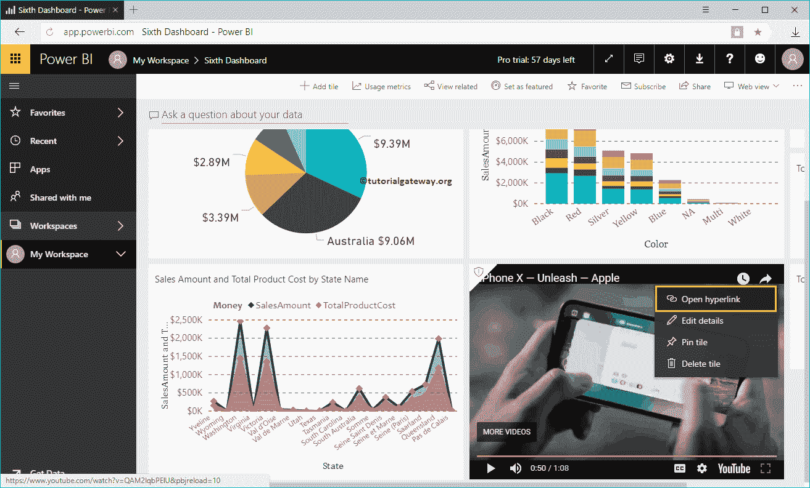

# 将视频添加到PowerBI仪表板

> 原文：<https://www.tutorialgateway.org/add-video-to-power-bi-dashboard/>

如何通过一个实际例子将视频添加到 Power BI 仪表盘？。在这个将视频添加到智能仪表板的演示中，我们将把一个 YouTube 视频插入到下面展示的第六个仪表板中。

## 如何将视频添加到PowerBI仪表板

要将 Vimeo 或 YouTube 视频添加到现有 Power BI 仪表盘，请点击添加平铺按钮

单击添加切片按钮打开以下窗口。请选择媒体部分下的视频，然后单击下一步按钮。

在“将视频添加到 PowerBI 仪表盘”部分，我们有

*   显示标题和副标题:请勾选此选项以显示视频标题和副标题。
*   标题:指定视频标题
*   字幕:提供这个视频的字幕
*   视频网址:请提供视频网址。请记住，它只接受 YouTube 或 Vimeo 视频

在这个 [Power BI](https://www.tutorialgateway.org/power-bi-tutorial/) 的例子中，我们想要在 Power BI 仪表盘中插入或添加一个 YouTube 视频。所以，我们添加了 iPhone X 视频。单击应用按钮。

现在，您可以在我们的 Power BI 仪表板中看到视频。

点击那个标记的部分，视频会弹出仪表盘，在左下角

播放

让我编辑视频切片

从下面的截图中可以看到，它里面几乎没有更多的选项

*   设置自定义链接:请选中此选项以提供此视频的自定义链接。
*   外部链接:如果选择此选项，您必须指定视频网址
*   链接到当前工作区中的仪表板或报告:如果选择此选项，则必须从当前工作区中选择仪表板或报告
*   网址:请提供外部视频网址。

如果您选中此设置自定义链接，那么我们在上一步中指定的 YouTube 视频将保持不变。但是，它会创建一个超链接，链接到另一个视频或另一个仪表板或报表。

让我添加另一个视频作为外部链接

从下面的截图可以看到，我们的 iPhone X 视频保持不变。但是，如果您单击右上角的…它会显示“打开超链接”选项。

选择该选项将打开另一个视频的 YouTube。