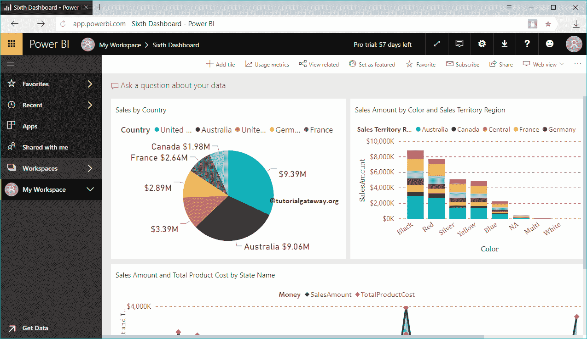

# 将网络内容添加到智能商务仪表板

> 原文：<https://www.tutorialgateway.org/add-web-content-to-power-bi-dashboard/>

让我用一个实际的例子向您展示如何向 Power BI 仪表板添加 Web 内容。对于这个将网络内容添加到PowerBI仪表板的演示，我们将在下面展示的第六个仪表板中插入定制的 HTML 代码。

## 如何将网页内容添加到智能商务仪表板

要向 Power BI 仪表盘添加自定义 HTML 代码或 Web 内容，请点击【添加平铺】按钮

单击添加切片按钮打开以下窗口。请选择媒体部分下的网页内容，点击【下一步】按钮

在“将网络内容添加到PowerBI仪表板”部分，我们有

*   显示标题和副标题:请选中此选项以显示网页内容标题和副标题。
*   标题:指定网站内容标题
*   副标题:请提供此网页内容的副标题
*   嵌入代码:您可以在此 [Power BI](https://www.tutorialgateway.org/power-bi-tutorial/) 文本框中编写您的自定义代码

从下面的截图中可以看到，我们添加了标题、副标题，并添加了 HTML 代码(一个标题，一个段落)。接下来，单击应用按钮。

现在，您可以在我们的仪表板中看到 HTML 页面。

让我编辑网页内容区块

从下面的截图中可以看到，它里面几乎没有更多的选项

*   设置自定义链接:请选中此选项以提供指向此网站内容的自定义链接。
*   外部链接:如果选择此选项，则必须指定外部网址
*   链接到当前工作区中的仪表板或报告:如果选择此选项，则必须从当前工作区中选择仪表板或报告
*   网址:请提供外部视频网址。

如果选中此设置自定义链接，那么我们在上一步中指定的网页内容(HTML 代码)将保持不变。但是，它会创建一个超链接，链接到另一个网页、另一个仪表板或报表。

让我添加我们的 [POWER BI](https://www.tutorialgateway.org/power-bi-tutorial/) 链接作为

外部链接

从下面的截图中可以看到，我们的自定义 HTML 页面保持不变。但是，如果您单击右上角的…它会向您显示“打开超链接”选项。将鼠标悬停在该选项上可显示目标链接。

选择该选项将打开我们在向 Power BI 仪表板添加网页内容时提供的自定义链接。

这次我们选择了链接到当前工作区的仪表板或报告选项，并选择了第四个仪表板

从下面的截图中可以看到，如果您点击 Power BI 网站内容右上角的…按钮，它会向您显示“打开超链接”选项。让我点击这个链接

现在，您可以看到第四个仪表板。

