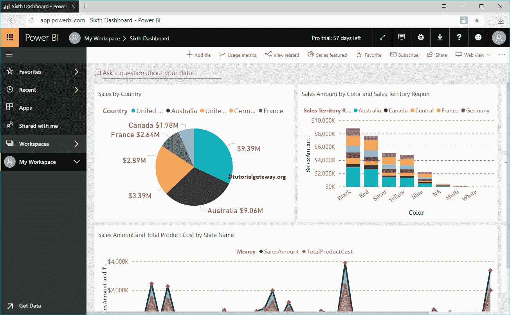
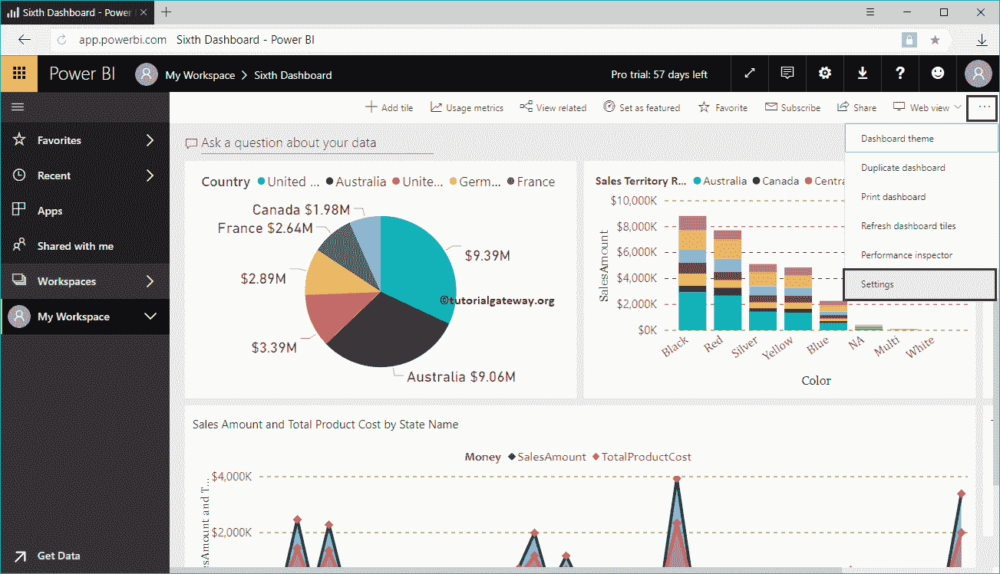
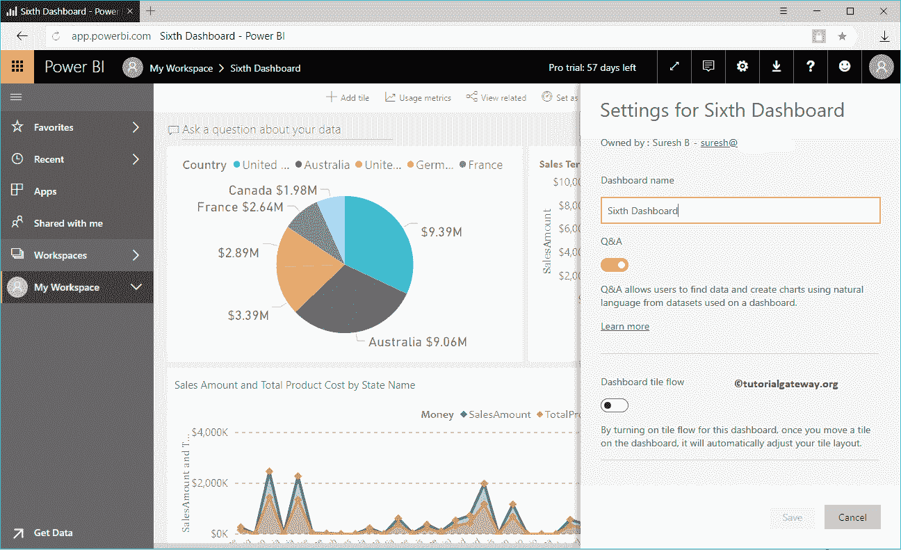
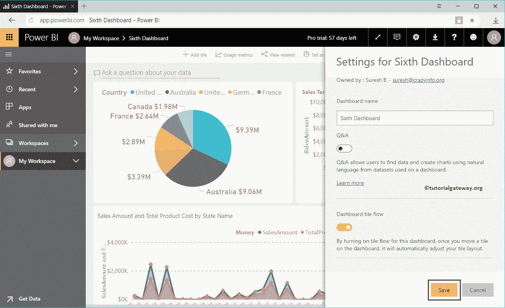
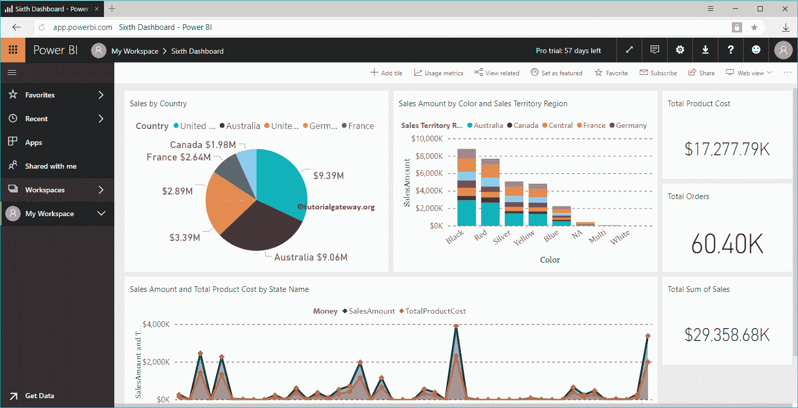

# PowerBI仪表板设置

> 原文：<https://www.tutorialgateway.org/power-bi-dashboard-settings/>

在本文中，我们向您展示了可供您使用的 Power BI 仪表板设置列表。在本演示中，我们将使用我的 Power BI 工作区中提供的第六个仪表板。

## PowerBI仪表板设置

要更改此 Power BI 仪表板设置，请单击右上角的…按钮，如下所示。接下来，从上下文菜单中选择设置选项。

选择设置选项打开仪表板设置窗口。

*   仪表板名称:您可以更改仪表板名称。
*   问答:它允许用户对数据提出问题。使用自然语言生成完整的视觉效果非常有用。
*   仪表板图块流:如果启用此选项，则 [Power BI](https://www.tutorialgateway.org/power-bi-tutorial/) 仪表板会自动调整图块的位置。

让我将问答切换到关闭，并将仪表板平铺流切换到打开

从下面的截图可以看到，问一个关于你从[仪表盘](https://www.tutorialgateway.org/power-bi-dashboard-introduction/)删除的数据的问题。注意，我无法捕获切片流。

相信我。管用

