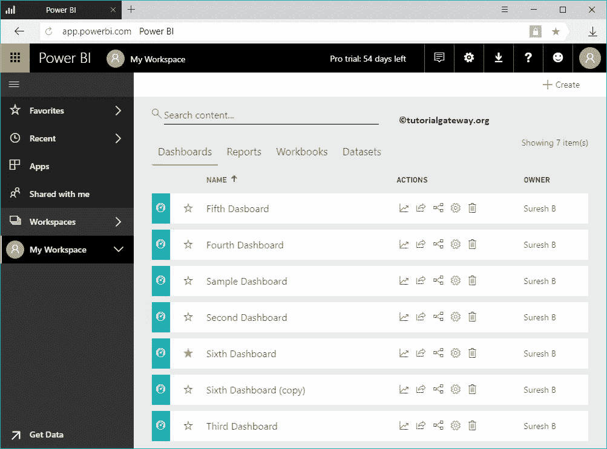
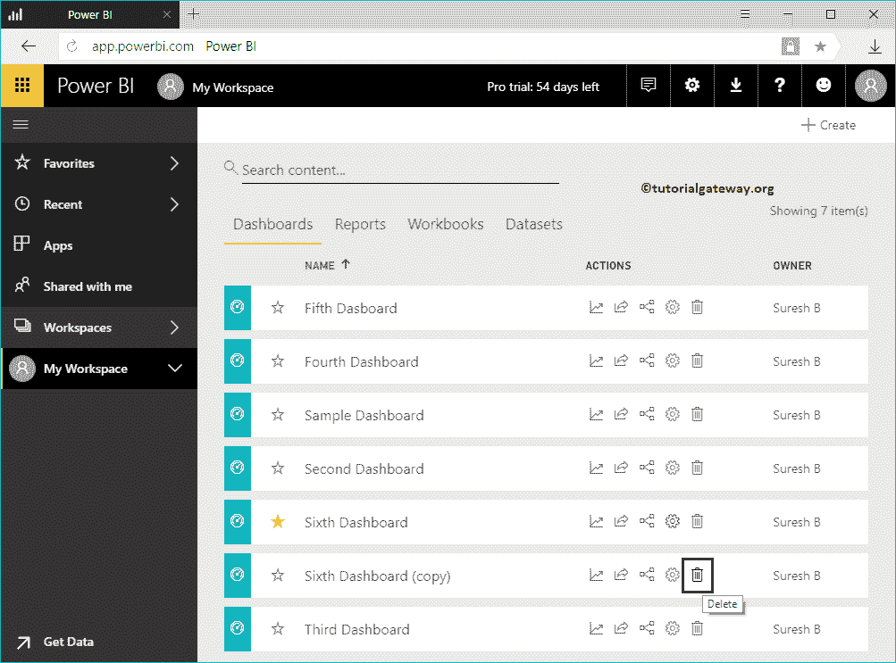
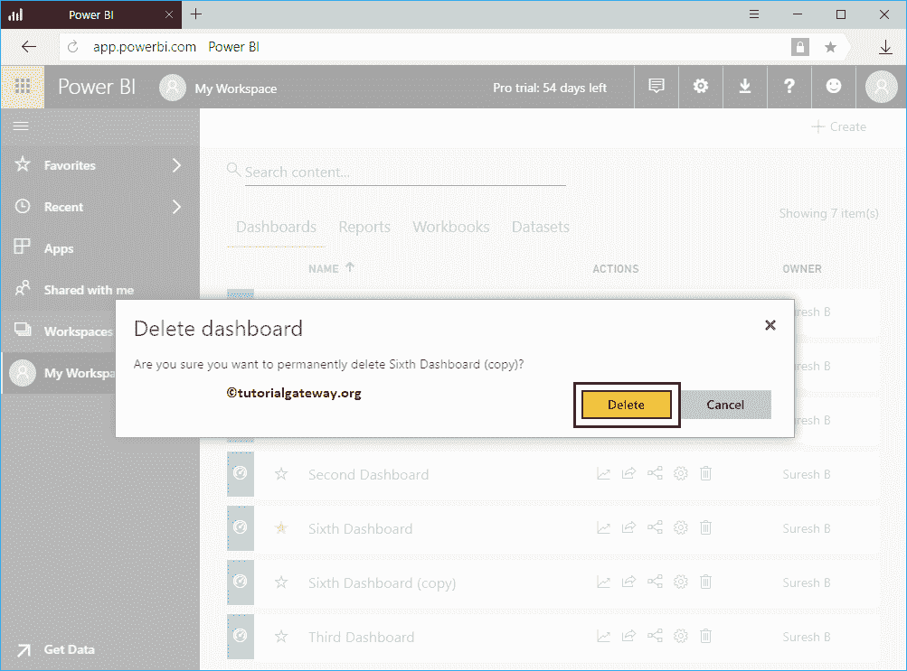
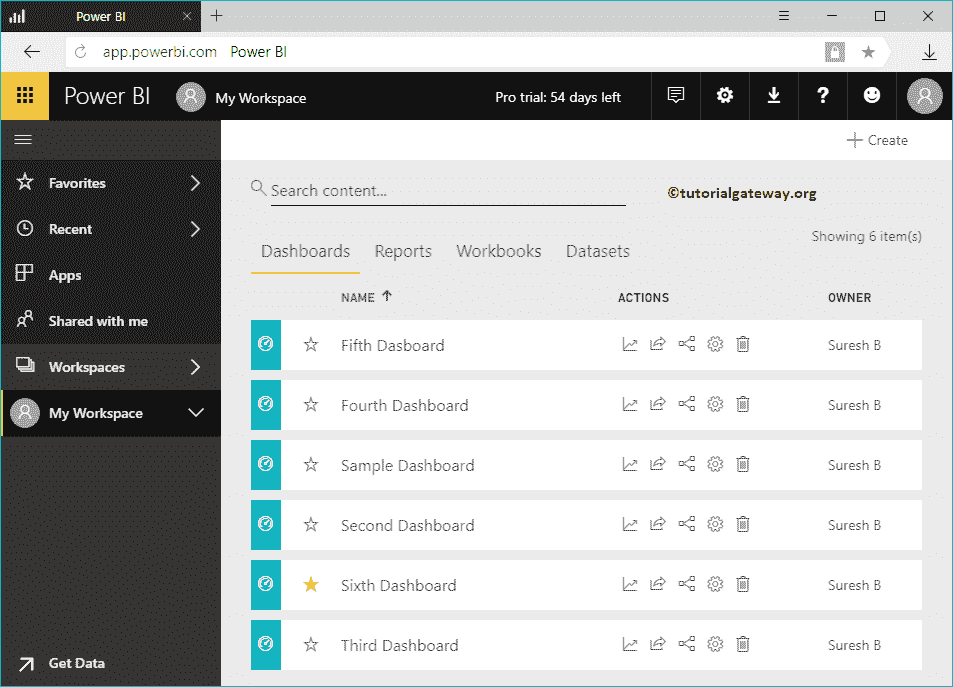

# 删除PowerBI仪表板

> 原文：<https://www.tutorialgateway.org/delete-power-bi-dashboard/>

让我用一个实际例子向您展示删除 Power BI 仪表板的分步方法。在我们开始删除仪表板之前，让我向您展示一下我的 Power BI 工作区中的现有仪表板。要查看它们，请单击 Power BI 我的工作区，然后转到仪表板选项卡。从下面的截图中，可以看到有七个仪表盘。

在本例中，我们将删除第六个仪表板(副本)。它只是第六个仪表板的副本。

## 如何删除 PowerBI 仪表板

要删除仪表板，请单击操作部分下的删除按钮，如下所示。

单击删除按钮显示确认框。请选择删除按钮以确认删除。

从下面 [Power BI](https://www.tutorialgateway.org/power-bi-tutorial/) 截图可以看到，我们的仪表盘列表中没有第六个仪表盘副本。

