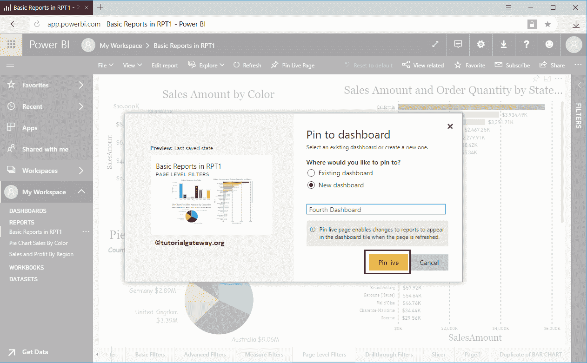
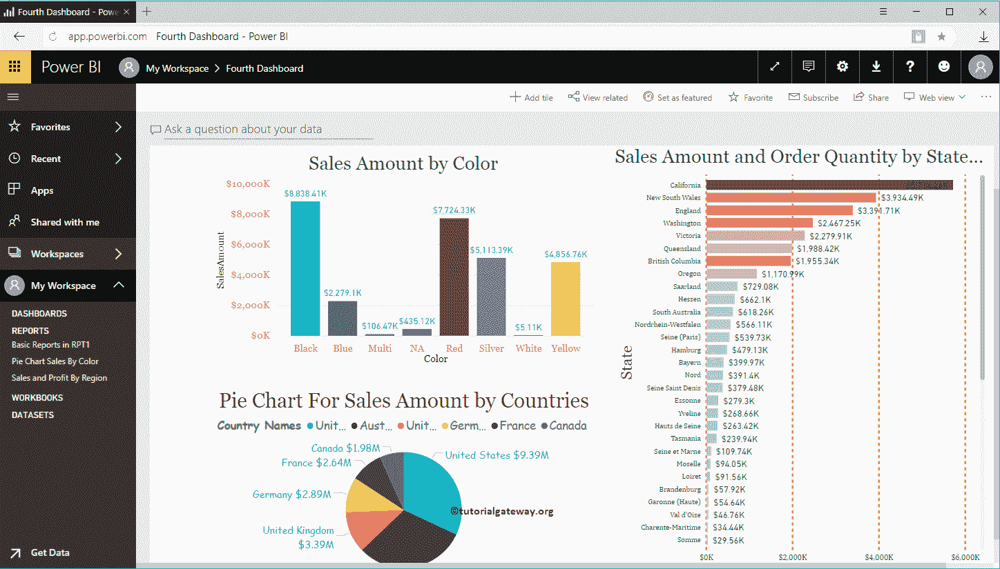

# PowerBI仪表板的引脚报告

> 原文：<https://www.tutorialgateway.org/pin-report-to-power-bi-dashboard/>

在本文中，我们通过一个实际示例向您展示了将报告固定到 Power BI 仪表板的分步方法。在我们开始将报告固定到 Power BI 仪表板之前，让我向您展示我在此示例中使用的页面。

从下面的截图可以看到，这是我们[从桌面](https://www.tutorialgateway.org/publish-power-bi-desktop-reports/)发布的报告。为了演示这个将报告固定到仪表板的示例，我们使用了[页面级过滤器](https://www.tutorialgateway.org/power-bi-page-level-filters/)页面。

## 引脚报告至PowerBI 仪表板方法 1

这种方法锁定了该页面上所有可用的视觉效果。我指的是[柱形图](https://www.tutorialgateway.org/column-chart-in-power-bi/)[饼图](https://www.tutorialgateway.org/pie-chart-in-power-bi/)[条形图](https://www.tutorialgateway.org/power-bi-bar-chart/)。

要将整个页面锁定到 [Power BI](https://www.tutorialgateway.org/power-bi-tutorial/) 仪表盘，点击我们在下面截图

中显示的锁定直播页面按钮

单击“锁定实时页面”按钮将打开以下窗口。

1.  现有仪表板:选择此选项可将此报告添加到现有仪表板。
2.  新仪表板:选择此选项可为此报告创建新仪表板。

让我选择新建仪表板选项，接下来，我们将仪表板名称指定为第四个仪表板

在第四个仪表板中，您可以在我们的仪表板中看到整个页面。

## PowerBI 仪表板方法 2 的引脚报告

这种方法将锁定此页面上可用的单个视觉效果。

为了锁定任何单个图表，将鼠标悬停在该图表上可以显示锁定可视按钮，我们在下面的截图中显示了该按钮。

点击该按钮打开以下窗口。这一次，我们还选择了新的仪表板，并指定名称为第五个仪表板。

在第五个仪表板中，您可以看到我们之前固定的柱形图。

