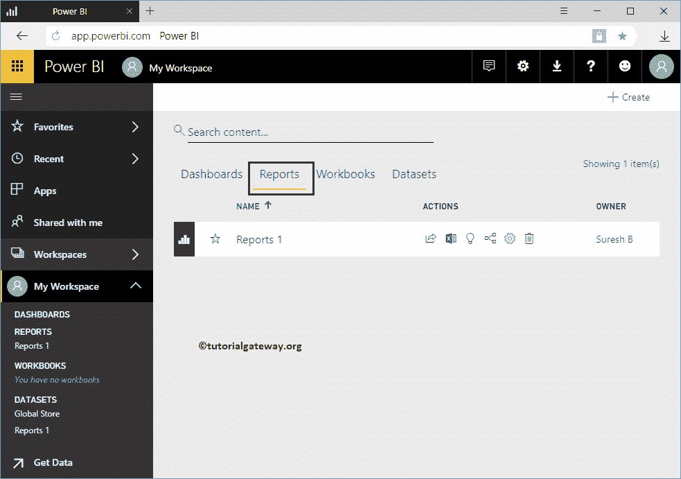
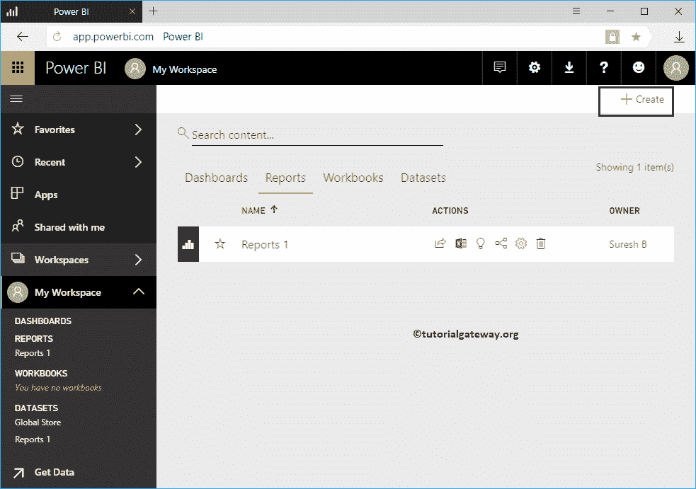
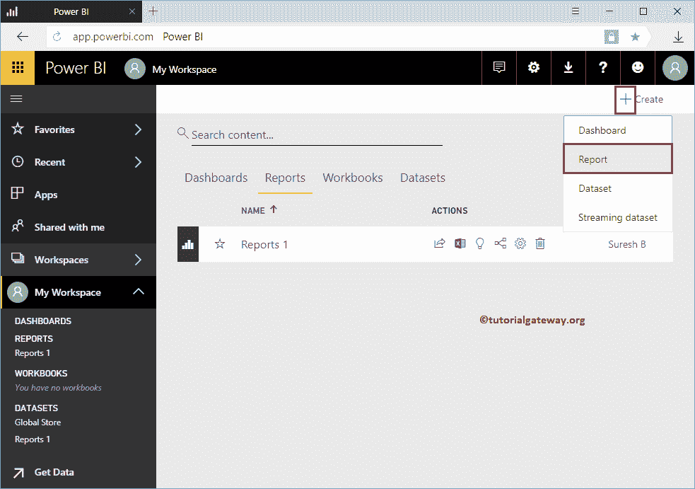
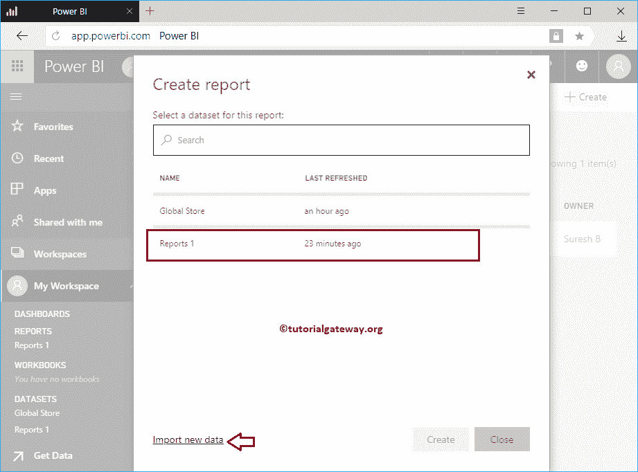
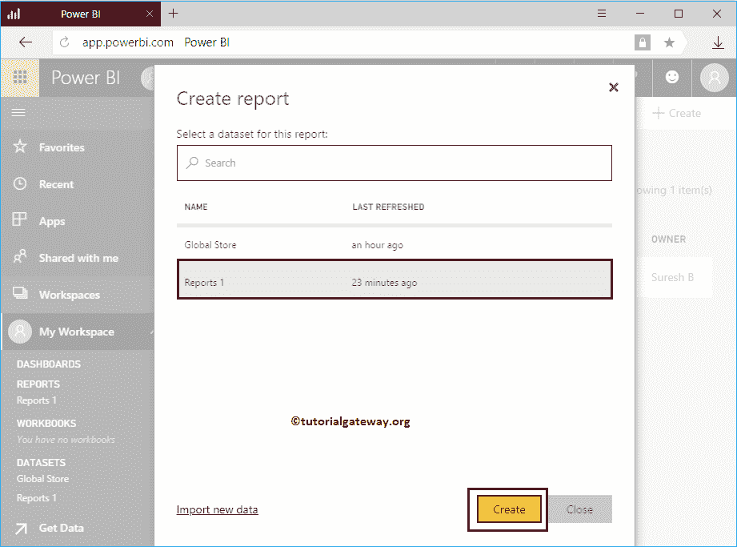
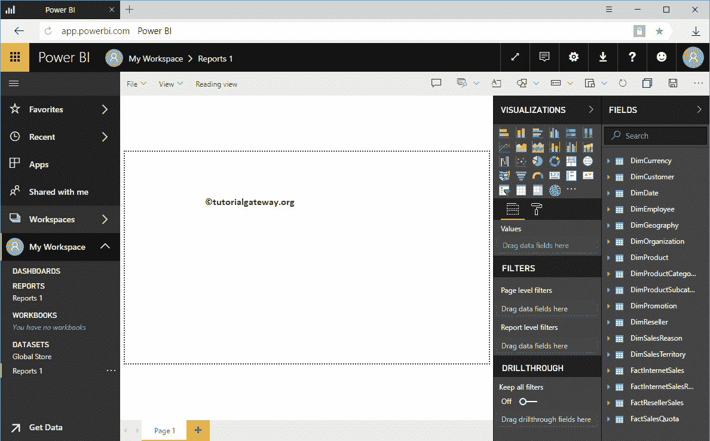
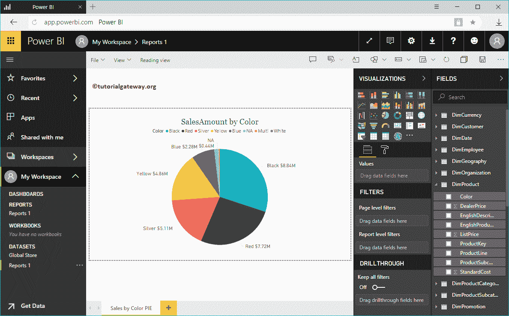
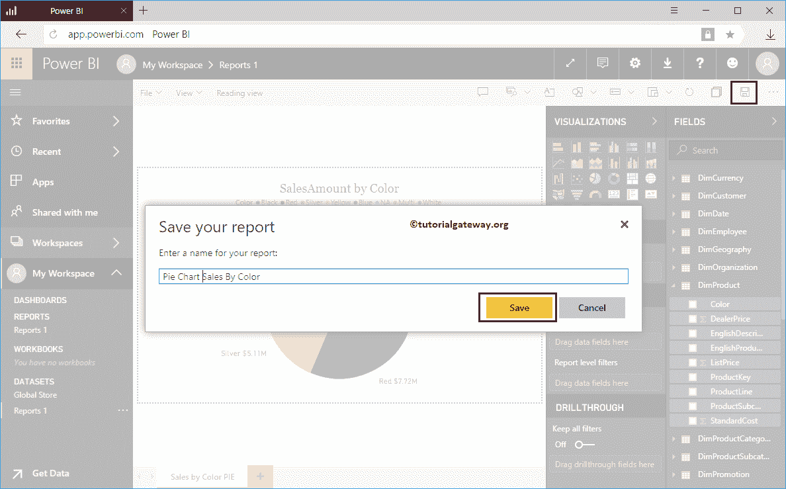
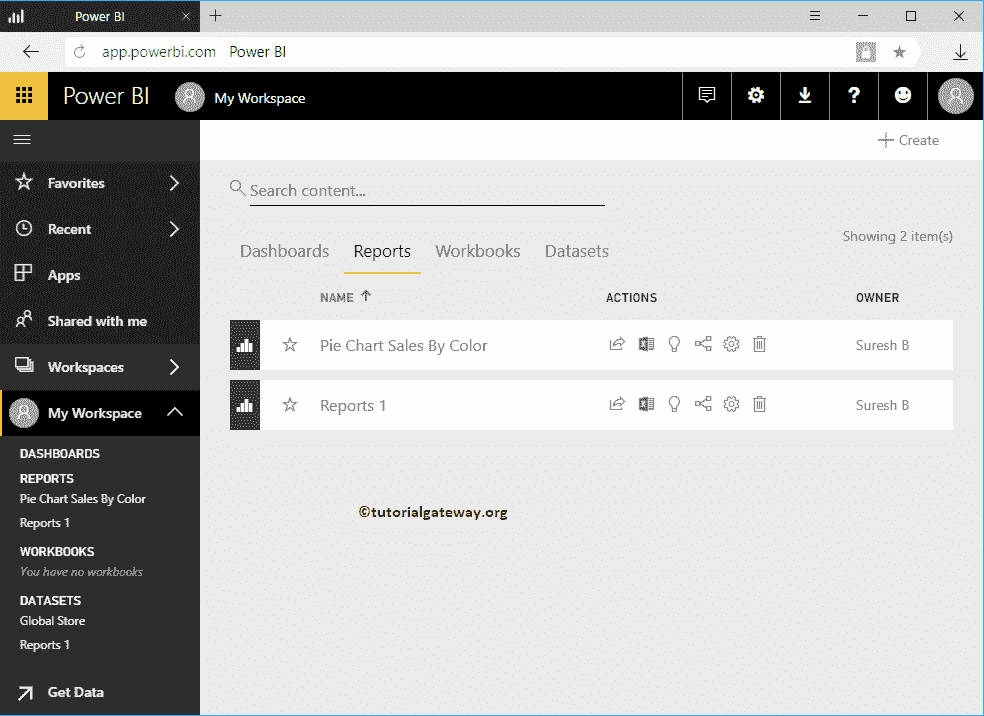

# 在 PowerBI 工作区中创建报告

> 原文：<https://www.tutorialgateway.org/create-a-report-in-power-bi-workspace/>

如何在 Power BI Workspace 中用一个实例创建报告？。在我们开始创建报告之前，让我向您展示一下我的 Power BI 工作区中的现有报告。

要查看它们，请单击 Power BI 我的工作区，然后转到报告选项卡。从下面的截图可以看到，目前我的工作区只有一个报告。

## 如何在 Power BI 工作区中创建报告

您必须使用右上角的+ Create 按钮在工作区内创建报告。

要创建新的 [Power BI](https://www.tutorialgateway.org/power-bi-tutorial/) 报告，请单击创建按钮，然后从上下文菜单中选择报告选项。

选择报告选项将打开一个名为创建报告的新窗口。在这里，您必须选择要用于此报告的数据集。

使用导入新数据导入或创建新数据集

现在，我们选择报告 1 数据集

单击创建按钮将打开以下窗口。在这里，您可以创建自己的视觉效果。

为了演示在工作区中创建报告，我们创建了一个[饼图](https://www.tutorialgateway.org/pie-chart-in-power-bi/)。创建完报告后，点击

保存按钮

单击保存按钮将打开一个名为保存您的报告的新窗口。请提供报告名称

现在，您可以看到我们在“报告”选项卡

中创建的报告