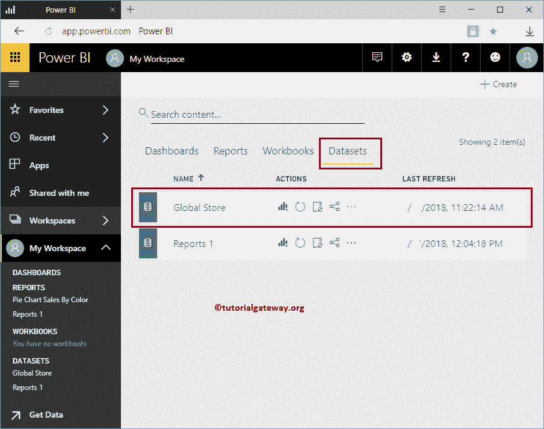
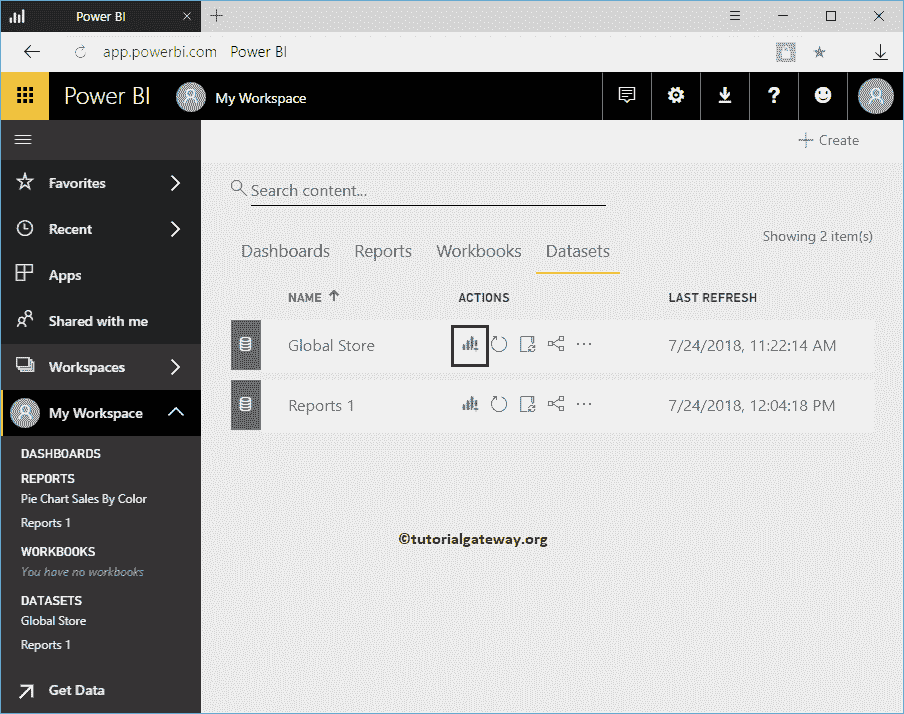
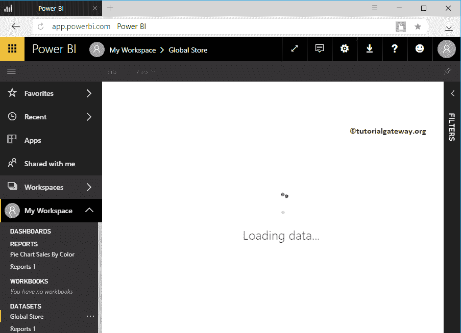
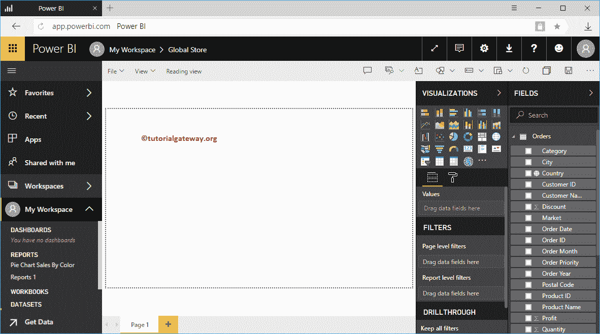
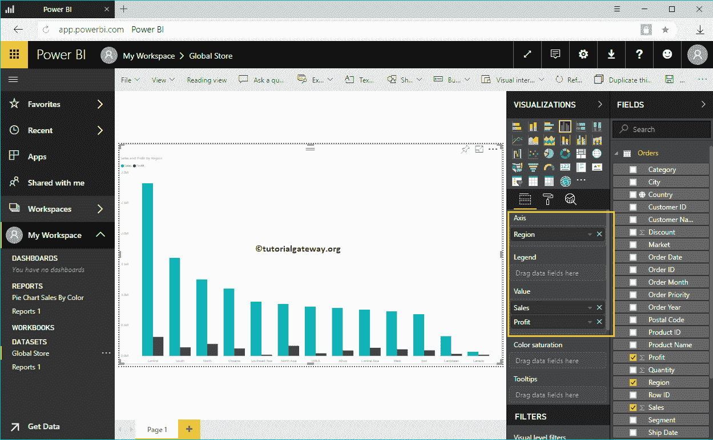
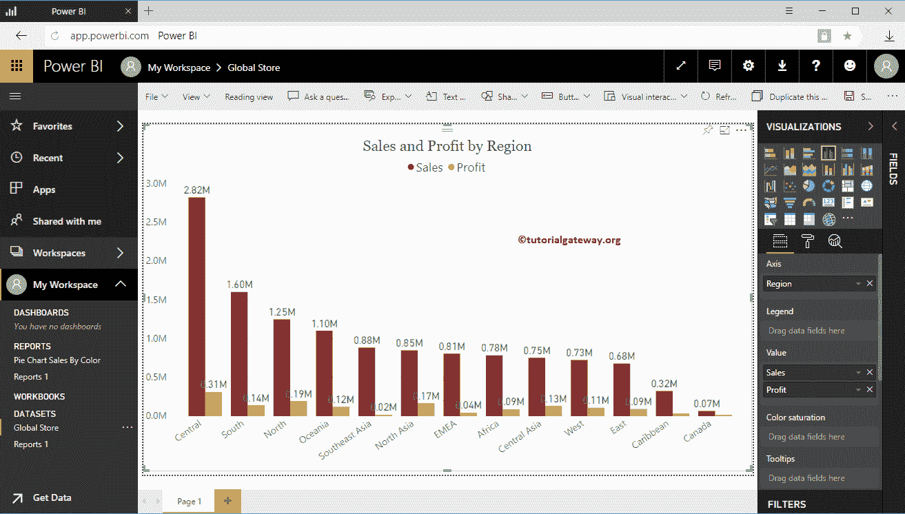
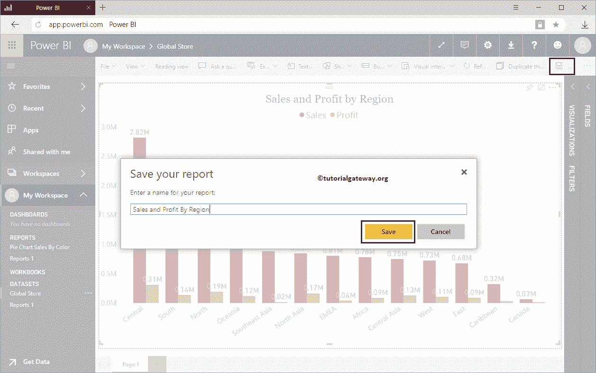
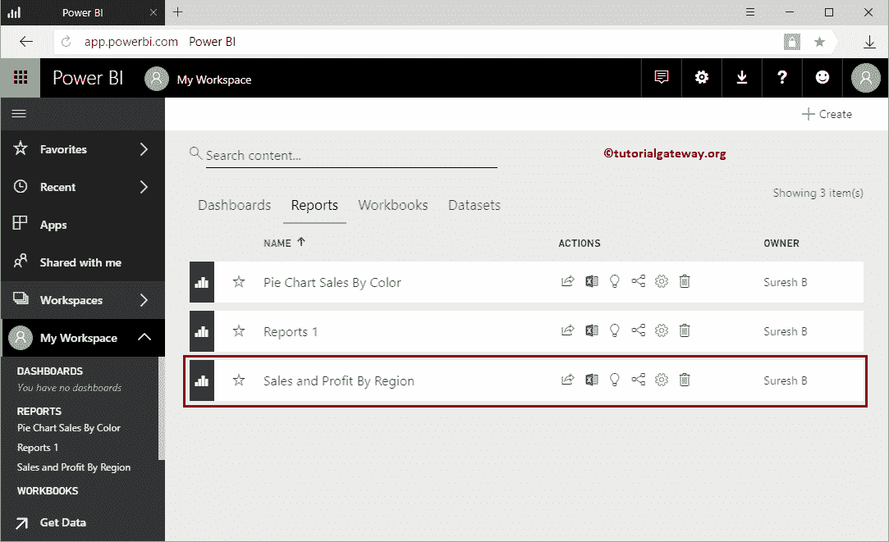

# 在 PowerBI 工作区中使用 Excel 数据创建报告

> 原文：<https://www.tutorialgateway.org/create-a-report-using-excel-data-in-power-bi-workspace/>

如何在 Power BI Workspace 中使用 Excel 数据创建报告，并给出一个实例？。这是我们在上一篇文章中导入的 Excel 工作簿。

在我们开始使用 excel 文件创建报告之前，让我向您展示一下我的 Power BI 工作区中的数据集。要查看相同内容，请点击 [Power BI](https://www.tutorialgateway.org/power-bi-tutorial/) 我的工作区，然后转到数据集选项卡。在这个例子中，我们使用了全局存储 excel 数据集，我建议您参考[上传 Excel 文件](https://www.tutorialgateway.org/upload-excel-files-to-power-bi-dashboard/)一文。

## 如何在 Power BI 工作区中使用 Excel 数据创建报告

点击 Excel 数据集

旁边的图表(或可视化)按钮

请等到数据加载

单击创建按钮将打开以下窗口。在这里，您可以创建自己的视觉效果。

出于演示目的，我们创建了一个[聚类柱形图](https://www.tutorialgateway.org/clustered-column-chart-in-power-bi/)。

让我快速[格式化](https://www.tutorialgateway.org/format-power-bi-column-chart/)到聚集柱形图。创建完报告后，点击

保存按钮

单击保存按钮将打开保存您的报告窗口。请提供报告名称。

在“报告”选项卡中，您可以看到我们创建的报告。

