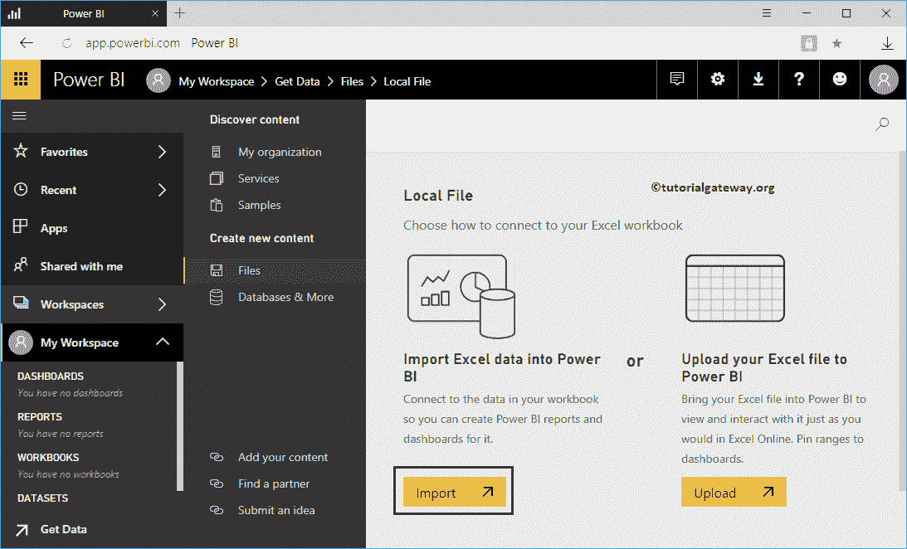

# 将 Excel 文件上传到 PowerBI 仪表板

> 原文：<https://www.tutorialgateway.org/upload-excel-files-to-power-bi-dashboard/>

如何用实例将 Excel 文件上传到 Power BI 仪表盘？。为了演示将 excel 文件上传到 Power BI 仪表板，我们将数据从全局存储 Excel 工作簿加载到 Power BI 仪表板。

## 如何将 Excel 文件上传到 Power BI 仪表板

默认情况下，当您打开 Power BI 服务 URL 时，它会显示以下页面。如果不是这样，请单击左下角的获取数据按钮。

在这个例子中，我们想要上传一个 excel 文件到 Power BI 仪表板。所以，让我点击文件平铺中的获取按钮。

单击获取按钮将打开以下窗口。在这个 [Power BI](https://www.tutorialgateway.org/power-bi-tutorial/) 的例子中，我们想从本地硬盘上传一个 Excel 文件。所以，让我选择本地文件选项。

单击“本地文件”按钮后，将打开一个新窗口，从文件系统中选择文件。现在，我们正在选择全局存储 Excel 工作簿，如下所示。

接下来，Power Bi 为您提供了两种选择

*   将 excel 数据导入 Power BI:它允许您使用此导入的 Excel 文件设计报告。
*   将您的 Excel 文件上传到 Power BI:这与 Excel Online 相同。您可以像在 Excel 中一样查看数据、与数据交互。没有报道。建议大家参考[上传 Power BI 工作簿](https://www.tutorialgateway.org/upload-power-bi-workbooks/)一文了解这个选项。

让我选择【将 Excel 数据导入 Power BI】选项

请等到导入完成

让我导航到我的工作区->数据集选项卡以查看可用的数据集。如您所见，它显示了我们之前创建的全局存储数据集。

提示:建议大家参考[使用 Excel 数据创建报告](https://www.tutorialgateway.org/create-a-report-using-excel-data-in-power-bi-workspace/)一文，了解 Excel Sheets 的用法