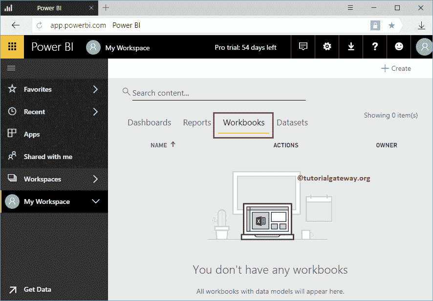
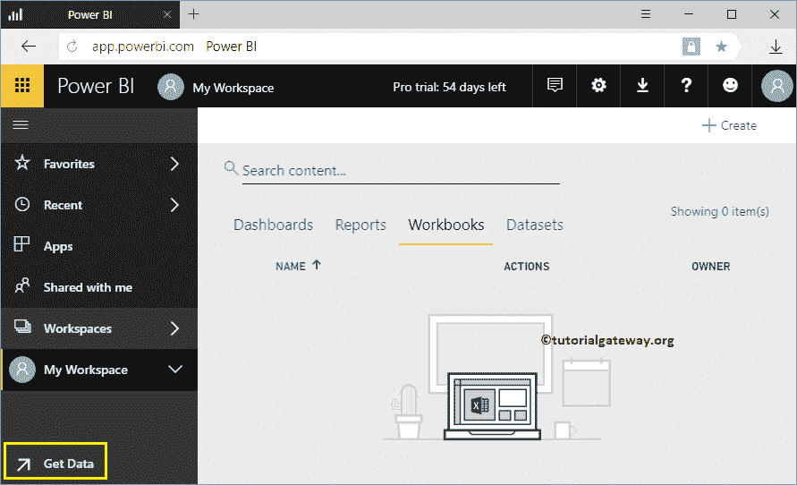
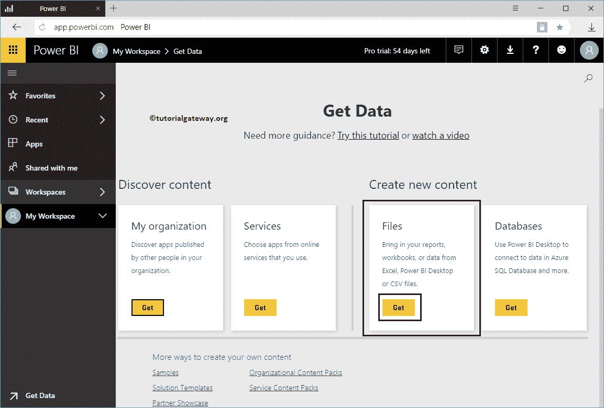
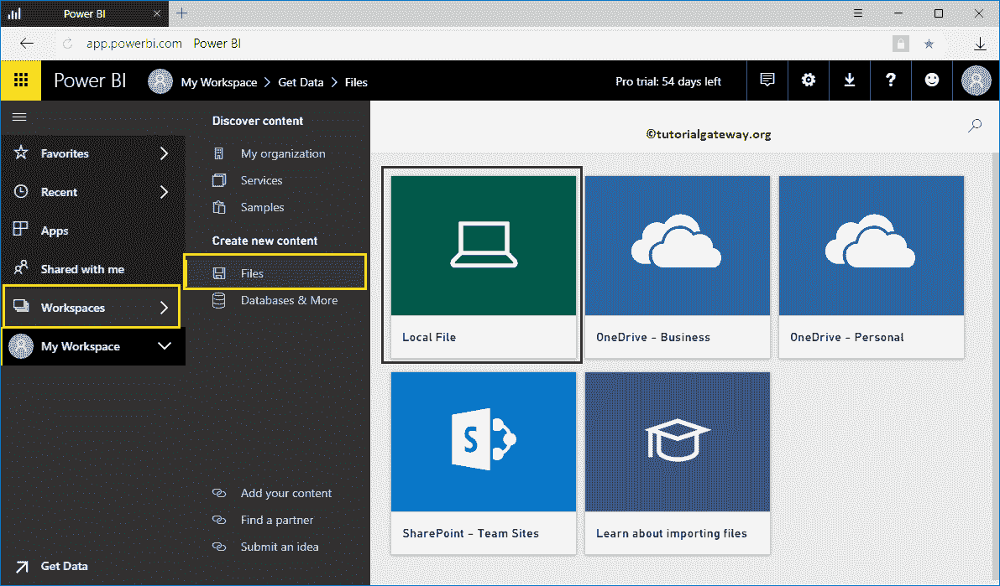
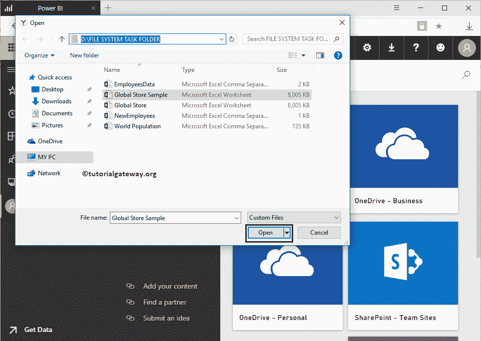
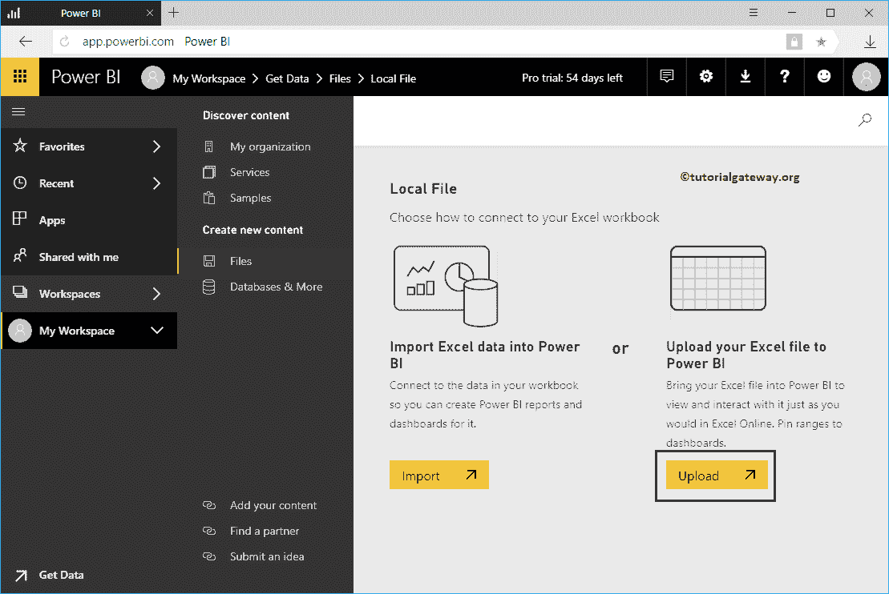
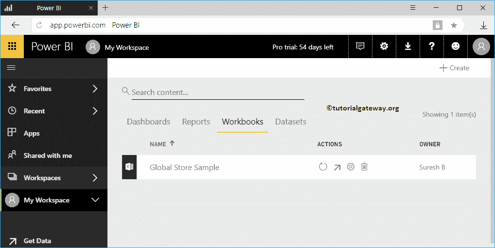

# 上传 PowerBI 工作簿

> 原文：<https://www.tutorialgateway.org/upload-power-bi-workbooks/>

在本文中，我们通过一个实际的例子向您展示如何上传 Power BI 工作簿。为了演示如何上传 Power BI 工作簿，我们将全球商店示例工作簿加载到 Power BI 仪表板中。

在我们开始上传之前，让我向您展示我的 Power BI 工作区中当前可用的工作簿列表。

从下面的截图可以看出，目前我的工作区中没有工作簿。

## 如何上传 PowerBI 工作簿

要上传 Power BI 工作簿，请单击左下角的获取数据按钮。

在这个例子中，我们想要上传一个 excel 工作簿。所以，让我点击 [Power BI](https://www.tutorialgateway.org/power-bi-tutorial/) 文件内的获取按钮。

单击获取按钮将打开以下窗口。在本例中，我们希望从本地文件系统上传 Excel 工作簿。所以，让我选择本地文件选项

单击“本地文件”按钮后，将打开一个新窗口，从文件系统中选择文件。现在，我们正在选择如下所示的全球商店示例 Excel 工作簿

接下来，Power BI 为您提供了两种选择

*   将 excel 数据导入 Power BI:它允许您使用此导入的 Excel 文件设计报告。此选项将数据集添加到我的[工作空间](https://www.tutorialgateway.org/create-power-bi-workspace/)中。建议大家参考[上传 Excel 文件](https://www.tutorialgateway.org/upload-excel-files-to-power-bi-dashboard/)的文章。
*   将您的 Excel 文件上传到 Power BI:这与 Excel Online 相同。您可以像在 Excel 中一样查看数据、与数据交互。此选项将工作簿添加到我的[工作区](https://www.tutorialgateway.org/create-power-bi-workspace/)。

让我选择【上传你的 Excel 文件到 Power BI】选项

请等到上传完成

让我导航到我的工作区->工作簿选项卡以查看可用的工作簿。如您所见，它显示了我们之前上传的全局存储示例工作簿。

