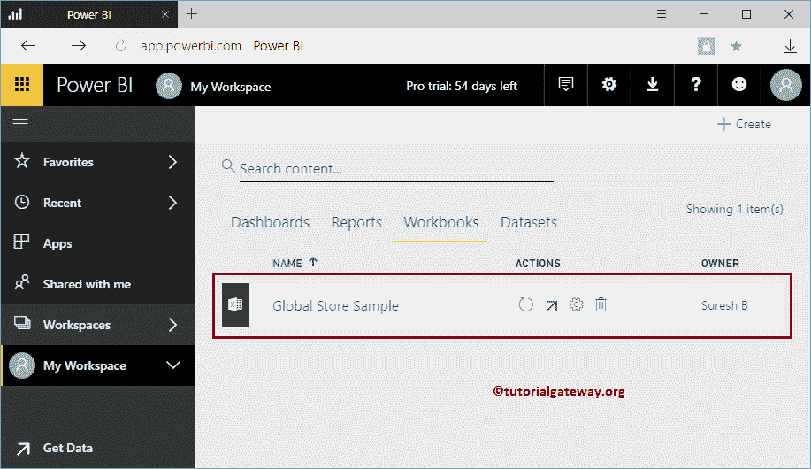
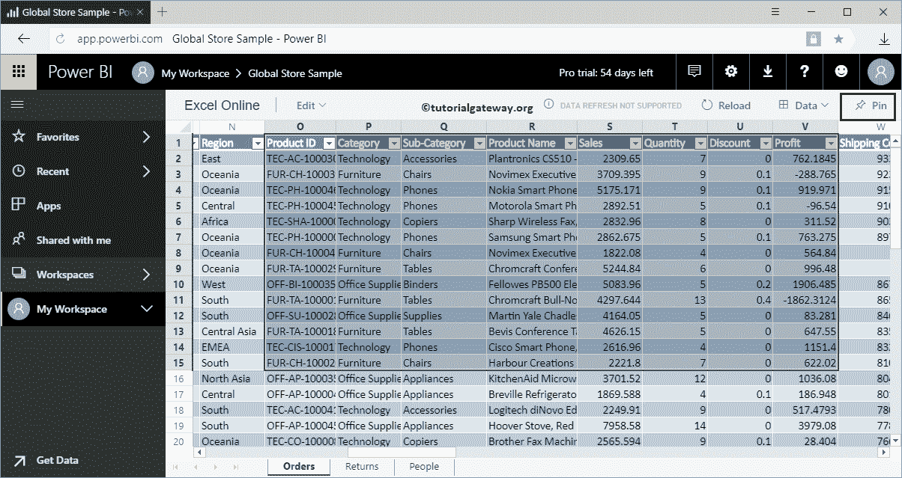

# 将工作簿固定到智能商务仪表板

> 原文：<https://www.tutorialgateway.org/pin-workbooks-to-power-bi-dashboard/>

让我用一个实例向您展示将工作簿固定到 Power BI 仪表板的分步方法。在我们开始锁定工作簿之前，让我向您展示我的 Power BI 工作区中的工作簿列表。

从下面的截图可以看出，只有一个工作簿。建议大家参考[上传工作簿](https://www.tutorialgateway.org/upload-power-bi-workbooks/)一文，了解一下这个文件上传到 [Power BI](https://www.tutorialgateway.org/power-bi-tutorial/) 的过程。

## 将工作簿固定到智能商务仪表板

在这个将工作簿固定到 PowerBI 仪表板的示例中，我们将使用这个工作簿。请单击此报告查看此工作簿中的数据。

你可以看到，它正在显示 Excel 在线。您可以通过使用光标选择所需的行和列来锁定此数据。

让我选择前 15 行 8 列。接下来，单击“锁定”按钮将它们锁定在仪表板上。

单击该 Pin 按钮将打开以下窗口。

1.  现有仪表板:选择此选项可将此数据添加到现有仪表板。
2.  新建仪表板:选择此选项可为此工作簿数据创建新的仪表板。

让我选择现有仪表板选项，接下来，我们选择第五个仪表板。

在第五个仪表板中，您可以看到我们之前选择和固定的 Excel 工作簿数据。

