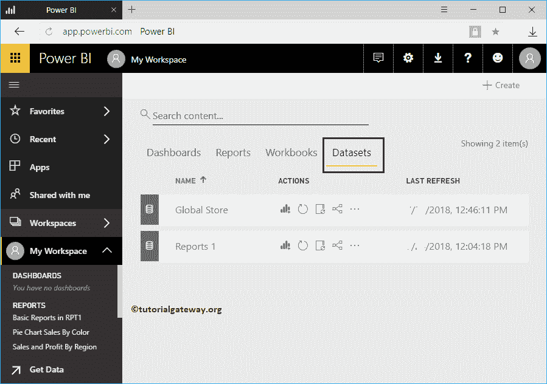
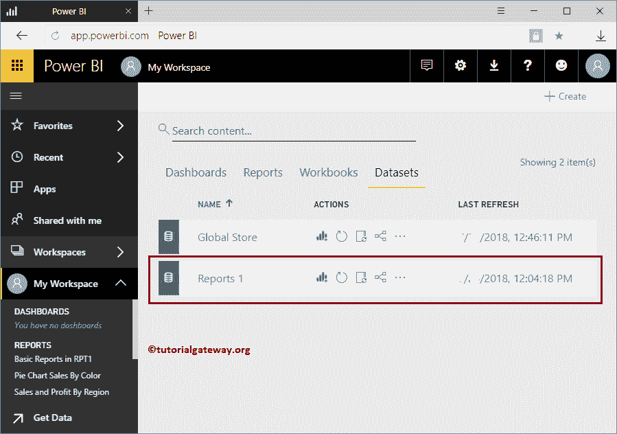
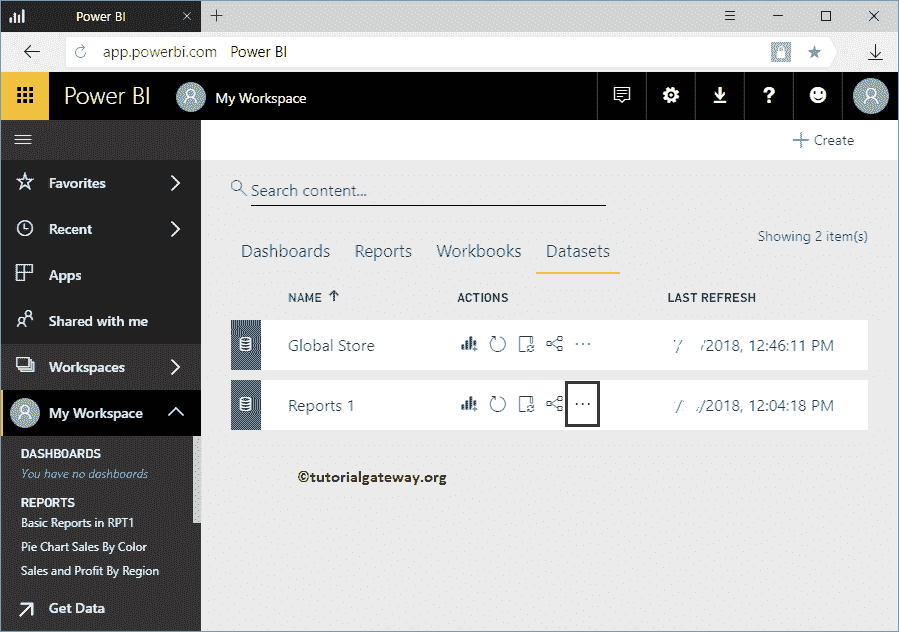
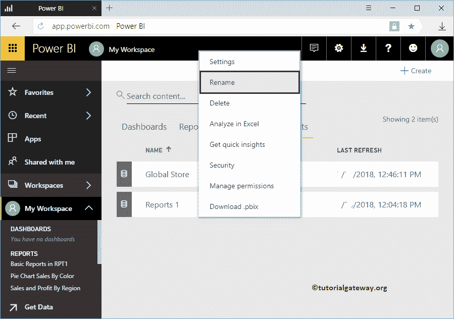
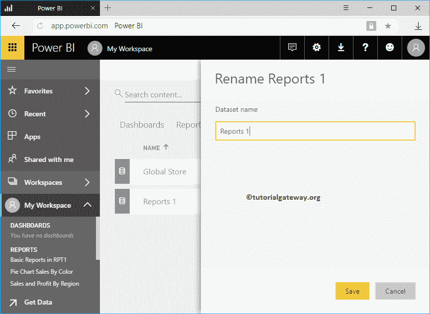
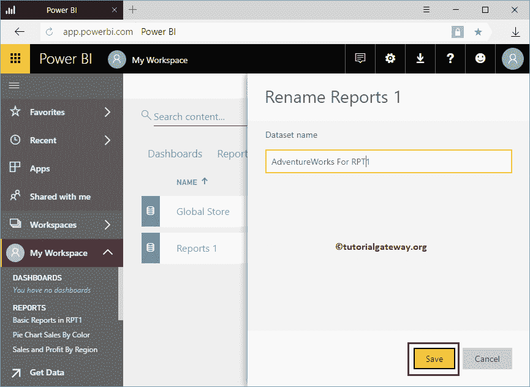

# 在 PowerBI 工作区中重命名数据集

> 原文：<https://www.tutorialgateway.org/rename-a-dataset-in-power-bi-workspace/>

如何用实例重命名 Power BI 工作空间中的数据集？。在我们开始重命名工作区中的数据集之前，让我向您展示我的工作区中可用数据集的列表。

要查看它们，请单击我的工作区，然后转到数据集选项卡

## 如何在 Power BI 工作空间中重命名数据集

在本例中，我们在 [Power BI](https://www.tutorialgateway.org/power-bi-tutorial/) 中重命名报告 1 数据集。

点击报告 1

旁边的…按钮

单击那个…按钮会打开一个上下文菜单。请从该菜单中选择重命名选项。

它打开一个重命名窗口

从下面的截图中可以看到，我们将这个数据集重命名为 RPT1 的 AdventureWorks。

现在，您可以看到名称已更改的数据集。

