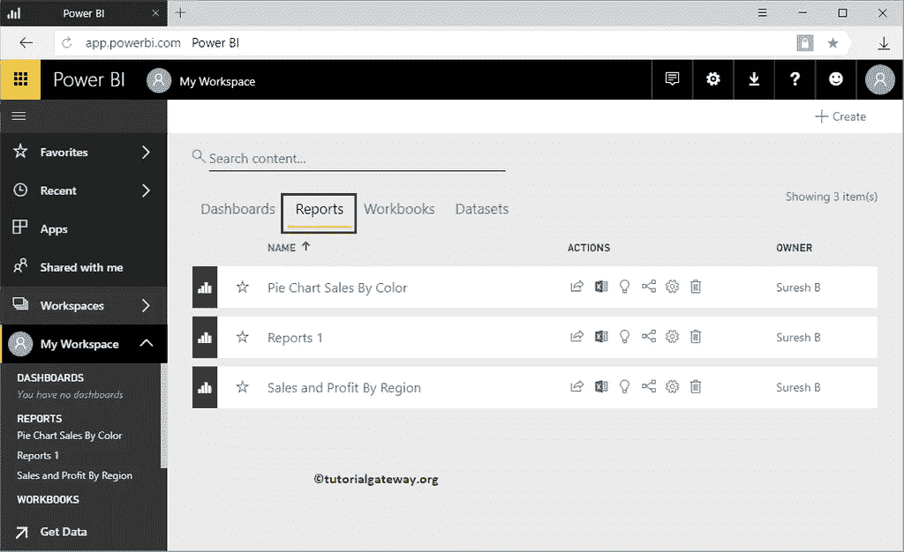
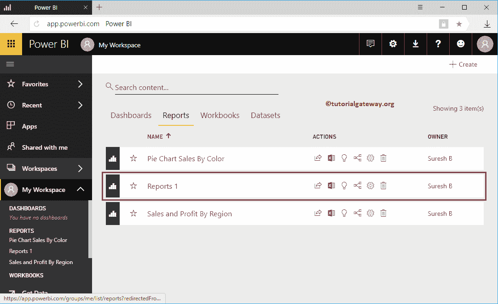
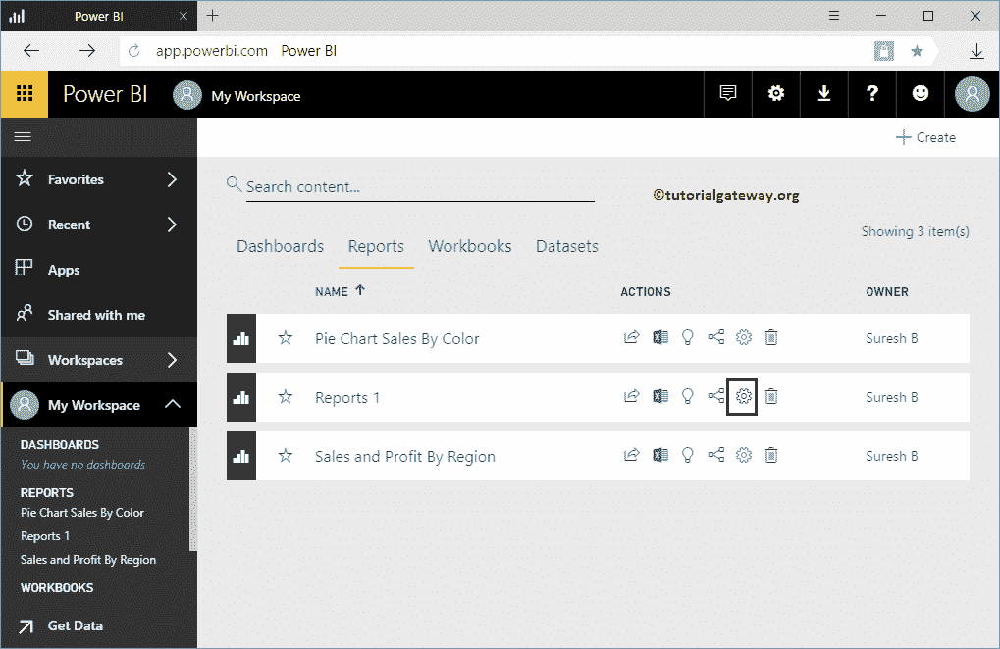
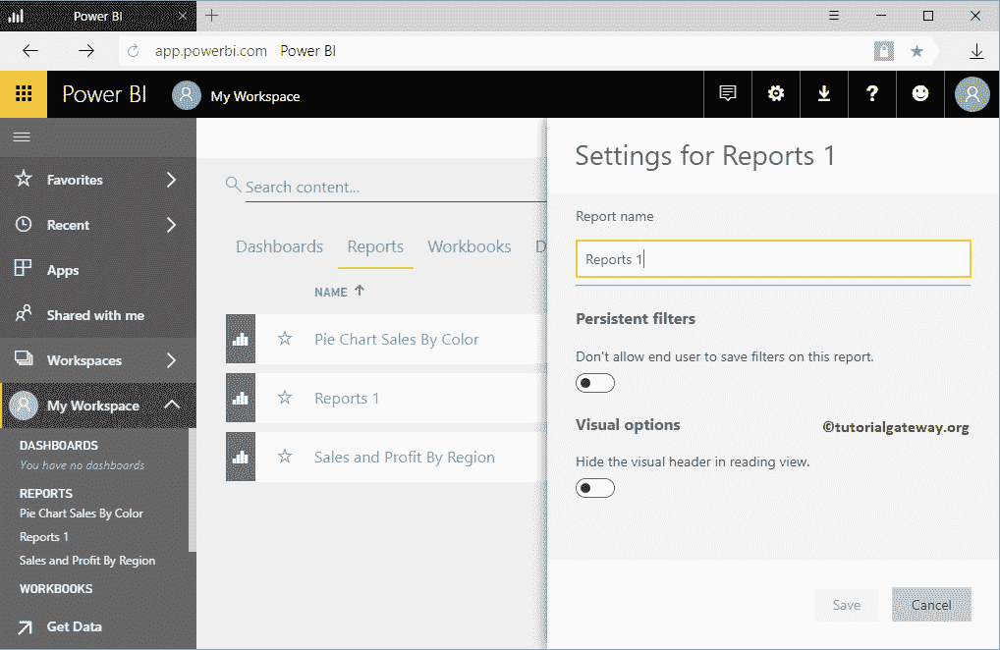
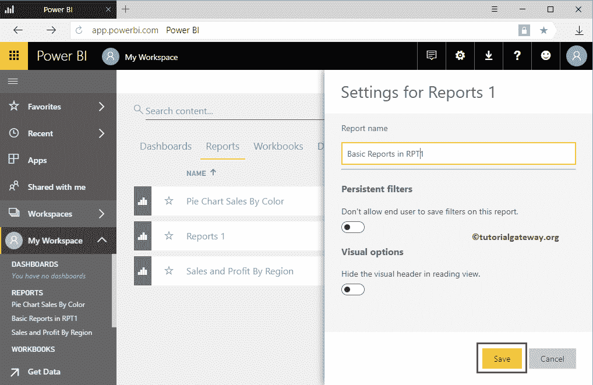
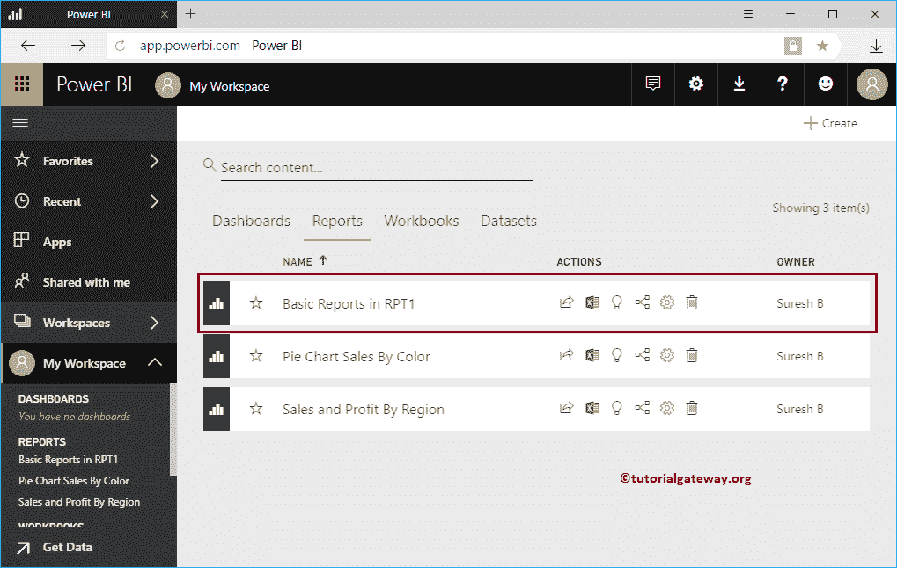

# 在 PowerBI 工作区中重命名报表

> 原文：<https://www.tutorialgateway.org/rename-a-report-in-power-bi-workspace/>

如何用实例重命名 Power BI 工作区中的报表？。在我的工作区中开始报告重命名之前，让我向您展示我的工作区中可用的报告列表。

要查看它们，请单击 Power BI 我的工作区，然后转到报告选项卡

## 如何在 Power BI 工作区中重命名报表

在这个 [Power BI](https://www.tutorialgateway.org/power-bi-tutorial/) 的例子中，我们重命名了我们[从桌面](https://www.tutorialgateway.org/publish-power-bi-desktop-reports/)发布的报告 1。

要重命名报告，请点击齿轮图标(设置图标)

单击齿轮图标将打开报告设置窗口。您可以使用报告名称下的第一个文本框根据您的要求更改名称。

从下面的截图中可以看到，我们在 RPT1 中将该报告重命名为基本报告。

现在可以看到报告名称已经更改

