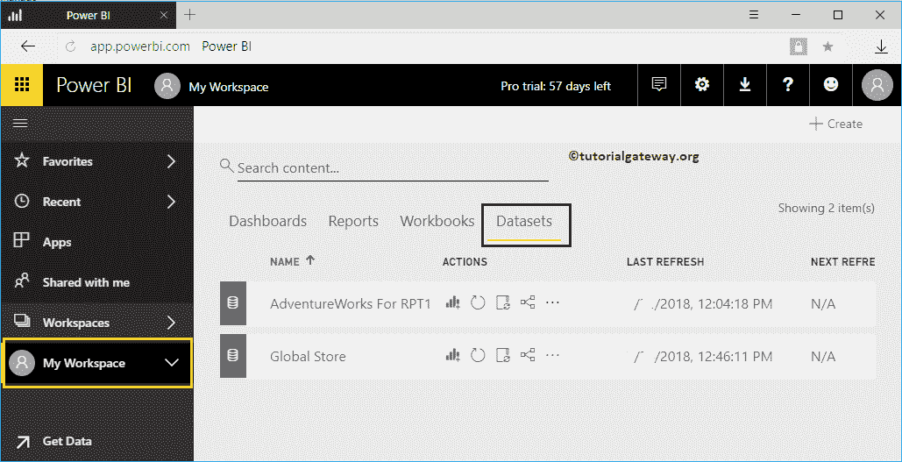
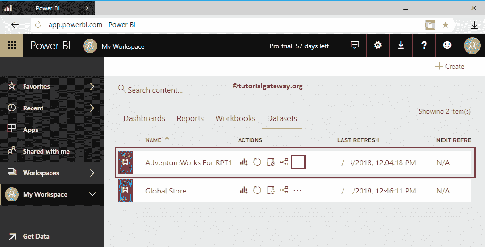
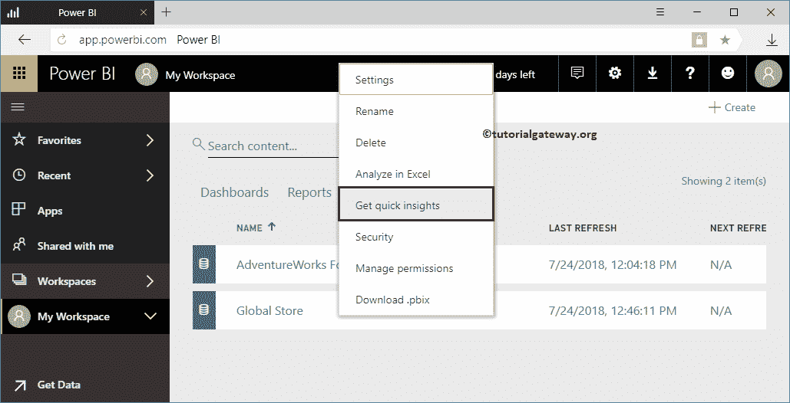
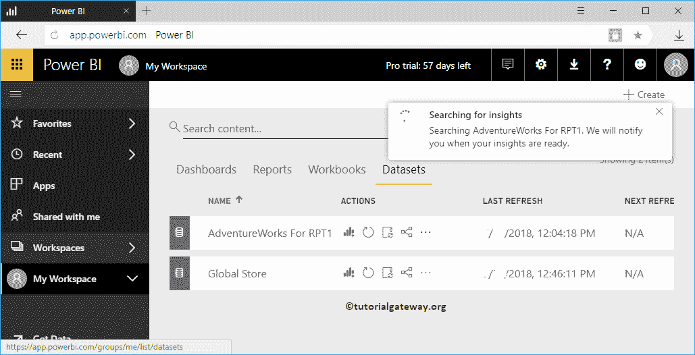
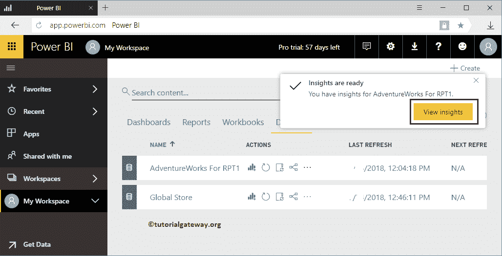
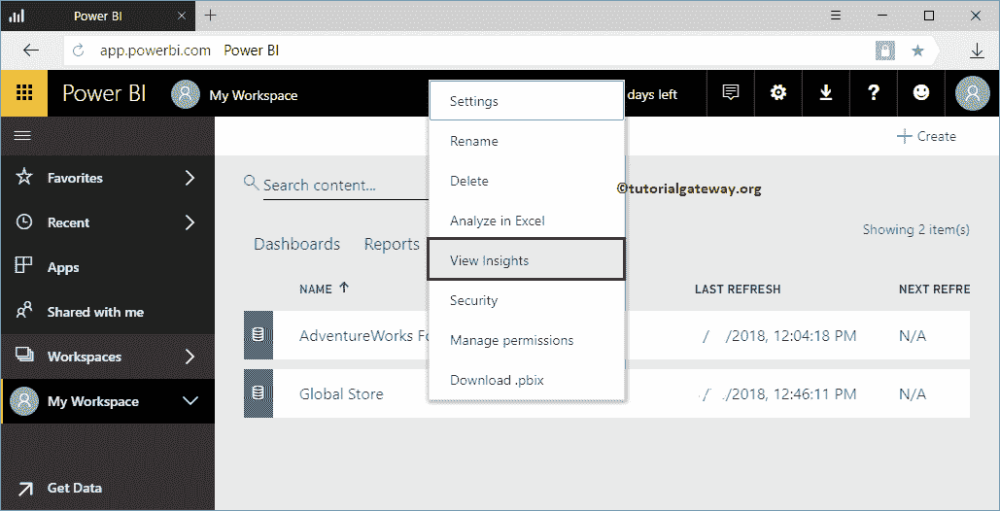
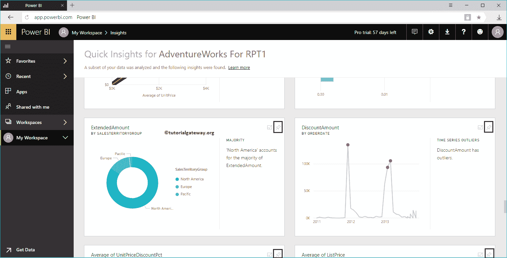
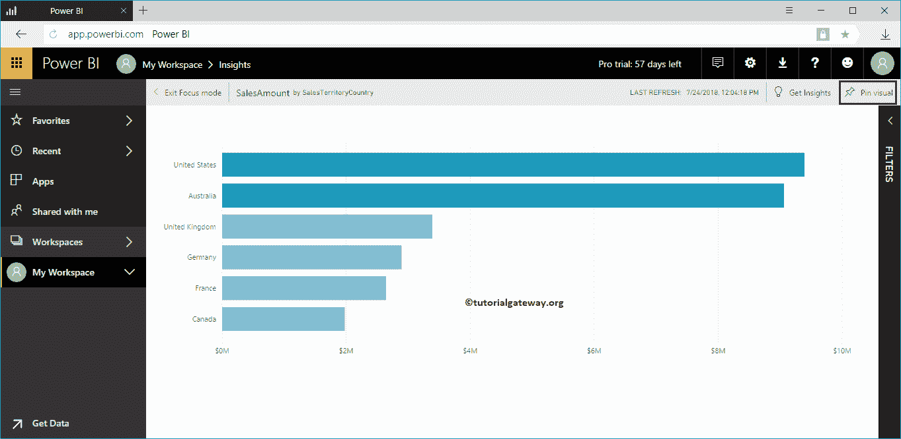
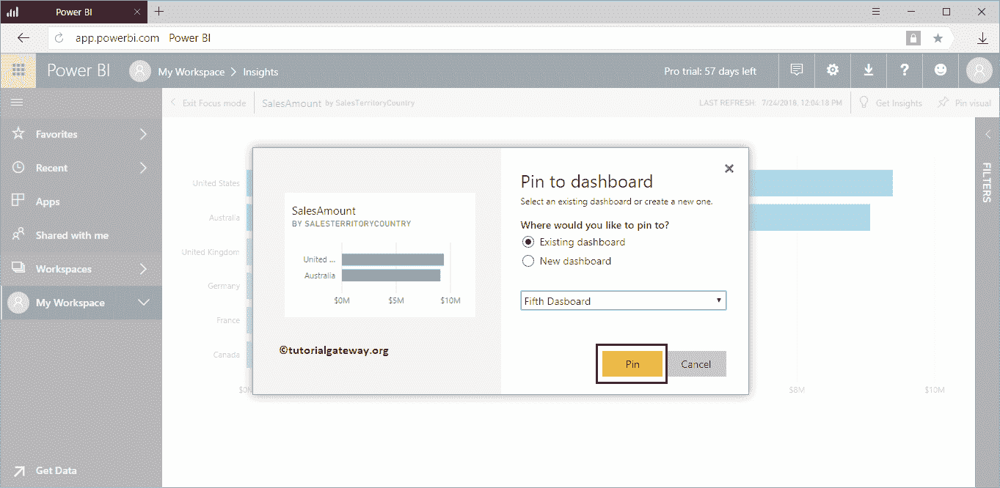
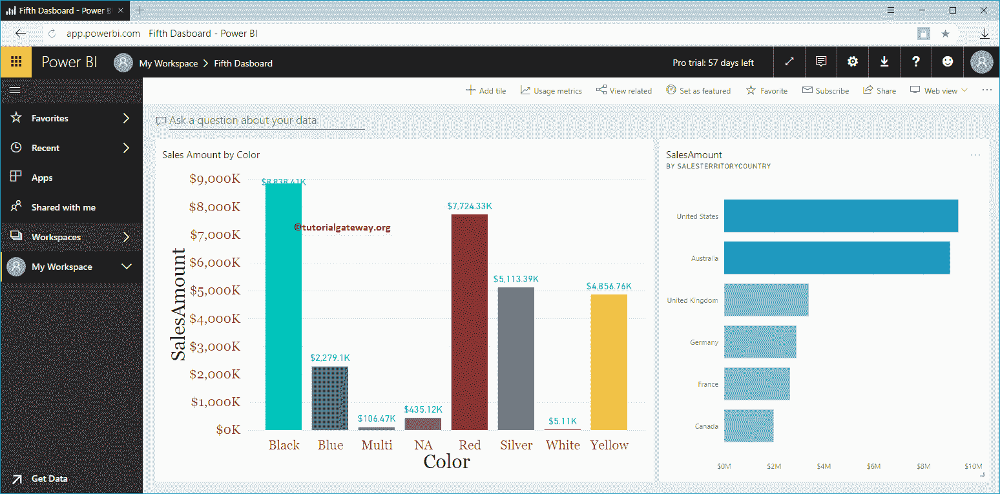

# 获得电力商业智能的见解

> 原文：<https://www.tutorialgateway.org/get-insights-in-power-bi/>

让我用一个实际的例子向您展示如何在 Power BI Workspace 中获得见解。在我们开始查找或获取数据的 Power BI 见解之前，让我向您展示我的工作区中的可用数据集列表。

要查看它们，请单击我的工作区，然后转到 Power BI 中的数据集选项卡。

## 如何在电力商业智能中获得洞察力

在本例中，我们在 [Power BI](https://www.tutorialgateway.org/power-bi-tutorial/) 中获得了针对 RPT1 数据集的冒险作品的 Power BI 见解。因此，点击 RPT1

冒险作品旁边的…按钮

单击我的[工作区](https://www.tutorialgateway.org/create-power-bi-workspace/)中的…按钮将打开一个上下文菜单。请从上下文菜单中选择获取快速洞察选项。

请等待 Power BI 算法处理您的数据，找到见解

一旦流程完成，您可以点击我们在

下方显示的按钮

或者单击数据集旁边的…按钮打开上下文菜单。请从该菜单中选择查看洞察选项(该选项被替换为获取[快速洞察](https://www.tutorialgateway.org/quick-insights-in-power-bi/))。

从下面的截图中，您可以看到由 Power BI 洞察生成的视觉效果。像任何其他报告一样，Power BI 允许您将这些视觉效果固定到仪表板上。

要锁定任何单个视觉对象，请将鼠标悬停在该视觉对象上，显示锁定视觉对象按钮。

或者点击你想看的报告。接下来，单击右上角的“视觉锁定”按钮。

我正在点击可视 Pin 按钮打开以下窗口。让我选择现有仪表板，即第五个仪表板。建议大家参考[添加报表到仪表盘](https://www.tutorialgateway.org/add-reports-to-power-bi-dashboard/)或[销报表到仪表盘](https://www.tutorialgateway.org/pin-report-to-power-bi-dashboard/)文章了解这些设置。

在第五个仪表板中，您可以看到我们之前固定的条形图。

