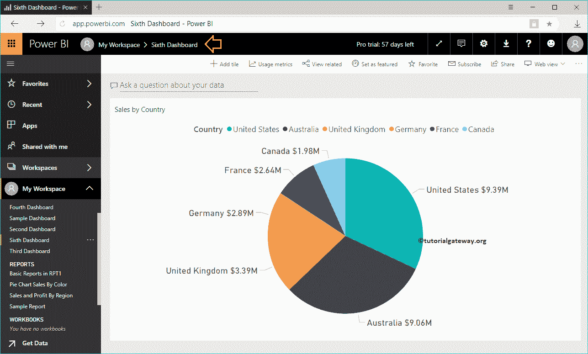
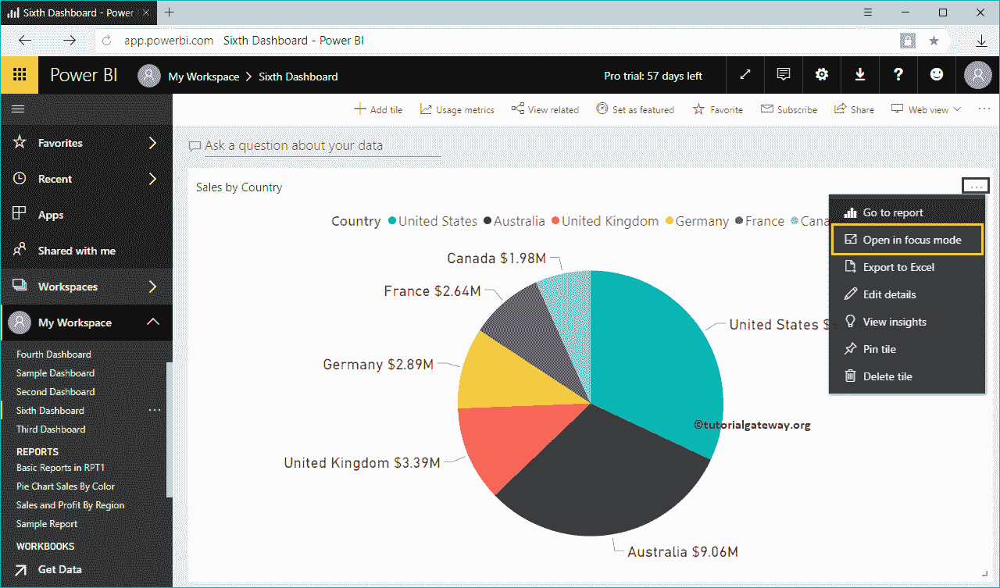
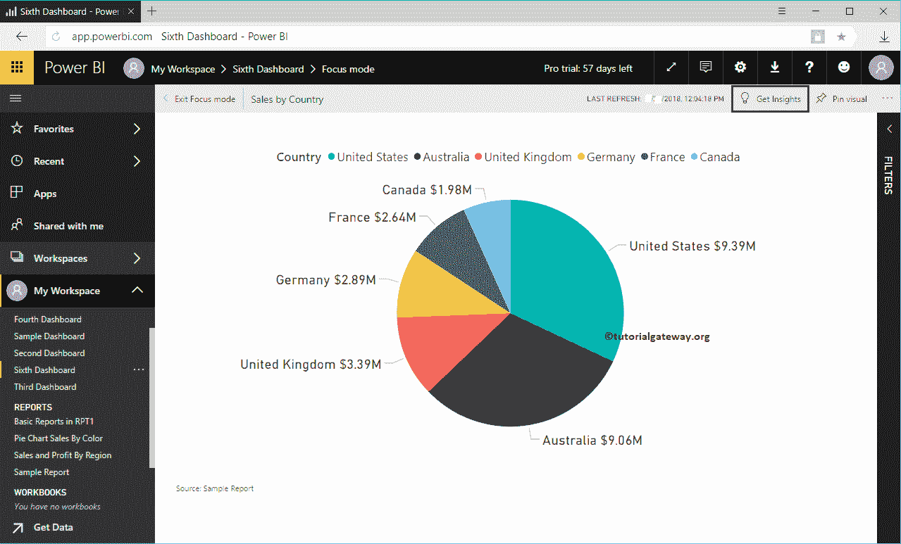
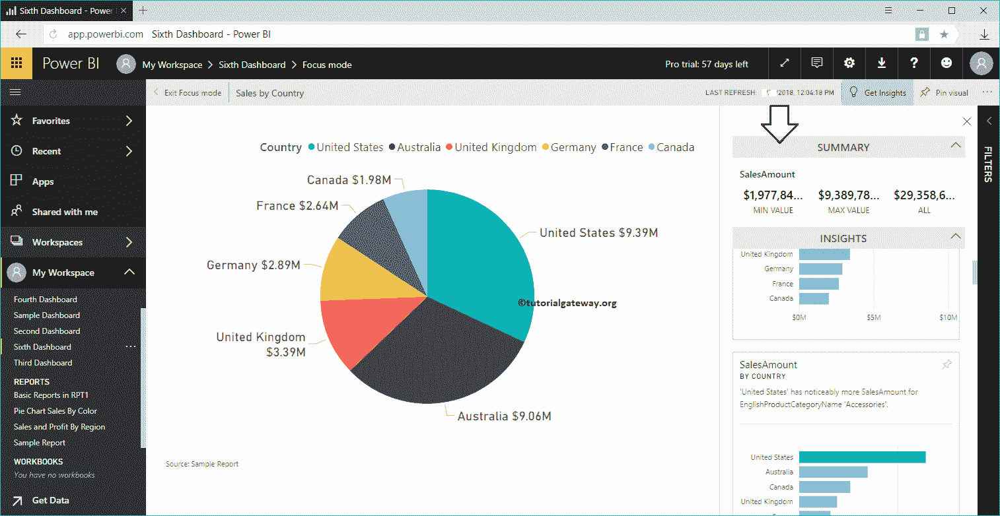
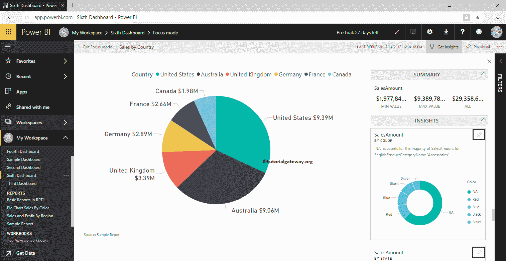
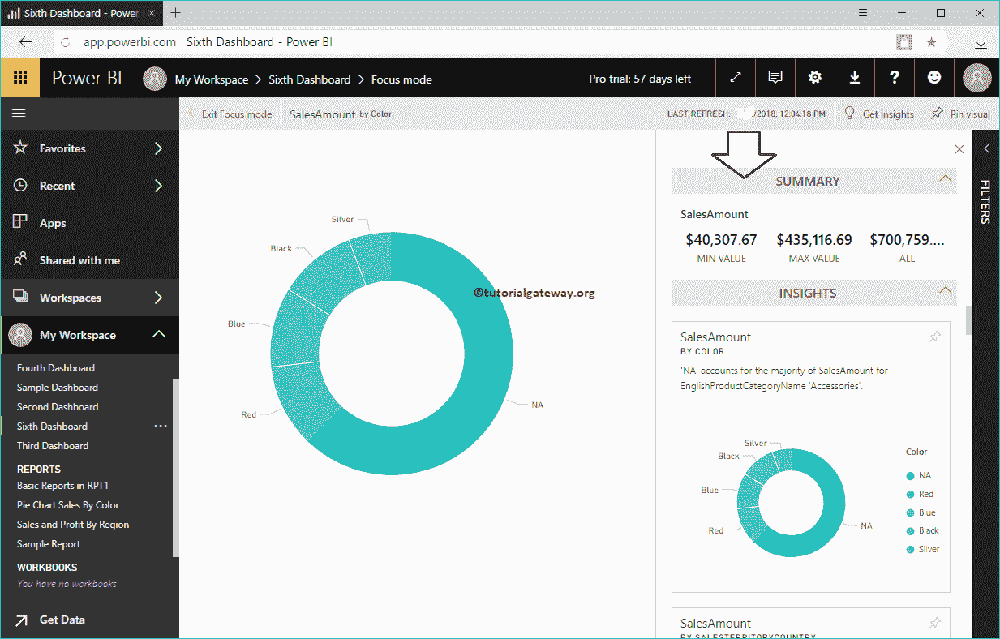
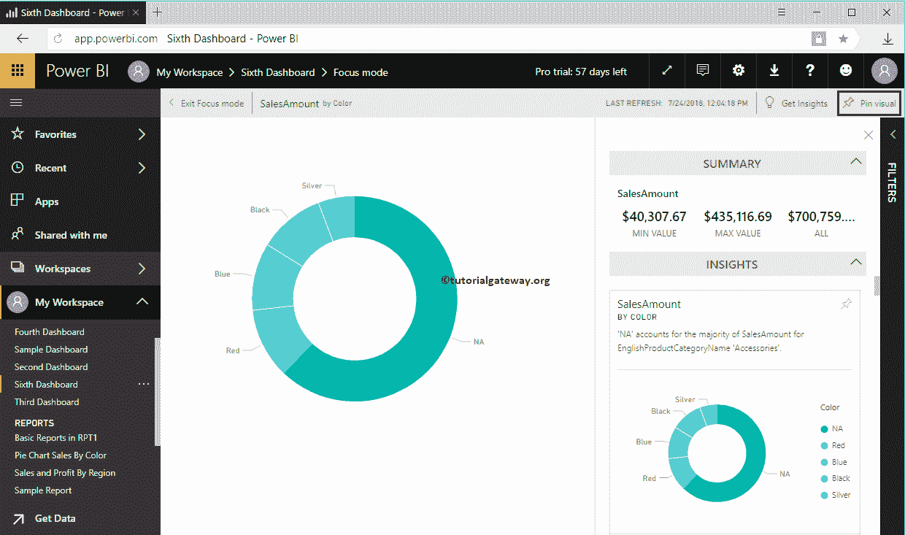
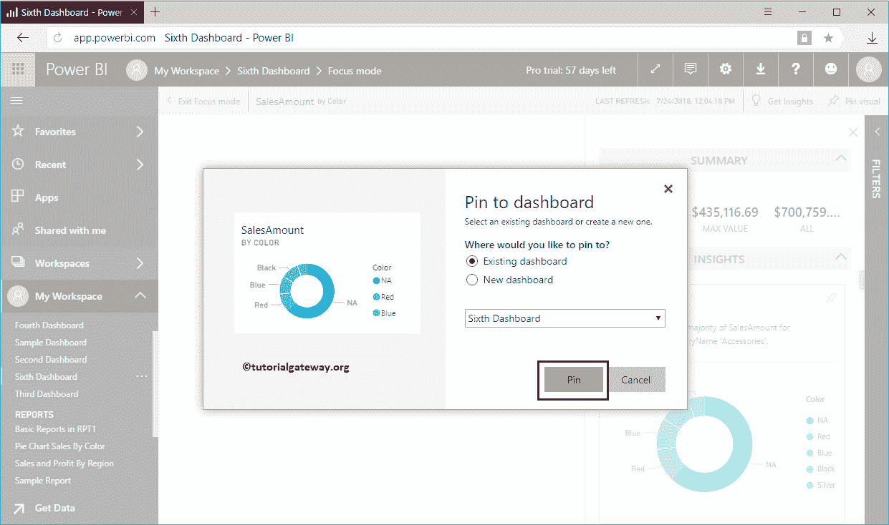
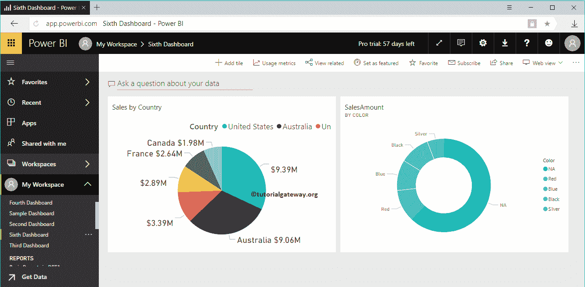

# 电力商业智能的快速洞察

> 原文：<https://www.tutorialgateway.org/quick-insights-in-power-bi/>

在本课程中，我们将通过一个实际示例向您展示如何快速了解 Power BI。一般来说，电力商业智能有两种见解。一种是在整个数据集上运行，另一种是在一个特定的报告上运行洞察(快速洞察)。稍后的一个也允许你进一步深入洞察。

在本次 Power BI 快速洞察演示中，我们将使用第六个仪表盘。要查看此内容，请单击我的工作区，然后转到仪表板选择第六个仪表板。

提示:建议大家参考 [Get Insights](https://www.tutorialgateway.org/get-insights-in-power-bi/) 文章，了解在数据集(第一个)上运行 [Power BI](https://www.tutorialgateway.org/power-bi-tutorial/) 算法的过程。

从下面的截图可以看到，它只有一个[饼图](https://www.tutorialgateway.org/pie-chart-in-power-bi/)。

## 电力商业智能的快速洞察

要获取报告的 Power BI 快速洞察，您必须单击右上角的…并选择在聚焦模式下打开。请记住，在我的[工作区](https://www.tutorialgateway.org/create-power-bi-workspace/)的某些版本中，旁边有一个按钮……用于进入聚焦模式。

一旦您的报告处于焦点模式，您可以在右上角看到“获取见解”选项。单击该按钮显示基于此报告的见解。

现在您可以看到基于此报告

的 Power BI 快速洞察

像任何其他报告一样，Power BI 允许您将这些视觉效果固定在[仪表盘](https://www.tutorialgateway.org/create-a-power-bi-dashboard/)上。要锁定任何单个视觉效果，将鼠标悬停在该视觉效果上，显示锁定视觉效果按钮

或者，如果您想进一步深入到报告中，请选择任何报告。出于快速洞察演示的目的，我们选择了[圆环图](https://www.tutorialgateway.org/power-bi-donut-chart/)。

选择后，Power BI 将根据此报告开始显示快速洞察。

如果要将此报告固定到仪表板，请单击右上角的固定可视按钮。

单击视觉锁定按钮将打开以下窗口。让我选择现有仪表板，即第六个仪表板。建议大家参考[添加报表到仪表盘](https://www.tutorialgateway.org/add-reports-to-power-bi-dashboard/)或[销报表到仪表盘](https://www.tutorialgateway.org/pin-report-to-power-bi-dashboard/)文章了解这些设置。

在第五个仪表板中，您可以看到我们之前固定的圆环图。

