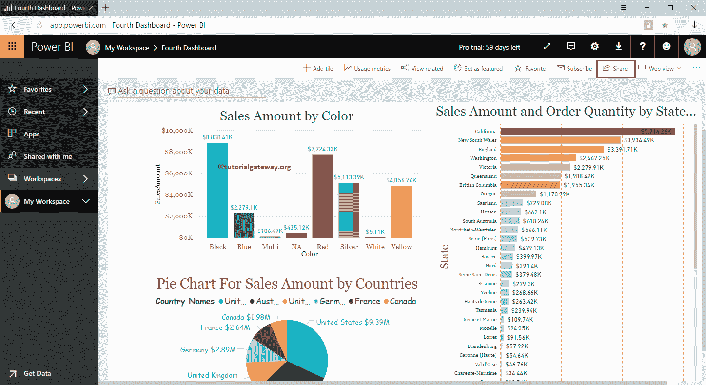

# 共享 PowerBI 仪表板

> 原文：<https://www.tutorialgateway.org/share-power-bi-dashboard/>

让我用一个实际的例子向您展示在您的组织中共享 Power BI 仪表板的分步方法。在我们开始共享 Power BI 仪表板之前，让我向您展示一下我的 Power BI 工作区中的现有仪表板。

要查看它们，请单击 Power BI 我的工作区，然后转到仪表板选项卡。从下面的截图可以看到，目前我的工作区有五个。在这个例子中，我们分发第四个。让我点击它，看看它的视觉效果。

## 如何分享商业智能仪表板的力量

从下面我的[工作区](https://www.tutorialgateway.org/create-power-bi-workspace/)截图中，你可以看到这个上可用的视觉效果。

要分发此 Power BI 仪表板，请单击右上角的共享按钮。

单击共享按钮打开 g 窗口中的。

*   授权给:请提供您要向其发送此邮件的电子邮件地址。
*   可选消息:您可以编写自定义消息来解释报告及其功能。
*   允许收件人访问您的仪表板:这允许收件人将此内容分发给其团队中的其他人。
*   向收件人发送电子邮件通知:发送关于此报告的电子邮件。
*   链接:这是这个 [Power BI](https://www.tutorialgateway.org/power-bi-tutorial/) 仪表盘的实际链接。

让我和纪梭分享这份报告，他在同一个组织

工作

让我用纪梭账户开通 PowerBI 服务。在“与我共享”选项卡下，您可以看到苏雷什共享的仪表板。

让我给你看个人资料，确认我是以纪梭的身份登录的。

