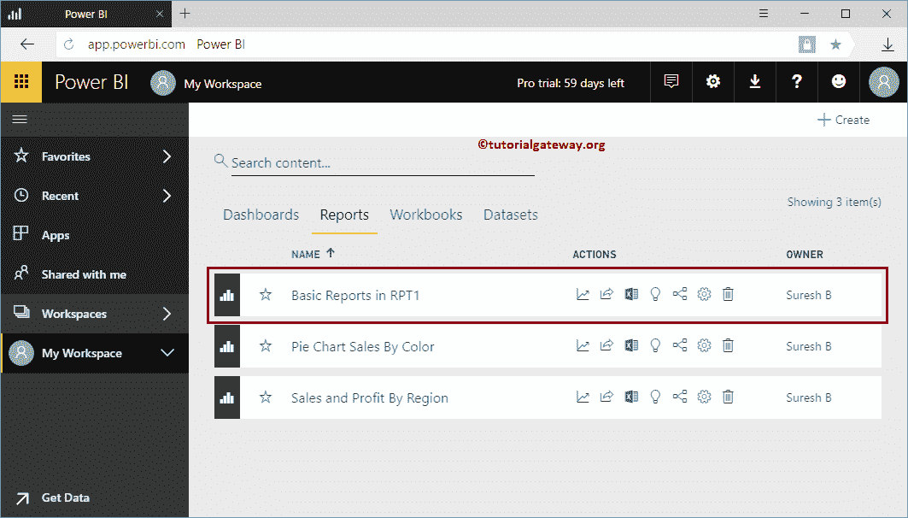
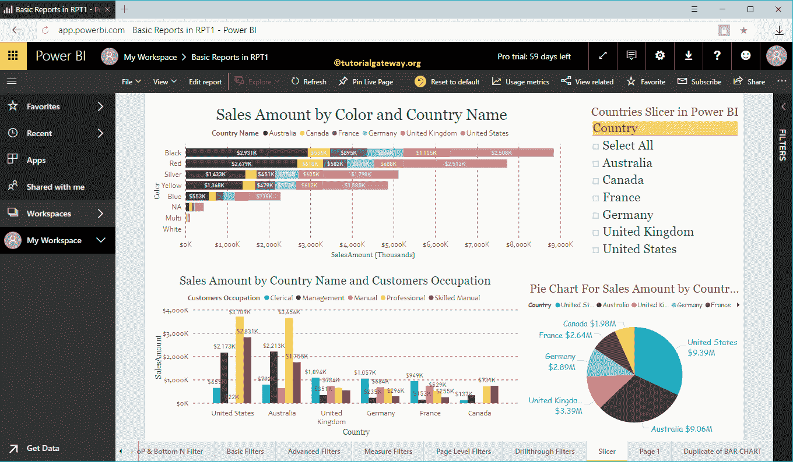
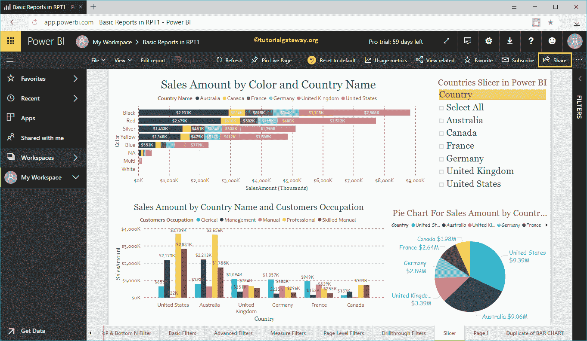
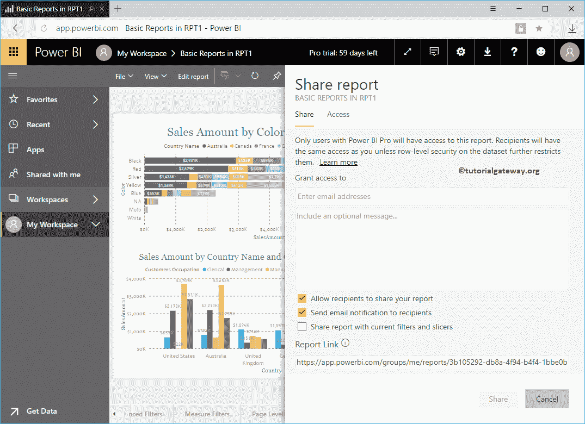
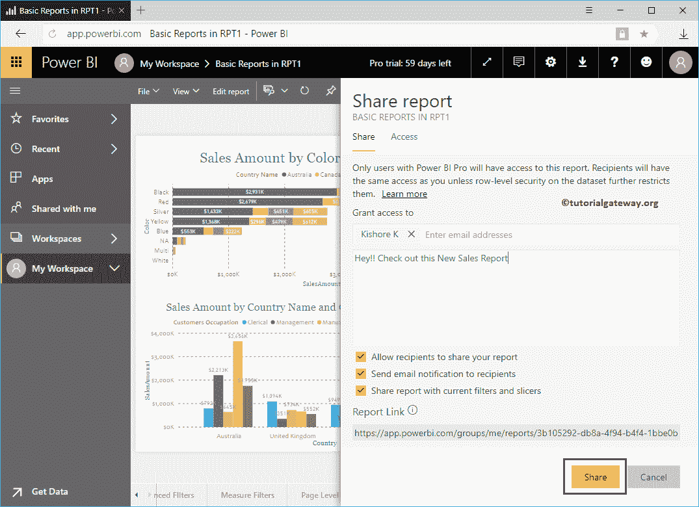
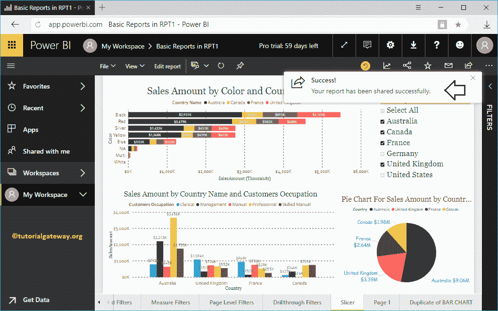
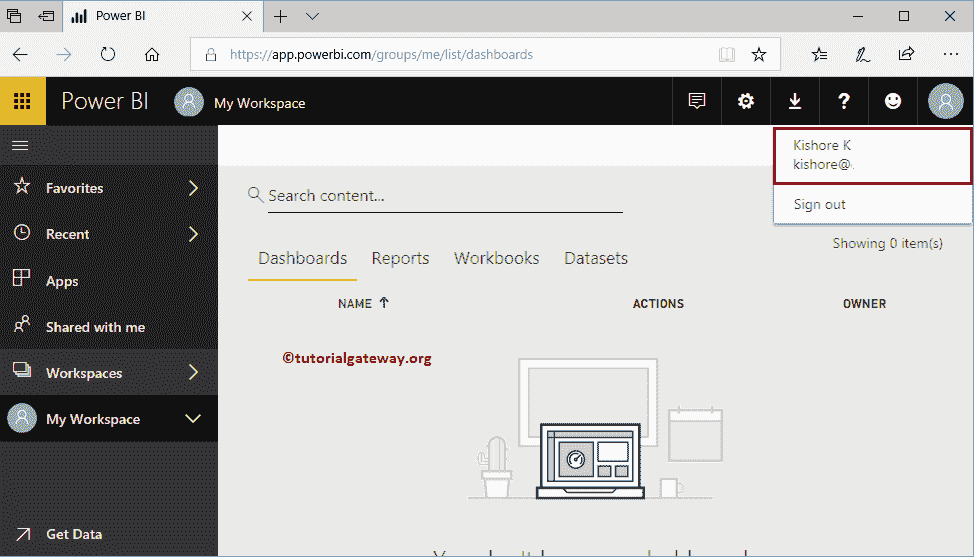
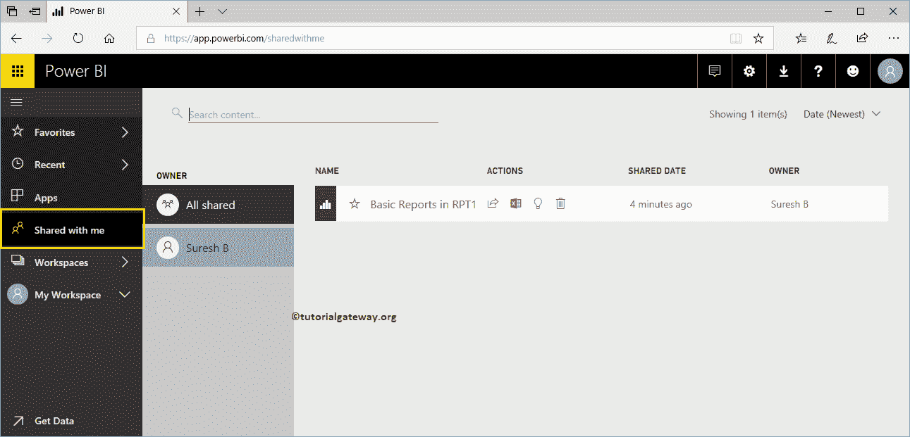
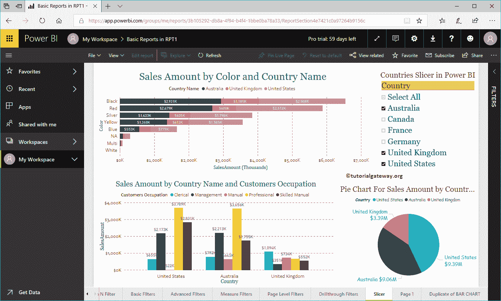

# 分享电力商业智能报告

> 原文：<https://www.tutorialgateway.org/share-a-report-in-power-bi/>

在本文中，我们通过一个实际的例子向您展示了在您的组织中共享 Power BI 报告的分步方法。在我们开始共享 Power BI 报告之前，让我向您展示一下我的 Power BI 工作区中的现有报告。

要查看它们，请单击 Power BI 我的工作区，然后转到报告选项卡。从下面的截图中可以看到，目前我的工作区中有三个。在本《分享电力商业智能报告》示例中，我们将。分发选定的 RPT1。让我打开这个看看里面的视觉效果。

## 如何在电力商业智能中共享报表

从下方[工作区](https://www.tutorialgateway.org/create-power-bi-workspace/)截图来看，这里面有 22 页。

要分发此内容，请单击右上角的共享按钮。

单击该按钮将打开电源商业智能共享报告窗口。

*   授权给:请提供您要交换的电子邮件地址。
*   可选消息:您可以编写自定义消息
*   允许收件人:这允许收件人与其团队中的其他人分发此邮件。
*   向收件人发送电子邮件通知:发送一封关于此的电子邮件。
*   与当前过滤器和切片器共享报告:它与我应用的过滤器和我使用的切片器一起分发此报告。

让我和纪梭分享一下，他在同一个组织

工作

你可以看到它是成功的。

让我用纪梭账户

开通 [Power BI](https://www.tutorialgateway.org/power-bi-tutorial/) 服务

在“与我共享”选项卡下，您可以检查用户 Suresh 发送的报告。

你可以点击它来查看视觉效果

