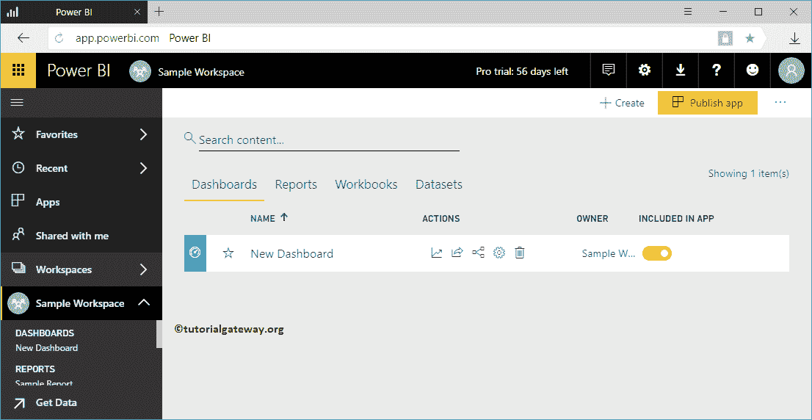
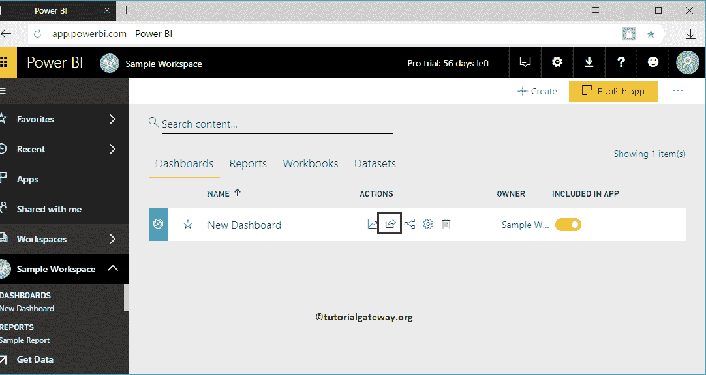
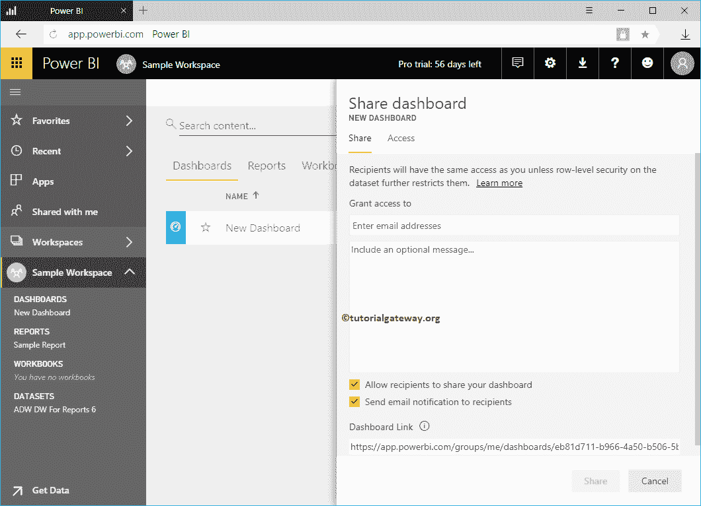
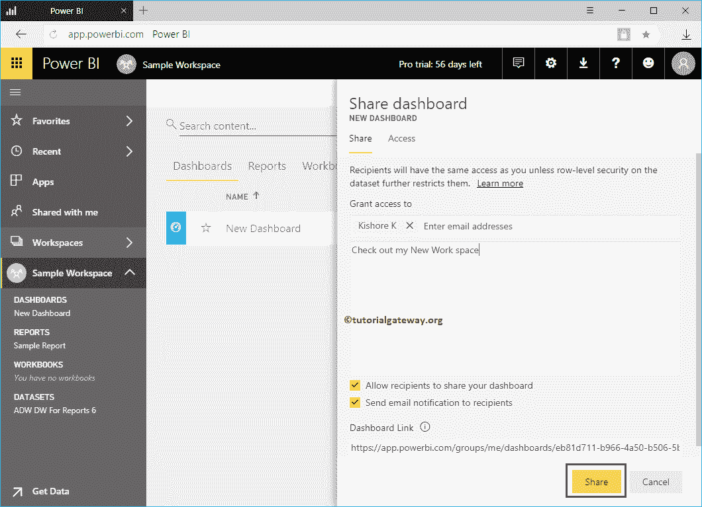
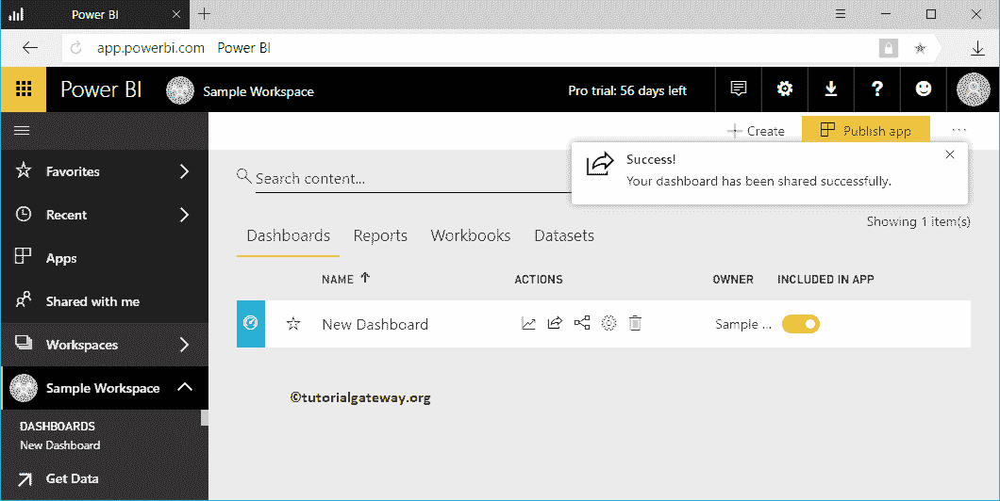
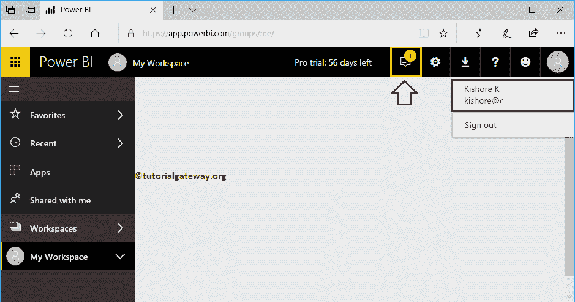
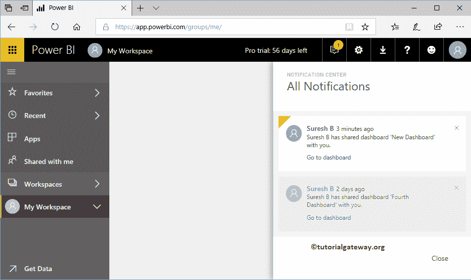
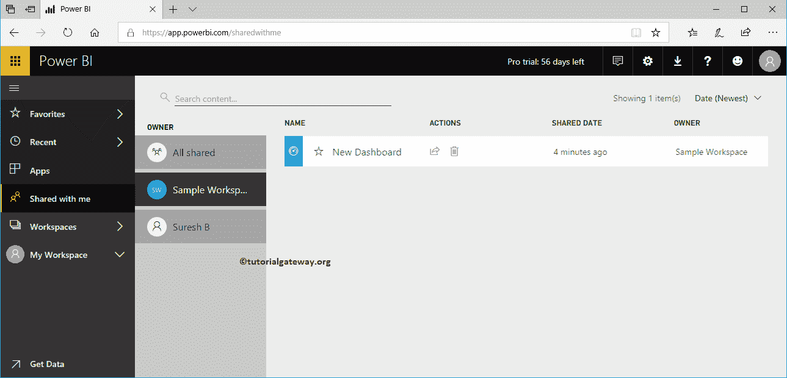
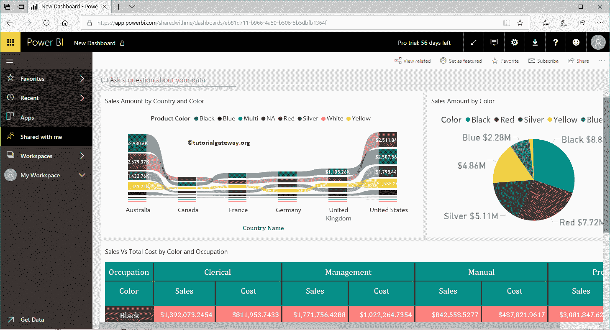

# 共享 PowerBI 工作空间

> 原文：<https://www.tutorialgateway.org/share-power-bi-workspace/>

让我们通过一个实际的例子来看看在您的组织中共享 Power BI Workspace 的分步方法。在我们开始共享工作区之前，让我向您展示我的 Power BI 帐户中的现有工作区。在此共享 PowerBI 工作区示例中，我们共享了示例工作区中提供的新仪表板。

## 如何共享 PowerBI 工作空间

要共享此工作区，请单击下面显示的共享按钮。

单击共享按钮将打开共享控制面板窗口。

*   授予访问权限:请提供您要共享此仪表板的电子邮件地址。
*   包含可选消息:您可以编写自定义消息
*   允许收件人共享您的仪表板:这允许收件人与其团队中的其他人共享此仪表板。
*   向收件人发送电子邮件通知:发送关于此报告的电子邮件。
*   仪表盘链接:这是这个 [Power BI](https://www.tutorialgateway.org/power-bi-tutorial/) 仪表盘的实际链接。

让我和纪梭分享一下，他在同一个组织

工作

从下面可以注意到，共享过程是成功的。

让我用纪梭账户开通 PowerBI 服务。

您可以看到声明苏雷什共享了新仪表板

的通知

在“与我共享”选项卡下，您可以看到以前共享的示例工作区。

让我单击仪表板查看仪表板内的报告。

