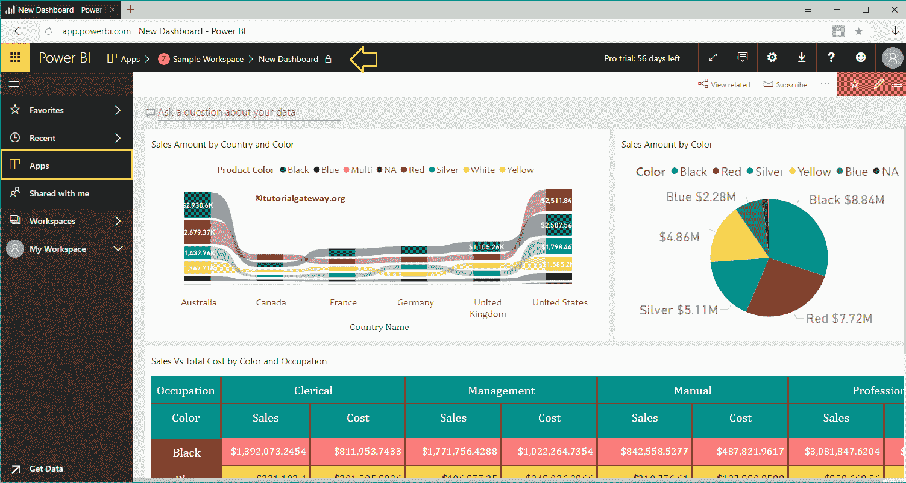

# 在 PowerBI 中发布应用

> 原文：<https://www.tutorialgateway.org/publish-app-in-power-bi/>

让我用一个实际的例子向您展示在 Power BI 中发布应用的分步方法。在我们开始发布 Power BI 应用程序之前，让我向您展示一下我的 Power BI 工作区中的现有仪表板。对于 Power BI 演示中的发布应用程序，我们使用示例工作区。

请单击 Power BI 示例工作区，然后转到仪表板选项卡查看可用仪表板的列表。从下面的截图可以看到，目前这个工作区只有一个仪表盘。

## 如何在 PowerBI 中发布应用

要在 Power BI 中发布应用，请点击右上角的发布应用按钮。建议大家参考[仪表盘](https://www.tutorialgateway.org/create-a-power-bi-dashboard/)[创建工作区](https://www.tutorialgateway.org/create-power-bi-workspace/)文章，了解 [Power BI](https://www.tutorialgateway.org/power-bi-tutorial/) 工作区创建。

单击发布应用按钮，打开以下 PowerBI 窗口。在详细信息部分下，

*   描述:请提供此应用的有效描述。这是一个必填字段，所以您必须在这里填写一些内容。
*   背景色:请选择此应用的背景色。默认情况下，选择绿色。

我们添加了描述，并将应用程序颜色更改为红色。

在内容选项卡下，指定应用程序登录页面

*   特定内容:如果选择此选项，请使用下拉列表选择仪表板
*   无:没有登陆页面

让我选择新仪表盘作为登陆页面

在“访问”选项卡下

*   权限:您可以授予对整个组织或少数个人或组的访问权限。

对于这个发布应用程序演示，我们选择了特定的个人或组，并添加了 Kishore。

完成后，请单击“完成”按钮。

点击发布按钮发布 PowerBI 应用。

请保存链接。此链接可帮助您打开应用程序。现在，让我点击获取应用按钮。

单击该按钮将带您进入以下窗口。如果不是这样，请单击左侧导航栏中的“应用程序”选项卡。

有时候可能会像下面这样打开。在这里，您可以单击示例工作区并查看其中的仪表板。

将鼠标悬停在该应用上，可编辑、删除和添加至喜爱的

让我打开我们在我的 IOS 设备中复制的网址。请记住，您必须从应用商店或谷歌游戏商店下载 Power BI 应用。

您可以在我们的应用程序中看到示例工作表。点击该应用找到数据

检查我们手机里的仪表盘。

