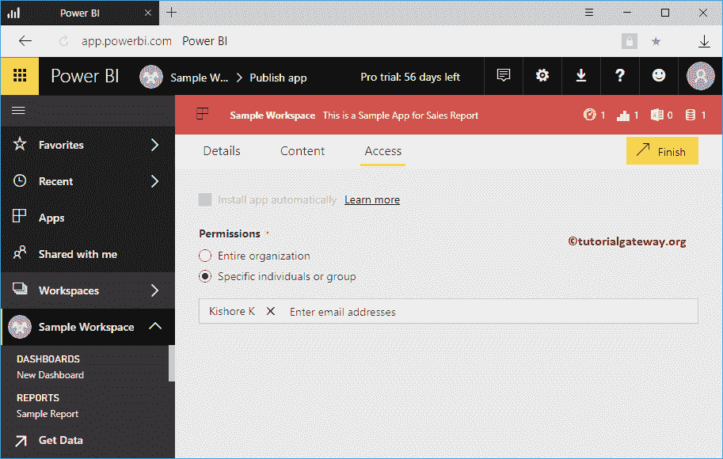
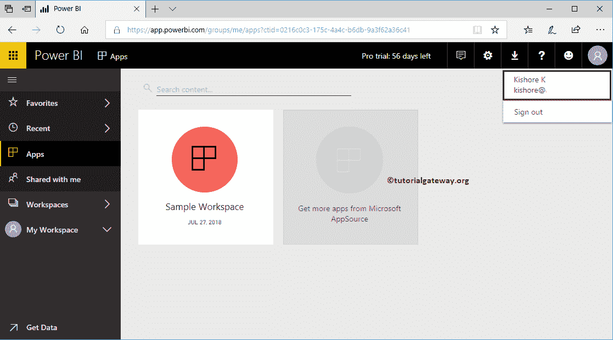
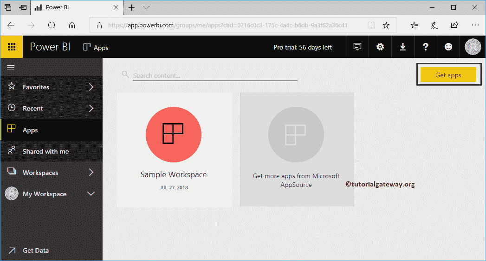
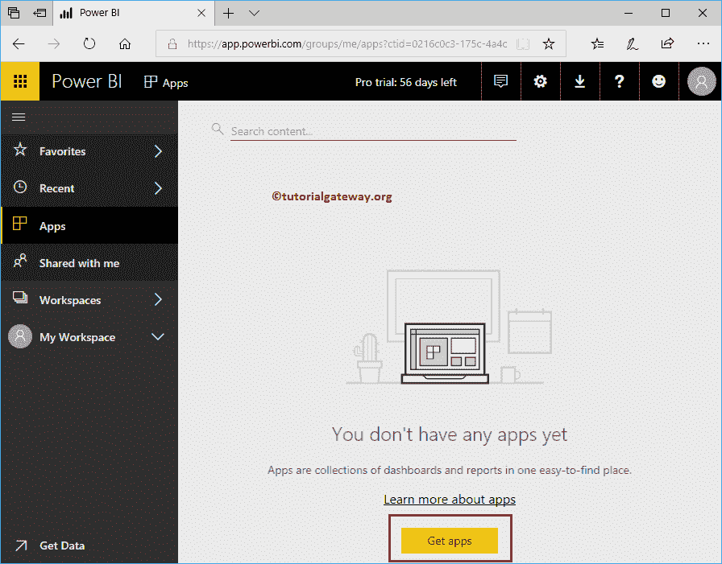
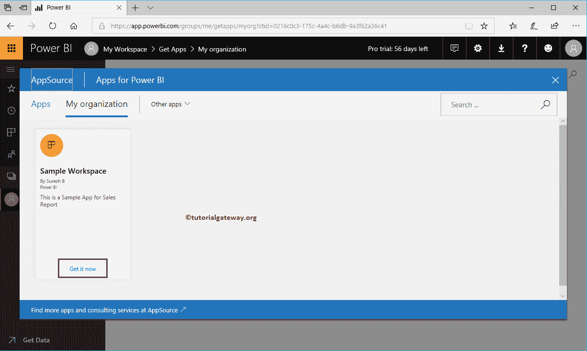
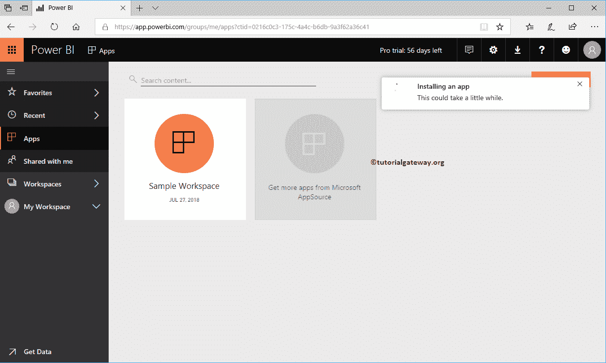
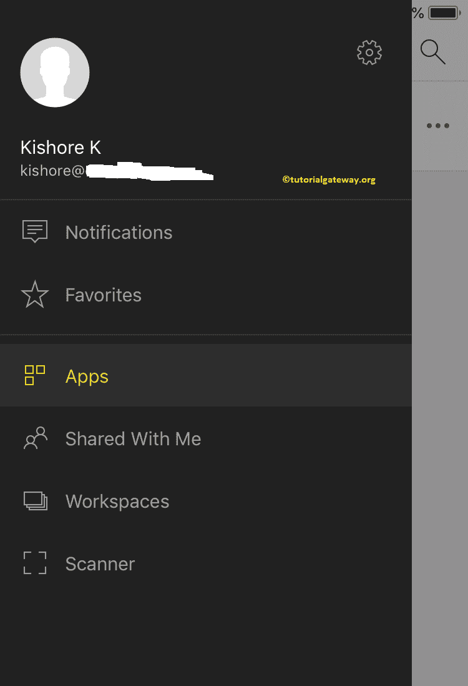
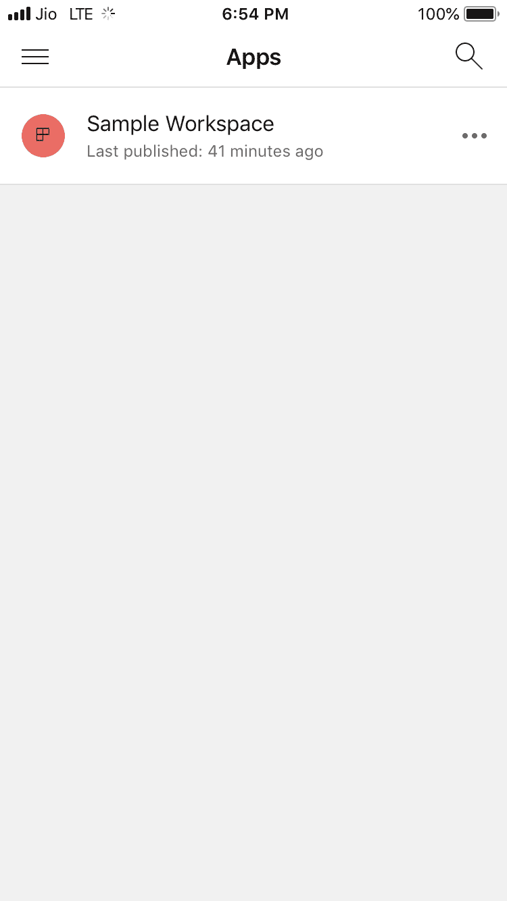
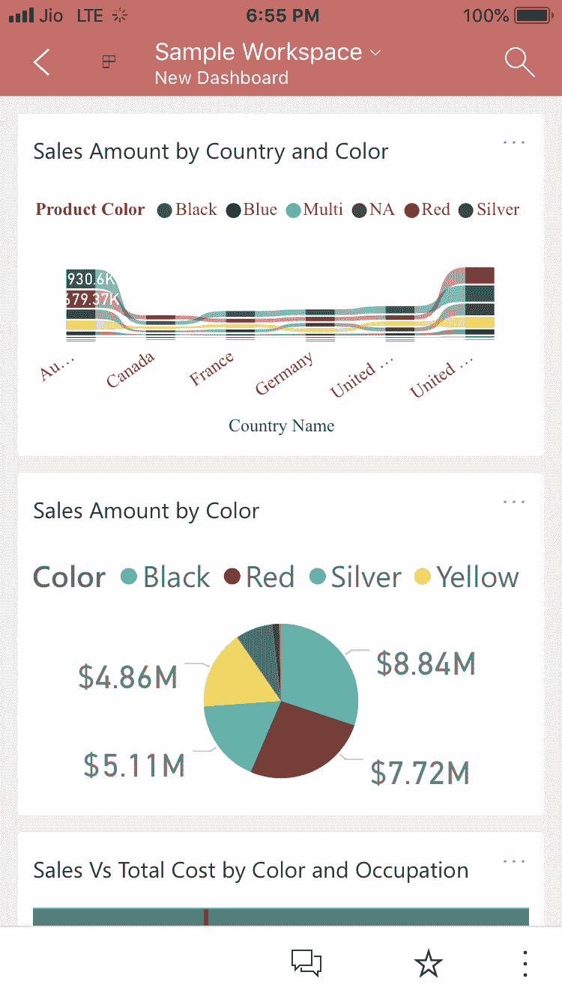

# 在 Power BI 中查看已发布的应用程序

> 原文：<https://www.tutorialgateway.org/view-published-app-in-power-bi/>

让我用一个实际的例子向您展示在 Power BI 中查看发布的应用程序的分步方法。如果您是此应用程序的管理员/所有者，则可以转到“应用程序”选项卡，并单击所需的应用程序。如果没有，请要求您的管理员授予对该应用程序的访问权限。

在 Power BI 演示中查看发布的应用程序时，我们使用的是之前创建的示例工作区应用程序。如你所见，我们允许纪梭。这意味着他可以访问这个应用程序。

## 如何在 Power BI 中查看已发布的应用

让我用纪梭账户开通PowerBI服务。从下面的截图，你可以看到他的PowerBI应用部分发布的应用。

如果不是这样，请单击获取应用程序按钮。参考[发布 App](https://www.tutorialgateway.org/publish-app-in-power-bi/) 文章，了解 [Power BI](https://www.tutorialgateway.org/power-bi-tutorial/) app 创建。

如果您的应用页面为空，请点按“获取应用”按钮。

点按“获取应用程序”按钮以打开以下窗口。在这里，您可以选择所需的应用程序。让我选择示例工作区，然后单击立即获取。

它会将应用程序安装到您的工作区。之后，您可以查看或查看发布的应用程序。

让我登录我的 IOS 设备

我正在点击应用程序选项卡以打开以下窗口。

现在可以看到仪表盘

